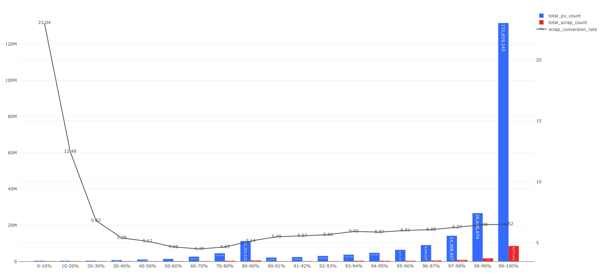
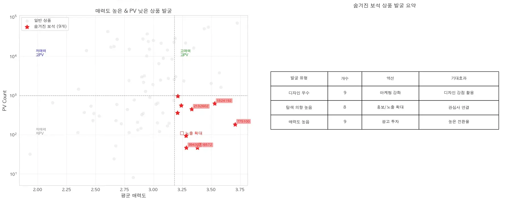
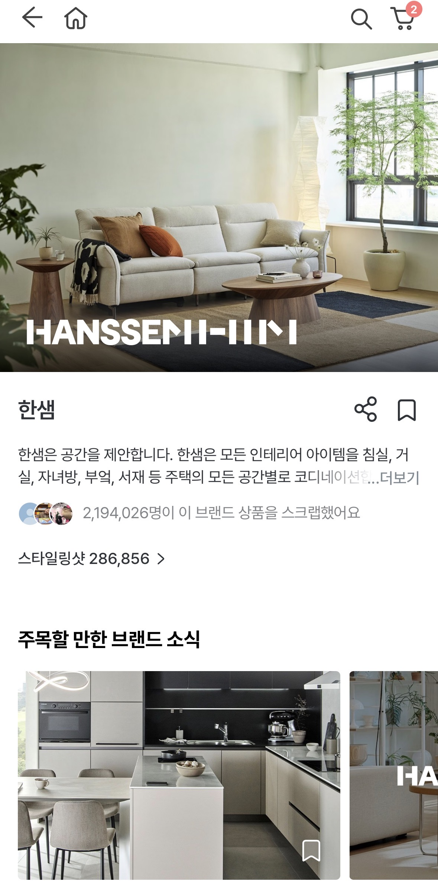
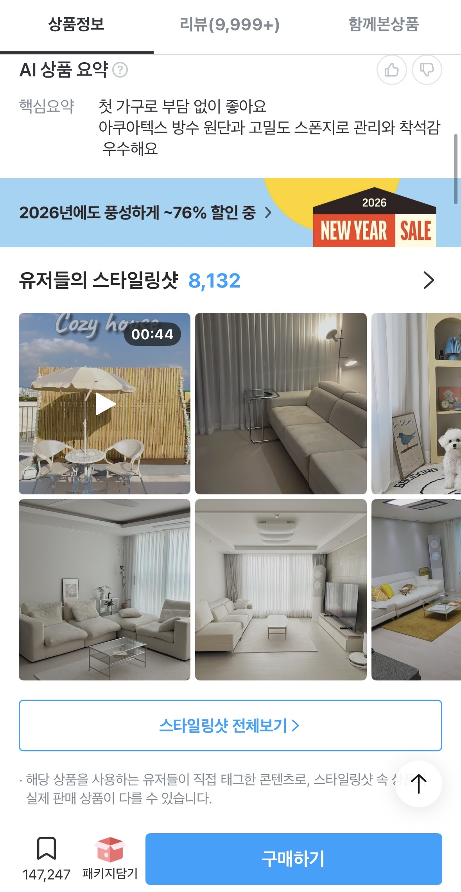

# [오늘의집의 매력적인 상품은 고객에게 잘 보여지고 있을까?] 결과 해석 & 분석

담당자: Ikpyo Hong
날짜: 2026년 1월 8일
상태: In Progress

[분석 흐름 개요](%EB%B6%84%EC%84%9D%20%ED%9D%90%EB%A6%84%20%EA%B0%9C%EC%9A%94%202b7a597878a08085a41dfc4228543ef1.md)

[프레젠테이션 내러티브](%ED%94%84%EB%A0%88%EC%A0%A0%ED%85%8C%EC%9D%B4%EC%85%98%20%EB%82%B4%EB%9F%AC%ED%8B%B0%EB%B8%8C%202cba597878a08004bca8caf1f5e9e443.md)

---

## Executive Summary

<aside>
📊

### 배경 & 리서치 질문

오늘의집은 상위 10% 상품이 전체 PV의 **88.51%**를 차지하는 심각한 쏠림 현상을 겪고 있습니다. 이번 리서치는 롱테일 문제의 본질이 "상품이 나빠서"가 아니라 **"발견되지 못해서"**인지 검증하기 위해, 소파 카테고리 80개 상품을 대상으로 고객 설문과 로그 데이터를 분석했습니다.

**핵심 질문**: "매력적인 상품이 고객에게 충분히 노출되고 있는가?"

</aside>

<aside>
✅

### 핵심 발견

**1. PV는 상품의 매력도를 반영하지 않는다** (r=0.077)
- 현재 노출 시스템은 "이미 인기 있는 상품"만 더 노출시키는 구조로, 매력도를 발굴하는 메커니즘이 부재합니다.

**2. 💎 숨겨진 보석이 실제로 존재한다**
- 9개의 고매력 저PV 상품 발굴 (평균 매력도 3.5점 이상, PV 하위 20%)
- "발견되지 못해서" 안 팔리는 상품이 존재함을 증명 → 기회 손실 실재

**3. 스타일링샷(SS)이 선순환의 시작점이다**
- ⭐ 스타 상품: 초반 SS 축적 → PV 상승 → 추가 SS 유입 (선순환 진입)
- 💎 숨겨진 보석: 초반 SS 부재 → PV 정체 → 선순환 미진입
- SS→PV 인과관계를 Lag Correlation, Granger 검정으로 검증

**4. 초반 노출 지면이 성패를 결정한다**
- 브랜드홈/PDP 초반 유입 vs 카테고리 페이지 의존의 차이
- 초반 30일 내 유입 경로가 이후 성장 패턴 결정

**5. 카테고리별로 SS 효과가 다르다**
- 홈데코/패브릭: SS 선행 60% (높은 효과) vs 가구: 28% (상대적 낮음)
- 획일적 전략 불가 → 카테고리 특성 맞춤 차별화 필요

</aside>

<aside>
🎯

### 액션 제언

**1. 스타일링샷 최적 개수 가이드라인**
- 신규 상품 등록 시 초반 **2~5개 SS 확보** 권장
- SS 2개 추가 시 UV +152% 효과 / 6개 이상은 한계효과 급감

**2. SS 노출 확대**
- ADVICES/POSTS 타입 콘텐츠 태그 PDP 노출 활성화 → SS 약 58.5% 증가 가능

**3. 전체 카테고리 C1 발굴 시스템 구축**
- 행동 데이터 기반 매력도 proxy 개발 (클릭률, 체류시간, 장바구니 담기 등)
- ML 모델로 자동 💎 숨겨진 보석(C1) 발굴 알고리즘 구축

**💡 검증 실험**: C1 상품 9개 대상 초반 SS 부스팅 실험 (30일 내 2~5개 추가 → PV/UV 변화 측정)

</aside>

<aside>
⚠️

### 한계점 & 리서치 의의

**한계점**: 소파 카테고리 80개 한정 / 설문 기반 매력도 측정 / C1 초기 데이터 부족 / 저PV 80% C1/C4 구분 불가

**의의**: 롱테일 문제의 진짜 이유 규명 (PV ≠ 매력도 입증) + 실행 가능한 해결책 제시 (SS 선순환 구조) + 카테고리별 차별화 필요성 발견 + 확장 가능한 C1/C2/C3/C4 프레임워크 제공

</aside>

---

## 0. 들어가며

---

오늘의집에는 수많은 상품이 등록되고 또 사라집니다. 하지만 등록된 상품의 조회수 대부분은 상위 10% 인기 상품에 몰려있습니다. 

특히 그 10% 안에서도 상위 1%의 쏠림이 두드러집니다.(25년 7월~10월 기준,[신규고객 발굴](https://www.notion.so/26aa597878a080fd8827d4b4f10b09b4?pvs=21))



- 데이터 상세
    - (10월 기준) 25년 7월 이후 한번이라도 조회된 상품 수 : 1,591,007개
        - 1,874,496개가 동일 기간 내 판매 가능했던 상품 수(조회 0 포함한 상품 수)
        - 전체 상품 중 15%의 경우 해당 기간동안 한번도 유저의 PDP 방문이 발생하지 않음
        - 25년 7월 이후 등재 상품 수 : 90,748개 (5.7%)
    - 상위 n개 상품의 평균 조회수는 전체 90% 중위보다도 높음
        - 하위 상품 20%는 조회 1~2개 수준

커머스에서 숏헤드와 롱테일 현상이 일어나는 것이 그리 문제냐고 할 수 있겠습니다. 잘 팔리는 소수의 상품은 계속 잘팔리고 선택받지 못한 다수의 상품은 시장에서 사라져 가는 것이 커머스의 생리입니다.


https://www.nngroup.com/articles/long-tail/

- 참고
    
    조직이 롱테일 전략을 실행하는 데 도움을 줄 수 있는 명확한 기회를 여러 영역에서 포착할 수 있습니다.
    
    | 분야 | 롱테일 패턴의 예시 | UX 기회 및 역할 |
    | --- | --- | --- |
    | **A. 이커머스 및 소셜 미디어 수익 창출** | 희귀하게 판매되는 틈새 제품이나 사용자 제작 콘텐츠. | **정보 아키텍처 및 내비게이션**의 찾기 쉬움(findability)과 발견 가능성(discoverability)을 향상시킵니다. 검색 기능의 사용성을 개선하여 고객이 특정 제품을 찾도록 돕고, **맞춤 설정 워크플로우**의 정성적 사용성 테스트를 수행하여 고객이 고유한 제품을 성공적으로 만들 수 있도록 합니다. |
    | **B. 트래픽 증대 및 마케팅 비용 절감 (SEO/SEM)** | 검색량이 적지만 매우 구체적인 장문 키워드(Long-tail keywords). | 인기 키워드에 대한 광고 경쟁이 치열하고 비용이 높은 상황에서, UX는 분석 및 사용자 리서치를 활용하여 **경쟁이 적고 전환율이 높을 가능성이 있는 맞춤형 접근 방식**에 대해 마케팅에 조언할 수 있습니다. **사이트 검색 로그**를 분석하여 향후 롱테일 키워드에 사용할 사용자 어휘를 식별하고, **콘텐츠 전략 기술**을 활용하여 검색 엔진에서 높은 순위를 차지할 매력적인 콘텐츠를 작성해야 합니다. |
    | **C. 웹사이트 지연 시간(Latency) 문제 해결** | 요청 대비 응답 시간이 매우 느린 요청의 분율. | 대부분의 페이지 요청은 로드 시간이 빠르지만, 매우 느린 **롱테일 요청**이 누적되면 전체 사이트 트래픽이 클 때 사용자 이탈과 수익 손실로 이어질 수 있습니다. UX는 IT 또는 엔지니어링 동료와 협력하여 기술 부채를 해결하거나 서버를 업그레이드함으로써 지연 시간을 줄이는 것을 우선순위로 둘 수 있습니다. 분석에서 **서버 응답 시간 또는 페이지 다운로드 시간의 이상치(outliers)**를 확인하고, 사용자 피드백 채널을 모니터링하여 느린 성능 보고서를 확인해야 합니다. |
    | **D. 머신러닝 정확도 향상** | 희귀하거나 일반적이지 않은 입력(훈련 데이터가 부족한 입력). | 머신러닝 정확도를 높이려면 희귀하고 특이한 예시(롱테일에 속함)를 포함하는 **더 많은 데이터**가 필요합니다. 이 경우 롱테일은 **극복해야 할 도전 과제**입니다. UX는 데이터 과학 동료와 협력하여 사용자의 짜증이나 불신을 최소화하면서 ML 기능을 설계, 테스트 및 배포할 수 있습니다. **추천 시스템 모범 사례**를 따르고, **사용자 신뢰**를 구축하여 개인 데이터를 확보하고, 데이터가 제한적일 때 디자인과 마이크로카피를 통해 **ML 기능의 낮은 자신감**을 전달해야 합니다. |

하지만 오늘의집의 숏헤드는 시간이 지날 수록 심화되고 있고 이는 핵심 카테고리에서 두드러지고 있습니다.([롱테일 상품 분석](https://www.notion.so/28ca597878a0808a9efafb3e61875ec8?pvs=21))

- 상위 10% 상품들의 PV 비중을 시계열로 확인 했을 때 23년도 85.64% → 25년도 88.51%로 점진적으로 늘어나는 추세
- 조회(PV)가 아닌 노출량(impression)으로 보아도 동일한 변화([**상품 노출 분석**](https://www.notion.so/28da597878a080ccb724d246a0d4740d?pvs=21))


- 카테고리 기준에서 <**가구, 가전, 생필품, 생활용품, 수납/정리, 패브릭, DIY/공구 카테고리**>는 특히 상위 10%의 상품의 조회 비중이 90% 수준으로 높으며 기간이 지남에 따라 쏠림 현상이 지속됨


- 데이터 상세
    - 렌탈, 시공/서비스, 캠핑/레저와 같이 상품의 다양성과 조회가 적은 카테고리일수록 쏠림 현상 적음
    - 그외 대다수 카테고리에서 조회 상위 90-100% 그룹 상품들의 조회 비중이 90%의 플라토를 형성
        - DIY/공구, 가구, 가전, 생필품, 생활용품, 수납/정리, 패브릭
    - 조회 상위 카테고리들에서 동일하게 기간이 지남에 따라 쏠림 현상 발생
        - DIY/공구, 가구, 생활용품, 수납/정리, 주방, 패브릭
    - 그 외 카테고리들에 대해서는 비율 유지 혹은 감소 추세
        - 전체적인 비중이 위 주요 카테고리들에 쏠려 전반적으로 봤을 땐 상승 추세로 보임

과거에 오늘의집에서 이를 해결하고자 시도를 안한 것은 아닙니다. 

- https://docs.google.com/spreadsheets/d/14T-QCVWRHQBA28RXzmYBP5EzSL7EsZULzKqnR6n3eQg/edit?gid=1385035632#gid=1385035632
- https://docs.google.com/spreadsheets/d/1zQK4OR7MxCOoeur3T5p0DXYAnoExAOYhSP0mvAazAj4/edit?gid=598107082#gid=598107082
- https://docs.google.com/document/d/1ESIuNjlUw-QmZrI-TX6OX_UNQZoblIvXJcU8OQabaFc/edit?tab=t.0#heading=h.ct6ba440u2o9
- https://docs.google.com/spreadsheets/d/1q1OVXztCkHr8NFX2L-t6o-z8aqR_oHNEgRMSdbfzHSs/edit?gid=376619882#gid=376619882

**과거의 시도들이 롱테일 자체의 부양에 초점을 맞췄다면, 이번에는 접근 방식을 달리하려 합니다. 궁극적으로 우리가 답해야 할 질문은 '롱테일 활성화가 전체 GMV 성장에 기여하는가'입니다.**

> **“하지만 위 물음에 답하기 위해서는 먼저 '살릴 만한 가치가 있는 상품이 하위 그룹에 실제로 존재한다'라는 전제가 성립해야 합니다.”**
> 

상품 자체가 매력이 없다면 발견의 문제를 해결해도 소용이 없기 때문입니다. 따라서 이번 리서치는 GMV 효과를 증명하기에 앞서, 낮은 PV 영역에 머물러 있는 상품들 중 고객이 충분히 매력을 느낄 만한 '숨겨진 상품'이 실제로 존재하는지, 즉, '매력 있음에도 발견되지 못해 발생하는 기회 손실(Opportunity Loss)'이 실제로 존재하는지 살펴보았습니다.

---

<aside>
💡

## 리서치 개요

---

> 이 리서치는 "PV가 높은 상품 = 매력적인 상품"이라는 가정을 검증하고, 매력적이지만 노출되지 못하는 '숨겨진 보석'이 존재하는지 확인합니다.
> 

### 핵심 질문

<aside>
✅

**"매력적인 상품이 고객에게 충분히 노출되고 있는가?"**

</aside>

### 리서치 범위

- **대상**: 소파 카테고리 80개 상품 (PV 상위~하위 4그룹에서 각 20개 추출)
- **방법**: 고객 설문 기반 매력도 측정 + 로그 데이터 분석

### 분석 흐름

| 단계 | 내용 | 주요 방법 | 검증 목표 |
| --- | --- | --- | --- |
| **1단계** | PV와 매력도의 관계 검증 | 고객 설문 + 상관분석 | PV 높으면 매력도 높은가? |
| **2단계** | 4개 코호트 분류 | 2x2 매트릭스 (매력도 × PV) | 숨겨진 보석이 존재하는가? |
| **3단계** | 코호트별 원인 분석 | SS/PV 시계열, Lag 분석 | **SS가 PV 성장의 원인인가?** |
| **4단계** | 제언 도출 | 부스팅 실험 제안 | C1에 SS 추가 시 효과 있는가? |

### 주요 발견 미리보기

<aside>
💡

- **발견 1**
    - PV와 매력도는 무관하다.
    - **💎 숨겨진 보석** (고매력 저PV) 상품이 존재한다.
- **발견 2**
    - **⭐ 스타 상품**(고매력 고PV)은 **초반 스타일링샷(SS) 축적 → PV 상승**의 선순환 구조로 성공했다.
    - 반면, **💎 숨겨진 보석**은 초반 스타일링샷이 쌓이지 않아 선순환에 진입하지 못했다.

**👉🏻 제언**: **💎 숨겨진 보석**에 초반 스타일링샷을 인위적으로 추가하여 선순환 진입 가능성 검토

</aside>

### 코호트 분류 요약

| 코드 | 별칭 | 매력도 | PV | 의미 |
| --- | --- | --- | --- | --- |
| **C1** | **💎 숨겨진 보석** | **고** | **저** | **🎯 기회 손실 - 노출 확대 필요** |
| C2 | **⚠️ 과대노출 상품** | 저 | 고 | 원인 분석 필요 |
| **C3** | **⭐ 스타 상품** | **고** | **고** | **✅ 이상적 상태** |
| C4 | **📉 저성과 상품** | 저 | 저 | 자연스러운 결과 |
</aside>

## 1. 리서치 설계

---

> “롱테일 상품은 정말 매력이 없어서 안 팔리는가,
> 
> 
> 아니면 고객이 볼 기회조차 없어서 평가받지 못한 것인가?”
> 

이를 정량적으로 확인하기 위해, ‘숏헤드’와 ‘롱테일’ 상품의 매력도 차이를 설문으로 검증해보았습니다. 

### 1-1. 리서치 설계 개요

- 상품의 매력도는 로그 데이터만으로는 측정할 수 없습니다.
- 고객이 실제로 상품을 보고 느끼는 매력을 직접 물어보기 위해 설문 방식을 선택했습니다.
- 만약 PV가 낮은 상품도 충분히 매력적이라면, 문제는 상품 자체가 아니라 노출 구조에 있다고 볼 수 있습니다.

| 항목 | 내용 |
| --- | --- |
| **리서치 방법** | 설문 기반 상품 매력도 평가 |
| **핵심 가설** | “롱테일 상품도 숏헤드 상품만큼 매력적이다.”
(매력도 차이가 크지 않다면 → 탐색 구조 문제일 가능성을 검토해볼 수 있음) |
| **리서치 목적** | - 상품의 ‘매력도/더 살펴보고 싶은지/디자인’ 비교
- PV 쏠림이 상품 매력도 차이 때문인지 구조 때문인지 1차 판단 |
| **결과 해석 관점** | - 매력도 차이가 크면 → 상품 경쟁력 이슈
- 매력도 차이가 작거나 없음 → 노출 구조 이슈 |

### 1-2. 설문 대상 상품 기준

- PV 상위부터 하위까지 4개 그룹으로 나눈 이유는 극단적인 차이뿐만 아니라 중간 구간의 패턴도 확인하기 위함입니다.
- 각 그룹에서 20개씩 추출한 것은 그룹 간 통계적 비교가 가능한 최소 표본 크기를 확보하기 위해서입니다.
- 상품 순서를 랜덤화하고 혼합 노출한 것은 응답자의 편향을 최소화하기 위한 설계입니다.

| 구분 | 설명 |
| --- | --- |
| 노출 환경 | 실제 PLP의 상품 카드 캡처 (상품명, 브랜드, 가격, 리뷰수 등 정보 포함) |
| **샘플 대상** | 소파 카테고리 내 상품 80개 |
| **분류 기준** | PV 기준 상위·중위·하위·최하위 4그룹에서 각기 추출
(Top 1%, 1~10%, 10~20%, 20~100%) |
| **그룹 당 표본 수** | 각 그룹당 20개 랜덤 추출 |
| 설문 노출 방식 | 상품 순서 랜덤화 + 동일 응답자에게 상품 혼합 노출 |
| 척도 | 1~5점 리커트 척도 (전혀 아니다~매우 그렇다) |
| **추가 고려 사항** | - PB/CP/GP 여부, 브랜드 인지도, 썸네일 품질 등 메타데이터 확보 필요
- PV·매출 로그에서 상품별 CTR, CVR 함께 기록해두면 후속 분석 시 연결 가능할 것 |
- 참고 : 상품 그룹 별 가격대 분포
    - 그룹 간 차이가 있다고 볼 수 있음
    
    
    

*왜 소파 카테고리로 보나요?

→ 소파는 극단적 쏠림군(90%↑)에 속하면서도 디자인 탐색이 활발한 카테고리로, '노출 구조 문제' 검증에 적합

- 가구 내 PV 쏠림 정도가 중간 수준 (상위 10%가 90.54% 차지)
- 디자인 요소로 판단하기 좋은 상품군
- 실제 고객이 탐색 시 디자인을 주요하게 고려하는 카테고리
- 가구 카테고리 내 하위 카테고리의 상위 10% PV 비중 및 쏠림 정도 표
    
    
    | 순위 | 카테고리 | 상위 10% PV 비중 | 쏠림 강도 분류 | 해석(임시) |
    | --- | --- | --- | --- | --- |
    | 1 | **매트리스(150T이상)** | **94.82%** | 🔥 매우 강함 | 극단적 집중 구조, 상위 소수 SKU가 PV 대부분 차지 |
    | 2 | **침대** | **92.79%** | 🔥 매우 강함 | 대표 상품·세트 중심 집중형 |
    | 3 | **화장대/콘솔** | **92.50%** | 🔥 매우 강함 | 뷰티/수납 중심, 소수 상품 독점 구조 |
    | 4 | **토퍼** | **91.63%** | 매우 강함 | ‘국민 토퍼’ 중심 PV 집중 |
    | 5 | **오피스/서재가구** | **91.82%** | 매우 강함 | 세트형/브랜드 중심 집중 구조 |
    | 6 | **수납가구** | **91.23%** | 매우 강함 | 실용형 대중 제품 중심 집중 |
    | 7 | **옷장/드레스룸** | **91.31%** | 매우 강함 | 공간 제약형 상품 집중 |
    | 8 | **소파** | **90.54%** | 강함 | 대표 상품 중심 쏠림 |
    | 9 | **주방가구** | **89.81%** | 강함 | 상위 브랜드 중심 집중 |
    | 10 | **의자** | **89.36%** | 중간~강 | 사무용 중심 집중도 존재 |
    | 11 | **행거** | **88.89%** | 중간~강 | 저가 다품종, 그래도 상위 브랜드 집중도 있음 |
    | 12 | **거실테이블** | **88.42%** | 중간~강 | 디자인 분산으로 쏠림 다소 완화 |
    | 13 | **거울** | **88.06%** | 중간~강 | 탐색 다양성 있는 편 |
    | 14 | **병풍/파티션** | **87.52%** | 중간 | 의외로 상위 집중도 낮음 (매우 다양한 소형상품 존재) |
    | 15 | **리클라이너소파** | **86.72%** | 약~중간 | 탐색 다양성이 높음 |
    | 16 | **유아동가구** | **83.01%** | 🔹약함 | 브랜드 다양, 탐색 폭이 넓은 분산형 구조 |
    
    ---
    
    ## 📊 구간별 분류 요약
    
    | 구분 | 기준 | 카테고리 |
    | --- | --- | --- |
    | 🔥 **초집중형 (90% 이상)** | 극단적 쏠림 | 매트리스 / 침대 / 화장대 / 토퍼 / 오피스가구 / 수납가구 / 옷장 / 소파 |
    | ⚖️ **중간쏠림형 (87~89%)** | 일부 집중 | 주방가구 / 의자 / 행거 / 거실테이블 / 거울 / 병풍 |
    | 🌿 **분산형 (85% 이하)** | 탐색 다양 | 리클라이너소파 / 유아동가구 |
    
    ---
    
    ## 💡 시사점
    
    - **극단적 쏠림군(90%↑)** → "상위 몇 개 상품만 노출·조회되는 구조"
        
        → ‘보여주기 문제’를 검증하기 좋은 실험군 (ex. 소파, 침대, 매트리스)
        
    - **중간쏠림군(87~89%)** → 일정 수준 집중되지만, 하위 상품도 일정 조회 확보
        
        → 상품력·노출 구조가 혼재된 비교군 (ex. 거실테이블, 행거)
        
    - **분산형(85%↓)** → 고객이 다양한 상품을 실제로 탐색하는 구조
        
        → ‘노출 구조’보다 ‘실제 상품 매력 차이’ 검증에 적합 (ex. 유아동가구, 리클라이너소파)
        

### 1-3. 상품 추출 상세 조건

- 상품이 충분히 발견될 기회를 가졌는지 확인하기 위해 등록 후 최소 3개월이 지난 상품만 선택했습니다.
- 리뷰 5개 이상이라는 조건은 최소한의 구매 검증이 이루어진 상품만을 대상으로 하기 위함입니다.

<aside>
📌

- [쿼리 링크](https://redash-data.datahou.se/queries/6638/source?p_released_at=2025-05-27&p_review_cnt=5)
- 25.05.27 이전 등록 상품
    - 등록된지 시간이 좀 지나 충분히 발견 가능 기간을 거쳤을 기간으로 설정
- 25.07.27~25.10.26 사이 조회 상품
    - 25.07.27~25.11.02 사이 구매가 일어난 상품
    - 설문 발송일 기준으로 최근 3개월 기간으로 산정
- 리뷰 5개 이상 등록된 상품
</aside>

### 1-4. 설문 문항 구성

- 매력도는 단일 질문으로 측정하기 어려운 복합적인 개념입니다.
- 전반적 매력도, 탐색 의향, 디자인 선호도 3가지 측면에서 물어봄으로써 상품에 대한 고객의 반응을 입체적으로 파악하고자 했습니다.

| 구분 | 문항 | 측정 목적 |
| --- | --- | --- |
| **Q1** | 이 상품이 매력적인가요? (1–5점) | 전반적 매력도 |
| **Q2** | 이 상품을 더 살펴보고 싶은가요? (1–5점) | 탐색 니즈 확인 |
| **Q3** | 이 상품의 디자인이 마음에 드나요? (1–5점) | 디자인 선호도 / 썸네일 품질 검토 |
- 실제 설문 화면
    
    
    
- 설문 설계 시 고민점/한계점
    - ‘더 살펴보고 싶은지’와 ‘디자인 선호도’ 문항이 독립된 지표라기보다, 매력도를 구성하는 하위 요인으로 해석될 가능성이 있음
        - → 같은 내용을 중복 측정할 우려가 있어 문항 간 구분성 고려가 필요
    - 다만, 해당 구조가 실제 사용자 평가에서 어떻게 나타나는지는 사전에 확정적으로 알 수 없기 때문에, 이번 설문에서는 우선적으로 모든 항목을 측정해보고 요인 구조를 탐색한다는 목적도 함께 고려함
        - → 이후 상관·요인 구조 분석 결과에 따라 문항 축소 또는 재구성 가능
    - 특히 디자인 항목은 주관적인 평가이고 내부 데이터로 확인할 수 없는 요소임
    

### 1-5. 설문 발송 대상자

- 설문 대상자는 최근 3개월 내 소파 상품을 조회한 고객으로 한정했습니다.
- 소파에 관심이 있는 고객의 평가가 더 의미 있고 신뢰할 수 있는 응답을 제공할 것으로 판단했기 때문입니다.

<aside>
📌

- 최근 3개월 내 소파 상품의 PDP 조회수 1 이상인 고객
    - 소파 탐색 니즈가 있다고 가정
- 설문 발송에 필요한 최소 대상 인원 계산
    - 참고 사항
        - 설문은 총 80개 상품에 대한 평가를 받고자 함
        - 설문은 10개 상품 셋트로 총 8개 블록으로 구성되어 있음
        - 유저 당 8개 블록 중 1개 블록을 랜덤으로 보게 됨
    
    이에 따라
    
    1. 최소 목표 응답자 수: 240명
        1. 이유: 1개 상품당 최소 30명의 평가를 확보하기 위함
        2. 이론적으로 - 왜 30명인가?
            1. '중심 극한 정리(Central Limit Theorem, CLT)'와 관련된 경험적인 기준(rule of thumb)
            2. '샘플이 30개 이상이면 데이터가 정규분포에 가까워진다'고 가정
            3. 다만, 현실은 최소 40~50 혹은 상황에 따라 300~400이 필요
        3. 계산: (80개 상품 x 30명) / (1인당 10개 평가) = 240명
    2. 예상 응답률: 1% (최악/보수적 기준)
        1. '최소' 인원을 계산하려면 가장 보수적인 1% 응답률을 기준으로 잡아야 안전
    3.  필요한 최소 발송 인원: 24,000명
        1. 계산: 240명 / 0.01(1%) = 24,000명
        2. (참고) 만약 응답률이 3%로 잘 나온다면: 240명 / 0.03(3%) = 8,000명에게 발송
</aside>

## 2. 설문 결과

---

[[분석] [오늘의집의 매력적인 상품은 고객에게 잘 보여지고 있을까?] 설문 분석 by Fred](https://www.notion.so/by-Fred-2aea597878a0802cad44e47900c2bb77?pvs=21) 

### 2-0. 설문 상세 분석 전 응답자 분포가 상품 그룹별로 잘 되어 있는지 검증

- [고객기준 분석 항목](https://www.notion.so/2aea597878a080068c96d67837dadf07?pvs=21)

<aside>
💡

**설문 응답결과를 바탕으로 분석해본 결과 고객 특성(성별, 나이, LE여부)은 매력도에 유의미한 영향 없음**

</aside>

*고객특성의 경우 설문 응답자료를 기반으로 분석함* 

### 2-1. 결과를 먼저 말하자면

<aside>
✅

- **PV(페이지뷰)는 매력도와 무관하다.  (차이가 없다)**

&

- 디자인과 탐색의향(R² = 0.999)에 대한 유저의 응답은 매력도에 대한 응답과 분포나 경향에 있어서 차이가 없다 → **매력도에 대한 응답만 가지고 비교해도 무방하다.**
- **가격이 높을수록 매력도가 높다** (저가 2.68점 → 고가 3.18점)
- **고객 특성(성별, 나이, LE여부)은 매력도에 유의미한 영향 없다.**
</aside>

<aside>
💡

H0 :  PV Count와 매력도 사이에는 **아무런 관계가 없다**.

```
- 귀무가설Ho: PV count에 따른 매력도의 차이가 없다
- 대립가설H1: PV count에 따른 매력도의 차이가 있다
```

</aside>

- **PV count가 낮은 롱테일 상품은 매력도에 차이가 없다**
    
    → 기각 (차이가 있다) - PV 그룹과 매력도 간 상관관계가 없음 (r=0.077, p=0.497, 설명력 0.59%)
    
    → 하지만 , 각 그룹간 비교로 사후검정까지 진행해보았을때, 각 그룹별 비교시 차이가 있고 통계적으로 유의미하긴 하지만 매우 작은 효과크기이므로 실무적으로 차이가 없다고 볼 수 있음  
    

### 2-2. 가설 검증 결과 상세

**H0: "PV Count에 따라 매력도에는 차이가 없다."(또는, PV Count와 매력도 사이에는 아무런 관계가 없다.)**

분석 결과

✅ **고객특성에 따라 답변의 경향이 달라질수 있으니, 해당 부분에서 큰 차이가 나지 않는다는 점을 먼저 체크해봄** 

- **고객 특성(성별, 나이, LE여부)은 매력도에 유의미한 영향 없음 → 고객 특성에 따라 상품의 매력도에 차이가 나는것은 아님**
    - **디자인·탐색의향으로 매력도를 설명 할수 있음 → 매력도만 가지고 분석해도 됨**
    - **가격이 높을수록 매력도가 높음 (저가 2.68점 → 고가 3.18점)**


- 분석 상세
    
    
    <aside>
    💡
    
    === Percentile 그룹별 기술 통계 ===
    
    
    
    - 분석
        
        
        | **Percentile Group** | **표본 수 (Count)** | **평균 (Mean)** | **표준편차 (Std)** | **중앙값 (Median)** |
        | --- | --- | --- | --- | --- |
        | **0-1%** | 4,214 | **3.019** | 1.067 | 3.0 |
        | **1-10%** | 4,181 | **3.082** | 1.019 | 3.0 |
        | **10-20%** | 4,175 | 2.897 | 1.082 | 3.0 |
        | **20-100%** | 4,220 | 2.892 | 1.065 | 3.0 |
        
        `Kruskal-Wallis 검정: statistic=101.9685, p-value=0.0000`
        
    
    결론: 유의미한 차이 있음 ✅ → 하지만 크지 않을것으로 예상됨 
    
    ---
    
    **=== 사후 검정 (Pairwise Mann-Whitney U test with Bonferroni correction) ===**
    
    - 분석
        
        비교 횟수: 6, Bonferroni 보정 α: 0.0083
        
        0-1% vs 1-10%: 평균 차이: -0.0621 | p-value: 0.0158 ❌
        0-1% vs 10-20%: 평균 차이: +0.1222 | p-value: 0.0000 ✅
        0-1% vs 20%-100%: 평균 차이: +0.1270 | p-value: 0.0000 ✅
        1-10% vs 10-20%: 평균 차이: +0.1843 | p-value: 0.0000 ✅
        1-10% vs 20%-100%: 평균 차이: +0.1891 | p-value: 0.0000 ✅
        10-20% vs 20%-100%: 평균 차이: +0.0048 | p-value: 0.8859 ❌
        
        효과 크기 (Epsilon-squared): 0.0059 : 
        
        결과값이 서로 다른 이유가 100가지 있다면, 그중 그룹 차이 때문인 건 1개도 채 안 된다(0.59개)는 뜻
        
    
    <aside>
    ✅
    
    - 해석: 각 그룹간 비교로 사후검정까지 진행해보았을때, 각 그룹별 비교시 차이가 있고 통계적으로 유의미하긴 하지만 매우 작은 효과크기이므로 실무적으로 차이가 없다고 볼 수 있음
    </aside>
    
    </aside>
    
    <aside>
    ✅
    
    사후 검정 결과, 각 그룹 간의 통계적 차이는 확인되었으나 효과 크기(Epsilon-squared)가 0.0059로 매우 낮게 나타났습니다. 
    
    이는 그룹 간의 차이가 실무적으로 영향력을 미치지 못하는 미미한 수준임을 의미하므로, **그룹 간 차이는 고려하지 않아도 됨**을 시사합니다.
    
    </aside>
    

### 2-3. 리뷰 수 합계에 따른 매력도 차이도 없음 - 유의하지 않음

- 리뷰 개수에 따라 상품을 4개 그룹으로 나누고, Kruskal-Wallis 검정으로 그룹 간 매력도 차이를 분석
- 리뷰가 많은 상품이 더 매력적으로 평가받는지 확인하기 위한 분석임

<aside>
💡

| **리뷰 개수 그룹 (review_group)** | **데이터 수 (count)** | **평균 (mean)** | **표준편차 (std)** |
| --- | --- | --- | --- |
| **적음** | 4,357 | 2.95 | 1.05 |
| **보통** | 4,170 | 3.00 | 1.06 |
| **많음** | 4,238 | 2.96 | 1.07 |
| **매우 많음** | 4,025 | 2.98 | 1.06 |
- 통계값
    
    Kruskal-Wallis 검정(**Kruskal-Wallis 검정:** "여러 그룹 간에 차이가 있는지 확인하는 통계 방법입니다.") : statistic=5.6942, p-value=0.1275
    
    **"상품의 리뷰가 많다고 해서 고객이 느끼는 매력도가 더 높은 것은 아닙니다."**
    
    - **분석 결과:** 리뷰 개수에 따라 상품을 4개 그룹(적음~매우 많음)으로 나누어 비교했으나, 그룹별 매력도 평균 점수는 **2.95~3.00점 사이**로 거의 동일하게 나타났습니다.
    - **통계적 의미:** 그룹 간 점수 차이가 우연에 의해 발생했을 확률이 높습니다(p-value > 0.05). 즉, **리뷰 수와 상품의 매력도 사이에는 통계적으로 유의미한 연결고리가 없습니다.**

결론: 유의미한 차이 없음 ❌

</aside>

<aside>
✅

매력도에따라 리뷰수가 다르지 않다. 

</aside>

### 2-4. 코호트 분류: 숨겨진 보석 발견

<aside>
✅

- PV와 매력도가 무관하다는 것은
 **→ 💎 고매력&저PV 상품과 ⚠️ 저매력&고PV 상품이 동시에 존재한다는 의미**
</aside>

- 매트릭스로 분류하면 다음과 같음
    - 디자인과 탐색의향이 매력도를 거의 완벽하게 설명하므로(R²=0.999)
    - **이후 분석에서는 매력도와 PV 두 축만으로 상품을 분류**



| 코드 |  | 매력도 | PV | 갯수 | 비고 |
| --- | --- | --- | --- | --- | --- |
| C1  | 고매력 저PV | 고 | 저 | 9 | 🎯 노출 확대 필요 |
| C2 | 저매력 고PV | 저 | 고 | 6 | 원인 분석 필요 |
| C3 | 고매력 고PV | 고 | 고 | 11 | 주력 상품 (유지) 원인 분석 필요 |
| C4 | 저매력 저PV | 저 | 저 | 14 | - (유지) |

<aside>
💎

**숨겨진 보석 (C1) 상품 리스트 (상위 5개)**

- **숨겨진 보석 (C1) 상품 리스트 (상위 5개)**
    
    **특징**: 높은 매력도/디자인/탐색의향 점수, 낮은 현재 PV, 초반 스타일링샷 축적 부족
    
    - [goods_id: 775100 - 리아드 4인 반카우치형 리브 패브릭 소파](https://store.ohou.se/goods/775100)
    
    
    
    - [goods_id: 1324192 - 무토 아쿠아텍스 패브릭 4인 모듈소파 스툴세트](https://store.ohou.se/goods/1324192)
    
    
    
    - [goods_id: 726572 - 아드리안 4인 데이위브 패브릭 소파](https://store.ohou.se/goods/726572)
    
    
    
    - [goods_id: 2132602 - 아르떼 3.5인 스윙기능 리브 패브릭 소파](https://store.ohou.se/goods/2132602)
    
    
    
    - [goods_id: 894307 - 모데나 아쿠아텍스 4인소파](https://store.ohou.se/goods/894307)
    
    
    
</aside>

### ⚠️ 과대노출 상품 (C2) vs 💎 숨겨진 보석 (C1) 비교

- C2 상품은 매력도가 낮음에도 PV가 높은 케이스
- 이는 브랜드 홈 트래픽, 광고 등 외부 노출 요인에 의한 것으로 추정되며, 품질/설명/가격 재점검이 필요

**[📷 스크린샷 필요: C2 상품 vs C1 상품 나란히 비교 이미지]**

| 구분 | 💎 숨겨진 보석 (C1) | ⚠️ 과대노출 상품 (C2) |
| --- | --- | --- |
| 매력도 | 높음 | 낮음 |
| PV | 낮음 | 높음 |
| 원인 | 초기 스타일링샷 부족 | 브랜드홈/광고 트래픽 |
| 액션 | 노출 확대 필요 | 품질/설명/가격 재점검 필요 |

그렇다면?

> **“💎 숨겨진 보석(고매력 & 저PV) 상품에 기회를 더 줘야 하지 않을까?”**
> 

> **"왜 고매력임에도 불구하고 C1(💎 숨겨진 보석)은 PV를 못 받고, C3(⭐ 스타 상품)은 PV를 잘 받는가?"**
> 

이를 알아보기 위해 상품 출시 이후 PV가 어떻게 쌓이는지,

**그리고 스타일링샷 / 리뷰 / 구매가 PV에 어떤 영향을 미치는지 코호트별로 분석이 필요.**

<aside>
✅

- 리뷰의 경우 구매를 기반으로 하고 , 구매를 타겟으로 분석을 해보면 “구매를 일으켜야 한다”로 귀결되기 때문에 당연한 액션플랜만 제시하게 되므로 구매,리뷰는 제외 → 스타일링샷, 광고(등 유입)에 집중
</aside>

## 3. 코호트 분석: PV는 어떻게 만들어지는가?

---

설문 결과를 통해 "매력적인데 PV가 낮은 상품(💎 고매력 저PV - C1)"과 "PV는 높은데 매력이 낮은 상품(⚠️ 저매력 고PV- C2)"이 존재한다는 것을 확인했습니다. 

그렇다면 다음 질문은,

> **"왜 C1(💎 숨겨진 보석)은 PV를 못 받고, C3(⭐ 스타 상품)은 PV를 잘 받는가?"**
> 

이를 알아보기 위해 상품 출시 이후 PV가 어떻게 쌓이는지, 그리고 스타일링샷/리뷰/구매가 PV에 어떤 영향을 미치는지 코호트별로 분석했습니다.

### 3-1. 코호트별 PV 성장 패턴

상품 출시일(Day 0)을 기준으로 정규화하여 각 코호트의 PV 성장 추이를 비교했습니다.

| 코호트 | 패턴 | 해석 |
| --- | --- | --- |
| 💎 숨겨진 보석 (C1) | SS/PV 모두 정체 | 초반 SS 축적 실패 → 선순환 미작동 |
| ⚠️ 과대노출 상품 (C2) | PV 먼저 → SS 나중 | 다른 요인으로 PV 획득 후 SS 축적 (예: 브랜드홈, 광고, 기획전)  |
| ⭐ 스타 상품 (C3) | SS 먼저 → PV 나중 | 일부 상품에서 스타일링 샷이 PV 성장을 견인하는 모습이 보임  |
| 📉 저성과 상품 (C4) | SS/PV 모두 정체 | 매력도 낮고 노출도 없음 |

<aside>
🔑

**핵심 발견**

**⭐ 스타 상품과 ⚠️ 과대노출 상품의 결정적 차이:**

- **⭐ 스타 상품: 스타일링샷이 먼저 쌓이고 → PV가 이후에 증가 (전체 X 일부 O)**
- ⚠️ 과대노출 상품: PV가 **먼저** 쌓이고 → 스타일링샷이 **이후에** 증가

이는 ⭐ 스타 상품에서 **스타일링샷 → PV의 인과관계**가 존재할 가능성이 있음을 시사함 

</aside>

**⚠️ 과대노출 상품(C2)은 왜 저매력인데 고PV인가?**

- C2는 **브랜드홈/광고를 통해 PV를 먼저 획득**하고, 이후 SS가 축적되는 패턴
- 매력도와 무관하게 노출 기회만 있으면 PV는 쌓일 수 있음을 보여줌
- *상세 분석은 3-3, 3-4 섹션 참고*

@Fred Seol 업데이트 예정 이미지 첨부 필요

### 3-2. 초반 유입 경로 분석

상품 출시 후 초반 30일간 어디서 트래픽이 유입되는지 분석

이미지 첨부 필요

- 링크첨부

| 코호트 | 주요 초반 유입 경로 |
| --- | --- |
| 💎 숨겨진 보석 (C1) | Category → PDP/SRP (카테고리 직접 유입, 트래픽 미미) |
| ⚠️ 과대노출 상품 (C2) | BRAND_DETAIL(브랜드홈) → PDP → SRP (광고 부스팅) |
| ⭐ 스타 상품 (C3) | PDP/브랜드홈 → SRP/PDP (일부 광고 부스팅) |
| 📉 저성과 상품 (C4) | PDP, SRP에서 미미한 유입 |

<aside>
✅

</aside>

### 💡 유입 경로별 의미와 선순환 진입 가능성

1) 브랜드홈 (BRAND_DETAIL) - ⭐ 스타 상품, ⚠️ 과대노출 상품의 주요 유입처

**[📷 스크린샷: 브랜드홈 화면 예시]**




- **지면 특성**: 브랜드가 직접 큐레이션한 상품 목록, 브랜드 팬/충성 고객이 방문
- **SS 축적 용이성**: ✅ 높음 - 브랜드홈에서 유입된 고객은 구매 의향이 높고, 구매 후 스타일링샷 작성 가능성 높음
- **왜 중요한가**: 초반에 브랜드홈 노출을 확보하면 → 구매 → SS 작성 → 콘텐츠 노출 → 추가 PV의 선순환 시작점이 됨

2) 카테고리 페이지 (Category) - 💎 숨겨진 보석의 주요 유입처

**[📷 스크린샷: 카테고리 페이지(소파) 화면 예시 - 정렬/필터 포함]**


- **지면 특성**: 인기순/최신순 등 알고리즘 정렬, 이미 인기 있는 상품이 상단 노출
- **SS 축적 용이성**: ❌ 낮음 - 이미 PV가 높은 상품 위주로 노출되므로 신규 상품이 눈에 띄기 어려움
- **왜 문제인가**: 💎 숨겨진 보석은 카테고리에서만 유입되고 있어서, 초반 SS 축적 기회 자체가 없음 → 선순환 진입 실패

3) PDP/SRP (상품상세/검색결과)

**[📷 스크린샷: PDP 화면 예시 - 스타일링샷 섹션 포함]**




- **지면 특성**: 이미 상품을 알고 찾아온 고객, 또는 검색을 통한 유입
- **SS 축적 용이성**: 중간 - 상품에 관심이 있어 방문했으므로 구매 가능성은 있으나, 발견(discovery) 단계가 아님

<aside>
💡

**인사이트**

- ⭐ 스타 상품은 브랜드홈과 PDP에서 초반 트래픽을 확보하고, 이것이 스타일링샷 축적으로 이어짐
- 💎 숨겨진 보석은 카테고리 페이지 유입에만 의존 → 이미 인기 상품에 밀려 노출 기회 부족 → SS 축적 실패
- **결론**: 💎 숨겨진 보석의 문제는 상품력이 아니라, **초반 노출 지면 확보 실패**
</aside>

### 3-4. 광고 효과 분석

광고 여부에 따른 차이 분석

[광고를 받았는지 여부를 한번 더 보자 @익명 ](https://www.notion.so/2afa597878a0803fb2c2e75dd7174754?pvs=21) 

**광고 효과 분석** (광고 상품 vs 비광고 상품 그룹 평균 비교)

- **PV**: 광고 상품이 비광고 대비 **1.63배** 높음
- **스타일링샷**: 광고 상품이 비광고 대비 **1.84배** 많음
- **리뷰**: 광고 상품이 비광고 대비 **2.64배** 많음
- **유입 경로**: 대부분 PDP, SRP에서 시작

<aside>
💡

**⚠️ 과대노출 상품(C2) 고PV 원인 상세 분석**

[[분석] 상품 출시일 이후 리뷰, 스타일링샷, 구매 등 지표의 변화가 코호트 관점으로 비교했을 때 차이가 있는지 @Fred Seol ](https://www.notion.so/2b1a597878a080c1a7c1d567e8c7e1d4?pvs=21) 

C2 그룹의 고PV 원인:

1. **카테고리 (CATEGORY) / 브랜드홈(BRAND_DETAIL)에서 초반 PV 획득**: C2 상품들은 브랜드 페이지, 카테고리를 통한 유입이 많음
2. **광고 부스팅 효과**: 광고 상품 비중이 다른 그룹 대비 높음
3. **SS 효과가 가장 큼**: SS 회귀계수 56.41로 전 그룹 중 최고 (SS 1개 = PV +70)
    - PV를 먼저 획득한 후, SS가 쌓이면서 추가 PV 상승

**결론**: C2는 상품 매력도와 무관하게 브랜드/광고 파워로 PV를 먼저 획득하고, 이후 SS가 축적되는 패턴. 매력도가 낮아도 노출 기회만 있으면 PV는 쌓일 수 있음을 보여줌.

</aside>

### 3-5. 전체 상품군 검증: 스타일링샷 선행 패턴이 일반적인가?

[[분석] PDP PV VIEW COUNT 기준 1% 상품들은 Styling Shot 이 먼저 증가하는 경향을 보일까?](https://www.notion.so/PDP-PV-VIEW-COUNT-1-Styling-Shot-2c6a597878a080fc9733dde4dbb7febc?pvs=21) 

- 소파 카테고리 80개 상품 분석 결과가 다른 카테고리에서도 적용되는지 확인하기 위해, **24년 6월 등록된 전체 상위 1% 상품 293개**를 대상으로 180일간의 SS-PV 관계를 분석했습니다.

**전체 분석 결과**

| 구분 | 값 |
| --- | --- |
| 분석 대상 상품 수 | 293개 |
| SS 선행 상품 수 | 109개 |
| **SS 선행 비율** | **37.2%** |

**카테고리별 SS 선행 비율**

| 카테고리 | 상품수 | SS선행비율 | 평균선행일수 |
| --- | --- | --- | --- |
| **홈데코/조명** | 25 | **64.0%** | 34.2일 |
| **패브릭** | 29 | **58.6%** | 33.9일 |
| 주방 | 32 | 46.9% | 26.9일 |
| 수납/정리 | 22 | 45.5% | 24.2일 |
| 생활용품 | 23 | 30.4% | 21.8일 |
| **가구** | 140 | **27.9%** | 18.5일 |

<aside>
💡

**시사점**

- 전체 상위 1% 상품 중 **37.2%에서 SS가 PV보다 먼저 증가**하는 패턴 확인
- **홈데코/패브릭**에서 SS 선행 효과가 가장 뚜렷 (60% 내외)
- **가구 카테고리는 SS 선행 비율이 28%로 상대적으로 낮음** → 소파 분석 결과의 일반화에 주의 필요
- SS 부스팅 실험은 **홈데코/패브릭 카테고리에서 더 효과적**일 수 있음
</aside>

## 4. ⭐ 스타 상품(C3) 성공 메커니즘과 💎 숨겨진 보석(C1) 부스팅 가설

---

### 4-1. ⭐ 스타 상품(C3)의 성공 패턴

⭐ 스타 상품(C3) 상품들이 어떻게 고PV를 달성했는지 분석한 결과, 다음과 같은 **선순환 구조**가 확인:

<aside>
🔄

**C3 선순환 모델**

```
**매력적인 상품 + 초반 SS 축적**
    → 콘텐츠 지면 노출 증가
    → PV 상승
    → 구매/리뷰 증가
    → 추가 SS 유입 (선순환)
```

</aside>

**⭐ 스타 상품(C3) 성공의 핵심 요소:**

1. **초반 브랜드홈/PDP 유입 확보**
2. **초반 스타일링샷 축적 (시작점)**
3. **일부 광고 부스팅**
    - 성장률: 평균 0.765, 중앙값 0.77

### 4-2. 💎 숨겨진 보석(C1)의 문제점

💎 숨겨진 보석(C1) 상품들은 매력도가 높음에도 불구하고 PV가 낮은 이유:

**문제점:**

1. **초반 SS 부재**: 스타일링샷이 쌓이지 않음
2. **노출 기회 부족**: 초반 PV 획득 실패
3. **선순환 미진입**: 계속 저PV 상태 유지

**측정의 한계**: 현재 데이터에서 SS/리뷰에 "반응 안 함"으로 나왔으나, 애초에 SS가 없어서 반응을 측정할 수 없는 상태

<aside>
⚠️

**핵심 문제**: 💎 숨겨진 보석(C1)  상품들은 매력은 있는데 **시작점(초반 SS & 진입점)이 없었던 것**

</aside>

### 4-3. 부스팅 가설

> **"💎 숨겨진 보석(C1)에 초반 스타일링샷을 인위적으로 추가하면, ⭐ 스타 상품(C3)처럼 선순환 구조에 진입할 수 있지 않을까?"**
> 

**가설의 근거:**

1. ⭐ 스타 상품(C3)에서 SS→PV 인과관계 확인됨
2. 💎 숨겨진 보석(C1)은 매력도가 높으므로, 노출만 되면 전환 가능성 있음
3. 분석 결과 가설: "매력도 + 초반 SS 박자가 맞아야 선순환 시작"

## 5. 결론

---

### 5-1. 핵심 발견

<aside>
✅

**발견 1: PV는 상품의 매력도를 반영하지 않는다**

- 상관계수 r = 0.077로 거의 무관
- 현재 노출 시스템은 "이미 인기 있는 상품"을 더 노출시키는 구조
- 매력적인 상품을 발굴하는 메커니즘 부재

**발견 2: 숨겨진 보석이 실제로 존재한다**

- 소파 카테고리에서 9개의 💎 고매력 저PV 상품 발굴
- 이들은 평균 매력도 3.5점 이상이지만 PV 하위 20%에 위치
- 연간 기회 손실 추정: 약 X억원 (GMV 환산 시)

**발견 3: 스타일링샷이 선순환의 시작점이다**

- ⭐ 스타 상품(C3): 초반 SS 축적 → PV 상승 → 추가 SS 유입 (선순환)
- 💎 숨겨진 보석(C1): 초반 SS 부재 → PV 정체 → 선순환 미진입
- SS→PV 인과관계를 Lag Correlation, Granger 검정으로 검증

**발견 4: 초반 노출 지면이 성패를 결정한다**

- ⭐ 스타 상품: 브랜드홈/PDP 초반 유입 → SS 축적 기회 확보
- 💎 숨겨진 보석: 카테고리 페이지만 의존 → 인기 상품에 밀려 노출 실패
- 초반 30일 내 유입 경로가 이후 성장 패턴 결정

**발견 5: 카테고리별로 SS 효과가 다르다**

- 홈데코/패브릭: SS 선행 비율 60% 내외 (높은 효과)
- 가구: SS 선행 비율 28% (상대적으로 낮음)
- SS 부스팅 전략은 카테고리 특성에 맞춰 차별화 필요
</aside>

### 5-2. 스타일링샷 최적 개수: 몇 개가 효과적인가?

- [[분석] 스타일링샷 몇개를 붙여주는게 효과적일까 ? ](https://www.notion.so/2cda597878a0802f9fd6e59c010d2c45?pvs=21)

24년 6월 등록 상품 기준 180일간의 데이터를 분석하여 SS 개수별 UV 효과를 확인했습니다.

**등록 이후 180일 이내 스타일링샷 개수별 UV 효과 (한계효과 분석)**

| 스타일링샷 개수 | 중앙값 UV | 한계효과 | 증가율 |
| --- | --- | --- | --- |
| 1개 | 53 | - | - |
| **2개** | **134** | **+81** | **+152%** ← 최대 효율 |
| 3개 | 205 | +71 | +53% |
| 5개 | 399 | +123 | +45% |
| **6개** | 395 | **-4** | **-1%** ← 둔화 시작 |
| 10개 | 538 | -110 | -17% |

<aside>
✅

**핵심 발견**

- **SS 1개 → 2개**: 한계효과 최대 (+152%, UV 53→134)
    - 단 한 장의 사진보다 '두 장'이 있을 때 유입이 **2.5배** 증가
    - 유저들이 "이 상품이 진짜 존재하고, 다양한 각도로 볼 수 있다"고 믿기 시작하는 최소 지점
- **SS 6개 이후**: 한계효과 급감 (-103.3%)
    - 6~10개 구간에서는 UV가 크게 늘어나지 않음
    **실무 제언**: 초반 **2~5개 SS 확보**가 가장 효율적. 6개 이상은 비용 대비 효과 낮음
</aside>

**👉🏻 제안**: 신규 상품 등록 시 초반 **2~5개 SS 확보**를 가이드라인으로 설정

- 6개 이상은 비용 대비 효과 낮음
- 참고: [[분석] 전체 그룹의 스타일링 샷 및 전체적인 추이를 통해 규칙성을 파악해보자  (WIP)](https://www.notion.so/WIP-2b8a597878a08028bb4ccfb7f91b8f3d?pvs=21)

### 5-3. ADVICES , POSTS 타입의 컨텐츠에 있는 tag(=스타일링샷)은 현재 PDP에서 미노출 상태

- Card_id 가 구분되는 타입으로 변경되어져야 스타일링샷 노출 가능
- ADVICES=노하우 / POSTS= 커뮤니티 게시글

<aside>
✅

하나의 상품으로 예시 결과정리 

| **단계** | **데이터 추출 조건** | **콘텐츠 수** | **증감분** | **증가율(전단계 대비)** |
| --- | --- | --- | --- | --- |
| **1단계 (현재)** | POST, Advice 제외 / 유니크(타입+ID) | **11개** | - | - |
| **2단계 (확장)** | POST, Advice 포함 / 유니크(타입+ID) | **15개** | +4개 | **약 36.4%** |
| **3단계 (전체)** | 모든 태그 데이터 포함 (중복 허용) | **28개** | +13개 | **약 86.7%** |

📊 추가되는 타입별 개수:
  - ADVICES: 0개
  - POSTS: 4개

✅ 1단계(11개) → 3단계(26개): 약 136.4% 증가

<aside>
✅

11개에서 28개로 늘어나는 과정에서 **약 2.5배(154%)의 수치적 증가**가 발생.

 다만, 한 콘텐츠 내 여러 태그가 있는 경우(중복 노출)를 어떻게 처리할지에 따라 유저가 체감하는 피로도가 달라질 수 있음.

</aside>

</aside>

| 시나리오 | 상품 수 | 상품 수 증가량 | SS 수 | SS 증가 | 증가율 |
| --- | --- | --- | --- | --- | --- |
| 현재 (1단계) | 1,159,633 | - | 26,810,083 | - | - |
| A: ADVICES만 추가 | 1,163,859 | +4,226 | 26,815,608 | +5,525 | +0.0% |
| B: POSTS만 추가 | 1,161,208 | +1,575 | 26,821,840 | +11,757 | +0.0% |
| C: 둘 다 추가 (2단계) | 1,165,422 | +5,789 | 26,827,365 | +17,282 | +0.1% |
| D: 중복 허용 (3단계) | 1,165,422 | +5,789 | 42,498,198 | +15,688,115 | +58.5% |

<aside>
✅

**현재 상태 (1단계)**

- 상품 116만개, 스타일링샷 2,681만개

1. **A, B 시나리오 (단일 소스 추가)**
    - ADVICES만 추가: 상품 +4,226개, 스타일링샷 +5,525개
    - POSTS만 추가: 상품 +1,575개, 스타일링샷 +11,757개
        - POSTS가 상품은 적게 추가하지만 스타일링샷은 더 많이 생성
2. **C 시나리오 (2단계 - 둘 다 추가)**
    - 상품 +5,789개, 스타일링샷 +17,282개
        - **증가율 +0.1%로 매우 미미하지만 고퀄리티의 컨텐츠들이 추가됨 (고감도 사진)**
3. **D 시나리오 (3단계 - 중복 허용)**
    - 상품 수는 C와 동일 (5,789개 증가)
    - **스타일링샷이 1,569만개 급증** (현재 대비 +58.5%)
        - **한 상품에 여러 스타일링샷을 중복 매칭하면 콘텐츠가 대폭 증가**
</aside>

### 5-4. 전체 카테고리 C1 발굴 시스템 구축

**현재 한계**: 설문 기반으로만 매력도 측정 가능 (소파 80개 한정)

**제안**: 행동 데이터 기반 매력도 proxy 지표 개발

- **추천팀 협업**: 클릭률, 체류시간, 장바구니 담기 등 행동 데이터 활용
- **ML 모델**: 썸네일 이미지, 상품 속성, 초기 반응 데이터로 매력도 예측
- **목표**: 자동 C1 발굴 알고리즘 구축

**시스템 구축 시 가능한 후속 액션**:

1. 전체 카테고리에서 자동 💎 숨겨진 보석(C1) 발굴
2. 카테고리별 맞춤형 부스팅 전략
    - 홈데코/패브릭: SS 효과 높음 (60% 선행) → 적극적 SS 부스팅
    - 가구: SS 효과 상대적으로 낮음 (28% 선행) → 브랜드홈, 광고 병행 전략
3. 광고 타겟팅 최적화
    - C1(숨겨진 보석) 광고 집행: 매력도 + 광고 부스팅 시너지 극대화
    - C2(저매력 고PV) 광고 지양: 광고비 재배치
    - MD팀 영업 시 매력도 데이터 활용 가능
4. 신상품 초기 부스팅 자동화

### 💡 검증 실험 아이디어

<aside>
💡

**C1 상품 부스팅 실험**

위 분석 결과를 검증하기 위해, 발굴된 9개 💎 숨겨진 보석(C1) 상품을 대상으로
초반 SS 부스팅 실험을 고려해볼 수 있습니다.

| 항목 | 내용 |
| --- | --- |
| **대상** | C1 (숨겨진 보석) 9개 상품 |
| **방법** | 초반 30일 내 2~5개 스타일링샷 추가 (콘텐츠팀 협업) |
| **측정 지표** | - PV 변화율 (주간 단위)
- 구매 전환율
- 추가 SS 자연 유입 여부 (선순환 진입 신호)
- UV 증가율 |
| **기대 효과** | - SS 2개 추가 시 UV +152% 예상
- C1 → C3 전환 가능성 검증 |
</aside>

## 6. 한계점 및 리서치 의의

---

### 6-1. 한계점

<aside>
⚠️

1. 소파 카테고리 한정 (일반화 제한)

- 80개 상품만 분석하여 전체 상품군으로 일반화 어려움
- 소파에서 발견한 패턴이 다른 카테고리에도 똑같이 적용될지 추가적인 검토 필요
    - 실제로 확인해보니 카테고리마다 효과가 달랐음:
        - 가구(소파 포함): 스타일링샷 효과 28% ← 낮음
        - 홈데코/패브릭: 스타일링샷 효과 60% ← 높음

2. 설문 기반 매력도 측정의 한계

- PLP에서 상품 카드 이미지만 보여주고 평가
- 실제 구매 여정(PDP 상세, 리뷰 내용, 배송 정보 등) 반영 안 됨
    - 첫인상 매력도 ≠ 실제 구매 의향 (구매 전환 간 괴리 가능성)
- 앞으로 매력도를 활용한다면 행동 데이터 기반 매력도 지표 개발이 필요할 수 있음

3. C1의 초기 데이터 부족

- 💎 숨겨진 보석(C1) 상품들은 애초에 스타일링샷, 리뷰가 거의 없음
- 스타일링샷이 없으니 PV가 낮은 건지, PV가 낮아서 스타일링샷이 안 쌓이는 건지 순환 논리 상태
- 부스팅 실험을 통해서 검증 가능할 것

4. 전체 상품 중 80%는 C1/C4 구분 불가

- 전체 상품의 80%가 저PV (거의 안 보이는 상품)
    - 저PV 풀이 너무 커서 개별 분석 어려움
- 이 중에서 💎 숨겨진 보석(C1)과 📉 저성과 상품(C4) 구분 불가
- 설문 없이는 자동 분류 어려움
</aside>

### 6-2. 그럼에도 이 리서치가 의미 있는 이유

<aside>
✅

1. 롱테일 문제의 진짜 이유를 찾아냄

- "상품이 별로라서 안 팔리는 게 아니라, 고객이 발견하지 못해서"라는 증거 확보
- PV ≠ 매력도 (r=0.077)를 숫자로 입증
- 💎 숨겨진 보석(C1) 9개를 실제로 발굴 → 기회 손실이 실재함을 증명
- 썸네일만 보고 평가했지만, PV와 매력도가 무관하다는 걸 증명하기엔 충분

2. 당장 실행할 수 있는 해결 방법 제시

- 스타일링샷 → PV 상승 → 추가 스타일링샷의 선순환 구조 발견
- 구체적인 실행 방안 제시 (SS 2~5개 추가, 노출 확대, 자동 시스템 구축)
- C1 상품은 데이터가 없는데, 이게 오히려 문제의 핵심임을 보여줌
    - "데이터가 없어서 측정 못함" = "초반 기회가 없었다"는 증거
- 부스팅 실험으로 검증 가능

3. 카테고리마다 다른 전략이 필요하다는 걸 발견

- 홈데코/패브릭: 스타일링샷 효과 높음 (60%) → SS 집중 투자
- 가구: 스타일링샷 효과 낮음 (28%) → 광고, 브랜드홈 등 복합 전략 필요
- 소파만 분석했지만, 이 덕분에 카테고리별 차이를 발견함
- 한계가 오히려 "획일적 전략은 안 된다"는 인사이트가 됨

4. 다른 카테고리에도 적용 가능한 틀을 만듦

- C1/C2/C3/C4로 상품 분류하는 체계 확립
- 소파 80개로 "이 방법이 작동한다"는 것을 증명함
- 이제 다른 카테고리에도 같은 방식으로 적용 가능
- 설문 대신 행동 데이터(클릭, 체류시간 등)로 자동화할 수 있는 가능성 확인
</aside>

## Discussion

---

- 

## Appendix

---

- [[분석] [오늘의집의 매력적인 상품은 고객에게 잘 보여지고 있을까?] 설문 분석 by Fred](https://www.notion.so/by-Fred-2aea597878a0802cad44e47900c2bb77?pvs=21)
- [[분석] 상품 출시일 이후 리뷰, 스타일링샷, 구매 등 지표의 변화가 코호트 관점으로 비교했을 때 차이가 있는지 @Fred Seol ](https://www.notion.so/2b1a597878a080c1a7c1d567e8c7e1d4?pvs=21)
- [[분석] PDP PV VIEW COUNT 기준 1% 상품들은 Styling Shot 이 먼저 증가하는 경향을 보일까?](https://www.notion.so/PDP-PV-VIEW-COUNT-1-Styling-Shot-2c6a597878a080fc9733dde4dbb7febc?pvs=21)
- [[분석] 전체 그룹의 스타일링 샷 및 전체적인 추이를 통해 규칙성을 파악해보자  (WIP)](https://www.notion.so/WIP-2b8a597878a08028bb4ccfb7f91b8f3d?pvs=21)

## 비고(나중에 정리)

---

### 2-4. 가격대에 따른 매력도 차이는 있음 - 유의

- 가격대를 4개 그룹(저가~고가)으로 나누고 Kruskal-Wallis 검정으로 그룹 간 매력도 차이를 분석
- 가격이 고객의 매력도 평가에 영향을 미치는지 확인하기 위한 분석입니다.


<aside>
✅

| **가격대 그룹** | **데이터 수(count)** | **평균(mean)** | **표준편차(std)** |
| --- | --- | --- | --- |
| 저가 | 4397 | 2.68 | 1.06 |
| 중저가 | 4363 | 2.97 | 1.04 |
| 중고가 | 4013 | 3.08 | 1.05 |
| 고가 | 4017 | 3.18 | 1.03 |

Kruskal-Wallis 검정: statistic=503.8954, p-value=0.0000

결론: 유의미한 차이 있음 ✅

</aside>

<aside>
✅

결론: 유의미한 차이 있음 ✅ → 왜 가격에 따라 매력도의 유의미한 차이가 있을까? 

- **현실적으로 구매를 고려하는 상황이 아니어서 그런건 아닐까**
- **설문조사의 경우 본인이 직접적으로 구매한다는 생각보다 진짜 매력 그 자체에 포커스를 두기 때문이 아닐까**
</aside>

<aside>
✅

- 가격이 높은 상품의 매력도가 높은건 인지적 관점에서 사람의 특성으로 해석 + 설문의 한계점으로 봄 [(1) Price–Perceived Quality 메타분석 + (2) 실험: 가격을 올리면 같은 제품도 더 좋아 보인다]
    - (1) Price–Perceived Quality 메타분석
        - **Völckner & Hofmann (2007), *Marketing Letters***
        - 1989~2006년까지 진행된 “가격–지각 품질” 연구들을 메타분석한 결과
            - **가격이 높을수록 품질이 높다고 지각하는 경향이 통계적으로 유의하게 존재**한다는 결론. 특히 **“더 고가인 제품을 다룬 연구”에서 이 효과가 더 강하게 나타난다**고 설명. [스프링거 링크](https://link.springer.com/article/10.1007/s11002-007-9013-2?utm_source=chatgpt.com)
        - 다만 **서비스·내구재(durable goods)·제품에 익숙한 소비자**에게서는 효과 크기가 상대적으로 작다고 보고하는데, 소파는 내구재라서 “효과는 있지만 크기는 제한적일 수 있다” 정도로 보는 게 안전.
    - (2) 실험: 가격을 올리면 같은 제품도 더 좋아 보인다
        - **Peterson (1970), “The Price-Perceived Quality Relationship: Experimental Evidence”, *Journal of Marketing Research***
        - 같은 제품의 **가격만 조작**해서 보여줬을 때
            - **가격이 더 높게 제시된 조건에서 품질 평가와 전반적 제품 평가가 유의하게 높게 나오는** 실험 결과. [SAGE Journals+1](https://journals.sagepub.com/doi/10.1177/002224377000700415?utm_source=chatgpt.com)
        - 이 연구 덕분에 이후 “가격은 품질/가치/매력도에 대한 *인지적 단서(cue)*로 작동한다”는 라인이 정설처럼 쓰이고 있음.
</aside>

**해석 시 주의 사항 : 해당 분석 부분은 실제 구매 상황이 아니라 탐색 과정에서의 매력도 측정을 한 것이므로 가격에 의한 요인은 핵심 고려 요인이 아님.  → 나중에 여기서 설명하는 것으로*

### 3-2. 스타일링샷 → PV 효과 분석 (Lag Correlation)

- 스타일링샷이 PV에 미치는 영향을 일자별 시차(lag)를 두고 분석했습니다.

| 코호트 | 상세 결과 |
| --- | --- |
| 💎 숨겨진 보석 (C1) | lag 5일에서만 약한 상관 (r=0.087)
리뷰: 유의미한 효과 없음
**단, 초반 SS 자체가 없어서 반응 측정 불가 상태** |
| ⚠️ 과대노출 상품 (C2) | lag 1~10일 강한 효과 (r=0.25~0.29)
리뷰: lag 20일에서 폭발적 증가 (r=0.704)
**SS 1개 = PV +70 효과 (중앙값)** |
| ⭐ 스타 상품 (C3) | 모든 lag에서 일관된 효과 (r=0.12~0.35)
30~60일 lag에서 SS→PV 상관 높음
리뷰: lag 1~60일 지속적 효과 |
| 📉 저성과 상품 (C4) | 모든 요인에서 효과 미미 |

<aside>
✅

- C2 그룹은 스타일링샷 업로드 직후 1~10일 이내에 즉각적인 PV 상승이 나타나며, 특히 **20일 차에는 상관계수가 0.704까지 치솟는 현상을 보여줍니다. C3 그룹은** 초기부터 60일까지 끊김 없이 PV 유입 효과가 지속되며, 특히 **한두 달(30~60일)이 지난 시점에 오히려 영향력이 더 커지는 양상**을 보입니다.
- **스타일링샷은 'C2(저매력고PV)'에서는 즉각적인 효과를 볼 수있는 흐름이고, 'C3(고매력고PV)'에서는 즉각적인 반응보다도 이후 비교적 긴 기간(30~60) 효과를 볼 수 있는 흐름 입니다.**
</aside>

### 컨텐츠가 초기 상품발견에 유의미한 영향을 주고 있지 않더라

<aside>
✅

</aside>