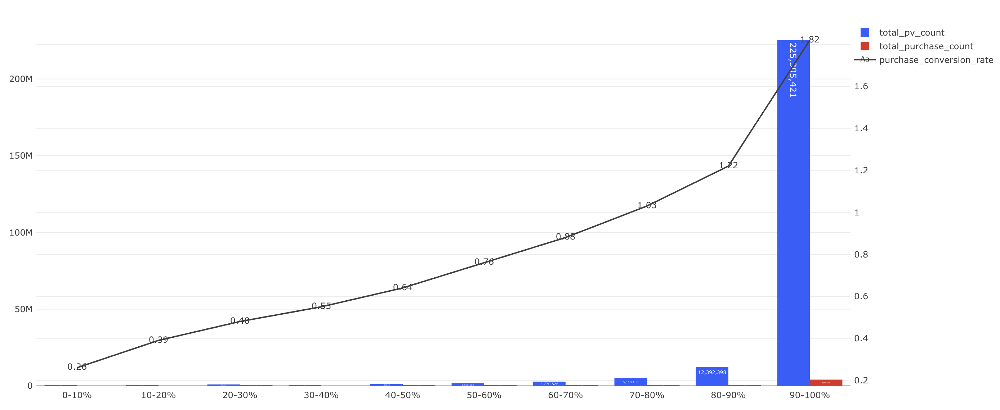

# [오늘의집의 매력적인 상품은 고객에게 잘 보여지고 있을까?] Kick-off

담당자: Ikpyo Hong
날짜: 2025년 10월 2일
상태: Done

## **Background  이 리서치가 중요한 이유(보완중)**

---

- 예시
    
    *리서치/분석의 배경 및 필요성, 대략적인 아이디어 작성. 목적과 목표는 이해관계자에 따라 달라질 수 있다. 조직의 전략적인 배경에서 나왔다면 제품 전략 문서나 로드맵을 언급해도 좋고,번뜩이는 아이디어에서 출발했다면 아이디어를 제안한 사람의 발언을 언급해도 좋습니다*
    
    *우리 제품/사업이 지금 어떤 단계에 있는지, 이 단계에 어떤 의사결정이 필요한지,이 의사결정/ 혹은 리서치로 인해 우리가 무엇을 할 수 있는지 적어줍니다.*
    
    > `*e.g.*`
    이 리서치는 4Q목표인 000를 달성하기 위해 발의되었습니다. 00님의 아이디어 “  “로부터 영감을 받았구요.  A기능의 지표가 00%인 상태이고 목표 지표는 00%입니니다. 목표로 가는 핵심적인 Blocker는 00라고 생각하고 있으며, 이와 관련한 전략을 결정하기 위해 이 리서치가 필요합니다. 리서치를 통해 이 Blocker를 해소함으로써 우리는 목표 지표 00%에 도달해 고객에게 00한 경험을 줄 수 있습니다.
    > 

https://redash-data.datahou.se/queries/6208/source#12979

- 오늘의집 등록 상품의 PV는 상위 10% 상품에 몰려있음([신규고객 발굴](https://www.notion.so/26aa597878a080fd8827d4b4f10b09b4?pvs=21) 분석에서 발췌)
    
    
    
    
    
    - 25년 7월 이후 한번이라도 조회된 상품 수 : 1,591,007개
        - 1,874,496개가 동일 기간 내 판매 가능했던 상품 수(조회 0 포함한 상품 수)
        - 전체 상품 중 15%의 경우 해당 기간동안 한번도 유저의 PDP 방문이 발생하지 않음
        - 25년 7월 이후 등재 상품 수 : 90,748개 (5.7%)
    - 상위 n개 상품의 평균 조회수는 전체 90% 중위보다도 높음
        - 하위 상품 20%는 조회 1~2개 수준

https://redash-data.datahou.se/queries/6253/source#13059

- 상위 10%를 1%단위로 쪼개어 보았을때 상위 1%의 쏠림이 큰 상태

https://redash-data.datahou.se/queries/6327/source#13196

- 상위 10% 상품들의 PV 비중을 시계열로 확인
    - 23년도 85.64% → 25년도 88.51%로 점진적 변화
- 추가로 확인이 필요한 것
    - 카테고리 별로 흐름이 다른가?
    - 상위 10% 상품들 내에서도 잘게 쪼개어보면 어떠한가? (상위 1%, 2% 등)

추가 분석 중

[롱테일 상품 분석](https://www.notion.so/28ca597878a0808a9efafb3e61875ec8?pvs=21) 

fyi

[세그먼트별 구매 상품 랭킹 파악](https://www.notion.so/276a597878a0804ab9ffdeb59e99d10e?pvs=21) 

기타

- https://docs.google.com/spreadsheets/d/1q1OVXztCkHr8NFX2L-t6o-z8aqR_oHNEgRMSdbfzHSs/edit?gid=376619882#gid=376619882

## **사용자, 사람, 프로세스에 관해 우리가 가정하고 있는 것**

---

### 핵심 가설

<aside>
💭

- **가설 1**: 고객들에게 노출되는 상품은 소수의 인기 상품(유명 브랜드/검색 상위/추천 상위)에만 몰려 있으며, 나머지 다수 상품은 발견되지 못하거나 PDP 진입조차 어렵다
- **가설 2**: PV 쏠림은 상품 자체 경쟁력(브랜드, 가격, 리뷰, 썸네일 퀄리티)과 노출 구조(검색, 추천, 기획전 등) 모두의 영향으로 발생한다
- **가설 3**: 장기적으로 PV 집중은 신규/롱테일 상품의 성장 기회를 저해하고, 고객 선택지의 다양성 및 플랫폼 신뢰도에도 부정적 영향을 줄 수 있다
</aside>

- 가설 수정
    - **좋아할만한 것이 숨겨져 있다**
        - 현상에 대한 파악 보다 검증을 위한 리서치나 분석이 필요할 것
            - 랜덤으로 섬네일 100개를 뽑는다, 5개는 상위 1%, 상위 2~10% 에서 뽑아서 고객에게 보여주고 매력적인지 확인
    - **PV가 골고루 뿌려졌으면 이상적으로 매출이 잘 나오는가? 를 검증**
        - 특정 파트너를 골라서 과거 사건을 트래킹 해보는 것
        - 잘된 애들이 과거에 어떠했는지
        - 제드님이 진행한 실험을 가지고 확인
        - PB를 기준으로 GP, CP 가지고 확인?
        - 설문조사로 각 A, B 상품을 보여주고 매력도를 보여줄 것
            - 큰 차이가 없다면 노출 차이 여부가 영향이 있을 것이다
    - **PV가 어떻게 다르게 뿌려져야 이상적으로 매출이 증가하는가?**
    - **그게 오늘의집에 도움이 되는가? (GMV인지, 고객 입장인지 등)**
    - **오늘의집에서 롱테일을 키우는 것이 왜 더 중요한가 까지 설명하면 좋을 것**

### 핵심 문제

<aside>

고객 관점

- 발견의 한계: 전체 상품의 15%는 단 한 번도 PDP 방문이 발생하지 않을 정도로 노출이 불균형하여, 고객은 다양한 상품을 발견할 기회를 잃음.
- 선택지 왜곡: 검색·추천 결과에서 반복적으로 상위 인기 상품만 노출되어 “비슷비슷한 상품만 보인다”는 경험으로 이어짐.
- 품질 대비 정보 비대칭: 조회·리뷰가 적은 상품은 실제로 좋은 품질임에도 불신을 받아 선택되지 못하고, 고객은 ‘진짜 좋은 상품’을 놓치게 됨.
- 쇼핑 경험의 단조로움: 신규/롱테일 상품과의 만남이 제한되어 탐색의 즐거움과 “내 취향 발견” 경험이 줄어듦.
</aside>

<aside>
💼

비즈니스 관점

- 매출 구조의 집중: 상위 10% 상품에 PV와 구매가 몰리면서 매출이 소수 상품/셀러에 종속되는 위험 구조 발생
- 롱테일 성장 저해: 신규 상품 및 비인기 상품은 초기 노출 기회 부족으로 성장을 시작하기조차 어려움
- 지속 가능성 위협: 플랫폼이 제공하는 상품 다양성이 약화되면 고객 신뢰도 및 장기 재방문 동기도 약해짐
</aside>

<aside>
💲

영업 관점

- 신규 셀러 유입 장벽: 입점 후에도 상품이 고객에게 노출되지 않아, 셀러의 불만·이탈 가능성이 높음
- 영업 설득력 저하: “오늘의집에 입점해도 상위 상품이 아니면 기회가 없다”는 인식 확산 → 신규 셀러 영입 어려움
- 셀러 간 불균형: 일부 셀러는 과도한 트래픽을 가져가고, 다수 셀러는 소외됨
</aside>

<aside>
📱

프로덕트 관점

- 알고리즘 편향: CTR/PV 중심 노출 구조가 인기 상품을 더 인기 있게 만드는 ‘부익부 빈익빈’ 효과를 강화
- 상품 다양성 부족: 고객에게 제공되는 탐색 결과가 편중되어 UX 저하
- KPI의 역효과: 단기적 전환율 극대화를 위한 설계가 장기적으로 플랫폼 다양성·지속성에 역행할 위험
</aside>

## 리서치 진행 방향

주요 리서치 질문

1. 고객은 인기 상품만 보는가, 아니면 노출 구조상 어쩔 수 없이 그렇게 되는가?
2. 신규/롱테일 상품을 고객이 접하지 못하는 이유는 무엇인가?
    - 정보 부족(리뷰, 브랜드 인지도/신뢰도)
    - 검색/추천 노출 구조 문제
    - 고객 탐색 행동 특성
3. PV 집중이 구매 전환, 스크랩, 탐색 다양성에 어떤 영향을 미치는가?

리서치 방법

- 정성 조사
    - 고객 인터뷰: 인기 상품/비인기 상품 탐색 경험 비교, "상품을 어떻게 발견했는지" 구체적으로 추적
    - 셀러 인터뷰: 신규 입점 시 노출/조회에 대한 어려움 파악
- 정량 분석
    - 검색/추천/기획전별 PV 기여도 분석
    - 인기 상품과 비인기 상품 간 구매전환율 비교
    - 신규 상품이 첫 PV를 얻기까지 걸리는 기간
- 벤치마킹
    - 경쟁사(쿠팡, 29CM 등)의 롱테일 노출 전략 조사

## 인터뷰/조사 대상

- **고객**
    - 상위 상품 구매 경험자 vs 롱테일 상품 구매 경험자
    - “새로운 상품 발견”을 중요하게 여기는 탐색형 고객
    
    <aside>
    ❔
    
    실제 “상품 발견 → 클릭 → 구매” 흐름을 경험하는 주체이기 때문에, PV 쏠림 현상이 고객 경험에서 어떻게 나타나는지 확인
    
    - 상위 인기 상품을 주로 접하는 고객 vs 롱테일 상품을 구매한 경험이 있는 고객을 나누어 인터뷰하면, 발견 경로 차이와 탐색 불편을 비교 가능
    - 고객이 “왜 이 상품을 선택했는지 / 다른 상품은 왜 보지 않았는지”를 직접 들어야, 데이터로만 보면 드러나지 않는 맥락(예: 리뷰 부족, 불신, 노출 구조 체감)을 파악할 수 있음
    </aside>
    

- **셀러**
    - 신규 입점 셀러(최근 6개월)
    - 조회/매출 상위 vs 하위 셀러 비교
    
    <aside>
    ❔
    
    PV 편중의 또 다른 직접 당사자는 셀러. 특히 신규 입점 셀러의 경우, 상품이 노출되지 않는 문제를 체감적으로 겪고 있음
    
    - 입점 후 첫 PV를 얻기까지 어떤 어려움이 있었는지 → 신규 상품이 성장하지 못하는 병목 지점 확인 가능
    - 상위 매출 셀러와 하위 매출 셀러를 비교하면, 상품 경쟁력 요인(브랜드, 가격, 이미지)과 노출 구조 차이 중 어디에서 문제가 생기는지 구분 가능
    </aside>
    

- **내부 이해관계자**
    - 프로덕트팀: 검색/추천 로직 담당자
    - 영업팀: 셀러 온보딩/운영 담당자
    - 커머스 기획/SM: 기획전/노출 구조 담당자
    
    <aside>
    ❔
    
    고객과 셀러 관점에서 드러난 문제를 실제로 해결 가능한 방법으로 연결해줄 주체를 조사
    
    - 프로덕트팀: 검색/추천 알고리즘 설계 의도와 한계 확인 (현재 구조가 상위 상품 강화 효과를 주는지)
    - 영업팀: 신규 셀러 온보딩 과정에서 PV 불균형 문제가 얼마나 자주 제기되는지 확인
    - 커머스 기획팀: 기획전/노출 전략이 롱테일 상품 활성화에 얼마나 기여하거나 방해하는지 확인
    </aside>
    

## **기대 결과물**

리서치의 핵심은 “왜 PV가 극소수 상품에 쏠리는지, 그것이 고객 경험과 비즈니스에 어떤 문제를 만드는지, 이를 풀기 위한 구조적 개선 포인트는 무엇인지”를 밝혀내는 것

- **인사이트 리포트**
    - PV 쏠림의 원인 구조(상품 경쟁력 요인 vs 노출 구조 요인)
    - 고객 관점/셀러 관점/비즈니스 관점에서의 문제 매핑
    - 롱테일 상품 발견/성장 저해 요인
- **우선 개선 제안**
    - 검색/추천 다양성 지표 설계 (ex. “상품 다양성 점수”)
    - 신규 상품 온보딩 개선 방안
    - 롱테일 상품 활성화 전략(리뷰 확보, 첫 노출 보장, 큐레이션 방식)

## 리서치 내러티브

---

1️⃣ **정량적 진단 (현상의 구조 파악)**

2️⃣ **정성적 탐색 (이게 고객에게 실제 문제인가?)**

3️⃣ **효율성 검증 (쏠림 구조가 비즈니스 성과에 어떤 영향을 주는가)**

4️⃣ **영향 분석 (신규·롱테일 상품/다양성 측면 영향)**

5️⃣ **본질 검증 (현재 인기 구조가 실제 선호를 반영하는가)**

**→ 이후 시사점/개선 방향 제안**

### ① 현상 진단 (정량)

> “왜 PV가 특정 상품에 몰리는가?”
> 

**가설 1️⃣**

PV 쏠림은 ‘상품 경쟁력’보다 ‘노출 구조(검색, 추천, 기획전 등)’의 영향이 더 크다.

검증 포인트

- 상위 10% 상품의 PV 집중이 구조적으로 만들어진 결과인가?
- 동일 조건(카테고리, 가격, 리뷰수 등)을 통제했을 때, 노출 위치/채널이 PV에 미치는 영향은 어느 정도인가?
- 채널(검색 vs 추천 vs 기획전)별 PV 집중 패턴의 차이는 존재하는가?

리서치 방법

- **정량 로그 분석**
    - PV 집중도, 노출 위치·채널별 PV 분포
    - 동일 조건 상품 매칭 후 노출 위치 vs PV 회귀분석
    - PV-CTR-노출량 상관 구조 시각화

산출물

- PV 집중 구조 리포트 (히트맵, 분포 차트)
- “상품 요인 vs 노출 요인” 기여도 비교 결과
- 구조적 쏠림 근거 요약 (1차 인사이트)

---

### ② 고객 체감 진단 (정성)

> “그 쏠림이 고객에게 실제로 문제인가?”
> 

**가설 1-2️⃣**

PV 쏠림은 모든 고객에게 문제가 아니라, 특정 세그먼트에서 더 강하게 체감되는 문제일 것이다.

검증 포인트

- 누구에게(어떤 세그먼트)에 이 현상이 문제로 인식되는가?
- 고객은 어떤 순간에 “비슷한 상품만 보인다”거나 “새로운 상품이 없다”고 느끼는가?
- 쏠림이 구매 의사결정에 어떤 심리적 영향(피로감, 불신, 탐색 포기 등)을 주는가?

리서치 방법

- **정성 고객 인터뷰 (탐색 행동 중심)**
    - 최근 탐색 경험자(이사, 결혼, 가구 교체 등) 8~10명
    - “상품을 어떻게 찾는가?”, “왜 그 상품을 클릭했나?”, “다양성 부족을 느낀 적 있나?”
- **세그먼트 비교 분석**
    - 이사/결혼/일반 고객군별로 탐색 경로·불편 포인트 비교

보조 실험 (가상 시나리오)

- **A vs B 개념 실험**
    - A: 현재 추천/검색 구조
    - B: 다양성 강화 구조(중위 상품 10% 추가 노출)
    - 고객 반응/선호 시뮬레이션으로 개선 효과 예측

산출물

- 고객 세그먼트별 탐색 경험 맵
- “누구에게 문제인가, 왜 문제인가” 인사이트
- PV 다양성 개선 시나리오별 고객 영향 예측

---

### ③ 효율성 검증 (비즈니스 성과)

> “쏠림 구조가 효율적인 매출 구조인가?”
> 

**가설 2️⃣**

PV가 높다고 해서 GMV나 전환율이 항상 높지는 않다.

상위 1% 상품은 PV는 높지만, 매출 효율은 떨어질 수 있다.

검증 포인트

- PV 대비 구매전환율(GCR) / GMV 효율의 분포
- PV 상위 vs 중위 그룹 간 효율 차이
- PV 집중이 매출 집중으로 이어지지 않는 구간 존재 여부

리서치 방법

- **데이터 분석 (SQL/Looker)**
    - PV-전환율-매출 회귀분석
    - PV 상위 1%, 2~10%, 중위권 그룹 비교
- **보조 셀러 인터뷰**
    - “조회는 많은데 판매가 안 되는 상품” 사례 수집

산출물

- PV-매출 효율 매트릭스
- “조회 vs 매출 불일치” 사례 리포트

---

### ④ 영향 분석 (롱테일·다양성 관점)

> “쏠림이 생태계 전반에 어떤 영향을 주는가?”
> 

**가설 3️⃣**

PV 집중은 신규·롱테일 상품의 성장과 고객의 탐색 다양성을 저해한다.

검증 포인트

- 신규 상품이 첫 PV를 얻기까지 걸리는 시간
- 추천/검색의 다양성 지표(Diversity Index) 추세
- 다양성과 고객 체류시간·만족도의 관계

리서치 방법

- **로그 분석**
    - 신규 상품 첫 PV 도달 시간 분석
    - 카테고리별 다양성 지표 추이
- **정성 인터뷰**
    - 신규 셀러: 노출 기회 체감
    - 고객: “새로운 상품을 발견하기 어려운 이유” 탐색
- **벤치마크**
    - 경쟁사(쿠팡, 무신사, 29CM) 롱테일 활성화 전략 조사

산출물

- 다양성 지표 리포트
- 신규 상품 성장 곡선
- 롱테일 활성화 제안 인사이트

---

### ⑤ 본질 검증 (고객 선호 왜곡)

> “PV 상위 구조가 진짜 선호를 반영하고 있는가?”
> 

**가설 4️⃣**

PV 상위 구조는 실제 고객의 선호와 일치하지 않을 수 있다.

(즉, 노출이 많아서 좋아 보이는 착시일 수 있다.)

검증 포인트

- PV 순위와 고객 선호도(매력도/구매의향) 간 상관
- 고객이 무작위로 노출된 중위 상품에 더 높은 반응을 보이는가?

리서치 방법

- **설문형 실험 (매력도 평가)**
    - 상/중/하위 그룹별 상품을 무작위 제시
    - 매력도·구매의향 평가 비교
- **정성 인터뷰**
    - 선택 이유 탐색 (“무엇이 더 좋아 보였는가?”)

산출물

- PV 순위 vs 선호도 상관분석 결과
- “현재 인기 구조는 선호를 반영하는가?” 인사이트

---

### 🔚 ⑥ 제안 / 시사점 정리

| 인사이트 축 | 문제 요약 | 제안 방향 |
| --- | --- | --- |
| **노출 구조** | PV 쏠림은 고객 선택이 아닌 구조적 노출의 결과 | 검색/추천 알고리즘 다양성 강화 |
| **고객 경험** | 특정 세그먼트(이사/결혼)는 상품 다양성 부족을 불편으로 체감 | 세그먼트별 탐색 맥락 기반 추천 강화 |
| **비즈니스 효율** | PV 집중이 매출 효율로 이어지지 않음 | KPI를 PV 중심 → GMV 효율 중심으로 전환 |
| **롱테일/생태계** | 신규 상품·셀러의 성장 저해 | 신규 상품 초기 노출·리뷰 확보 프로그램 |
| **선호 반영성** | 인기 구조가 실제 선호를 왜곡 | “좋아요/선호 기반” 개인화 추천 고도화 |

## **References**

---

[1P 신규상품 수요 예측을 위한 EDA](https://www.notion.so/1P-EDA-120a597878a080bba625fe5987071961?pvs=21) 

https://docs.google.com/spreadsheets/d/1q1OVXztCkHr8NFX2L-t6o-z8aqR_oHNEgRMSdbfzHSs/edit?usp=sharing

[[2501] 이사/결혼 고객의 탐색 문제는 무엇일까?](https://www.notion.so/2501-181a597878a080ecb9e5c081ebb06230?pvs=21) 

[신규고객 발굴](https://www.notion.so/26aa597878a080fd8827d4b4f10b09b4?pvs=21) 

**[Recommendation] 상품 pv 분위 그룹별 스크랩 전환율** https://redash-data.datahou.se/queries/6253/source#13059

**[Recommendation] PDP조회 분위별 시계열 변화** https://redash-data.datahou.se/queries/6327/source#13196

**[Recommendation] 상품 pv 하위 상품 파악** https://redash-data.datahou.se/queries/6208/source#12979

https://ohou-se.slack.com/archives/C06QW7LAVPS/p1760349208389169

커머스 롱테일 프로젝트

- https://docs.google.com/document/d/1ESIuNjlUw-QmZrI-TX6OX_UNQZoblIvXJcU8OQabaFc/edit?tab=t.0
- https://docs.google.com/spreadsheets/d/1zQK4OR7MxCOoeur3T5p0DXYAnoExAOYhSP0mvAazAj4/edit?gid=598107082#gid=598107082
- https://docs.google.com/spreadsheets/d/14T-QCVWRHQBA28RXzmYBP5EzSL7EsZULzKqnR6n3eQg/edit?gid=1385035632#gid=1385035632

## Discussion

---

- 251013_이해관계자 의견 청취(추천팀)
    
    **`참석자`**
    
    - @Dominic Lim @Riley Kim @Jordan Sim @Ikpyo Hong
    
    **`Agenda`**
    
    - 추천팀 핵심 Question
        - 롱테일 상품을 추천에 노출 했을때 단기적 성능(CTR, CVR 등)이 좋지 않을 수 있음
            - 단기적인 성능 하락을 감수할 수 있는가?
            - 현재는 CTR 목표로 설정 되어 있음
        - 지면 기준으로 롱테일 상품을 안보여주는 곳이 있는지, 어디인지 정의 필요
        - 과거 경험
            - 과거 상품 노출 시 특가 상품을 좀 더 노출을 많이하겠다는 비즈니스적 목표가 있었으며 일방적으로 보여주는 방식이었고 OKR에 특가 노출 비중이 있었음 → 향후 롱테일 노출 전략이 추천에 적용된다면 기존 방식으로는 안될 것
                - OKR이 특가 노출 비중을 늘리는 것이 아니라 특가 노출을 어떻게 해야 OKR을 달성할 수 있을지가 되어야 함
            - 롱테일을 잘 잡으면 업사이드가 있다는 것에는 동의하나 어떻게 할지 방식에서는 고민 필요, 목표 설정이 중요함
    - 데이터 분석 관점 의견
        - 데이터 분석에서 기준을 전체 페이지로 보면 판단이 어려울 것, 좀 더 나누어 볼 필요 있음
        - pv외에 임프레션 기준으로도 한번 보면 좋을 것 같음
            - 노출은 되었는데 사람들이 클릭을 안하는 걸수도 있음
    - R&R 관점 의견
        - 검색 담당과 추천 담당 영역이 다르며 각기 차이 존재
            - 잘 안바뀌는 영역도 있음 → 검색이 상대적으로 덜 바뀌는 편
            - 광고 > 추천 > 검색 순으로 변경 빈도 높음
            - 검색 담당 → 한스, 카오님
        - 추천은 대부분 여러 시그널을 조합해서 내보내는 형태(인기순, 비슷한 상품 등)
            - 과거, 사진 개인화 → 200~300% 증가 했던 이력 있음
        - 추천으로 바뀔 수 있는 곳
            - 쇼핑홈, PDP(하단 영역)
        - 현재 추천 영역 없는 곳
            - 검색 - 임프레션이 더 잘나옴
            - brand detail page(
        - 리스트 형태는 검색 이고, 피드 형태는 추천
            - 추천팀에서 카테고리 PLP, 베스트 페이지, 오늘의딜 개인화 해볼 예정
    - 고객 관점 의견
        - 롱테일을 잘 구매하는 군이 있을 것
            - 롱테일을 잘 보여주는 군에게 더 노출을 시켜서 전체 노출량을 높이고 퍼져나가도록 개인화가 필요할 것
        - 콘텐츠에 신규 사진이 올라오면 몇 시간 낸 무조건 노출을 시키는데, 비슷한 사진을 본 사람에게 노출을 하고 있음, 일정 노출을 만들 수 있겠음
    - UX 관련
        - 라일리님) 바이너리샵 제품이 잘 안뜬다, 피드백 루프 해결해야 할 필요 있음
        - 개인화 또는 탐색을 더 할 수 있는 인터랙션 구조를 만들 수 있을까?
            - 개인 선호를 반영한 추천 구조
        - 조던님) 기존 추천하던 페이지에 그대로 반영되면 마이너스가 될 것
            - 이를 위한 다른 UI를 만들어두는 것이 좋지 않을까
        - 가장 쉬운 방법은 유저가 고를 수 있는 UI를 만드는 것
            - 모듈별로 맥락적으로 나열 하는 것도 방법일 것
            - 이후엔 유저 별로 따로 학습을 시킬 수 있을 것
            - 이런 접근을 하면 어떨까
    - 향후 협업을 위한 contact point : 도미닉님
- 251014_데이터 분석 요청
    
    **`참석자`**
    
    - @Carl Jang @Ikpyo Hong
    
    **`Agenda`**
    
    - 분석 요청
        - 카테고리 별로 나누어 보기
        - 임프레션 기준으로 살펴보기
            - 조회 받을 기회가 적어서 인지, 단순히 상품 매력도가 떨어져서 인지 추가 검증 필요
        - PDP 내 리뷰, 스타일링샷 등 상관관계 확인해보기
            - 리뷰든 스타일링 샷이든 상품의 매력을 발산하기에 도움이되는 요소가 적은 상품이 click이나 cvr 등 적을 것이라는 가설
    - 아이디어
        - 임프레션까지 확인 했는데 롱테일은 노출되는 기회가 없다면 해소해줄 필요가 있다
        - 상품 자체가 힘이 없으면 상품의 힘을 키울 수  있는 리뷰나 스타일링샷을 늘리도록 방향을 설정
        - 간단하게 썸네일만 바꿔도 힘을 가져갈 수 있지 않을까? → 리서치로 테스트 해볼 수 있을 듯
        - 실제 지면에서 무언가 테스트를 해본다면
            - 인기순 페이지(베스트 페이지) 같은 곳에서 테스트 해볼 수 있을  것
- 251014_1p 신규상품 수요 예측 분석 내용 다운로드
    
    [1P 신규상품 수요 예측을 위한 EDA](https://www.notion.so/1P-EDA-120a597878a080bba625fe5987071961?pvs=21) 
    
    **`참석자`**
    
    - @Herick Choi @Ikpyo Hong
    
    **`Agenda`**
    
    - 분석 발단
        - 1p를 런칭하는데 잘 안나간다는 것을 발견 했음
            - 잘못된 1p를 런칭하기로 결정한 것 아닐까?
            - 팔릴지 예측해볼 수 없는가?
    - 분석 결론
        - 수요 예측을 위한 비슷한 상품을 정의하기 위해서는 상품들의 특징들이 있어야 하는데(컬러, 사이즈 등등) 그런 정보들이 미비하여 수요 예측이 어려운 상황
        - 예측을 할 때 수요가 꾸준히 일어나야 하는데 예측이 가능한데 간헐적으로 팔리면 예측이 어려움
        - 예측하기에는 안팔리는 롱테일 상품이 많음
        - 그래도 1p는 조회를 부어주는 퍼널이 존재하여 전체 상품 보다는 상황이 좋은 편
            - 더불어 1p에서 잘 팔리는 것을 잘 골랐을 수 있음
            - 1p가 더 잘 팔리는 별도 요인들이 더 있을 것
        - 하지만 잘팔린다고 해서 엄청난 차이로 더 잘팔리는 것은 아님
        - 안 팔리는 상품이 2개로 나뉘어짐
            - 정말 장기로 안팔리는 것과 간헐적으로 팔리는 것은 성격이 좀 다르다
            - 1p 기준으로 장기적으로 안팔리는건 그냥 안팔린다고 보면 됨
            - 간헐적으로 팔리는 것은 노출의 문제
        - 소규모, 가격이 낮은 상품은 팔리는데 큰 상품들 책상이나 큰 의자 같은 애들은 안팔리는 확률이 올라감, 이유는 확인 좀 필요함 -> 대체제가 너무 많이 있는 것 같음
- 251020_이해관계자 의견 청취(검색팀)
    - 기존에 비즈와 논의한 내용 있음
        - 노출을 못받고 있는 것들이 노출을 받으면 좋은 퍼포먼스를 낼 수 있다
        - 기준점 - ctr 등
        - 콜드스타트 문제를 광고로 풀고 있음
        - 오가닉에서 풀면 메트릭이 흔들릴 것
        - 모듈을 만들면 광고 퍼포먼스가 떨어질 것, 트레이드 오프를 이야기해야한다에서 끝났음
    - 문제는 맞을 것인데 결국 어떻게 풀 것인지가 해결해야 할 것
        - 트레이드 오프 발생에 대해, 좋은 퍼포먼스를 발생시킬 수 있는 롱테일의 요소를 찾는 것에 집중하는 것이 좋지 않을까
    - 사례
        - 취향의 발견
            - 가격대가 있더라도 감도 높은 상품 위주로 보여주는 컬렉션
            - 바이너리샵이랑 겹치지만 결이 좀 다름
            - 감도에 대한 정의
                - 29 상품을 참고하여 평가, 29에서 인기 많은 상품이 감도 높을 것이라는 가정
                - 브랜드 단위
            - 결과적으로 가격대가 높고 감도 있는 것들이 선택
    - 데이터 분석
        - 과거에 롱테일이었다가 현재 올라온 상품들이 있다면 더 빨리 올려주는 방법이 있으면 좋을 것
            - 어떤 상품이 필요한지 모르기 때문에, 사례를 찾아서 기준을 마련할 필요가 있음
            - 결국 브랜드와 셀러가 중요할 것?
    - 검색에서는 키워드 추천으로 풀고 있는 것 같음
        - 좁혀갈 수 있는 구체적 방법을 제공하고 있음
    - 검색에서는 애초에 오로라에서 키워드 등록이 안되어 있으면 제한적임
        - 다른 방법으로 해볼 수 있겠지만 힘든 상태
    - 나중에도 안팔릴것을 발굴하기보다 팔릴것을 발굴하는 데에 집중하는 것이 좋을 것
- 251022_리서치 방향 논의
    
    PV 쏠림 및 롱테일 상품 발견 문제 확인을 위한 리서치
    
    아젠다
    
    1. 리서치 배경 및 목적 (데이터 현상 공유)
    2. 핵심 가설 수립 (데이터 기반 고도화)
    3. 주요 리서치 방법론 비교 및 최적안 선정
    4. 향후 계획 (Next Steps)
    
    ---
    
    **2. 리서치 배경 및 목적**
    
    1) 현재 현상
    
    - 쏠림 문제: 오늘의집 PV는 상위 10% 상품에 88.5%가 집중되어 있으며, 특히 상위 1% 내에서 쏠림이 가장 극심
        - 악화 추세: 이 쏠림은 23년(85.6%) 대비 25년(88.5%)로 점진적으로 악화
    - '발견 제로' 상품의 존재: 가장 심각한 것은, 판매 가능한 상품의 15%가 25년 7월 이후 단 한 번의 PDP 조회(PV=0)도 발생하지 않았음 (하위 20%는 조회수 1~2회 수준)
    - 신규 상품의 매몰: 신규 등록 상품(전체의 5.7%)이 이 '발견 제로' 그룹에 속할 가능성이 높아, '콜드 스타트(Cold Start)' 문제가 심각할 것으로 추정
    
    2) 리서치 목적 (Goal)
    
    - 현상 규명: 상위 1%로의 PV 쏠림이 '고객의 자발적 선호' 때문인지, '롱테일 상품을 발견하는 것 자체의 실패' 때문인지 그 핵심 원인을 규명
    - 문제 증명: (만약 구조적 문제라면) "15%의 상품이 PV 0을 기록"하는 것이 '서비스의 구조적/UX적 문제'임을 고객 리서치를 통해 증명
    - 기회 포착: '좋아할 만한 상품(롱테일)'을 발견하지 못하고 이탈하는 고객의 '숨겨진 니즈(Latent Needs)'를 포착하여, 구조적 개편의 근거를 확보
    
    ---
    
    **3. 핵심 가설**
    
    > [핵심 가설]
    > 
    > 
    > "PV 쏠림 현상(상위 10%에 88.5% 집중)과 15%에 달하는 'PV=0' 상품의 존재는, '고객이 숏헤드 상품만 원해서'가 아니라, '매력적인 롱테일 상품이 서비스의 구조적 문제(IA, 검색/추천 로직)로 인해 발견조차 되지 못하는' 발견의 실패(Discovery Failure) 문제이다."
    > 
    > "이러한 구조적 실패는 신규/롱테일 상품의 성장 기회를 저해하고 고객 선택의 다양성을 침해하며, 이는 궁극적으로 플랫폼 신뢰도(원하는 상품을 찾을 수 있는 곳)에 부정적 영향을 줄 수 있다."
    > 
    
    ---
    
    **4. 주요 리서치 방법론 비교 및 최적안 논의**
    
    핵심 가설을 검증을 위한 리서치 방법론 비교 표
    
    | **리서치 방법** | **1. 상품 가치/선호도 평가 (설문)** | **2. 카드 소팅 (온라인 툴)** | **3. 로그 데이터 기반 '탐색형 UT'** | **4. 경쟁사 비교 '탐색형 UT'** |
    | --- | --- | --- | --- | --- |
    | **핵심 목적** | 롱테일 상품의 '수요/매력도' 검증 | 'IA(정보 구조)'의 문제점 진단 | '탐색 실패 행동' 포착 | '부족한 구조(기능)' 발견 |
    | **검증 가설** | "고객은 롱테일 상품을 *원한다*." | "고객은 롱테일을 *분류/예측* 못 한다." | "고객은 롱테일을 *찾다가 포기한다*." | "우리는 경쟁사 대비 *발견 기능*이 부족하다." |
    | **장점** | • 빠름 (설문)
    • '수요'와 '발견' 문제를 분리 | • IA 개편의 구체적 근거 확보
    • 사용자의 멘탈 모델 파악 | • 'PV 쏠림'과 '행동'의 1:1 연결 (가장 중요)
    • 문제의 'Why'를 심층 관찰 | • 즉각적인 개선안(Action Item) 도출
    • 문제를 객관적으로 증명 |
    | **단점** | • '행동'이 아닌 '태도' 측정
    • '왜' 발견 못하는지는 모름 | • IA 외의 문제(검색, 필터)는 모름 | • 리크루팅/진행 시간 소요 (정성) | • 리크루팅/진행 시간 소요 (정성)
    • 적절한 경쟁사 선정 필요 |
    - 리서치 방식 상세
        
        1. 상품 가치/선호도 평가 (설문 방식)
        
        이 방식은 "PV 쏠림이 정말 '수요'의 문제인지 '발견'의 문제인지"를 분리하여 검증하는 데 초점을 맞춥니다.
        
        - **핵심 가설:** "고객은 롱테일 상품을 '원하지 않아서' 안 보는 것이 아니라 '발견하지 못해서' 못 보는 것이다. 만약 숏헤드 상품과 롱테일 상품을 동등하게 노출(제시)한다면, 롱테일 상품의 선호도(매력도)는 숏헤드 상품 못지않게 높을 것이다."
        - **얻을 수 있는 점 (Key Insights):**
            - **'수요 문제' vs '발견 문제' 분리:** 만약 롱테일 상품의 선호도가 숏헤드 상품만큼 높게 나온다면, "PV 쏠림은 고객의 수요 문제가 아니라 순전히 발견(UX/UI)의 문제다"라는 주장에 대한 강력한 근거를 확보할 수 있습니다.
            - **MD(상품) 문제 배제:** 만약 롱테일 상품의 선호도가 현저히 낮게 나온다면, 이는 UX 문제가 아니라 상품 소싱(MD) 자체가 숏헤드 중심으로만 이루어지고 있을 가능성을 시사합니다.
        
        ---
        
        2. 카드 소팅 (온라인 툴 방식)
        
        이 방식은 "구조적 발견 문제" 중에서도 **'정보 구조(IA)'**, 즉 카테고리 분류 체계가 롱테일 탐색을 가로막고 있는지를 진단합니다.
        
        - **핵심 가설:** "현재 서비스의 카테고리 구조(IA)는 사용자의 머릿속 분류 방식(Mental Model)과 다르다. 이로 인해 사용자는 롱테일 상품이 어디에 있는지 예측하지 못하고, 탐색(Browsing) 과정에서 길을 잃어 결국 숏헤드 영역(베스트 등)으로 이탈한다."
        - **얻을 수 있는 점 (Key Insights):**
            - **'고아' 롱테일 상품 식별:** 사용자들이 특정 롱테일 상품들을 어디에도 분류하지 못하고 헤매는 패턴을 발견, 이 상품들이 현재 IA에서 '고아' 상태임을 증명할 수 있습니다.
            - **사용자 중심 카테고리명 도출:** 사용자가 직접 붙인 그룹명(예: "센스있는 집들이 선물")과 현재의 카테고리명(예: "홈/데코") 사이의 격차를 확인하여, IA 개편의 구체적인 방향성을 얻을 수 있습니다.
            - **탐색 실패의 1차 원인 진단:** "PV 쏠림은 고객이 *검색*을 못해서가 아니라, 애초에 *탐색(둘러보기)*이 불가능한 구조이기 때문이다"라는 가설을 뒷받침합니다.
        
        ---
        
        3. 로그 데이터 기반 '탐색형 UT' (관찰 방식)
        
        이 방식은 **"PV 쏠림"이라는 데이터(What)와 "탐색 실패"라는 행동(Why)을 1:1로 연결**하는 가장 직접적이고 강력한 방법입니다.
        
        - **핵심 가설:** "PV 쏠림을 주도하는 '숏헤드 의존형' 사용자는 (A)롱테일 탐색 니즈가 분명히 존재함에도, (B)실제 탐색 과제 수행 시 현재의 구조적 문제(복잡한 IA, 불편한 필터, 부정확한 검색)에 부딪혀 (C)쉽게 탐색을 포기하고, (D)가장 안전하고 접근하기 쉬운 숏헤드 영역으로 회귀(이탈)한다."
        - **얻을 수 있는 점 (Key Insights):**
            - **'데이터'와 '행동'의 직접 연결:** "PV 쏠림 현상"을 만드는 실제 사용자를 데려와, 그들이 "왜" 롱테일 PV를 발생시키지 못하는지(포기하는지) 그 행동과 맥락을 직접 관찰하고 녹화하여 증거로 삼을 수 있습니다.
            - **핵심 탐색 장벽(Pain Point) 포착:** 사용자가 탐색을 '포기'하는 결정적인 순간(예: "필터가 이게 뭐예요?", "검색해도 안 나오네, 그냥 베스트나 봐야겠다")을 포착하여 가장 시급하게 개선할 '구조적 문제'의 우선순위를 정할 수 있습니다.
        
        ---
        
        4. 경쟁사 비교 '탐색형 UT' (관찰 방식)
        
        이 방식은 우리 서비스의 '구조적 문제'를 사용자가 이미 '학습된 불편함'으로 인지하지 못할 때, **비교 대상을 통해 문제를 객관화하고 '개선 방향'까지 도출**하는 방법입니다.
        
        - **핵심 가설:** "사용자는 동일한 롱테일 탐색 과제를 수행할 때, (A)발견 구조(필터, 큐레이션, IA 등)가 잘 갖춰진 경쟁사 앱에서는 쉽게 성공하지만, (B)우리 앱에서는 부족한 구조적 기능 때문에 실패하거나 훨씬 큰 불편을 겪을 것이다. 이 차이점이 PV 쏠림의 핵심 원인이다."
        - **얻을 수 있는 점 (Key Insights):**
            - **'부족한 기능'의 명확한 식별:** 사용자가 경쟁사 앱에서는 쉽게 사용하지만 우리 앱에서는 찾지 못하는 결정적인 기능(예: "여긴 스타일 필터가 있네", "테마별로 모아 보여주니 편하다")을 직접적으로 발견할 수 있습니다.
            - **'해야 할 일(Action Item)' 즉각 도출:** 리서치 결과 자체가 "경쟁사의 OOO 기능을 벤치마킹/도입해야 한다"는 구체적인 개선안으로 직결됩니다.
            - **문제의 객관화:** "우리 앱도 쓸만해요"라고 말하던 사용자가 비교를 통해 "아, 이게 없어서 불편했었네요"라고 스스로 문제를 인지하게 만들어, 개선의 당위성을 확보하기 용이합니다.
    
    **논의 - 리서치 방법 선정**
    
    - 상품 가치/선호도 평가
        - "롱테일 상품도 숏헤드만큼 매력적이다"라는 전제를 빠르게 검증
    - 로그 기반 탐색 UT
        - "PV 쏠림(Top 10% or 1%)"을 주도하는 '숏헤드 의존형' 사용자(A그룹)를 로그로 특정하여 리크루팅
        - 이들이 "롱테일 상품(예: 신상품, 비인기 카테고리)"을 찾도록 과제를 주었을 때, '왜, 그리고 어떻게' 발견에 실패하고 포기하는지 Pain Point 확인
    
    `Carl`) 롱테일 상품 자체가 매력이 있는지 부터 확인을 해야 다음이 있을 수 있을 것
    
    `Sungbae`) 문제가 없다고는 안나올 것인데, 어디에 어떤 문제가 있는지가 다를 것
    
    `Carl`) 숏헤드와 롱테일을 섞어서 이미지와 상품 정보만 제공해줬을 때 롱테일이 선택 받는 것이 맞다면 구조를 다시 고려해봐야 한다?
    
    `Sungbae`) 1번을 먼저 진행하면 추후 데이터를 붙여서 분석하고 어디에서 문제인지 정의할 수 있을 것, 그 다음 3번 같음, 이유를 알아야 하니까, 그 이유를 가지고 2번을 할 수 있을 것 - 1번 
    
    `Sungbae`) 모든 결론이 참이라면, 분석 결과를 기반으로 상품 평가 기준을 마련할 수 있을 것 - 예비 루키를 선별할 수 있는 기준과 프로그램
    
    **해야할 것**
    
    - 숏헤드, 롱테일 상품 추출을 위해
        - 필터 기준이 필요함
        - 예를 들면 리뷰수, 조회수, 판매량, 출시일, CP&GP 여부, 브랜드 인지도
    - 상품 몇개 추출해야하는지 계산이 필요
    - 상품 당 응답수 몇개 필요한지 계산 필요