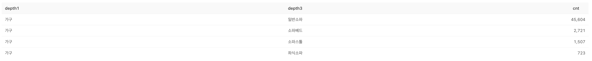

# [오늘의집의 매력적인 상품은 고객에게 잘 보여지고 있을까?] 상품 매력도 평가 설문 계획

담당자: Ikpyo Hong
날짜: 2025년 10월 23일
상태: Done

## 리서치 목적

---

> “롱테일 상품은 정말 매력이 없어서 안 팔리는가,
> 
> 
> 아니면 고객이 볼 기회조차 없어서 평가받지 못한 것인가?”
> 

이를 정량적으로 확인하기 위해, ‘상위(숏헤드)’와 ‘롱테일’ 상품의 선호도 차이를 설문 실험으로 검증

리서치 설계 개요

| 항목 | 내용 |
| --- | --- |
| **리서치 방법** | 설문 기반 **상품 가치/선호도 평가 (Image-based Conjoint / Simple Rating)** |
| **핵심 가설** | “롱테일 상품도 숏헤드 상품만큼 매력적이다.” (매력도 차이가 크지 않다면 → 구조적 문제 가능성↑) |
| **리서치 목적** | - 상품 자체의 ‘수요/매력도’ 비교
- PV 쏠림이 상품력 차이 때문인지 구조 때문인지 1차 판단 |
| **결과 해석 관점** | - 선호도 차이가 크면 → 상품 경쟁력 이슈
- 차이가 작거나 없음 → 노출 구조 이슈 |

## 리서치 설계

---

**1️⃣ 상품 샘플링 설계**

| 구분 | 설명 |
| --- | --- |
| **샘플 대상** | 동일 카테고리 내 상품 100개 추출 (예: 소파 / 책상 등) |
| **분류 기준** | PV 기준 상위·중위·하위 3그룹 또는 4~5그룹
(예시: Top 10%, 10~50%, 50~100%) |
| **표본 수** | 각 그룹당 30~35개 (시각 노출 시 과도하지 않게 제한) |
| **필터 조건** | - 출시 n개월 이상
- 리뷰 n개 이상 등록된 상품
- 가격대·카테고리 일치 (마찬가지 논의 필요) |
| **추가 메모** | - PB/CP/GP 여부, 브랜드 인지도, 썸네일 품질 등 메타데이터 확보 필요
- PV·매출 로그에서 상품별 CTR, CVR 함께 기록해두면 후속 분석 시 연결 가능 |
- 251028_논의 결정사항 w/ @Carl Jang
    - 우선 소파로 진행해보기로
        - 소파 내에서 상품들을 여러개 추출 해보고, 가격대가 어떠한지 살펴보자
        - 만약에 갸격대가 pv 상위와 하위가 너무 크게 차이가 나지 않는다면, 비율을 맞춰서 상품군을 추출해보자
        - 카테고리 선정
            
            ## 🧩 카테고리별 상위 10% PV 비중 및 쏠림 강도 정리
            
            | 순위 | 카테고리 | 상위 10% PV 비중 | 쏠림 강도 분류 | 해석(임시) |
            | --- | --- | --- | --- | --- |
            | 1 | **매트리스(150T이상)** | **94.82%** | 🔥 매우 강함 | 극단적 집중 구조, 상위 소수 SKU가 PV 대부분 차지 |
            | 2 | **침대** | **92.79%** | 🔥 매우 강함 | 대표 상품·세트 중심 집중형 |
            | 3 | **화장대/콘솔** | **92.50%** | 🔥 매우 강함 | 뷰티/수납 중심, 소수 상품 독점 구조 |
            | 4 | **토퍼** | **91.63%** | 매우 강함 | ‘국민 토퍼’ 중심 PV 집중 |
            | 5 | **오피스/서재가구** | **91.82%** | 매우 강함 | 세트형/브랜드 중심 집중 구조 |
            | 6 | **수납가구** | **91.23%** | 매우 강함 | 실용형 대중 제품 중심 집중 |
            | 7 | **옷장/드레스룸** | **91.31%** | 매우 강함 | 공간 제약형 상품 집중 |
            | 8 | **소파** | **90.54%** | 강함 | 대표 상품 중심 쏠림 |
            | 9 | **주방가구** | **89.81%** | 강함 | 상위 브랜드 중심 집중 |
            | 10 | **의자** | **89.36%** | 중간~강 | 사무용 중심 집중도 존재 |
            | 11 | **행거** | **88.89%** | 중간~강 | 저가 다품종, 그래도 상위 브랜드 집중도 있음 |
            | 12 | **거실테이블** | **88.42%** | 중간~강 | 디자인 분산으로 쏠림 다소 완화 |
            | 13 | **거울** | **88.06%** | 중간~강 | 탐색 다양성 있는 편 |
            | 14 | **병풍/파티션** | **87.52%** | 중간 | 의외로 상위 집중도 낮음 (매우 다양한 소형상품 존재) |
            | 15 | **리클라이너소파** | **86.72%** | 약~중간 | 탐색 다양성이 높음 |
            | 16 | **유아동가구** | **83.01%** | 🔹약함 | 브랜드 다양, 탐색 폭이 넓은 분산형 구조 |
            
            ---
            
            ## 📊 구간별 분류 요약
            
            | 구분 | 기준 | 카테고리 |
            | --- | --- | --- |
            | 🔥 **초집중형 (90% 이상)** | 극단적 쏠림 | 매트리스 / 침대 / 화장대 / 토퍼 / 오피스가구 / 수납가구 / 옷장 / 소파 |
            | ⚖️ **중간쏠림형 (87~89%)** | 일부 집중 | 주방가구 / 의자 / 행거 / 거실테이블 / 거울 / 병풍 |
            | 🌿 **분산형 (85% 이하)** | 탐색 다양 | 리클라이너소파 / 유아동가구 |
            
            ---
            
            ## 💡 시사점
            
            - **극단적 쏠림군(90%↑)** → "상위 몇 개 상품만 노출·조회되는 구조"
                
                → ‘보여주기 문제’를 검증하기 좋은 실험군 (ex. 소파, 침대, 매트리스)
                
            - **중간쏠림군(87~89%)** → 일정 수준 집중되지만, 하위 상품도 일정 조회 확보
                
                → 상품력·노출 구조가 혼재된 비교군 (ex. 거실테이블, 행거)
                
            - **분산형(85%↓)** → 고객이 다양한 상품을 실제로 탐색하는 구조
                
                → ‘노출 구조’보다 ‘실제 상품 매력 차이’ 검증에 적합 (ex. 유아동가구, 리클라이너소파)
                
    - 출시일 6개월 이상? → 리뷰 필터를 우선 적용?
        - 필터 조건을 다양하게 하고 이후에 살펴보자
    - 추후 분석을 위해 확보해야 하는 지표
        - 상품의 PB / CP / GP 여부(엄밀히는 브랜드)
        - 브랜드 인지도 → 브랜드 홈 PV로 보면 될 것
        - 썸네일 품질 → 인간이 봐야할듯
        - 상품 별 PV, 매출, CTR → 검색, 쇼핑홈, PDP 추천
    - 소파 상품 구분을 위한 PV 범위 기준
        - 상위 : 1%
        - 중위 : 1~10%
        - 하위 : 10%~20%
        - 최하위??
        - → 데이터 뽑아보고 결정하자
- 소파 카테고리 검증 계획
    
    ## 🎯 리서치 방향 확정
    
    **1차 라운드 리서치: “소파” 카테고리 단일 검증**
    
    ---
    
    ### ✅ 목적
    
    “PV 상위 상품만 조회되는 구조가, 실제 고객 선호의 결과인가
    
    아니면 노출 구조(랭킹·추천·썸네일 위치 등)에 의해 발생한 결과인가?”
    
    ---
    
    ### ✅ 리서치 설계 개요(데이터 확인 후 수정 필요)
    
    | 항목 | 설계 포인트 |
    | --- | --- |
    | **노출 환경** | 실제 PLP 카드 캡처 (상품명, 브랜드, 가격, 리뷰수, 썸네일 유지) |
    | **시선 유지 시간** | 카드형 이미지는 응답자당 약 1.5~2초 시선 유도 후 응답 유도 (즉각적 판단 유도) |
    | **상품 수** | 8~12개 (Top n%, Mid n%, Low n%) |
    | **무작위 노출 방식** | 순서 랜덤화 + 동일 응답자에게 상·중·하 혼합 |
    | **리커트 척도** | 1~5점 균등 척도 (매우 아니다~매우 그렇다) |
    
    ---
    
    ### ✅ 설문 문항 구조
    
    (리커트 1~5점, 전혀 아니다~매우 그렇다)
    
    | 구분 | 문항 | 측정 목적 |
    | --- | --- | --- |
    | **Q1. 구매 고려 의향 (핵심)** | 이 상품이 매력적이어서 더 살펴보고 싶다. (1–5점) | 전반적 매력도 / 구매 후보 진입 의향 |
    | **Q2. 시각적 매력도 / 취향 적합도** | 이 상품의 디자인이 마음에 든다. (1–5점) | 디자인 선호도 / 썸네일 품질 검토 |
    | **Q3. 가격 인식 (상대적 기대)** | 이 상품의 가격대가 적절하다고 느낀다. (1–5점) | 가격 적정 인식 |
    
    ---
    
    ### ✅ 분석 계획
    
    | 단계 | 분석 항목 | 방법 | 해석 포인트 |
    | --- | --- | --- | --- |
    | 1️⃣ | PV 티어별 평균 매력도 | ANOVA / t-test | 상·하위 PV 간 차이가 유의한가? |
    | 2️⃣ | “익숙함” 점수 vs PV 관계 | 상관분석 | PV 높을수록 익숙함↑ / 새로움↓ → 노출 구조 효과 |
    | 3️⃣ | 회귀 모델 | 매력도 = f(PV티어, 익숙함) | 익숙함 통제 후에도 PV효과 남는가? |
    | 4️⃣ | 결과 시각화 | PV티어별 매력도·익숙함 boxplot | 구조적 쏠림 패턴 시각화 |
    
    ---
    
    ### ✅ 기대하는 결과
    
    > “같은 소파 카테고리 내에서도, 상위 PV 상품이 반드시 더 매력적인 것은 아니었습니다. 고객은 하위 PV 상품에서도 높은 매력도를 느꼈으며, 상위 상품은 ‘익숙함’ 점수가 높게 나타났습니다. 이는 현재 PV 쏠림이 고객 선호의 결과가 아니라, **노출 구조에 의해 강화된 결과일 가능성**을 시사합니다.”
    > 

## 2️⃣ 설문 구조 설계

### ✳️ 설문 포맷: 이미지 기반 선호 평가 (Single Select or Likert)

참여자에게 상품 이미지를 랜덤으로 보여주고, “구매하고 싶은 정도”를 1~5점으로 평가받는 방식.

| 섹션 | 구성 | 예시 문항 |
| --- | --- | --- |
| **인트로** | 맥락 제시 | “다음은 오늘의집에 판매 중인 상품입니다. 실제로 본 적이 없어도 좋습니다. 디자인·가격·이미지를 보고 ‘나에게 얼마나 매력적인 상품인지’ 평가해주세요.” |
| **본 설문 (랜덤 노출)** | 각 응답자에게 10~12개 상품 노출 (상·중·하 섞음) | “이 상품을 본다면 구매하고 싶은 마음이 얼마나 드시나요?” (1~5점 척도) |
| **보조 항목 (선택)** | 속성별 평가 | - “이 상품은 디자인이 세련돼 보인다.”
- “가격 대비 좋아 보인다.”
- “이런 제품은 ‘오늘의집’에서 자주 본다.” |
| **마무리** | 비교 인식 확인 | “이런 상품은 ‘자주 보이는 느낌인가요’ vs ‘새로워 보이나요’?” |

---

## 3️⃣ 표본 및 리쿠르팅

| 항목 | 내용 |
| --- | --- |
| **응답자 수** | N = 300명 이상 (가구 카테고리 구매 경험자 중심) |
| **타깃 기준** | - 최근 3개월 내 오늘의집에서 가구/인테리어 탐색 경험
- 25~40대 여성 중심
- 탐색 관여도 높은 ‘자기주도형’ 중심 |
| **리쿠르팅 채널** | - 오늘의집 유저 CRM 설문 발송 |
| **응답 시간** | 약 5~7분 |

---

## 4️⃣ 분석 설계

| 분석 항목 | 지표 / 비교 방식 |
| --- | --- |
| **1. 그룹별 평균 매력도 비교** | 상위 vs 중위 vs 하위 상품별 평균 선호도(평균/분산) |
| **2. 속성별 영향 요인** | 디자인·가격·브랜드 인식 등 속성별 평가 비교 |
| **3. 상품 노출 경험 인식** | “이런 상품 자주 봤다 vs 처음 본다” 응답 분포 |
| **4. PV·선호도 상관분석** | PV가 높을수록 선호도도 높은지 확인 (r 값 계산) |
| **5. 구매전환율(GCR) 교차 분석** | 동일 상품의 실제 GCR과 선호 점수 비교 |

---

## 5️⃣ 해석 포인트

| 결과 유형 | 해석 | 시사점 |
| --- | --- | --- |
| **선호도 차이 큼 (상위 > 중위·하위)** | 실제 상품 경쟁력 차이 존재 | 쏠림은 ‘상품력 문제’ 가능성 |
| **선호도 차이 작음 / 무의미** | 구조적으로 롱테일 상품이 묻히고 있음 | 쏠림은 ‘노출 구조 문제’ |
| **‘처음 본다’ 응답률이 높음** | PV 쏠림으로 인한 ‘탐색 기회 손실’ | 추천·검색 개선 필요 |
| **하위 상품이 오히려 선호도 높음** | 구조적 왜곡 명백 | 노출 정책·IA 구조 개선 필요 |

---

## 6️⃣ 기대 결과물 (1차 설문 결과 리포트)

| 항목 | 내용 |
| --- | --- |
| 📈 **결과 요약 그래프** | 상/중/하 그룹별 평균 매력도 차이 |
| 🎨 **상품 예시 첨부** | 실제 설문 노출 이미지 일부 |
| 📊 **PV vs 선호도 상관도** | PV가 높다고 선호도가 높은가? |
| 💬 **응답 인사이트** | “이건 예쁜데 처음 봐요” 등 질적 코멘트 |
| 🧭 **후속 리서치 제안** | “이 상품군은 충분히 매력적이므로 IA/추천 구조 개선이 필요” 등 |
- 추후 분석 시 고려해야 할 요소들
    - 설문 응답 결과

---

---

carl 메모



- 가구 > 소파 뒤 depth3는 4개의 카테고리 존재
- 여기서 일반소파만 할건지 다른거 모두 포함해서 볼건지?
    - 대다수가 일반소파
    - 일반소파로 한정하여 확인해보자

```sql
select count(distinct product_id) as cnt
from ba_preserved.productions_view
where depth3 = '일반소파'
    and is_selling = True
    and sold_out = false
    and on_hide = false
```

- 15,394개 제품


- 소파만 한정으로 7~9월 4개 그룹으로 나누어서 확인
    - 논의
        - **소파 상품 데이터만 뽑아서 조회 기준 그룹을 나눠야할지 (위에 지표는 해당 기준으로 추출)**
        - 전체 상품 데이터 뽑아서 조회 기준 그룹 나누고 소파를 추출해야할지
- 그룹별 3달 평균 조회수 각 그룹마다 10배씩 차이 (적절한 그룹 나누기?)
- 구매 전환율도 비슷한 경향 (전체 조회 수 대비 구매 수)

---

- [소파 조회 분위별 지표](https://redash-data.datahou.se/queries/6587/source#13800)
    - 25년 7월~9월 사이 데이터 기준
    - 0~1% / 1~10% / 10~20% / 20~100% 그룹 4가지
        - 소파 상품 조회만 가지고 조회 분위로 그룹 나눔
    - 전체 소파 상품 15,394개 (0~1%면 154개 상품이 포함된 그룹)
    - 조회 낮을수록 가격대 높고, 구매 전환율 낮고, 리뷰 수 낮음
    - CTR은 아직... 노출량이 크다보니 마트 말아서 해야해서 시간이 좀 더 걸릴거 같아요ㅠㅠ
- [소파 조회 분위별 상품 추출](https://redash-data.datahou.se/queries/6581/source?p_released_at=2025-04-30&p_review_cnt=5)
    - 이미지에서 확인
    
    