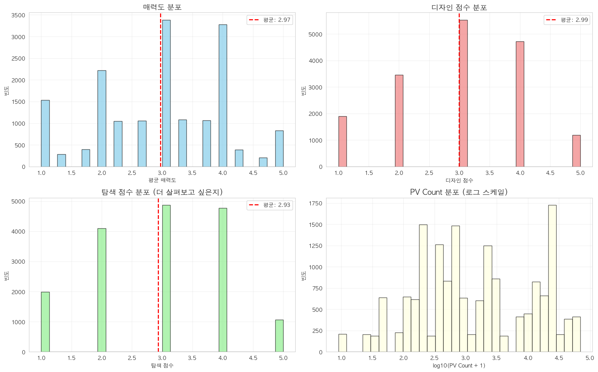

# [분석] [오늘의집의 매력적인 상품은 고객에게 잘 보여지고 있을까?] 설문 분석 by Fred

담당자: Fred Seol
날짜: 2025년 11월 17일
상태: Done

📊 핵심 결과 해석

1. 그룹별 매력 점수 추정치

각 그룹의 평균 매력 점수와 95% 신뢰구간을 보면:

- 1-10% 그룹이 가장 높음 (3.101점)
- 20%-100% 그룹이 가장 낮음 (2.920점)
- 차이는 약 0.18점 정도
1. 실질적 차이는 미미함

베이즈 분석의 핵심은 "차이의 크기"를 평가하는 것인데:

의미있는 차이(|차이| > 0.2)일 확률:

- 모든 그룹 간 비교에서 0~0.1%

해석: 통계적으로는 차이가 있지만 (95% 신뢰구간이 0을 포함하지 않음), 실무적으로는 의미없는 수준입니다.

1. 대표본 효과의 명확한 증거
- Kruskal-Wallis 검정(p < 0.001)은 "차이가 있다"고 했지만

<aside>
💡

- 베이즈 분석은 "차이의 크기가 0.06~0.12점 정도로 매우 작다"고 알려줌
</aside>

- 16,790개의 큰 표본 때문에 작은 차이도 통계적으로 유의하게 나타난 것
1. 그룹 간 변동성 (sigma_between: 0.170)

이 값은 그룹 간 차이의 표준편차입니다:

- 그룹 내 변동(개인차)에 비해 그룹 간 변동이 매우 작음
- 즉, 상품 인기도보다 개인차가 훨씬 큰 영향을 미침

💡 실무적 의사결정

<aside>
💡

✅ 주요 결론:
롱테일 상품(0-1%)과 인기 상품(20-100%) 간 매력도 차이는
통계적으로 존재하지만 실질적으로 무시할 수 있는 수준 (~0.12점)

</aside>

권장사항:

1. 롱테일 상품도 인기 상품과 유사한 매력도를 가지므로, 상품 추천 시 인기도보다는 개인화/맥락에 집중
2. 매력도 차이로 상품을 차별화하기보다는 탐색성, 디자인 등 다른 요소에 주목
3. percentile 그룹이 아닌 다른 세분화 기준 검토 필요

이 분석의 가치는 "차이가 없다"는 걸 증명한 게 아니라, **"차이가 있지만 너무 작아서 실무적으로 고려할 필요가 없다"**는 걸 정량적으로 보여준 것입니다.

# 결론

<aside>
✅

### H0: PV count에 따른 매력도의 차이가 없다

✅ PV count와 매력도 간 상관관계 없음 → **PV가 높다고 매력도가 높은 것이 아니며, 그 반대도 성립하지 않음**

</aside>

<aside>
✅

- **PV(페이지뷰)는 매력도와 무관하다.  (차이가 없다)**

&

- 디자인과 탐색의향(R² = 0.999)에 대한 유저의 응답은 매력도에 대한 응답과 분포나 경향에 있어서 차이가 없다 → **매력도에 대한 응답만 가지고 비교해도 무방하다.**
- **가격이 높을수록 매력도가 높다** (저가 2.68점 → 고가 3.18점)
- **고객 특성(성별, 나이, LE여부)은 매력도에 유의미한 영향 없다.**
</aside>

<aside>
📌

그러면 ?

매력도는 높은데 PV가 낮은 상품이 있음 (반대도 같음= pv가높은데 매력도가 낮은)

예시

- goods_id: 775100 - 리아드 4인 반카우치형 리브 패브릭 소파
- goods_id: 1324192 - 무토 아쿠아텍스 패브릭 4인 모듈소파
- goods_id: 726572 - 아드리안 4인 데이위브 패브릭 소파
- goods_id: 2132602 - 아르떼 3.5인 스윙기능 리브 패브릭 소파
- goods_id: 894307 - 모데나 아쿠아텍스 4인소파

이러한 상품군을 데이터로 정량화 할 필요가 있음 

&

**가격이 높을수록 매력도가 높음** (저가 2.68점 → 고가 3.18점) → 왜?

---

**PV는 높은데 매력도가 낮은 상품들 존재**
→ 품질/설명/가격 재점검 필요

</aside>

# Data

- 예시 5 rows × 25 columns
    
    
    |  | **user_id** | **respondent_id** | **response_datetime** | **gender** | **birth_year** | **age** | **lifestyle_changes_past** | **lifestyle_changes_future** | **has_past_event** | **has_future_event** | **...** | **review_cnt** | **pv_count** | **purchase_count** | **attractiveness_score** | **attractiveness_text** | **explore_score** | **explore_text** | **design_score** | **design_text** | **avg_score** |
    | --- | --- | --- | --- | --- | --- | --- | --- | --- | --- | --- | --- | --- | --- | --- | --- | --- | --- | --- | --- | --- | --- |
    | 0 | 25978761 | 1.149846e+11 | 11/17/2025 10:14:15 AM | 여성 | 1985 | 40 | 이사를 했어요|기존에 있던 가구나 가전 제품을 새롭게 교체했어요 | 기존에 있던 가구나 가전 제품을 새롭게 교체할 예정이에요 | True | True | ... | 244 | 23772 | 173 | 1.0 | 매우 그렇지 않다 | 1.0 | 매우 그렇지 않다 | 1.0 | 매우 그렇지 않다 | 1.0 |
    | 1 | 25978761 | 1.149846e+11 | 11/17/2025 10:14:15 AM | 여성 | 1985 | 40 | 이사를 했어요|기존에 있던 가구나 가전 제품을 새롭게 교체했어요 | 기존에 있던 가구나 가전 제품을 새롭게 교체할 예정이에요 | True | True | ... | 691 | 27402 | 155 | 1.0 | 매우 그렇지 않다 | 1.0 | 매우 그렇지 않다 | 1.0 | 매우 그렇지 않다 | 1.0 |
    | 2 | 25978761 | 1.149846e+11 | 11/17/2025 10:14:15 AM | 여성 | 1985 | 40 | 이사를 했어요|기존에 있던 가구나 가전 제품을 새롭게 교체했어요 | 기존에 있던 가구나 가전 제품을 새롭게 교체할 예정이에요 | True | True | ... | 8 | 1031 | 5 | 2.0 | 그렇지 않다 | 2.0 | 그렇지 않다 | 2.0 | 그렇지 않다 | 2.0 |
    | 3 | 25978761 | 1.149846e+11 | 11/17/2025 10:14:15 AM | 여성 | 1985 | 40 | 이사를 했어요|기존에 있던 가구나 가전 제품을 새롭게 교체했어요 | 기존에 있던 가구나 가전 제품을 새롭게 교체할 예정이에요 | True | True | ... | 94 | 2726 | 14 | 3.0 | 보통이다 | 3.0 | 보통이다 | 3.0 | 보통이다 | 3.0 |
    | 4 | 25978761 | 1.149846e+11 | 11/17/2025 10:14:15 AM | 여성 | 1985 | 40 | 이사를 했어요|기존에 있던 가구나 가전 제품을 새롭게 교체했어요 | 기존에 있던 가구나 가전 제품을 새롭게 교체할 예정이에요 | True | True | ... | 154 | 8882 | 43 | 1.0 | 매우 그렇지 않다 | 1.0 | 매우 그렇지 않다 | 1.0 | 매우 그렇지 않다 | 1.0 |
- 요약
    
    === 데이터 요약 ===
           attractiveness_score  explore_score  design_score     avg_score  \
    count          16790.000000   16790.000000  16790.000000  16790.000000   
    mean               2.996665       2.930137      2.991066      2.972608   
    std                1.104408       1.118748      1.104754      1.061490   
    min                1.000000       1.000000      1.000000      1.000000   
    25%                2.000000       2.000000      2.000000      2.000000   
    50%                3.000000       3.000000      3.000000      3.000000   
    75%                4.000000       4.000000      4.000000      4.000000   
    max                5.000000       5.000000      5.000000      5.000000   
    
               pv_count    review_cnt  selling_cost  
    count  16790.000000  16790.000000  1.679000e+04  
    mean    8080.872365    234.144848  7.341229e+05  
    std    13880.981641    693.223446  8.091565e+05  
    min        8.000000      5.000000  1.060000e+05  
    25%      228.000000      7.000000  2.590000e+05  
    50%      993.000000     27.000000  3.990000e+05  
    75%    13956.000000    163.000000  7.890000e+05  
    max    70111.000000   5448.000000  4.130000e+06
    

# 핵심가설

<aside>
💡

H0 :  PV Count와 매력도 사이에는 **아무런 관계가 없다**.

```
- 귀무가설Ho: PV count에 따른 매력도의 차이가 없다
- 대립가설H1: PV count에 따른 매력도의 차이가 있다
```

</aside>

# 응답 분포 파악  - 정규성 만족으로 봐도 무방

<aside>
💡

통계적으로는 만족 X 하지만 효과크기로 보았을때 미미하여 → 정규성으로 가정하고 봐도 무방함 

</aside>



=== 점수 간 상관계수 ===
                      attractiveness_score  explore_score  design_score  \
attractiveness_score              1.000000       0.886442      0.871231   
explore_score                     0.886442       1.000000      0.862040   
design_score                      0.871231       0.862040      1.000000   
avg_score                         0.960583       0.957878      0.951972   

                      avg_score  
attractiveness_score   0.960583  
explore_score          0.957878  
design_score           0.951972  
avg_score              1.000000  

=== 정규성 검정 (Shapiro-Wilk Test) ===
attractiveness_score: statistic=0.9097, p-value=0.0000 → 비정규분포 ❌
  └─ 왜도(Skewness): -0.2051 (대칭적)
  └─ 첨도(Kurtosis): -0.6912 (평평함)
  └─ K-S Test: statistic=0.1908, p-value=0.0000
explore_score: statistic=0.9115, p-value=0.0000 → 비정규분포 ❌
  └─ 왜도(Skewness): -0.0987 (대칭적)
  └─ 첨도(Kurtosis): -0.8505 (평평함)
  └─ K-S Test: statistic=0.1782, p-value=0.0000
design_score: statistic=0.9104, p-value=0.0000 → 비정규분포 ❌
  └─ 왜도(Skewness): -0.1700 (대칭적)

...

avg_score: statistic=0.9521, p-value=0.0000 → 비정규분포 ❌
  └─ 왜도(Skewness): -0.1674 (대칭적)
  └─ 첨도(Kurtosis): -0.6673 (평평함)
  └─ K-S Test: statistic=0.1205, p-value=0.0000


<aside>
✅

통계검정 - 정규성 만족 X 
하지만 정규성 만족에 가까움 = 표본 크기가 매우 크고(≈16k), 왜도(skewness)가 작아(절댓값 ~0.1–0.2) 대체로 대칭에 가깝기 때문입니다. + 
첨도(kurtosis)도 과도하지 않다면(여기선 음수, 평평한 편) 정규분포로 봐도 무방

</aside>

- 추가
    
    
    
    Levene p = 4.439056559614085e-22
    Kruskal p = 2.0241106463800673e-12
    sum_sq       df          F        PR(>F)
    C(age_group)     87.665354      4.0  18.041347  8.519886e-15
    Residual      20390.147868  16785.0        NaN           NaN
    
    <aside>
    ✅
    
    실무적으로 중요한 한 가지: 효과크기(eta-squared)를 보면 매우 작음. 
    
    = eta^2 ≈ 87.665 / 20477.813 ≈ 0.0043 (≈0.43%) → 통계적으로 유의하지만 **실무적 영향은 거의 없음**.
    
    </aside>
    

# 고객기준 분석 항목

- 고객 단위로 큰 차이가 없다면 → 상품단위로 분석

<aside>
💡

LE 여부 → 차이 x 

- 과거 미래 이벤트 둘 다 전부 차이 X

성별 → 차이 X 

나이 → 차이 X 

</aside>

### 고객 기준으로 분석

- LE 여부 ((이사, 결혼 했는지 안했는지, 예정인지) - 이미 설문에 있음 ) 에 따라 비슷한 상품군이라도 매력도에 차이가 있나 ?
    
    <aside>
    ✅
    
    - 없다 ( 무시해도 됨 ) 과거, 미래 여부에 따른 큰 차이 X
    </aside>
    
    
    
    
    
    <aside>
    💡
    
    === LE 여부별 기술 통계 ===
    LE 있음: n=13,170, 평균=2.962, 표준편차=1.071
    LE 없음: n=3,620, 평균=3.011, 표준편차=1.024
    평균 차이: 0.048
    
    정규성 검정: LE 있음 p=0.0000, LE 없음 p=0.0000
    등분산성 검정: p=0.0001
    
    Mann-Whitney U test: statistic=23245733.5000, p-value=0.0206
    결론: 유의미한 차이 있음 ✅
    하지만 
    Cohen's d: -0.0461 (작은 효과) → 무시 해도됨 
    
    ================================================================================
    
    === LE 여부별 기술 통계 (미래 이벤트) ===
    LE 예정 있음: n=13,010, 평균=2.969, 표준편차=1.065
    LE 예정 없음: n=3,780, 평균=2.986, 표준편차=1.051
    평균 차이: 0.018
    
    정규성 검정: LE 예정 있음 p=0.0000, LE 예정 없음 p=0.0000
    등분산성 검정: p=0.0583
    
    Mann-Whitney U test: statistic=24447820.0000, p-value=0.5870
    결론: 유의미한 차이 없음 ❌
    Cohen's d: -0.0167 (작은 효과)
    
    </aside>
    
- 성별 간 차이 (설문)  에 따라 비슷한 상품군이라도 매력도에 차이가 있나 ?
    
    <aside>
    ✅
    
    결론: 유의미한 차이 없음 ❌
    
    </aside>
    


<aside>
💡

=== 성별별 기술 통계 ===
count      mean       std
gender

기타         30  2.533000  1.394264
남성       2620  2.993897  1.049727
여성      14140  2.969596  1.062704

기타는 무시 

Kruskal-Wallis 검정: statistic=4.6835, p-value=0.0962
결론: 유의미한 차이 없음 ❌

</aside>

- 나이 기준 그룹 차이 (설문) 에 따라 비슷한 상품군이라도 매력도에 차이가 있나 ?

<aside>
✅

차이는 있으나 미비하여 무시해도 됨 

</aside>


<aside>
💡

=== 나이 그룹별 기술 통계 ===
           count      mean       std  median
age_group                                   
20대         1690  2.941503  1.077886     3.0
30대         5330  2.883711  1.102497     3.0
40대         5020  2.970815  1.069250     3.0
50대         3640  3.069335  0.997738     3.0
60대+        1110  3.137748  0.953650     3.0

Kruskal-Wallis 검정: statistic=85.9664, p-value=0.0000
결론: 유의미한 차이 있음 ✅

=== 그룹 간 차이 크기 ===
최대 평균: 3.138 (60대+)
최소 평균: 2.884 (30대)
절대 차이: 0.254
상대 차이: 8.81%

효과 크기 (Epsilon-squared): 0.0049
  - 해석: 작음 (< 0.01)

=== Pairwise 비교 (Mann-Whitney U) ===
20대 vs 30대: p=0.1039 ns, 평균차이=0.058 (2.942 vs 2.884)

...

30대 vs 60대+: p=0.0000 ***, 평균차이=0.254 (2.884 vs 3.138)
40대 vs 50대: p=0.0000 ***, 평균차이=0.099 (2.971 vs 3.069)
40대 vs 60대+: p=0.0000 ***, 평균차이=0.167 (2.971 vs 3.138)
50대 vs 60대+: p=0.0561 ns, 평균차이=0.068 (3.069 vs 3.138)

</aside>

---

### 상품 그룹(pv `percentile_group`) 에 따른 매력도를 중심으로 교차 분석

- 상품 그룹(1%,10%…) (percentile group) 에 따른 매력도의 차이가 유의미한가? 어떻게 ? 얼마나 ?
    
    <aside>
    💡
    
    차이 X 
    
    </aside>
    
    
    
    <aside>
    💡
    
    === Percentile 그룹별 기술 통계 ===
    
    
    
    - 분석
        
        
        | **Percentile Group** | **표본 수 (Count)** | **평균 (Mean)** | **표준편차 (Std)** | **중앙값 (Median)** |
        | --- | --- | --- | --- | --- |
        | **0-1%** | 4,214 | **3.019** | 1.067 | 3.0 |
        | **1-10%** | 4,181 | **3.082** | 1.019 | 3.0 |
        | **10-20%** | 4,175 | 2.897 | 1.082 | 3.0 |
        | **20-100%** | 4,220 | 2.892 | 1.065 | 3.0 |
        
        `Kruskal-Wallis 검정: statistic=101.9685, p-value=0.0000`
        
    
    결론: 유의미한 차이 있음 ✅ → 하지만 크지 않을것으로 예상됨 
    
    ---
    
    **=== 사후 검정 (Pairwise Mann-Whitney U test with Bonferroni correction) ===**
    
    - 분석
        
        비교 횟수: 6, Bonferroni 보정 α: 0.0083
        
        0-1% vs 1-10%: 평균 차이: -0.0621 | p-value: 0.0158 ❌
        0-1% vs 10-20%: 평균 차이: +0.1222 | p-value: 0.0000 ✅
        0-1% vs 20%-100%: 평균 차이: +0.1270 | p-value: 0.0000 ✅
        1-10% vs 10-20%: 평균 차이: +0.1843 | p-value: 0.0000 ✅
        1-10% vs 20%-100%: 평균 차이: +0.1891 | p-value: 0.0000 ✅
        10-20% vs 20%-100%: 평균 차이: +0.0048 | p-value: 0.8859 ❌
        
        효과 크기 (Epsilon-squared): 0.0059 : 
        
        결과값이 서로 다른 이유가 100가지 있다면, 그중 그룹 차이 때문인 건 1개도 채 안 된다(0.59개)는 뜻
        
    
    <aside>
    ✅
    
    - 해석: 각 그룹간 비교로 사후검정까지 진행해보았을때, 각 그룹별 비교시 차이가 있고 통계적으로 유의미하긴 하지만 매우 작은 효과크기이므로 실무적으로 차이가 없다고 볼 수 있음
    </aside>
    
    </aside>
    
    <aside>
    ✅
    
    사후 검정 결과, 각 그룹 간의 통계적 차이는 확인되었으나 효과 크기(Epsilon-squared)가 0.0059로 매우 낮게 나타났습니다. 
    
    이는 그룹 간의 차이가 실무적으로 영향력을 미치지 못하는 미미한 수준임을 의미하므로, **그룹 간 차이는 고려하지 않아도 됨**을 시사합니다.
    
    </aside>
    
    @Carl Jang 베이즈 분석으로 그룹간 차이를 한번 보면 어떨까 ? 
    

### PV _CNT 에 따라서는 ?

<aside>
💡

→ PV  count만으로는 매력도를 충분히 설명하기 어려움

</aside>


<aside>
💡

=== 가설 검정: PV Count와 매력도 (상품별) ===

귀무가설 (H0): PV count에 따른 매력도의 차이가 없다
대립가설 (H1): PV count에 따른 매력도의 차이가 있다

상관분석: r=0.0771, p-value=0.4966

단순 선형 회귀:
R²: 0.0059 (설명력: 0.59%)
Adj R²: -0.0068
F-statistic: 0.47 (p=0.4966)
회귀 계수: 0.000008 (p=0.4966)

결론:
❌ 귀무가설 채택 (p=0.4966 >= 0.05)
→ PV count에 따른 매력도 차이가 없음

단, 설명력은 0.59%로 낮음
→ PV  count만으로는 매력도를 충분히 설명하기 어려움

</aside>

### 리뷰 갯수에 따른 매력도의 차이가 유의미한가? 어떻게 ? 얼마나 ?

<aside>
💡

| **리뷰 개수 그룹 (review_group)** | **데이터 수 (count)** | **평균 (mean)** | **표준편차 (std)** |
| --- | --- | --- | --- |
| **적음** | 4,357 | 2.95 | 1.05 |
| **보통** | 4,170 | 3.00 | 1.06 |
| **많음** | 4,238 | 2.96 | 1.07 |
| **매우 많음** | 4,025 | 2.98 | 1.06 |
- 통계값
    
    Kruskal-Wallis 검정(**Kruskal-Wallis 검정:** "여러 그룹 간에 차이가 있는지 확인하는 통계 방법입니다.") : statistic=5.6942, p-value=0.1275
    
    **"상품의 리뷰가 많다고 해서 고객이 느끼는 매력도가 더 높은 것은 아닙니다."**
    
    - **분석 결과:** 리뷰 개수에 따라 상품을 4개 그룹(적음~매우 많음)으로 나누어 비교했으나, 그룹별 매력도 평균 점수는 **2.95~3.00점 사이**로 거의 동일하게 나타났습니다.
    - **통계적 의미:** 그룹 간 점수 차이가 우연에 의해 발생했을 확률이 높습니다(p-value > 0.05). 즉, **리뷰 수와 상품의 매력도 사이에는 통계적으로 유의미한 연결고리가 없습니다.**

결론: 유의미한 차이 없음 ❌

</aside>

<aside>
✅

매력도에따라 리뷰수가 다르지 않다. 

</aside>

### 가격대 에 따른 매력도의 차이가 유의미한가? 어떻게 ? 얼마나 ?


<aside>
✅

| **가격대 그룹** | **데이터 수(count)** | **평균(mean)** | **표준편차(std)** |
| --- | --- | --- | --- |
| 저가 | 4397 | 2.68 | 1.06 |
| 중저가 | 4363 | 2.97 | 1.04 |
| 중고가 | 4013 | 3.08 | 1.05 |
| 고가 | 4017 | 3.18 | 1.03 |

Kruskal-Wallis 검정: statistic=503.8954, p-value=0.0000
결론: 유의미한 차이 있음 ✅

</aside>

<aside>
✅

결론: 유의미한 차이 있음 ✅ → 왜 가격에 따라 매력도의 유의미한 차이가 있을까? 

- **현실적으로 구매를 고려하는 상황이 아니어서 그런건 아닐까**
- **설문조사의 경우 본인이 직접적으로 구매한다는 생각보다 진짜 매력 그 자체에 포커스를 두기 때문이 아닐까**
</aside>

## 디자인(설문) 에 따른 매력도의 차이가 유의미한가? 어떻게 ? 얼마나 ?  / 더 살펴보고 싶은지 (설문)에 따른 매력도의 차이가 유의미한가? 어떻게 ? 얼마나 ?

<aside>
💡

- 당연한이야기) 디자인과 탐색은 매력도에 비슷한 영향을 미침
- 디자인 , 탐색과 pv는
</aside>


<aside>
💡

================================================================================
📊 통계적 유의성 검증 결과
================================================================================

        관계  상관계수(r)      p-value       R² 유의성
PV vs 매력도 0.235159 3.574912e-02 0.055300 유의함
디자인 vs 탐색 0.982246 1.876729e-58 0.964808 유의함
디자인 vs PV 0.235888 3.516420e-02 0.055643 유의함
 탐색 vs PV 0.244369 2.892301e-02 0.059716 유의함

💡 통계 해석 가이드:
  • 상관계수(r): -1~1 범위, 절댓값이 클수록 강한 상관관계
    - |r| > 0.7: 강한 상관, 0.4~0.7: 중간 상관, < 0.4: 약한 상관
  • p-value: < 0.05면 통계적으로 유의함 (*, **, *** 표시)
  • R²: 회귀모델의 설명력 (0~1, 높을수록 좋음)

💡 버블 차트 해석 가이드:
1. PV vs 매력도: PV 높아도 매력도 낮은 상품 주의
2. 디자인 vs 탐색: 두 점수가 모두 높은 상품이 이상적
3. 디자인 vs PV: 디자인 좋은데 PV 낮은 상품 = 마케팅 기회
4. 탐색 vs PV: 탐색 의향 높은데 PV 낮은 상품 = 홍보 필요

</aside>

- 모든 PV 관련 상관계수가 **통계적으로는 유의하지만 효과 크기(설명력)는 매우 작음**. 표본·상품 단위 집계 규모 때문에 p값은 작게 나왔을 가능성(샘플사이즈 영향).
- 디자인과 탐색이 거의 동일하게 보이면 둘 중 하나를 합쳐서 avg_score로 사용하거나, 둘을 따로 쓰면 회귀모형에서 **다중공선성(VIF)**을 유발하므로 주의 필요.
- 버블 차트(시각)에서 보이는 “PV 높음 + 매력도 낮음” 점들은 **고PV인데 매력도가 낮은 제품**(품질/설명문구/가격 문제 가능) — 운영상 리스크.
- 반대로 **디자인·탐색 높지만 PV 낮음**은 마케팅/노출 기회(숨겨진 보석).

### 기회를 줘야하는 아이템은 ?

= 매력도가 높은데 pv가 낮은 상품 

<aside>
💡

================================================================================
💎 숨겨진 보석 상품 상세 정보
================================================================================

1️⃣ 디자인 우수 상품 (상위 5개)
--------------------------------------------------------------------------------
  • goods_id: 775100 - 리아드 4인 반카우치형 리브 패브릭 소파
  • goods_id: 1324192 - 마지막수량 할인/무토 아쿠아텍스 패브릭 4인 모듈소파 스툴세트
  • goods_id: 726572 - 아드리안 4인 데이위브 패브릭 소파
  • goods_id: 2132602 - 아르떼 3.5인 스윙기능 리브 패브릭 소파
  • goods_id: 406320 - 엘리쉬 3.5인 기능성 슈렁큰 천연면피 소가죽 소파

2️⃣ 탐색 의향 높은 상품 (상위 5개)
--------------------------------------------------------------------------------
  • goods_id: 775100 - 리아드 4인 반카우치형 리브 패브릭 소파
  • goods_id: 1324192 - 마지막수량 할인/무토 아쿠아텍스 패브릭 4인 모듈소파 스툴세트
  • goods_id: 726572 - 아드리안 4인 데이위브 패브릭 소파
  • goods_id: 3172802 - 무드 모듈형 아쿠아텍스 패브릭 4인 소파(쿠션증정/스툴선택)
  • goods_id: 894307 - 모데나 아쿠아텍스 4인소파 쿠션4종 증정 (스툴포함)

3️⃣ 매력도 높은 상품 (상위 5개)
--------------------------------------------------------------------------------
  • goods_id: 775100 - 리아드 4인 반카우치형 리브 패브릭 소파
  • goods_id: 1324192 - 마지막수량 할인/무토 아쿠아텍스 패브릭 4인 모듈소파 스툴세트
  • goods_id: 726572 - 아드리안 4인 데이위브 패브릭 소파
  • goods_id: 2132602 - 아르떼 3.5인 스윙기능 리브 패브릭 소파
  • goods_id: 894307 - 모데나 아쿠아텍스 4인소파 쿠션4종 증정 (스툴포함)

================================================================================

</aside>


<aside>
💡

================================================================================
💎 숨겨진 보석 상품 액션 아이템
================================================================================
1. 디자인 우수 상품 9개 → 디자인 강조 마케팅
   상위 5개 상품 ID: 775100, 1324192, 726572, 2132602, 406320
2. 탐색 의향 높은 상품 8개 → SNS/커뮤니티 홍보
   상위 5개 상품 ID: 775100, 1324192, 726572, 3172802, 894307
3. 매력도 높은 상품 9개 → 광고 예산 우선 배정
   상위 5개 상품 ID: 775100, 1324192, 726572, 2132602, 894307

매력도랑 탐색의향은 같네 ,,,ㅎㅎ,,, 
================================================================================

</aside>

### 매력도에 영향을 미치는 변수는 ? (옵셔널 추가)

<aside>
✅

**다중공선성이 있더라도 한번 체크해봄 (** **다중공선성**: 디자인-탐색 간 높음(VIF 30+) )

탐색의향 1등 

디자인 2등

나머지는 미비함 - 가격도 그렇게 크게 영향 미치지 않음 

</aside>


<aside>
💡

=== 상품별(goods_id) 집계 후 다중 회귀 분석 ===

총 상품 수: 80

상품별 집계 데이터 샘플:
goods_id  avg_score  pv_count  review_cnt  selling_cost  design_score  \
0    155244   2.348416     113.0         6.0      369000.0      2.316742

1    198862   2.965730   15168.0      1273.0      269000.0      2.945946

2    227660   2.477459     227.0        21.0      165000.0      2.486486

3    227799   1.933135      32.0        23.0      212000.0      1.940541

4    267218   2.941189   10216.0      5448.0      253900.0      2.933921

explore_score  attractiveness_score

0       2.371041              2.357466

1       2.935135              3.016216

2       2.427027              2.518919

3       1.913514              1.945946

4       2.898678              2.991189

=== 다중 회귀 분석 결과 (상품별) ===
OLS Regression ResultsDep. Variable: avg_score R-squared: 0.999
Model: OLS Adj. R-squared: 0.999
Method: Least Squares F-statistic: 1.508e+04
Date: Mon, 17 Nov 2025 Prob (F-statistic): 8.62e-110
Time: 23:32:46 Log-Likelihood: 248.56
No. Observations: 80 AIC: -485.1
Df Residuals: 74 BIC: -470.8
Df Model: 5
Covariance Type: nonrobust

```
                coef    std err          t      P>|t|      [0.025      0.975]
const 0.0201 0.012 1.678 0.098 -0.004 0.044
pv_count -1.435e-07 9.8e-08 -1.465 0.147 -3.39e-07 5.17e-08
review_cnt 2.245e-06 1.99e-06 1.129 0.262 -1.72e-06 6.21e-06
selling_cost 3.565e-09 1.88e-09 1.894 0.062 -1.86e-10 7.32e-09
design_score 0.4641 0.020 23.517 0.000 0.425 0.503
explore_score 0.5333 0.020 26.160 0.000 0.493 0.574Omnibus: 0.288 Durbin-Watson: 2.059
Prob(Omnibus): 0.866 Jarque-Bera (JB): 0.448
Skew: 0.112 Prob(JB): 0.799
Kurtosis: 2.709 Cond. No. 2.43e+07
```

---

Notes:
[1] Standard Errors assume that the covariance matrix of the errors is correctly specified.
[2] The condition number is large, 2.43e+07. This might indicate that there are
strong multicollinearity or other numerical problems.

=== VIF (다중공선성 체크) ===
변수        VIF
0       pv_count   1.175547
1     review_cnt   1.150588
2   selling_cost   1.429997
3   design_score  31.491531
4  explore_score  29.913719

※ VIF < 5: 낮음, 5-10: 중간, > 10: 높음 (변수 제거 고려)

</aside>

# NEXT

1. **그룹간 차이를 베이지안 분석으로 한번 더 해보자 @Carl Jang** 
    - Result
        - 데이터 예시
            
            
            
        - 결과
            
            
            
            
            
            
            
            
            
        
        <aside>
        💡
        
        **📊 핵심 결과 해석**
        
        1. 그룹별 매력 점수 추정치
            
            각 그룹의 평균 매력 점수와 95% 신뢰구간을 보면:
            
            - 1-10% 그룹이 가장 높음 (3.101점)
            - 20%-100% 그룹이 가장 낮음 (2.920점)
            - 차이는 약 0.18점 정도
        2. 실질적 차이는 미미함
            
            베이즈 분석의 핵심은 "차이의 크기"를 평가하는 것인데:
            
            의미있는 차이(|차이| > 0.2)일 확률:
            
            - 모든 그룹 간 비교에서 0~0.1%
            
            해석: 통계적으로는 차이가 있지만 (95% 신뢰구간이 0을 포함하지 않음), 실무적으로는 의미없는 수준입니다.
            
        3. 대표본 효과의 명확한 증거
            - Kruskal-Wallis 검정(p < 0.001)은 "차이가 있다"고 했지만
            - 베이즈 분석은 "차이의 크기가 0.06~0.12점 정도로 매우 작다"고 알려줌
            - 16,790개의 큰 표본 때문에 작은 차이도 통계적으로 유의하게 나타난 것
        4. 그룹 간 변동성 (sigma_between: 0.170)
            
            이 값은 그룹 간 차이의 표준편차입니다:
            
            - 그룹 내 변동(개인차)에 비해 그룹 간 변동이 매우 작음
            - 즉, 상품 인기도보다 개인차가 훨씬 큰 영향을 미침
        
        **💡 실무적 의사결정**
        
        ✅ 주요 결론:
        
        - 롱테일 상품(0-1%)과 인기 상품(20-100%) 간 매력도 차이는
        통계적으로 존재하지만 실질적으로 무시할 수 있는 수준 (~0.12점)
        - 롱테일 상품도 인기 상품과 유사한 매력도를 가지므로, 상품 추천 시 인기도보다는 개인화/맥락에 집중
        - 이 분석의 가치는 "차이가 없다"는 걸 증명한 게 아니라, **"차이가 있지만 너무 작아서 실무적으로 고려할 필요가 없다"**는 걸 정량적으로 보여준 것입니다.
        </aside>
        
        - additional
            
            <aside>
            💡
            
            1. 결론
            - 제품 인기도가 사용자 평가에 미치는 영향은 통계적으로만 존재
            - 실무적으로는 모든 인기도 구간의 제품들이 비슷한 수준으로 평가됨
            2. 최적 구간: 1-10%
            - 흥미롭게도 최상위 0-1%보다 1-10% 구간이 모든 지표에서 가장 높음
            - 하지만 이 차이도 실무적으로는 미미함 (0.06점 차이)
            3. 롱테일 제품의 품질 인식
            - 롱테일 제품이 인기 제품보다 약간 낮은 평가를 받지만
            - 차이가 너무 작아서 사용자들은 제품 인기도와 관계없이 비슷한 품질로 인식
            4. 통계 vs 실무의 괴리
            - 대용량 데이터(16,790개)에서는 작은 차이도 통계적으로 유의하게 나옴
            - 실제 비즈니스 관점에서는 그룹간 차이가 거의 없음
            5. 핵심 인사이트
            
            ---
            
            - 통계적으로는 유의하지만, 실질적 차이는 미미함
            - 그룹간 변동(σ_between = 0.170.18)이 그룹내 변동(1.10)보다 훨씬 작음
            - 모든 그룹의 평균이 2.9~3.1점 범위에 밀집
            
            해석:
            
            - 실무적으로 유의미하려면 이 확률이 80% 이상이어야 하는데, 실제로는 거의 0%
            - 의미있는 차이(>0.2점)가 날 확률: 0.0~0.2% (모든 비교에서)
            
            베이지안 분석 결과:
            
            분석에서는 **0.2점 이상의 차이를 "의미있는 차이"**로 정의했습니다.
            
            ❌ 실무적으로는 의미가 거의 없습니다
            
            1. 실무적 의미 (Practical Significance)
            
            ---
            
            - 가장 큰 차이: 디자인 점수에서 롱테일 vs 1-10% 그룹 = 0.192점
            - 최대 차이: 0.06~0.13점 (5점 척도 기준)
            
            | 비교 그룹 | 매력 차이 | 탐색성 차이 | 디자인 차이 |
            | --- | --- | --- | --- |
            | 1-10% | +0.064 | +0.058 | +0.060 |
            | 10-20% | -0.108 | -0.125 | -0.125 |
            | 20%-100% | -0.117 | -0.123 | -0.132 |
            
            0-1% 그룹 대비 차이:
            
            그룹간 차이의 크기
            
            ---
            
            패턴: 1-10% 그룹이 모든 지표에서 가장 높고, 롱테일(20%-100%)이 가장 낮습니다.
            
            | 인기도 그룹 | 매력 | 탐색성 | 디자인 |
            | --- | --- | --- | --- |
            | 0-1% (최상위) | 3.037 | 2.978 | 3.040 |
            | 1-10% | 3.101 ⭐ | 3.035 ⭐ | 3.101 ⭐ |
            | 10-20% | 2.929 | 2.853 | 2.915 |
            | 20%-100% (롱테일) | 2.920 | 2.855 | 2.909 |
            
            그룹별 평균 점수 (5점 척도)
            
            1. 차이의 실질적 크기 (Effect Size)
            
            ---
            
            하지만, 표본 크기가 매우 크기 때문에(각 그룹 ~4,000개) 아주 작은 차이도 통계적으로 유의하게 나옵니다.
            
            - 귀무가설 기각 → 그룹간 차이가 통계적으로 유의함
            - Kruskal-Wallis H 검정: H = 84.52, p < 0.000001
            
            ✅ 통계적으로 유의합니다
            
            1. 그룹간 차이의 통계적 유의성
            
            📊 분석 결과 요약
            
            </aside>
            
- **저매력 고PV `vs` 고매력 저PV 통해서 왜 이런 행태가 나타나는지 보자. : 특정 상품에 한정해서 상품을 더 살펴보자**
    1. 광고를 받았는지 여부를 한번 더 보자 @Carl Jang 
        - 스타일링샷, CP/GP 여부 등등
        - Result
            - **광고**
                
                
                
                - 매력점수가 높지만 PV count가 적은 Q2 그룹의 경우 가장 적은 광고 상품 비중을 보임
                - 매력 점수와 PV count 모두 낮은 Q3의 경우 그 다음으로 낮은 광고 상품 비중을 보임
                - PV count는 광고 여부와 연관이 있어보이지만 매력도와는 별개 (Q1 vs Q4)
            - **스타일링샷 & 리뷰**
                
                
                
                - 조회가 많이 발생하지 않는 상품들의 경우 다른 그룹 상품들 대비 스타일링샷과 리뷰 수가 크게 차이남
                    - 상관관계
                        
                        
                        
                - 광고 여부에 따른 스타일링샷 & 리뷰 비교
                    
                    
                    
                    - PV Count: 광고 상품이 1.63배
                    - Style Count: 광고 상품이 1.84배
                    - Review Count: 광고 상품이 2.64배
                    - 매력 점수: 광고 상품이 -0.029점 낮음
                    - (광고 outlier성 상품을 제외하면 PV ↔ Style & Review도 꽤 높은 상관을 보일듯)
                    - 모두 그룹 평균으로 비교
                        
                        <aside>
                        💡
                        
                        ### 1️⃣ 광고 상품 통계
                        
                        PV Count - 평균: 10659.1, 중앙값: 5085.0
                        Style Count - 평균: 441.6, 중앙값: 202.0
                        Review Count - 평균: 382.6, 중앙값: 86.0
                        매력 점수 - 평균: 2.978
                        
                        ### 2️⃣ 비광고 상품 통계
                        
                        PV Count - 평균: 6557.1, 중앙값: 365.0
                        Style Count - 평균: 240.3, 중앙값: 21.5
                        Review Count - 평균: 144.8, 중앙값: 11.0
                        매력 점수 - 평균: 3.006
                        
                        </aside>
                        
            - **CP/GP & 브랜드**
                
                
                
                - Q2, Q3의 상품들이 Q1, Q4에 비해 브랜드 인기가 낮음
                    - 브랜드 rank는 25년 10월 한달 브랜드 페이지 방문 수 기준으로 랭킹
                    - 브랜드 cnt는 각 브랜드 방문 수
                - 각 그룹 내 1P 상품이 없거나 매우 적어 큰 차이를 보이진 않음
                
                
                
    2. 상품 출시일 이후 리뷰, 스타일링샷 구매 등 지표의 변화가 코호트 관점으로 비교했을 때 차이가 있는지 @Fred Seol 
        1. [[분석] 상품 출시일 이후 리뷰, 스타일링샷, 구매 등 지표의 변화가 코호트 관점으로 비교했을 때 차이가 있는지 @Fred Seol ](https://www.notion.so/2b1a597878a080c1a7c1d567e8c7e1d4?pvs=21) 
        
        <aside>
        ✅
        
        - C3(저매력고PV)는 스타일링 샷에 폭발적으로 반응하여 트래픽을 만드는 경향이 다수 관찰된다.  C1,C4(고 매력저PV)은 리뷰/스타일링샷에 거의 반응하지 않는다
            - C2가 '매력도가 낮은데도 PV가 높은 이유'는 **스타일링샷** 때문일 가능성이 높음.
            - C2에서 스타일링샷 작성 1~10일 이후 pv 증가 경향이 있음  → C2의 경우 첫 리뷰 **작성 20일 후 PV 크게 증가**
                - 스타일링샷이 쌓이고 → 리뷰가 쌓이는 선순환 구조에서 C1의 경우 스타일링샷이 초반에 쌓이지 않는 구조일 가능성이 있음
        </aside>
        
        1. 오가든 , 오퍼월  , 기획전 등등  이후 pv lot → 악셀레이팅? 
- **지면 단위 (ex. 쇼핑검색 지면 한정)**
    1. 해당 지면에서 결과를 주는 것에 있어 차이가 있는 원인은 무엇일지?
    - 추천 알고리즘에 의해 pv가 높은가?  은 cycle 뺑뺑이가 될 수 있음 → 이후에 체크하자

---

# NEXT - NEXT

- 소파는 이러한 특성이 있다
    - → 이러한 특성이 다른 카테고리나 지금의 상품군에는 어떻게 적용되고 있는가 ?
    - →