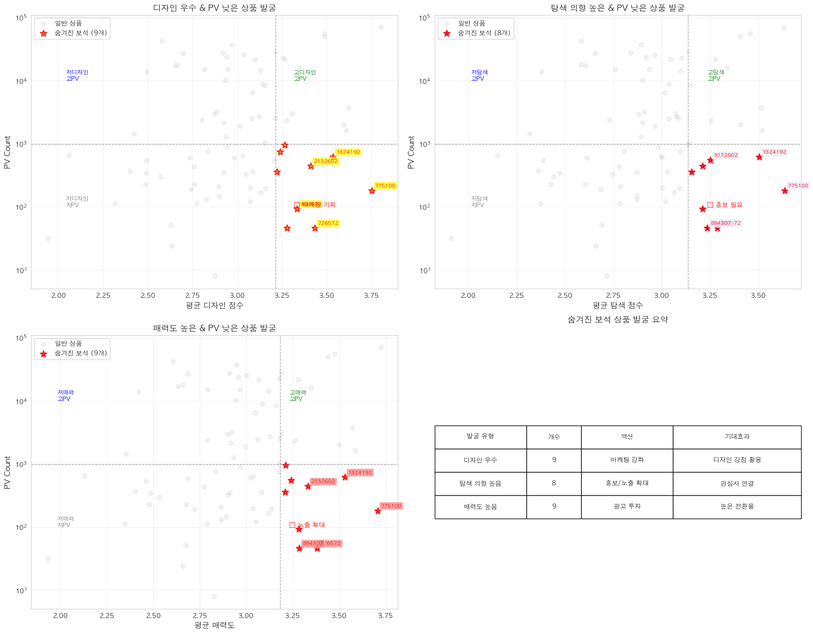

# [분석] 상품 출시일 이후 리뷰, 스타일링샷, 구매 등 지표의 변화가 코호트 관점으로 비교했을 때 차이가 있는지 @Fred Seol

담당자: Fred Seol
날짜: 2025년 11월 24일
상태: Done

# 결론

<aside>
✅

- C3(저매력고PV)는 스타일링 샷에 폭발적으로 반응하여 트래픽을 만드는 경향이 다수 관찰된다.  C1,C4(고 매력저PV)은 리뷰/스타일링샷에 거의 반응하지 않는다
    - C2가 '매력도가 낮은데도 PV가 높은 이유'는 **스타일링샷** 때문일 가능성이 높음.
    - C2에서 스타일링샷 작성 1~10일 이후 pv 증가 경향이 있음  → C2의 경우 첫 리뷰 **작성 20일 후 PV 크게 증가**
        - 스타일링샷이 쌓이고 → 리뷰가 쌓이는 선순환 구조에서 C1의 경우 스타일링샷이 초반에 쌓이지 않는 구조일 가능성이 있음
</aside>

- 부스팅의 시작점은 스타일링샷 ?
- 고매력인에 저 pv C1 → 광고를 태우는게 좋을까 ?
    - 증명하려면 ? → 고 pv 인 상품정보들을 뽑고 초반 스타일링샷 count 보면 증명 가능하지 않을까 ?

---

`next` 

1. C2 
    - 스타일링 샷 뭔지 까보기
        - 어쩌다가 이틀만에 스타일링샷이 등록되었는지? (최근 상품 지면 기준으로)
    - 왜 어쩌다가 ? pv를 많이 받게 되었는지? 스타일링 샷 으로부터 ? 찾아보기
2. 전체 상품에 대해서 비슷하게 추정해볼수 있을까? 
    - C2, C3 → pv를 많이 받는애들의 전체 양은 얼마나 될까 ? (스타일링샷이 쌓이고 → 이후 영향을 미치는것에 대해서 )

# 데이터 설명

- C1 과 C2를 비교하는게 포인트



| **코드** | **명칭** | **매력도** | **PV (페이지 뷰)** | **비고** | **갯수** |
| --- | --- | --- | --- | --- | --- |
| **C1** | **숨겨진 보석** | **고 (High)** | 저 (Low) | 노출 확대 필요 | 9 |
| **C2** | **문제 상품** | 저 (Low) | **고 (High)** | 원인분석필요 | 6 |
| **C3** | **스타 상품** | **고 (High)** | **고 (High)** | 주력 상품 (유지 관리) | 11 |
| **C4** | **저성과** | 저 (Low) | 저 (Low) | -  | 14 |
| **not** | **중간 범위** | 중간 | 중간 |  |  |


‘

### 가설

1. 상품 출시 이후 리뷰 부스팅으로 인해 → PV count의 변화가 생겼을 것이다.
2. 상품 출시이후 스타일링샷 부스팅으로 인해 → PV count의 변화가 생겼을 것이다.
3. 상품출시 이후 구매 부스팅으로 인해 → PV count의 변화가 생겼을 것이다. 

### 분석

- 첫 데이터를 얻기까지의 차이가 있는지를 먼저 체크
- 왜냐면 첫 데이터를 늦게 얻으면 부스팅을 받는 의미 자체가 없을수 있기 때문


- 이상치 몇개를 제외하면 , C1(고매력 저 pv), c2(저매력 고 pv),c3 (고매력 고pv) 는 첫 데이터 까지 걸리는 시간 큰 차이 없음.
    - 약 평균 median = 2 일
- C4 (저매력 저pv)의경우 크지 않지만 차이가 있음
- 4는 분석에서 크게 생각하지 않기로함

```markdown
각 상품의 첫 데이터 날짜를 0일로 정규화
   - 모든 상품이 동일한 시작점에서 비교됨
```


- 고 pv 의 특징 c2,c3는 스타일링샷이 계속 누적됨

### 요인 영향 분석: Lag 효과

- 질문:  리뷰/스타일링샷/구매가 있던 날 이후 PV/UV가 변하는가?
    - 다음과 같이 시간차이에 대한 요인별 → pv 값에 대한 correlation 을 다 구하고 체크함
        
        === Lag 상관분석 결과 (유의미한 것만) ===
        cohort            factor target  lag  correlation       p_value    n significant
        C1 stylingshot_count pdp_pv    5     0.086891  1.970590e-02  720           ✅
        C1 stylingshot_count pdp_uv    5     0.102830  5.749360e-03  720           ✅
        C1       buyer_count pdp_pv    1     0.123600  6.816846e-04  752           ✅
        C1       buyer_count pdp_pv    2     0.095945  8.827342e-03  744           ✅
        C1       buyer_count pdp_pv    3     0.091732  1.278679e-02  736           ✅
        C1       buyer_count pdp_pv    5     0.076695  3.964843e-02  720           ✅
        C1       buyer_count pdp_pv   10     0.080404  3.606318e-02  680           ✅
        C1       buyer_count pdp_pv   20     0.081509  4.596609e-02  600           ✅
        C2      review_count pdp_pv    1     0.203756  1.156471e-04  353           ✅
        C2      review_count pdp_pv    2     0.211696  6.562084e-05  350           ✅
        C2      review_count pdp_pv    3     0.220577  3.394699e-05  347           ✅
        C2      review_count pdp_pv    5     0.202035  1.727048e-04  341           ✅
        C2      review_count pdp_pv    7     0.202099  1.963303e-04  335           ✅
        C2      review_count pdp_pv   10     0.224765  4.218514e-05  326           ✅
        C2      review_count pdp_pv   20     0.704306  1.173581e-45  296           ✅
        C2      review_count pdp_pv   30     0.307837  3.023961e-07  266           ✅
        C2      review_count pdp_uv    1     0.221527  2.673233e-05  353           ✅
        C2      review_count pdp_uv    2     0.227991  1.655465e-05  350           ✅
        C2      review_count pdp_uv    3     0.227831  1.825858e-05  347           ✅
        C2      review_count pdp_uv    5     0.211654  8.188580e-05  341           ✅
        C2      review_count pdp_uv    7     0.206043  1.459055e-04  335           ✅
        C2      review_count pdp_uv   10     0.227949  3.256402e-05  326           ✅
        C2      review_count pdp_uv   20     0.706146  5.480294e-46  296           ✅
        C2      review_count pdp_uv   30     0.288166  1.757405e-06  266           ✅
        C2 stylingshot_count pdp_pv    1     0.256682  1.020559e-06  353           ✅
        C2 stylingshot_count pdp_pv    2     0.264900  4.951011e-07  350           ✅
        C2 stylingshot_count pdp_pv    3     0.289482  3.996710e-08  347           ✅
        C2 stylingshot_count pdp_pv    5     0.275390  2.379074e-07  341           ✅
        C2 stylingshot_count pdp_pv    7     0.290101  6.423602e-08  335           ✅
        C2 stylingshot_count pdp_pv   10     0.250437  4.704808e-06  326           ✅
        C2 stylingshot_count pdp_pv   20     0.195588  7.156330e-04  296           ✅
        C2 stylingshot_count pdp_pv   30     0.144372  1.847797e-02  266           ✅
        C2 stylingshot_count pdp_uv    1     0.217727  3.694266e-05  353           ✅
        C2 stylingshot_count pdp_uv    2     0.221876  2.809393e-05  350           ✅
        C2 stylingshot_count pdp_uv    3     0.233242  1.134342e-05  347           ✅
        C2 stylingshot_count pdp_uv    5     0.231247  1.609355e-05  341           ✅
        C2 stylingshot_count pdp_uv    7     0.239508  9.336303e-06  335           ✅
        C2 stylingshot_count pdp_uv   10     0.198918  3.015830e-04  326           ✅
        C2 stylingshot_count pdp_uv   20     0.160964  5.507869e-03  296           ✅
        C2       buyer_count pdp_pv    1     0.314595  1.504527e-09  353           ✅
        C2       buyer_count pdp_pv    2     0.326574  3.843679e-10  350           ✅
        C2       buyer_count pdp_pv    3     0.338863  9.031547e-11  347           ✅
        C2       buyer_count pdp_pv    5     0.370016  1.667093e-12  341           ✅
        C2       buyer_count pdp_pv    7     0.379287  6.650314e-13  335           ✅
        C2       buyer_count pdp_pv   10     0.374905  2.558770e-12  326           ✅
        C2       buyer_count pdp_pv   20     0.433963  5.047441e-15  296           ✅
        C2       buyer_count pdp_pv   30     0.729173  2.170503e-45  266           ✅
        C2       buyer_count pdp_pv   40     0.148520  2.247952e-02  236           ✅
        C2       buyer_count pdp_uv    1     0.329950  2.069621e-10  353           ✅
        C2       buyer_count pdp_uv    2     0.346949  2.453604e-11  350           ✅
        C2       buyer_count pdp_uv    3     0.354509  1.030913e-11  347           ✅
        C2       buyer_count pdp_uv    5     0.376569  6.253961e-13  341           ✅
        C2       buyer_count pdp_uv    7     0.388651  1.594858e-13  335           ✅
        C2       buyer_count pdp_uv   10     0.373504  3.129007e-12  326           ✅
        C2       buyer_count pdp_uv   20     0.444410  9.273776e-16  296           ✅
        C2       buyer_count pdp_uv   30     0.715405  5.357515e-43  266           ✅
        C3      review_count pdp_pv    1     0.277537  4.584563e-22 1166           ✅
        C3      review_count pdp_pv    2     0.262541  1.163315e-19 1155           ✅
        C3      review_count pdp_pv    3     0.251269  6.232582e-18 1144           ✅
        C3      review_count pdp_pv    5     0.257427  1.929994e-18 1122           ✅
        C3      review_count pdp_pv    7     0.235020  2.862984e-15 1100           ✅
        C3      review_count pdp_pv   10     0.219792  3.870157e-13 1067           ✅
        C3      review_count pdp_pv   20     0.153622  1.801274e-06  957           ✅
        C3      review_count pdp_pv   30     0.146953  1.756281e-05  847           ✅
        C3      review_count pdp_pv   40     0.161201  1.094552e-05  737           ✅
        C3      review_count pdp_pv   50     0.157917  7.148095e-05  627           ✅
        C3      review_count pdp_pv   60     0.124301  4.648273e-03  517           ✅
        C3      review_count pdp_uv    1     0.251767  2.574114e-18 1166           ✅
        C3      review_count pdp_uv    2     0.237739  2.643741e-16 1155           ✅
        C3      review_count pdp_uv    3     0.232479  1.666875e-15 1144           ✅
        C3      review_count pdp_uv    5     0.231080  4.577575e-15 1122           ✅
        C3      review_count pdp_uv    7     0.206975  4.150519e-12 1100           ✅
        C3      review_count pdp_uv   10     0.193611  1.802204e-10 1067           ✅
        C3      review_count pdp_uv   20     0.138637  1.677542e-05  957           ✅
        C3      review_count pdp_uv   30     0.118894  5.255064e-04  847           ✅
        C3      review_count pdp_uv   40     0.144086  8.655913e-05  737           ✅
        C3      review_count pdp_uv   50     0.156060  8.708519e-05  627           ✅
        C3      review_count pdp_uv   60     0.127365  3.722282e-03  517           ✅
        C3 stylingshot_count pdp_pv    1     0.148876  3.279248e-07 1166           ✅
        C3 stylingshot_count pdp_pv    2     0.145677  6.624153e-07 1155           ✅
        C3 stylingshot_count pdp_pv    3     0.135935  3.947258e-06 1144           ✅
        C3 stylingshot_count pdp_pv    5     0.145627  9.648567e-07 1122           ✅
        C3 stylingshot_count pdp_pv    7     0.145181  1.329589e-06 1100           ✅
        C3 stylingshot_count pdp_pv   10     0.136054  8.205268e-06 1067           ✅
        C3 stylingshot_count pdp_pv   20     0.191710  2.253173e-09  957           ✅
        C3 stylingshot_count pdp_pv   30     0.278593  1.456054e-16  847           ✅
        C3 stylingshot_count pdp_pv   40     0.340833  1.670393e-21  737           ✅
        C3 stylingshot_count pdp_pv   50     0.328214  3.258911e-17  627           ✅
        C3 stylingshot_count pdp_pv   60     0.289297  2.001213e-11  517           ✅
        C3 stylingshot_count pdp_uv    1     0.145382  6.179982e-07 1166           ✅
        C3 stylingshot_count pdp_uv    2     0.130984  7.970727e-06 1155           ✅
        C3 stylingshot_count pdp_uv    3     0.122667  3.180483e-05 1144           ✅
        C3 stylingshot_count pdp_uv    5     0.127662  1.794709e-05 1122           ✅
        C3 stylingshot_count pdp_uv    7     0.127178  2.332503e-05 1100           ✅
        C3 stylingshot_count pdp_uv   10     0.123468  5.258705e-05 1067           ✅
        C3 stylingshot_count pdp_uv   20     0.172309  8.155364e-08  957           ✅
        C3 stylingshot_count pdp_uv   30     0.248339  2.268284e-13  847           ✅
        C3 stylingshot_count pdp_uv   40     0.346256  3.482004e-22  737           ✅
        C3 stylingshot_count pdp_uv   50     0.339021  2.501284e-18  627           ✅
        C3 stylingshot_count pdp_uv   60     0.302224  2.217961e-12  517           ✅
        C3       buyer_count pdp_pv    1     0.590034 2.724372e-110 1166           ✅
        C3       buyer_count pdp_pv    2     0.577443 1.127043e-103 1155           ✅
        C3       buyer_count pdp_pv    3     0.567096  2.499372e-98 1144           ✅
        C3       buyer_count pdp_pv    5     0.569083  2.775926e-97 1122           ✅
        C3       buyer_count pdp_pv    7     0.568871  2.525413e-95 1100           ✅
        C3       buyer_count pdp_pv   10     0.530061  2.411857e-78 1067           ✅
        C3       buyer_count pdp_pv   20     0.489463  8.420971e-59  957           ✅
        C3       buyer_count pdp_pv   30     0.392663  1.304773e-32  847           ✅
        C3       buyer_count pdp_pv   40     0.294314  3.412721e-16  737           ✅
        C3       buyer_count pdp_pv   50     0.247828  3.141479e-10  627           ✅
        C3       buyer_count pdp_pv   60     0.222418  3.236210e-07  517           ✅
        C3       buyer_count pdp_uv    1     0.552572  3.457919e-94 1166           ✅
        C3       buyer_count pdp_uv    2     0.545795  1.215623e-90 1155           ✅
        C3       buyer_count pdp_uv    3     0.540252  1.130003e-87 1144           ✅
        C3       buyer_count pdp_uv    5     0.540916  2.878610e-86 1122           ✅
        C3       buyer_count pdp_uv    7     0.553262  3.237907e-89 1100           ✅
        C3       buyer_count pdp_uv   10     0.507405  6.917178e-71 1067           ✅
        C3       buyer_count pdp_uv   20     0.461524  1.182215e-51  957           ✅
        C3       buyer_count pdp_uv   30     0.383452  4.677813e-31  847           ✅
        C3       buyer_count pdp_uv   40     0.299793  9.026069e-17  737           ✅
        C3       buyer_count pdp_uv   50     0.255992  7.720466e-11  627           ✅
        C3       buyer_count pdp_uv   60     0.225529  2.189239e-07  517           ✅
        C4 stylingshot_count pdp_pv   50     0.187471  3.699496e-03  238           ✅
        C4       buyer_count pdp_pv    1     0.139741  8.758731e-04  564           ✅
        C4       buyer_count pdp_pv    2     0.169192  5.993534e-05  557           ✅
        C4       buyer_count pdp_pv    3     0.159225  1.771103e-04  550           ✅
        C4       buyer_count pdp_pv    5     0.185726  1.507821e-05  536           ✅
        C4       buyer_count pdp_pv    7     0.206394  1.979042e-06  522           ✅
        C4       buyer_count pdp_pv   10     0.173309  9.657293e-05  501           ✅
        C4       buyer_count pdp_pv   30     0.146449  5.304622e-03  361           ✅
        C4       buyer_count pdp_uv    1     0.129843  2.002634e-03  564           ✅
        C4       buyer_count pdp_uv    2     0.176482  2.805656e-05  557           ✅
        C4       buyer_count pdp_uv    3     0.158875  1.831025e-04  550           ✅
        C4       buyer_count pdp_uv    5     0.185358  1.568646e-05  536           ✅
        C4       buyer_count pdp_uv    7     0.178321  4.180571e-05  522           ✅
        C4       buyer_count pdp_uv   10     0.118805  7.767681e-03  501           ✅
        C4       buyer_count pdp_uv   40     0.122259  3.489557e-02  298           ✅
        C4       buyer_count pdp_uv   60     0.186066  1.167311e-02  183           ✅
        not      review_count pdp_pv    1     0.251421  5.914105e-52 3525           ✅
        not      review_count pdp_pv    2     0.244078  1.656088e-48 3490           ✅
        not      review_count pdp_pv    3     0.236961  2.663567e-45 3455           ✅
        not      review_count pdp_pv    5     0.232735  7.237680e-43 3385           ✅
        not      review_count pdp_pv    7     0.208832  5.501060e-34 3315           ✅
        not      review_count pdp_pv   10     0.214237  1.217723e-34 3210           ✅
        not      review_count pdp_pv   20     0.190829  7.372698e-25 2860           ✅
        not      review_count pdp_pv   30     0.193376  1.431663e-22 2510           ✅
        not      review_count pdp_pv   40     0.134738  3.233895e-10 2160           ✅
        not      review_count pdp_pv   50     0.108214  3.779031e-06 1817           ✅
        not      review_count pdp_pv   60     0.113198  1.296276e-05 1477           ✅
        not      review_count pdp_uv    1     0.244529  3.717134e-49 3525           ✅
        not      review_count pdp_uv    2     0.241711  1.409430e-47 3490           ✅
        not      review_count pdp_uv    3     0.234577  2.101857e-44 3455           ✅
        not      review_count pdp_uv    5     0.231937  1.408538e-42 3385           ✅
        not      review_count pdp_uv    7     0.204455  1.284876e-32 3315           ✅
        not      review_count pdp_uv   10     0.215041  6.788463e-35 3210           ✅
        not      review_count pdp_uv   20     0.193088  2.012954e-25 2860           ✅
        not      review_count pdp_uv   30     0.197798  1.467655e-23 2510           ✅
        not      review_count pdp_uv   40     0.133142  5.232789e-10 2160           ✅
        not      review_count pdp_uv   50     0.110766  2.213579e-06 1817           ✅
        not      review_count pdp_uv   60     0.107056  3.744204e-05 1477           ✅
        not stylingshot_count pdp_pv    1     0.201597  1.203994e-33 3525           ✅
        not stylingshot_count pdp_pv    2     0.186518  1.090551e-28 3490           ✅
        not stylingshot_count pdp_pv    3     0.192291  3.936355e-30 3455           ✅
        not stylingshot_count pdp_pv    5     0.187235  4.426215e-28 3385           ✅
        not stylingshot_count pdp_pv    7     0.166264  5.613146e-22 3315           ✅
        not stylingshot_count pdp_pv   10     0.165316  4.197263e-21 3210           ✅
        not stylingshot_count pdp_pv   20     0.129085  4.228334e-12 2860           ✅
        not stylingshot_count pdp_pv   30     0.157289  2.270457e-15 2510           ✅
        not stylingshot_count pdp_pv   40     0.131851  7.690256e-10 2160           ✅
        not stylingshot_count pdp_pv   50     0.105499  6.590130e-06 1817           ✅
        not stylingshot_count pdp_pv   60     0.193696  5.957981e-14 1477           ✅
        not stylingshot_count pdp_uv    1     0.207121  1.847083e-35 3525           ✅
        not stylingshot_count pdp_uv    2     0.195256  2.488826e-31 3490           ✅
        not stylingshot_count pdp_uv    3     0.201223  6.826264e-33 3455           ✅
        not stylingshot_count pdp_uv    5     0.193551  6.287018e-30 3385           ✅
        not stylingshot_count pdp_uv    7     0.172384  1.580949e-23 3315           ✅
        not stylingshot_count pdp_uv   10     0.167982  9.540364e-22 3210           ✅
        not stylingshot_count pdp_uv   20     0.129567  3.514877e-12 2860           ✅
        not stylingshot_count pdp_uv   30     0.158695  1.270872e-15 2510           ✅
        not stylingshot_count pdp_uv   40     0.130772  1.057941e-09 2160           ✅
        not stylingshot_count pdp_uv   50     0.100242  1.862396e-05 1817           ✅
        not stylingshot_count pdp_uv   60     0.175137  1.222060e-11 1477           ✅
        not       buyer_count pdp_pv    1     0.601095  0.000000e+00 3525           ✅
        not       buyer_count pdp_pv    2     0.559564 8.155633e-287 3490           ✅
        not       buyer_count pdp_pv    3     0.567582 6.773340e-294 3455           ✅
        not       buyer_count pdp_pv    5     0.520496 2.036970e-234 3385           ✅
        not       buyer_count pdp_pv    7     0.483492 7.995434e-194 3315           ✅
        not       buyer_count pdp_pv   10     0.463139 1.992496e-170 3210           ✅
        not       buyer_count pdp_pv   20     0.427673 1.514053e-127 2860           ✅
        not       buyer_count pdp_pv   30     0.432453 6.438893e-115 2510           ✅
        not       buyer_count pdp_pv   40     0.326771  6.359354e-55 2160           ✅
        not       buyer_count pdp_pv   50     0.213387  3.723682e-20 1817           ✅
        not       buyer_count pdp_pv   60     0.193769  5.828181e-14 1477           ✅
        not       buyer_count pdp_uv    1     0.556168 1.845380e-285 3525           ✅
        not       buyer_count pdp_uv    2     0.523685 4.243689e-245 3490           ✅
        not       buyer_count pdp_uv    3     0.530897 1.451350e-250 3455           ✅
        not       buyer_count pdp_uv    5     0.488939 5.627344e-203 3385           ✅
        not       buyer_count pdp_uv    7     0.451592 2.556013e-166 3315           ✅
        not       buyer_count pdp_uv   10     0.436070 3.833094e-149 3210           ✅
        not       buyer_count pdp_uv   20     0.401296 3.954824e-111 2860           ✅
        not       buyer_count pdp_uv   30     0.404779  1.383713e-99 2510           ✅
        not       buyer_count pdp_uv   40     0.298632  9.660982e-46 2160           ✅
        not       buyer_count pdp_uv   50     0.199368  9.592395e-18 1817           ✅
        not       buyer_count pdp_uv   60     0.180026  3.171778e-12 1477           ✅
        


- **구매(Buyer)가 가장** 큰 요인
    - 특히 **C2, C3 코호트**에서 구매와 PV의 연관성이 매우 강함
- 다만 구매를 만들어낼수 없기에 스타일링샷과 리뷰에 집중해보면
    - 리뷰
        - **C1, C4: 리뷰 효과 거의 없음 (-0.03 ~ 0.04)**
        - **C2: lag 20에서 0.70 - 리뷰 작성 20일 후 PV 크게 증가**
        - C3: 0.25~0.28로 일정한 효과 / not: 0.19~0.25로 일정한 효과
    - 스타일링샷
        - C2에서 1~10일 이후 pv 증가 경향이 있음
        - C3의 경우 30일 이후 Pv 증가 경향이 있음
    
    ---
    
- 코호트별 요인 효과 (회귀계수 평균)
    
    === 코호트별 요인 효과 (회귀계수 평균) ===
    
    [타겟: pdp_pv]
    review_count_coef  stylingshot_count_coef  buyer_count_coef
    cohort
    
    C1                   0.64                    1.32             10.11
    C2                  17.57                   56.41             22.23
    C3                  18.70                   11.28             24.69
    C4                   1.63                   -0.45              0.39
    not                 10.81                    6.46             17.80
    
    유의미한 상품 비율 (p < 0.05):
    C1: {'review_count': '0%', 'stylingshot_count': '12%', 'buyer_count': '12%'}
    C2: {'review_count': '0%', 'stylingshot_count': '33%', 'buyer_count': '33%'}
    C3: {'review_count': '18%', 'stylingshot_count': '18%', 'buyer_count': '18%'}
    C4: {'review_count': '0%', 'stylingshot_count': '0%', 'buyer_count': '0%'}
    not: {'review_count': '6%', 'stylingshot_count': '9%', 'buyer_count': '23%'}
    
    [타겟: pdp_uv]
    review_count_coef  stylingshot_count_coef  buyer_count_coef
    cohort
    
    C1                   0.15                    0.58              5.77
    C2                  10.90                   26.63             11.93
    C3                   8.00                    8.02             11.85
    C4                  -0.72                    0.47              0.09
    not                  4.64                    2.39              8.31
    
    유의미한 상품 비율 (p < 0.05):
    C1: {'review_count': '0%', 'stylingshot_count': '12%', 'buyer_count': '0%'}
    C2: {'review_count': '0%', 'stylingshot_count': '33%', 'buyer_count': '33%'}
    C3: {'review_count': '18%', 'stylingshot_count': '9%', 'buyer_count': '18%'}
    C4: {'review_count': '14%', 'stylingshot_count': '0%', 'buyer_count': '0%'}
    not: {'review_count': '3%', 'stylingshot_count': '3%', 'buyer_count': '20%'}
    


 **C2의 스타일링샷 효과가 압도적**

| 요인 | C2 회귀계수 (PV) | 해석 |
| --- | --- | --- |
| **스타일링샷** | 중앙값 **~70**, IQR 25~100 | 스타일링샷 1개 = PV **+70** |
| 리뷰 | 중앙값 ~20 | 리뷰 1개 = PV +20 |

**C1, C4는 모든 요인에서 효과 미미**