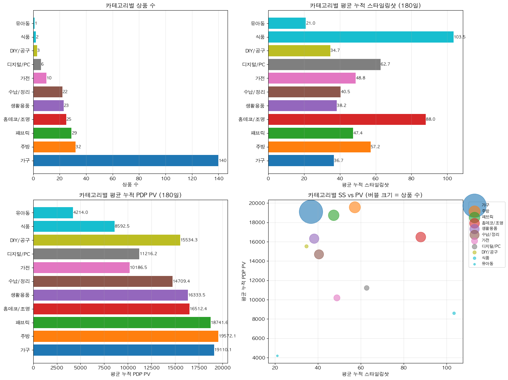

# [분석] PDP PV VIEW COUNT 기준 1% 상품들은 Styling Shot 이 먼저 증가하는 경향을 보일까?

담당자: Fred Seol
상태: In Progress

# 결론

<aside>
💡

</aside>

# 배경

- 설문 조사를 통해 매력도를 측정하고, 해당 상품들의 분석을 통해 높은 PV를 증가시키는 특정 피쳐가 SS인것을 확인함
- 이 내용이 전체 상품에도 해당되는지 체크 할 필요가 있음
- **전체 상품군 중 1%의 상품이 PV의 50% 이상 차지 → 그러니 PDP PV 상위 1% 상품만 체크해보자**

# 내용

### 카테고리 별로 살펴보면?

- **가구** 카테고리가 **140개**로 압도적으로 가장 많은 상품 수를 보유하고 있습니다. 이는 전체 분석 대상 상품의 절반가량(약 47.8%)을 차지하는 수준입니다.

<aside>
💡

- **주방** 카테고리가 32개로 다음으로 많으며, **패브릭**과 **홈데코/조명**이 각각 29개와 25개로 뒤를 잇습니다.
- 유아동 식품 공구는 모수가 너무 적어 유의하지 않습니다.
</aside>

<aside>
💡

가구 / 주방 /패브릭 / 생활용품 / 수납정리 

</aside>

- 시각화 대상 카테고리: 9개 (상품 3개 이상)
- **24년 6월 등록된 상품들의 런칭이후 180일 기준 데이터**

- ***max_days일차 값으로 정규화* 진행! 각 상품의 60일차 값 기준으로 SS, PV 정규화 (0~1)**
    - `lead_score = norm_SS - norm_PV` 계산
    - `lead_score` > 0인 일수가 30일 이상이면 "SS 선행 상품"으로 분류

| **category** | **상품수** | **SS선행상품수** | **SS선행비율** | **평균선행일수** | **평균lead_score** | **최대lead_score** |
| --- | --- | --- | --- | --- | --- | --- |
| 유아동 | 1 | 1 | 1.000 | 31.000 | 0.042 | 0.321 |
| **홈데코/조명** | **25** | **16** | **0.640** | **34.200** | **0.093** | **0.342** |
| **패브릭** | **29** | **17** | **0.586** | **33.862** | **0.153** | **0.490** |
| **식품** | **2** | **1** | **0.500** | **26.500** | **-0.002** | **0.153** |
| **주방** | **32** | **15** | **0.469** | **26.938** | **0.038** | **0.294** |
| **수납/정리** | **22** | **10** | **0.455** | **24.182** | **0.042** | **0.341** |
| 디지털/PC | 6 | 2 | 0.333 | 20.833 | -0.021 | 0.304 |
| 생활용품 | 23 | 7 | 0.304 | 21.826 | 0.026 | 0.312 |
| 가구 | 140 | 39 | 0.279 | 18.479 | 0.012 | 0.348 |
| 가전 | 10 | 1 | 0.100 | 11.700 | -0.089 | 0.089 |
| DIY/공구 | 3 | 0 | 0.000 | 12.000 | -0.005 | 0.239 |

| **구분** | **값** |
| --- | --- |
| 분석 대상 상품 수 | 293 |
| SS 선행 상품 수 | 109 |
| SS 선행 비율 | 37.2% |

- ~~유아동과 식품 공구는 모수가 너무 적어서 제외~~

<aside>
💡

- 홈데코 패브릭 주방 수납 생활용품 카테고리에서  **SS선행상품수 비율이 높음**
</aside>

**`전체 상위 1% 상품 통계`**
============================================================
총 상품 수: 293 / 카테고리 수: 11
180일 기준 평균 누적 스타일링샷: 46.1
180일 기준 평균 누적 PDP PV: 17,728.6

전체 스타일링샷-PV 상관관계
------------------------------------------------------------
Pearson 상관계수: 0.4130 (p=0.0000)
Spearman 상관계수: 0.5216 (p=0.0000)
Kendall Tau 상관계수: 0.3640 (p=0.0000)

### 근데 이게 인과적일까 ? (wip)

- 스타일링샷(SS)이 PDP PV 증가의 **원인**인지 검증
- 상관관계를 넘어 인과관계 확인

---

- 세 가지 검증 방법
    1. **Event Study**: SS 최초 발생일 전후 PV 변화 비교
    2. **PV 가속도 분석**: SS 발생 시점의 PV 증가 속도 변화
    3. **Granger 인과검정**: SS가 미래 PV를 예측하는지 통계 검정

---

### Event Study: SS 최초 발생 전후 PV 변화 분석

- 분석 대상 상품 수: 277
- SS 발생 전 평균 일별 PV: 39.4
SS 발생 후 평균 일별 PV: 70.0
- Paired t-test: t=8.580, p=0.0000
Wilcoxon signed-rank test: W=4154, p=0.0000

<aside>
💡

- **→ SS 발생 전후 PV 변화가 통계적으로 유의함 (p < 0.05)**
    - 문제는 런칭이후 SS이 생기기전에 PV가 증가하고 있는 양이 적기때문에, PV증가가 SS를 증가시키는 영향도가 섞여서 들어감
</aside>

- 방식
    
    예를 들어:
    
    - SS 전 14일 평균 PV = **5명**
    - SS 후 14일 평균 PV = **135명**
    
    → 변화율 = (135−5)/5×100=2600%(135−5)/5×100=2600%
    

### PV 가속도 분석: SS 발생 시점 전후 PV 증가 속도 변화

- 분석 대상 상품 수: 288
- SS 발생 전 평균 일별 PV 증가량: 45.0
SS 발생 후 평균 일별 PV 증가량: 62.9
평균 가속도 (변화량): 17.9
- PV 증가 속도가 빨라진 상품 비율: 82.3%
- `Paired t-test: t=4.578, p=0.0000
Wilcoxon signed-rank test: W=5930, p=0.0000`

<aside>
💡

- **→ SS 발생 후 PV 증가 속도 변화가 통계적으로 유의함 (p < 0.05)**
</aside>

### *Granger 인과검정*

- [상품별 Granger → 카테고리 집계]
각 상품 단위로 SS → PV Granger 검정을 수행한 뒤, 카테고리 수준으로 요약합니다.
**- 귀무가설(H0): SS는 PV를 Granger-cause 하지 않는다**
    - **- p < 0.05 → SS가 PV에 선행하는 영향이 있다고 해석**
    
    ✅ 상품별 Granger 분석 완료: 288개 상품
    [카테고리별 상품 단위 Granger 요약]
    **- 각 카테고리 안에서 "SS → PV" 인과성이 유의한 상품이 얼마나 되는지 요약**

| **category** | **n_products (상품 수)** | **n_tested (검정 상품 수)** | **n_significant (유의미 상품 수)** | **significant_ratio_pct (유의미 비율)** | **avg_best_lag (평균 최적 지연일)** |
| --- | --- | --- | --- | --- | --- |
| 홈데코/조명 | 25 | 25 | 14 | 56.0% | 4.4일 |
| 식품 | 2 | 2 | 1 | 50.0% | 2.5일 |
| 가전 | 10 | 10 | 4 | 40.0% | 3.1일 |
| 가구 | 135 | 135 | 47 | 34.8% | 3.8일 |
| 주방 | 32 | 32 | 11 | 34.4% | 3.5일 |
| DIY/공구 | 3 | 3 | 1 | 33.3% | 4.0일 |
| 디지털/PC | 6 | 6 | 2 | 33.3% | 2.8일 |
| 수납/정리 | 22 | 22 | 7 | 31.8% | 3.4일 |
| 생활용품 | 23 | 23 | 7 | 30.4% | 3.3일 |
| 패브릭 | 29 | 29 | 8 | 27.6% | 3.5일 |
| 유아동 | 1 | 1 | 0 | 0.0% | 7.0일 |
|  |  |  |  |  |  |

<aside>
💡

- 홈데코 유의미한 상품수 56% 가장 많음
- 나머지는 30~40%대
- SS이 PV를 증가시키는 상품도 있고 아닌 상품도 있는것으로 보임
- 카테고리별 차이가 크게 나지 않음
</aside>

# 참조