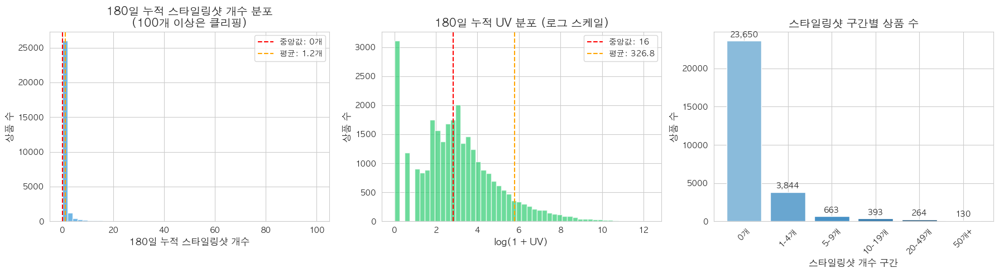

# [분석] 스타일링샷 몇개를 붙여주는게 효과적일까 ?

담당자: Fred Seol
날짜: 2025년 12월 20일
상태: In Progress

# 결론

- 한계효과 → marginal_effect: 이전 대비  UV(중앙값) 증가량 (한계효과)

<aside>
✅

<aside>
✅

방법 1 (한계효과 급감) & (증가율 둔화): 6개

- 감소율: -103.3%
- **SS 6 → 10 : 크게 UV가 늘어나지 않음 (7에서 잠깐 튀는 부분제외)**
</aside>

<aside>
✅

방법 2 (절대 한계효과): 2개

- 한계효과: 81.0
    - 기준: **mean_uv** 평균(1473.5)미만이면서 **increase_pct(증가율) 이 가장큼**
    - 가장 현실적임 - 단 한 장의 사진보다 '두 장'이 있을 때 유입은 2.5배 뜁니다. **53 → 134 (+152%)**
    - 유저들이 "이 상품이 진짜 존재하고, 다양한 각도로 볼 수 있다"고 믿기 시작하는 최소 지점이 아닐까?
</aside>

</aside>

# 내용

<aside>
✅

스타일링샷이 많으면 많을수록 좋겠지만 , 초반에 얼마나 만드는게 가장 효율적인가? 

**"적당한 개수"가 있을까?**

</aside>

### DATA

- 24년 6월 등록된 상품기준 180일간의 데이터
    - *스타일링샷 0개인 상품의수 23,650개 (81.7%) → 약 80%는 스타일링샷이 180일동안 0개  → 0개는 제거*
        - 📌 분석 대상 상품 수: 28,944개
        📌 카테고리 수: 16개
        
        ---
        
        - **스타일링 샷 수별 상품**
            - 🏷️ 스타일링샷 0개인 상품: 23,650개 (81.7%) → 제거
            - 🏷️ 스타일링샷 1개 이상인 상품: 5,294개 (18.3%)
            - 🏷️ 스타일링샷 5개 이상인 상품: 1,450개 (5.0%)
            - 🏷️ 스타일링샷 10개 이상인 상품: 787개 (2.7%)

📊 스타일링샷 구간별 UV 통계 (180일 누적)
========================================================================

|  | **상품수** | **UV_평균** | **UV_중앙값** | **UV_25분위** | **UV_75분위** | **UV_표준편차** |
| --- | --- | --- | --- | --- | --- | --- |
| **ss_bin** |  |  |  |  |  |  |
| 0개 | 23650 | 50.23 | 12.0 | 3.0 | 32.00 | 232.06 |
| 1-4개 | **3844** | **380.8** | **84.0** | **25.0** | **273.00** | **1112.01** |
| 5-9개 | **663** | **1386.81** | **478.0** | **182.0** | **1384.50** | **2728.7** |
| 10-19개 | **393** | **2927.78** | **1101.0** | **402.0** | **3012.00** | **5039.55** |
| 20-49개 | **264** | **6871.3** | **3884.0** | **1354.5** | **8730.25** | **8488.26** |
| 50개+ | **130** | **22487.92** | **13942.5** | **5043.5** | **27468.25** | **28382.41** |

========================================================================

🔹 Pearson 상관계수: 0.6106 
🔹 Spearman 상관계수: 0.4773 
🔹 로그 변환 후 Pearson 상관계수: 0.6245 

========================================================================

💡 주요 지표 설명:

- ss_bin: 전체 180일 SS 개수 (1~10개는 개별, 이후 구간)
- n: 해당 개수/구간의 상품 수
- median_uv: 중앙값 UV
- marginal_effect: 이전 대비 UV 증가량 (한계효과)
- increase_pct: 이전 대비 증가율(%)
- marginal_decay: 한계효과 감소율(%)

| **ss_bin (판매량)** | **n (샘플수)** | **median_uv (유입 중앙값)** | **mean_uv (유입 평균)** | **p25_uv (하위 25%)** | **p75_uv (상위 25%)** | **std_uv (표준편차)** | **marginal_effect (증가분)** | **increase_pct (증가율)** |
| --- | --- | --- | --- | --- | --- | --- | --- | --- |
| **1** | 2,369 | 53.0 | 223.78 | 18.0 | 169.0 | 774.68 | - | - |
| **2** | 799 | 134.0 | 480.68 | 40.0480.68 | 380.0 | 1,278.67 | +81.0 | 152.83% |
| **3** | 414 | 205.0 | 631.87 | 52.0 | 677.5 | 1,066.60 | +71.0 | 52.99% |
| **4** | 259 | 276.0 | 1,110.54 | 93.5 | 992.5 | 2,266.90 | +71.0 | 34.63% |
| **5** | 194 | 399.0 | 1,425.80 | 127.0 | 1,219.25 | 3,427.45 | +123.0 | 44.57% |
| **6** | 171 | 395.0 | 1,055.88 | 183.0 | 1,200.50 | 2,066.46 | -4.0 | -1.00% |
| **7** | 124 | 637.5 | 1,603.48 | 184.75 | 1,788.75 | 2,630.87 | +242.5 | 61.39% |
| **8** | 89 | 622.0 | 1,454.60 | 183.0 | 1,448.0 | 2,593.52 | -15.5 | -2.43% |
| **9** | 84 | 647.5 | 1,533.96 | 294.75 | 1,487.5 | 2,332.72 | +25.5 | 4.10% |
| **10** | 61 | 538.0 | 1,302.77 | 255.0 | 1,586.0 | 2,684.26 | -109.5 | -16.91% |
| **11-20** | 332 | 1,246.5 | 3,226.35 | 456.5 | 3,595.75 | 5,309.93 | +708.5 | 131.69% |
| **21-50** | 264 | 3,884.0 | 6,871.30 | 1,354.5 | 8,730.25 | 8,488.26 | +2,637.5 | 211.59% |
| **51-100** | 96 | 12,049.0 | 18,237.54 | 4,234.75 | 26,074.25 | 18,674.06 | +8,165.0 | 210.22% |
| **100+** | 33 | 19,209.0 | 35,524.21 | 12,290.0 | 35,577.0 | 44,354.87 | +7,160.0 | 59.42% |

<aside>
✅

방법 1 (한계효과 급감) & (증가율 둔화): 6개

- 감소율: -103.3%
- **SS 6 → 10 : 크게 UV가 늘어나지 않음 (7에서 잠깐 튀는 부분제외)**
</aside>

<aside>
✅

방법 2 (절대 한계효과): 2개

- 한계효과: 81.0
    - 기준: **mean_uv** 평균(1473.5)미만이면서 **increase_pct(증가율) 이 가장큼**
    - 가장 현실적임 - 단 한 장의 사진보다 '두 장'이 있을 때 유입은 2.5배 뜁니다. **53 → 134 (+152%)**
    - 유저들이 "이 상품이 진짜 존재하고, 다양한 각도로 볼 수 있다"고 믿기 시작하는 최소 지점이 아닐까?
</aside>