# 오늘의집 월간 인사이트 Ohouse User Insights

<aside>


*Docs Owner@Sungbae Kim Contrubutors :@usi @익명의 그룹 

오늘의집에서 가장 중요한 고객 인사이트를 매달 업데이트합니다.   last update: 2025/12/23* 

</aside>

---

# 00
집,하면 떠오르는 오늘의집
다른 키워드는 아직..

> *저한테 오늘의집앱이 진짜 딱 인테리어 용도 앱이어서 그거와 관련된 것만 많이 보려고 해서…*
> 

인테리어 관련해서 가장 먼저 떠오르고, 
탐색하고 구매할 의향이 있는 플랫폼은 오늘의집.
하지만 그 외 라이프영역에서 먼저 떠오르게 하고 있지는 못합니다.

‘오늘의집은 인테리어(집꾸미기)’ 라는 기대로 인해 평소 자신의 관심사더라도 인테리어 외 영역의 콘텐츠를 발견하는 것을 [기대하지 않습니다.](https://www.notion.so/2-6ae578e14e2640f79a84f3af637cb065?pvs=21) 

인테리어 외 관심있는 주제는
요리, 콜렉터블, DIY,애니메이션, 게임,티켓 및 전시,뷰티 입니다. 


- *Details*
    
    [2025.1H 오늘의집 사용경험 조사](https://www.notion.so/2025-1H-245a597878a08043981cfc36d1bb54c0?pvs=21) 
    
    - 인테리어/스타일링 관련해서 먼저 떠오르고, 정보 탐색 의향이 있는 플랫폼으로 오늘의집이 1위입니다.
        
        [브랜드 인덱스 조사_24. 상반기](https://www.notion.so/_24-0872dab15aff41999ee74480fb531e57?pvs=21) 
        
        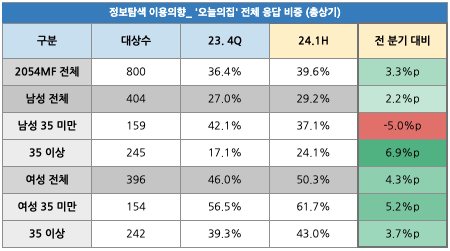
        
        
        
        오늘의집에서 인테리어 주제가 아닌 다른 주제의 콘텐츠를 제공하고 있다고 인지하고 있는 답변 비율은 오늘의집 인지자 중 40.3%로, 지난 조사 대비 1.4%p 상승했으나, 인테리어가 아닌 주제에 관심이 있어서 오늘의집에 방문하는 사람은 거의 없습니다. (3.7%)
        
        즉, 인테리어할 때 오늘이집에 방문해서 겸사겸사 다른 주제의 콘텐츠를 접하는 것이지, 다른 주제의 문제를 해결하러 오늘의집에 접속하고 있지는 않습니다. 
        
    - **인테리어외 관심있는 주제는 요리, 콜렉터블, DIY,애니메이션, 게임,티켓 및 전시,뷰티** 입니다.
        
        (구글 데이터)
        
        [오늘의집_오늘의집 (18-44)_240911 (1).pdf](%25E1%2584%258B%25E1%2585%25A9%25E1%2584%2582%25E1%2585%25B3%25E1%2586%25AF%25E1%2584%258B%25E1%2585%25B4%25E1%2584%258C%25E1%2585%25B5%25E1%2586%25B8_%25E1%2584%258B%25E1%2585%25A9%25E1%2584%2582%25E1%2585%25B3%25E1%2586%25AF%25E1%2584%258B%25E1%2585%25B4%25E1%2584%258C%25E1%2585%25B5%25E1%2586%25B8_(18-44)_240911_(1).pdf)
        
        - 인테리어 카테고리 외에 관심이 있는/구매 의도를 가진 분야는 어디인지
        - 어떤 성향의 사람이고, 시청하는 유튜브 채널은 무엇인지
        - 대상은 오늘의집'에 관심이 있고, '인테리어 디자인 및 데코레이션 서비스'에 구매의도를 가지고 있는 18-44세 입니다.
    - 살림,요리,일상 콘텐츠를 보기 위해 오늘의집에 접속하는 비중이 증가했으며 동기간 식품 카테고리 구매자 수 및 거래액 크게 증가
        
        
        
    - **8/5 오마트 런칭** 후 오마트 등록상품 발생거래액 하반기 총 237억
        
        
        
    - 오늘의집 고객 89%가 주 1회 요리를 합니다. 그 중 50%는 30분 이상 요리 콘텐츠를 찾아봅니다.
        
        [**오늘의집에서 보고싶은 콘텐츠 경험 설문조사**](https://docs.google.com/spreadsheets/d/1U5w4H74BJejmH_iwBtbRh-GdFjOQW_Xd2mzsho0Zz60/edit?gid=1317338742#gid=1317338742)
        
        **오늘의집 고객들은 요리를 자주 함.** 
        
        ㄴ 설문전체 고객 대상으로 주1회 이상 요리하는 사람 비율은 89% , 주 2회 이상 요리하는 사람의 비율은 77%
        ㄴ 설문 응답자가 '고관여 유저가 더 많음' 을 감안하여 오늘의집 방문일수에 따라 비교분석을 해도 차이가 근소함
        
        **오늘의집 고객들은 요리 콘텐츠 관심이 많음.** 
        
        ㄴ 설문 전체 응답자 기준 요리 콘텐츠를 주 30분 이상 보는 사람은 52%
        ㄴ 설문 응답자가 고관여 유저가 많음 을 감안하여 오늘의집 방문일수와 비교를 해도 차이가 크지 않음. (5~10일 구간은 오히려 높음)
        
    

---

# 01
오늘의집,
물건 사러 왔어요.

오늘의집에 방문한 것은 결국
관심의 실현(구매) 때문이며,
그들의 구매 결정은 여전히 오래걸립니다.

> *적당한 가성비의 **캡슐머신을 찾고 있는데**, 캡슐 브랜드마다 호환가능한 기계가 따로 있는 것 같고 어떤 브랜드의 캡슐의 커피맛이나 가격대가 나랑 맞을지 검색하고 알아 보는 중인데 **고민도 되고 선택하는데 시간이 좀 걸리네요.***
> 
- *Details*
    
    모든 고객들은 ‘이렇게 살고 싶다’의 실현을 위해서 오늘의집을 찾습니다.  구매를 하거나, 참고를 해서 집을 꾸미고 취미생활을 하기 위해 오늘의집을 방문했다고 했습니다. 
    
    최근 홈화면 방문자 대상 설문조사 응답자 2025명중 1달 이내 오늘의집에서 구매하기 위해 찾아본 상품이 없는 사람은 **0명**이었습니다. ([Link](https://www.notion.so/Interpretation-Analysis-57aaf33e3d184afe8adbfecf20921b49?pvs=21))
    
    그들에게 여전히 어려운 문제는 **구매하고 싶을만큼 매력적인 물건을 찾는 것** or **구매하고 싶은 카테고리는 있으나 결정 하지 못하는 것** ([Survey](https://www.notion.so/30-401c54cb6ae54835bb96c227aafb0161?pvs=21))입니다. 관심 있는 물건을 발견 한 후 구매하는 데 시일이 오래 걸립니다.
    
    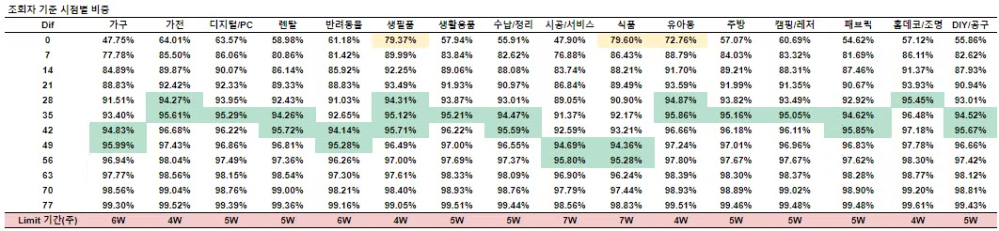
    
    특히 오늘의집에 방문한 고객은 고민을 오래 합니다. 라이프스타일은 발견과 탐색의 과정이 훨씬 모호하기 때문입니다. 브랜드나 상품의 종류가 굉장히 많고, 디자인 또한 다양하기 때문에, 구매할 상품을 찾아내기까지 많은 어려움들이 따릅니다. **이 지점을 도와줄 수 있는 것이 바로 콘텐츠, 리뷰** 입니다. ([Link](https://docs.google.com/document/d/145GwBaRyspsjsqdUFdBBHsjlI-MHZR57qm6yZDXvYQk/edit))
    

---

# 02
구매결정의 지름길, 
O!!모먼트는 리뷰와 콘텐츠

여전히 오늘의집의 강력한 장점은 
리뷰, 콘텐츠를 통해 구매결정을 돕는 것입니다. 

여전히 가전/가구 구매에 도움되는 콘텐츠를 쉽게 찾을 수 있다고 생각하는 [고객이 절반 미만입니다.](https://www.notion.so/12ea597878a08012b665cd1ab09fcc05?pvs=21) 
상품 구매를 고민할 때 콘텐츠를 찾고 있지만 ‘스타일링’ 외에 구매에 도움되는 상품 추천 정보, 장단점, 큐레이션 콘텐츠는 [발견하고 있지 못합니다.](https://www.notion.so/2-6ae578e14e2640f79a84f3af637cb065?pvs=21) 

> 사용자 찐 리뷰가 구매에 정말 도움이 많이 되서 좋아요. [[링크](https://ohou-se.slack.com/archives/CBK1D38BV/p1671841203153709)]
> 

> 오늘의집을 모를땐 **항상 상상만 하면서 꾸미기 템을 사다보니.. 생각과 달라서 실패가 절반 이상이었는데 오늘의집만의 시그니처인 '유저 스타일링팁' 덕분에 대략적 사이즈, 색감, 주변 연출 방법 팁까지 직관적으로 보이니까 실패가 거의 0가 됐어요!** 예쁘게 꾸며가시는 분들의 집과 센스를 모아 볼 수 있는것도 넘 좋구요^U^  -10주년 댓글 중
> 

- Ohouse Vision from Jay [[링크](https://docs.google.com/document/d/145GwBaRyspsjsqdUFdBBHsjlI-MHZR57qm6yZDXvYQk/edit)]
    
    일반적으로 한 유저가 특정 상품을 구매하기까지 1)발견과 2)탐색을 거치게 되는데요. 그 과정은 생각보다 단순하지 않습니다.
    
    하나의 물건을 구매하기 까지 유저는 커뮤니티를 들어갔다가, 글도 찾아보고, 쇼핑몰 들어가서 확인하고, 다시 그걸 반복하는 과정들을 거친 후 최종적으로 의사결정을 하게 됩니다. 개인이 어떤 특성을 가졌는가, 어떤 카테고리의 물건을 사고자하는가, 처음 어떻게 해당 물건에 대해서 알게되었는가 등등의 요소에 따라 개인이 선택하는 path가 달라질 것입니다. 즉 유저의 구매 의사결정을 돕는 문제를 해결함에 있어, no silver bullet 임을 말씀드리고 싶습니다.
    
    한 유저가 하나의 제품을 구매하는 과정도 이렇게 복잡할 수 있습니다. 그런데 라이프스타일 카테고리로 오면 이 과정은 더욱 어려워집니다. 왜냐하면 발견과 탐색의 과정이 훨씬 모호하기 때문입니다. 브랜드나 상품의 종류가 굉장히 많고, 디자인 또한 다양하기 때문에, 구매할 상품을 찾아내기까지 많은 어려움들이 따르게 되는데 이 지점을 도와줄 수 있는 것이 바로 콘텐츠 입니다. 내 취향에 맞는 콘텐츠를 찾게되었을 때 비로소 구매 결정에 한걸음 더 다가갈 수 있죠. 그래서 특히 라이프스타일 카테고리의 상품을 구매하는 과정에서는 콘텐츠 탐색과 상품 정보 탐색을 끊임없이 옮겨다니게 됩니다. **바로 오늘의집은 이러한 지점에서 가치를 발휘합니다. 콘텐츠 속에 있는 상품 정보를 태그를 달아 콘텐츠 세계와 커머스 세계 사이의 지름길을 만들게 되면, 쇼핑을 위한 탐색 시간이 줄어들고 이 과정은 더 편하고 즐거운 과정이 됩니다.** 예를 들면 오늘의집의 상품 정렬은 오늘의집 콘텐츠로부터 영향을 받기 때문에 오늘의집의 상품 탐색 경험은  일반적인 커머스에서의 경험에 비해 나에게 잘 맞는 상품을 더 빠르게 찾고, 구매 의사결정까지 빠르게 내릴 수 있게 됩니다.
    
- Detalis
    
    ***User Problem: 구매 결정을 위한 정보 획득 및 탐색 과정이 오래 걸림*** 
    
    > (스타일링은 팁은 도움 받고 있음)우선 여기에 올리는 사람들의 너무 데코가 예뻐요
    > 
    
    > (그외 정보는 찾기 어려움) 밥솥 같은 거는 그리고 개량이나 이런 게 어려운데 그래서 그런 건 저는 만약에 제가 이걸 샀다면 또 네이버에 찾아보고 있을 것 같거든요.이 제품 이름으로 쳐가지고 얼마나 넣어야 되는지랑 주의사항 같은 거
    > 
    - 1. 유저가 오늘의집 스타일링샷을 볼 때 기대하는 점 : 상품 구매 이후 ‘이렇게 할 수 있겠다’ 상상가능한 팁 얻기
        - “우선 여기에 여기에 올리는 사람들의 너무 데코가 예뻐요. 음식을 뭔가 플레이팅하는 것들이 예뻐서 많이 도움이 되는 것 같아요. 사실 인터넷 서칭을 하면은 서칭하거나 구글링하거나 하면은 뭔가 필요 없는 정보들도 되게 많이 보고 좀 질이 낮은 정보들도 많고 그런데 오늘 집에서 올려 거 봤었을 때는 데코적인 측면에서 뭔가 질이 낮은 게 별로 없었던 것같아요.” (P10,engageO)
        - “그러면은 여기에 이제 예를 들면 여기 들어가면은 여기에 이게 유저 스타일링 샷이 있잖아요. 그래서 저희도 여기 다 들어가 보거든요. 그래가지고 이제 이거 보면서 이분은 이렇게 세팅을 해가지고 올리셨구나 이런 식으로 올리셨구나 해가지고 이 색깔이 되게 음식이랑 봤을 때 예쁘다 예쁘게 색감이 또 담기는구나 이런걸 보고 참고해서 샀어요.” (P8,engageO)
    - 2. 유저가 오늘의집 리뷰를 볼 때 기대하는 점 : 제품의 기능을 검증할 수 있는 장/단점 파악 및 구매 영감 얻기
        - “제가 실생활에 필요한 제품을 살 때는 상품 리뷰를 좀 많이 보는 편이에요.왜냐하면 상품 소개나 그리고 블로그 이런 데서 올라오는 거는 사실 광고가 많은 아서 진짜 실제 사용 후기는 잘 안 된다는 생각이 있어서.. 실제로 오늘의 집 리뷰 올려주시는 분들 거를 좀 많이 봐요. 많이 봐서 장점은 뭐고 단점은 뭐고 근데 이제 이 단점이 제 허용 안에 있는 단점이면 저는 그냥 그 상관없이 그냥 구매해서 한번 써보고 이게 이런 거구나를 좀 경험하는 구매를 하고 있습니다.” (P1,engageO)
        - “네 실제 장단점 같은 거 스타일링에는 약간 스타일 위주로 약간 보이는 비주얼 위주로 많이 나왔다고 하면 리뷰에서는 실제 사용 후기 같은 게 좀 더 솔직하게 있는 것 같아가지고 그거를 기대하면서 리뷰를 보죠.” (P12,engageO)
    
    ### **가전/가구를 포함, 상품구매에 도움되는 콘텐츠는 아직 충분히 제공하지 못하고 있음.**
    
    - **오늘의집에서 찾기 쉽다고 생각하는 콘텐츠는 수납/정리 및 패브릭/홈데코**
    - 가전/가구에 구매에 도움되는 콘텐츠(49%), 요리/식품(38.7%), 프리미엄/리빙(38.2%)가 다음 순위며
    - 반려/유아동/캠핑/취미에 도움되는 콘텐츠는 찾기 어렵다고 응답
        
        
        

---

# 03
오늘의집 충성 고객,
아이폰 쓰는 34세 이하 여성

연령대에 따른 콘텐츠 조회는 큰 차이가 없었지만,
여성이 더 콘텐츠를 많이 보고, 리액션과 태그클릭도 더 많이 합니다.

또한 여성의 플랫폼 재이용 의향은 남성 고객에 비해 높은 편입니다. 

이로 인해 사용하는 기기 플랫폼별 차이가 뚜렷하게 나타납니다. 
iOS는 Android에 비해 상대적으로 연령대가 낮고 여성 비율이 높으며, 콘텐츠 조회 및 구매율이 높습니다.

![각 %는 홈 방문 세션 중 각 기능 이용 세션의 비중을 나타냄 [[링크]](https://www.notion.so/25ba597878a0806ca53eff6e7f827dfc?pvs=21)](image%201.png)

각 %는 홈 방문 세션 중 각 기능 이용 세션의 비중을 나타냄 [[링크]](https://www.notion.so/25ba597878a0806ca53eff6e7f827dfc?pvs=21)

- Detalis
    
    [플랫폼별 지표 차이 원인 분석](https://www.notion.so/25ba597878a0806ca53eff6e7f827dfc?pvs=21) by @Genie Heo 
    
    - IOS는 Android에 비해 상대적으로 연령대가 낮고 여성 비율이 높으며, 콘텐츠 조회 및 구매율이 높은 특성을 보였습니다. 반면 Android 유저는 40대 이상 비중이 높고, 마케팅 채널을 통한 유입 및 오퍼월 이용률이 높은 경향을 보였습니다.
        
        
        
        
        
    - [CAU breakdown 퀵 인사이트](https://www.notion.so/CAU-breakdown-1b2a7667990c4d1e98a0b748b06f1392?pvs=21)
        1. **`연령대`**: 저연령일 수록 콘텐츠 리액션과 상품 태그 클릭 전환율이 높다.
        2. **`성별`**: 여성이 남성보다 콘텐츠 리액션과 상품 태그 클릭 전환율이 모두 높다.
        3. **`가입일`**: 오늘의집 DAU 대부분은 가입한지 2년이 넘은 유저들이다.(분석일 2024-07-17)
            1. 가입한지 1 ~ 6개월 된 유저들이 최근 콘텐츠 조회전환율이 높아지고 있다.
            2. 가입한지 1개월 미만 유저들의 콘텐츠 리액션과 상품 태그 클릭 전환율은 높아지고 있다.
        4. **`커머스`** ([RFM](https://ko.wikipedia.org/wiki/RFM) Segment)
            1. Recency: 최근 구매자일 수록 상품 태그 클릭 전환율이 높다.
                - (가설) 최근에 구매한 유저들은 콘텐츠를 통해 상품 탐색을 한다.
            2. Frequency: 구매 빈도가 높을 수록 콘텐츠 리액션과 상품 태그 클릭 전환율이 **낮다.**
                - (가설) 구매 빈도가 높은 상품 관련 유효 콘텐츠를 발견 못한다.
            3. Monetary: 구매 금액이 클수록 콘텐츠 리액션과 상품 태그 클릭 전환율이 **높다.**
                - (가설) 구매 금액이 큰 가구 관련 콘텐츠들은 유저들에게 O!Moment를 제공한다.
        
        https://file.notion.so/f/f/7a97d13d-f721-4ca6-95f3-85bd276f9d9c/18bb77d6-003a-4d3a-a3b4-71ac6f63ce6a/엠브레인_오늘의집_플랫폼_사용성_조사_2024년_1차_Topline_Report(240816)_수정.pdf?table=block&id=f33f7588-2268-4794-86fb-7530b018d51d&spaceId=7a97d13d-f721-4ca6-95f3-85bd276f9d9c&expirationTimestamp=1729244592861&signature=ITW9aQntWytDRNRZrSHncXggC8ioAoZluNgUAhsZsK8&downloadName=#오늘의집+및+타+커머스+플랫폼+사용성+조사_Topline+Report.pdf
        
    - 연령대별 주요 화면
        
        [유저 demo 기반 구분](https://www.notion.so/demo-24fa597878a080d8823cf1f39d77cb88?pvs=21) by @Carl Jang  
        
        ### 유저 demo 기반 구분
        
        - **PDP추천 영역**
            - 방문 유저 수
                
                
                
                - 여성 그룹이 65+ 제외 모두 상위에 위치
                - 15-24 female의 경우 3월 중순 이후 급감 (→ 개강 이슈인지?) ([쿼리](https://redash-data.datahou.se/queries/5997#12546))
                    
                    
                    
                    - 23년부터 확인했을 때 매해 개강 시즌에 비슷한 패턴으로 방문 급증 이후 급감
                    - 15-24 male도 동일 패턴
            - 클릭 전환율
                
                
                
                - 지면 내 클릭을 한번이라도 하는 유저 비중은 여성 그룹이 모두 상위에 배치 (15-24, 25-34만 애매)
                - 특히 45-54, 55-64 Female그룹의 경우 45% 가까운 전환율을 보이고 가장 낮은 15-24, 25-34 male보다 2배 높은 전환율
            - CTR
                
                
                
                - 클릭 전환율과 비슷한 양상
                - 상위 그룹과 중간 그룹의 CTR 차이가 뚜렷하게 존재
            - 유저당 노출 (65+ 제외)
                
                
                
                - 여성 그룹의 상품 노출이 많고 나이대가 높을수록 더 높아짐
            - 스크랩 전환율
                
                
                
                - 여성 그룹의 스크랩 전환율이 더 높고 나이대가 어릴수록 더 높아짐
            - 유저 당 스크랩 수
                
                
                
                - 여성 그룹의 유저 당 스크랩 수가 더 높고 나이대가 어릴수록 더 높아짐
            - 장바구니 전환율
                
                
                
                - 여성 그룹의 장바구니 전환율이 더 높고 나이대가 높을수록 더 높아짐
            - 유저 당 장바구니 수
                
                
                
                - 여성 그룹의 유저 당 장바구니 수가 더 높고 나이대가 높을수록 더 높아짐
    - 주요 커머스 플랫폼 재이용의향(24년 8월 조사와 25년 1월 조사 비교)
        
        
        

---

# 04
원하는 상품과 콘텐츠가 있지만
앱의 일관성이 낮고 
앱을 믿지 못하겠어요.

타사대비 상품/콘텐츠 탐색 용이성이 높지만
가격,혜택,콘텐츠 신뢰도가 낮고 디자인에 대한 일관성이 떨어진다고 느낍니다. 

특가가 정말 할인가가 맞는지, 정품이 맞는지, 셀러가 제대로 소통하는지 의문을 가집니다. 

> *이벤트나 특가 배너가 뜨는데 매번 들어가보면 **정작 특가가 맞는지도 모르겠습니다. 가격도 늘 비슷하고 조금만 싸면 특가라고 여러개를 올려놓으니 가독성도 좋지 않아서 이제는 잘 안 누르게 됩니다.* [[링크](https://ohou-se.slack.com/archives/C06NDRWHH5J/p1726308647232729)]**
> 

- *Details*
    
    [2024.1H 오늘의집 사용경험 조사 ](https://www.notion.so/2024-1H-3f7a98be7567445582f9357ec1c4d89c?pvs=21) 
    
    [2024.2H 오늘의집 사용경험 조사 ](https://www.notion.so/2024-2H-182a597878a080cbb7e5d3e53a43923b?pvs=21) 
    
    [2025.1H 오늘의집 사용경험 조사](https://www.notion.so/2025-1H-245a597878a08043981cfc36d1bb54c0?pvs=21) 
    
    > **정보가 많음. 하지만 그에 비해 앱이 보여주려고 하는 것들이 너무 많으며,** **사용자가 앱을 이끄는 것이 아니라 앱이 사용자를 이끄려고 하는 느낌이 강함**
    > 
    
    > 눈팅만 하면서 이번에 이사하면서 구매해보니 스타일링에 대한 팁도 많이 받을 수 있었어요. 제품 퀄리티도 좋은 것들도 많았습니다. 금액에 관련하자면 매우 비싸진 않지만, 그렇다고 매우 저렴하지도 않더라구요 **뭐랄까. 타사를 한번 더 보게되었던 금액이긴 했어요**
    > 
    
    > 사실 구매자 입장에서는 오늘의 집이라는 플랫폼을 믿고 유명하지 않은 브랜드를 선택하는 경우가 많습니다. 그런데 막상 구매 후 반품 또는 환불 등의 문제가 생겼을 때 판매자와 연락 닿기가 쉽지 않다던지 또는 나몰라라 하는 경우를 보며 제대로 된 해결이 되지 않는다는 느낌을 받았습니다. ([link](https://ohou-se.slack.com/archives/C06NDRWHH5J/p1719926549220939))
    > 
    
    
    
    **관련 보고서**
    
    - [[2411] 콘텐츠를 많이 보고 물건 구매를 하지 않은 사람들(HCPN Deepdive)](https://www.notion.so/2411-HCPN-Deepdive-149a597878a08017aa8df818e07b50b8?pvs=21)
        
        > **가격인식**
        > 
        > - 오늘의집 가격이 **저렴하다고 생각하는 비율은 32%**
        >     - [평균 2.79, 표준편차 0.8](https://www.notion.so/2-79-0-8-3a631df557ef47b5800728230722dc94?pvs=21)
        >     - ㄴ ** 정기조사로 결과가 조금씩 다르지만 경향은 비슷함.
        > - 특가 상품은 비교적 Coverage가 넓으나 실제 인지를 보았을 때 **특가가 실제로 저렴하다고 믿는 비율은 56%로 높은 편이**라고 보기 어려움.
        >     - [**5-3. 오늘의집 <특가>는 저렴하다는 믿음이 있나요?**](https://www.notion.so/5-3-c0b227f4e48f4a7792e595558b6276bb?pvs=21)
        
        > **최저가상품**
        > 
        > 1. 최저가상품은 전체 상품 기준으로 6-7% 가량. 
        > 2. 고객이 보는 상품 기준으로 최저가뱃지 상품은 21% (79%는 아님)
        >     
        >     [**Pricing 2.0 Dashboard**](https://redash-commerce.datahou.se/dashboards/242-pricing-2-0-dashboard?p_start_dt=2024-07-01&p_w2642_%EB%B0%B0%EC%86%A1%EB%B9%84%20%EB%AF%B8%ED%8F%AC%ED%95%A8%28%EC%B5%9C%EC%A0%80%EA%B0%80%2Cnone%29=%EC%B5%9C%EC%A0%80%EA%B0%80&p_w2642_%EB%B0%B0%EC%86%A1%EB%B9%84%20%ED%8F%AC%ED%95%A8%28%EC%B5%9C%EC%A0%80%EA%B0%80%2Cnone%29=none&p_w2643_%EB%B0%B0%EC%86%A1%EB%B9%84%20%EB%AF%B8%ED%8F%AC%ED%95%A8%20%EC%B5%9C%EC%A0%80%EA%B0%80%20%EB%8B%AC%EC%84%B1%EC%9D%BC%EC%88%98%20N%EC%9D%BC%20%EC%9D%B4%EC%83%81=0)
        >     
    

---

# 05
돈이 되지 않아도 쓰는 리뷰
그런데 쓸 이유가 점점 사라져요.

고객들은 리뷰로 받는 포인트가 정확히 얼마인지도 모르면서,
누군게에게 도움이 되고자 리뷰를 작성하기도 합니다.

그러나 리뷰를 작성할 내재적,외재적 동기는 점점 줄어들고
작성과정의 UX 또한 매끄럽지 않다고 느낍니다.

- Detalis
    - 리뷰 작성률이 22년부터 지속적으로 하락하는 중 (전년대비 약 20~35%이상 하락 발생) 입니다. [[링크](https://redash-commerce.datahou.se/dashboards/189--)]
    
    
    
    - 리뷰가 없는 상품은 60%가 넘습니다. [[링크](https://docs.google.com/spreadsheets/d/1bjQfRTAfcxTnFa0rKi4pObhdUy79ay4J1vwTkdXuqDY/edit?gid=1296916670#gid=1296916670&range=5:5)]
    - 과거에 구매 경험이 있는 상품을 구매했을 때의 리뷰작성률이 30% 이상 낮음 (처음 사는 제품을 구매할떄의 리뷰작성률보다 크게 낮음). 그런데 전체 구매 중에 재구매 비중이 점점 올라가는 추세임.
    - 리뷰작성률이 낮은 생필품, 식품, 패브릭 비중이 올라감. 리뷰작성률이 높은 주방의 주문비중이 대폭 내려감.
    
    [[2404] 그 많던 후기 작성자들은 다 어디로 갔을까?](https://www.notion.so/2404-5825555599574608b6869b9f31a4684e?pvs=21) 
    
    [리뷰 작성률 하락원인 분석 ](https://www.notion.so/e50d61a01f214f75bf2a2e5ad37753ad?pvs=21) 
    
    | **리뷰 작성 동기** | **리뷰를 작성하지 않는 이유** | **User Quote** |
    | --- | --- | --- |
    | 리뷰 작성 인지가 잘 됨 | - 작성을 미루다 보니 잊어버림- 리뷰 작성을 콘텐츠 업로드와 헷갈리는 경우 존재 | P1 - 인테리어 용품들이 사고 바로 쓰고 끝이 아니라, 어딘가 비치하고 바꿔야 하고 그때그때 사고나서 바로 달고 바꾸는 것이 아니라서 시간이 지나다보니 잊어버리게 되는 것 같아요.P4- 사진을 촬영하고 올리려했는데 자꾸 미루고 미루다보니. 당장 사진 촬영할 여건이 안되거나 이러면 나중에 남기자 하고 미루는 편. 리뷰 쓸때 꼼꼼하게 쓰고 사진도 잘찍음 |
    | 리뷰 작성이 간편 | - 작성 가능한 리뷰가 있는지 인지가 어려움- 리뷰 작성을 어디에서 해야 하는지 찾기 어려움(리뷰 작성 시 자연스럽게 구매 내역을 먼저 떠올림)- 리뷰 작성 항목이 많은 것은 개인 차에 따라 불편하기도 함 | P5 - 쓸수있는 리뷰가 이만큼 쌓여있다는 것을 몰랐음. 구매확정 기다리고있다는 알림은 못받은것같고, 리뷰 작성 유도 알림을 받았는진 기억이 가물가물 함.P1 - 다른 플랫폼에 비해 내가 구입한 상품의 리뷰를 어디서 써야하는지 좀 어려움. |
    | 금전적 보상(포인트) | - 오늘의집 리뷰 작성 리워드가 높은 편임에도 그 가치가 높다고 인식되지 않음- 리뷰를 작성하면 얼마를 받을 수 있는지 명확히 기억하는 참여자 적음 | P1 - 오늘의집은 리뷰 썼을 때 적립금이 있는지 모르겠다고 함. 500원 혜택을 알게되어도 잘 안쓸거같아요. 적립금이 100원 500원인데, 제가 시간을 들여서 쓰는것보다는 얼마 안되니까 안받아. 이렇게 되는거같아요. 네이버는 구매포인트가 페이로 결제하면 쌓이는 게 한번 있고, 구매하고 나서 리뷰를 쓰면 얼마 얼마지나서 다시 쓰면 얼마가 추가되고 이런게 있는데, 이왕 노력을 들일거면 혜택이 더 많은거에 집중하자. 적립금이 금액대에 따라 달랐으면 좋겠다? 100만원짜리샀으면 포인트 더 많이 받을 수있으면 좋을 것 같다. |
    | 사회적 보상(타인에게 도움, 타인의 인정, 소통) | - 오늘의집은 리뷰를 작성하면 남에게 얼마나 도움이 되는지 알기 어렵다- 브랜드와 소통이 어렵다 | P1 - 네이버는 내가 쓴 리뷰가 조회 얼마를 넘었다 이런것이 떠서 눌러서 들어가봅니다P1 - 아고다 같은 숙박 어플들에도 리뷰를 써요. 아고다는 따로 금전적 혜택은 없는데, 해외여행 숙소는 장단점/솔직 후기 등을 다른분들도 아셨으면 좋을것같아서 정보제공 차원에서 작성하기도 함. |
    | 서비스 자주 이용 또는 고관여 | 관심사나 생활 패턴이 달라져 (오늘의집을 덜 이용하게 되면서) 리뷰를 덜 쓰게 된다 | P4 - 과거에는 물건을 엄청많이 사던 시기라서 (이사를 해서), 그때는 리뷰를 더 많이 썼던 것 같음. (구매빈도의 영향), 처음에는 인테리어 소품 많이 찾아보고 샀는데, 살아가다보니 그것보다는 생활용품, 집에 필요한거 위주로 쇼핑행태가 바뀌었음 (오 이쁘다! 사야겠다  -> 필요한것들을 사야겠다로 바뀜) |
    | 새롭거나 특별한 경험 | 일상적으로 자주 구매하는 상품(생필품 등)은 매번 구매하는 것이라 리뷰 작성 니즈가 적음- 쿠팡을 이용할 때는 급하게 구매하거나 천천히 살펴보고 구매하지 않아 리뷰를 잘 쓰지 않게 됨 | P2 - (컬리에서) 진짜 맛있거나 진짜 별로였던 경우는 꼭 쓰고 싶구요P2 - 세제를 늘 정기적으로 구매하는데 배송받을때마다 리뷰를 쓴다는게 와닿지가 않아요 루틴한 일상속에서 구매하는 품목 뿐이거든요 이걸 평가한다는것자체가 저한테는 어렵더라구요. 별로 이 제품에 대해 알릴 정보가 크게 없고 무난해서요 (대기업 브랜드 제품)P3 - 후기는 자주 사는 것은 안쓰고, 새로 구매하는 것은 써봤을 때 괜찮은 것은 후기남김. 만족도가 높을 때 리뷰를 쓴다 |

---

# 06
구매 확신을 이끄는 리뷰,
그러나 리뷰가 없거나, 탐색하기 어려워.

리뷰가 없는 상품이 60%가 넘어 고객들은 상품의 단점/문제점을 파악하지 [못하고 있습니다.](https://www.notion.so/119a597878a081a5ba96d9ed4cf907d1?pvs=21) 
퀄리티 높은 리뷰, 장기간 사용리뷰는 중요도에 비해 찾기 [힘들며](https://www.notion.so/119a597878a081a5ba96d9ed4cf907d1?pvs=21) 
카테고리마다 중요하게 여기는 정보가 전혀 다르지만 일괄적인 별점시스템과 탐색시스템으로 인해 고객들이
상품 정보를 제대로 [습득하지 못합니다.](https://www.notion.so/119a597878a081a5ba96d9ed4cf907d1?pvs=21)

- Details
    
    ## 고객은 리뷰가 없어 상품 구매에 어려움을 겪고 있다
    
    ### 오늘의집에 리뷰가 없는 상품은 60%가 넘고 [[링크](https://docs.google.com/spreadsheets/d/1bjQfRTAfcxTnFa0rKi4pObhdUy79ay4J1vwTkdXuqDY/edit?gid=1296916670#gid=1296916670&range=5:5)]
    고객은 리뷰가 없어서 [상품의 단점이나 문제점 파악]에 어려움을 겪으며,
    [실구매자 경험이 없어서] 구매에 어려움을 겪고 있음.
    
    | No | **Q. 오늘의집에서 쇼핑을 할 때, 리뷰가 부족한 상품을 구매하는 데 어려움을 느낀다면 그 이유는 무엇인가요?** | 응답 |
    | --- | --- | --- |
    | 1 | 상품의 단점이나 문제점을 미리 알 수 없다
    (리뷰가 없으면 상품의 결함이나 단점을 미리 파악하기 어려움) | 22.79% / 377명 |
    | 2 | 다른 사람들의 사용 경험을 알 수 없다
    (실제 구매자들의 경험을 통해 참고할 수 없어서) | 17.71% / 293명 |
    | 3 | 신뢰할 수 있는 정보가 부족하다
    (상품에 대한 믿을 만한 정보가 충분하지 않아서) | 14.33% / 237명 |
    | 4 | 가격에 비해 품질을 확인하기 어렵다
    (가격이 합리적인지 판단하기 힘들어서) | 13.66% / 226명 |
    | 5 | 비슷한 가격대의 리뷰가 많은 상품을 선호한다
    (리뷰가 많은 다른 상품과 비교할 때 신뢰도가 낮게 느껴짐) | 11.85% / 196명 |
    | 6 | 결정에 필요한 시간과 노력이 더 많이 든다
    (리뷰가 부족해 더 많은 시간을 들여 조사해야 해서) | 11.37% / 188명 |
    | 7 | 반품 또는 교환 가능 여부에 대한 불안감이 크다
    (상품이 마음에 들지 않을 경우를 대비한 불안감) | 6.17% / 102명 |
    | 8 | 기타 | 2.12% / 35명 |
    
    ### 오늘의집에서 쉽게 찾을 수 있는 리뷰는 [실사용 사진 리뷰]
    반면, [구체적이고 상세한 리뷰] [장기간 사용후 작성한 리뷰] 는 중요도에 비해 찾기 어려움
    
    특히 찐리뷰(개인적으로 구매한 리뷰)와 장기간 리뷰는 찾기 어렵다고 생각하는 사람이 더 많음. 
    
    | No | 오늘의집에서 가장 잘 확인할 수 있는 것? | 오늘의집에서 가장 확인하기 쉽다 | 오늘의집에서 가장 확인하기 어렵다 | 차이(탐색용이성) |
    | --- | --- | --- | --- | --- |
    | 1 | 실사용 사진과 함께 작성된 리뷰 | 61.31% | 3.45% | **57.86%** |
    | 2 | 구체적 정보를 종합적으로 작성한 상세 리뷰 | 19.59% | 7.13% | **12.45%** |
    | 3 | 장기간 사용 후 작성된 리뷰 | 5.86% | 31.74% | **-25.88%** |
    | 4 | 제품을 무상 제공받지 않고 개인적으로 구매한 사용자의 리뷰 | 5.38% | 18.14% | **-12.76%** |
    | 5 | 다른 사용자가 유용하다고 평가한 리뷰 | 4.47% | 14.57% | -10.10% |
    | 6 | 리뷰 작성자가 다양한 제품에 대해 꾸준히 고퀄리티 리뷰를 작성해온 리뷰 | 3.39% | 24.97% | -21.58% |
    
    ## 카테고리에 따라
    [구매 결정 영향 요소]와 [리뷰 탐색 시 중점 요소]가 상이
    
    ### 카테고리별 중요도에 비해 오늘의집에서 찾기 어려운 것들
    
    크게 [내구성/품질/소재], [공간 활용], [안전성 및 성분], [성능/조도/맛 등 본질 요소]의 4가지로 나눌 수 있음
    
    |  | 중요도에 비해 오늘의집에서 찾기 어려운 정보  |
    | --- | --- |
    | 가구 | 내구성 및 소재, 사용감 등이 중요 |
    | 생활용품 | 품질 및 내구성, 사용 편리 및 관리 용이성 등이 중요 |
    | 주방용품 | 소재 및 성능정보, 내구성 및 품질이 중요 |
    | 패브릭 | 내구성 및 세탁 용이성, 소재 등이 중요 |
    | 공구/DIY | 내구성 및 품질이 중요 |
    | 캠핑/레저 | 내구성 및 품질이 중요 |
    | 반려동물 | 안전성 및 성분이 중요 |
    | 생필품 | 안전성 및 성분이 중요 |
    | 유아/아동 | 안전성 및 성분이 중요 |
    | 수납/정리 | 공간 활용성 및 수납 용량 등이 중요 |
    | 데코/식물 | 제품의 크기 및 공간 적합성이 중요 |
    | 가전/디지털 | 성능 및 기능 정보가 중요 |
    | 조명 | 조명의 밝기/조도가 중요 |
    | 식품 | 맛에 대한 정보가 중요 |

---

# 07
예쁜 것보단 구매에 도움되는 것
팔로우보다는  스크랩, 검색

콘텐츠를 통해 얻고자 하는 것도 결국 ‘[구매결정](https://www.notion.so/Ohouse-User-Insights-10da597878a080729a16d024a0c4124a?pvs=21)에 도움’을 받기 위해서 입니다.
예쁜 콘텐츠보단 자신이 지금 찾고 있는 문제를 해결해줄 수 있는 콘텐츠를 찾습니다.
크리에이터 팔로우하는 가장 큰 이유는 그들이 올린 콘텐츠가 나중에 구매에 도움이 될 것 같아서 입니다. 

팔로우가 있는 유저들에게도 팔로우 기반 추천보다 개인화, 인기순 추천이 효과적이었습니다.

> 정말 관심이 있어서 팔로우 한 사람도 있지만 형식상 맞팔 요청한 사람도 팔로우를 하고 있어서 그런지 제가 좋아하는 류가 아닌것들이 바로 보여서 늘 집들이 탭이나 발견탭을 두번 눌렀어요 차라리 잘 다듬어진 것이 메인에 나오고 **제 팔로우는 제가 따로 눌러서 확인 하면 좋겠어요**
> 

> (팔로우한 계정) 어디가서 볼 수 있죠? 기억안나요.
> 

> 이런 제품 괜찮은데? 라는 생각이 들면 **일단 스크랩을 해요**. 무의식적으로 스크랩을 해두고 **다시 봐요.**
> 

- *Details*
    
    **앱을 열면 터치 한 번에 팔로우를 할 수 있습니다. 하지만..** 
    DAU의 80%는 팔로우를 하지 않습니다. 이 비율은 증가하지 않았습니다. 팔로우는 새로운 기능이 아닙니다. 고객들이 팔로우를 하지 않는 이유는 크리에이터에 관심이 별로 없기 때문입니다. 
    
    **‘좋아요' , ‘팔로우’**보다는 **‘스크랩'**. [**사람**]보다는 [**상품**]에, [**소통**] 보다는 [**구매와 눈팅**]
    
    ---
    
    
    
    > 고객이 오늘의집에 **방문한 목적은 관심있는 것을 찾고 [도움]을 받고, [물건]을 사는 것.** 탐색과정에서 좋아요,댓글 같은 상호작용에는 큰 관심이 없고, 관심이 있다하더라도 추가적인 정보를 얻는 수단으로 사용한다. 드물게 팔로우를 했더라도 따로 찾아보지는 않으며 인스타그램에서 팔로우한 집플루언서의 경우도 마찬가지다. 팔로우한 크리에이터가 꾸준히 활동을 하지 않는다고 믿거나 (게시물이 1개라던가) 실제로 그러한 경우가 대부분
    > 
    
    탐색과정에서 좋아요,댓글 같은 상호작용에는 큰 관심이 없고, 관심이 있다하더라도 추가적인 정보를 얻는 수단으로 사용한다. 드물게 팔로우를 했더라도 따로 찾아보지는 않으며 인스타그램에서 팔로우한 집플루언서의 경우도 마찬가지다. 팔로우한 크리에이터가 꾸준히 활동을 하지 않는다고 믿거나 (게시물이 1개라던가) 실제로 그러한 경우가 대부분입니다. [[리대시](https://redash-data.datahou.se/queries/2962/source#5864)]
    
    
    
    고객들이 관심을 표현하는 명확한 수단은 스크랩, 검색, 장바구니, 구매입니다.
    
    영감의 흔적 **[스크랩]** , 취향을 발견하는 곳 **[스크랩북]**
    
    ---
    
    
    
    > 마음에 드는 상품/콘텐츠를 찾았을 때 **[스크랩]**을 한다.
    주로 콘텐츠/상품 사진 속에 내가 좋아하는 [공간], [상품] , [브랜드]가 있는 경우다.
    꼼꼼히 보고 스크랩을 하는 것이 아니라 [마음에 드는 정도], [관심이 가면] 일단 스크랩하게 해두는 편.
    > 
    
    > **[스크랩북]** 은 내 취향을 알 수 있는 곳, 모아두는 곳이다.
    기능적으로는 [추가 탐색의 시작점] , [상품 구매 결정을 위해 고민하는 곳], [다시보고 싶은 상품과 콘텐츠가 있는 곳]
    > 
    
    ```graphql
    아무것도 안한 고객  
    < 상품이나 콘텐츠를 구경한 사람 
    < **스크랩**이나 **장바구니**를 사용한 사람 
    < 구매한 사람
    ```
    
    기존 페르소나에서 상위그룹 혹은 유지의 retention이 하위그룹으로의 이동보다 더 높습니다. 즉, 다음 단계로의 퍼널로 순차적으로 넘어갈 수 있게 하는 것이 중요하다. (PDP 를 조회하지 않았다면, 상품 경험부터 시키게 하고, 스크랩하지 않았다면 스크랩부터 하게 하기) 
    
    구매여부를 지외하고 스크랩/장바구니를 이용한 사람과 구매한 사람의 차이는 크지 않았다. [[또오세요 오늘의집 study (24.05)](https://docs.google.com/presentation/d/1xnR-p6C_qSSuYb3R3Ay94d7MEP0pJ1d6P61Y-riuHOw/edit#slide=id.g2bd84921690_0_16)]
    
    추천 프로듀서의 경우 **팔로우가 있는 유저들에게도 팔로우 기반 추천보다 개인화, 인기순 추천이 효과적임**
    
    - [홈 피드 첫 콘텐츠 만족도 분석](https://www.notion.so/7b98e0b1f41340d5bcb33bb57d8616ad?pvs=21)
        
        Summary
        
        - 팔로잉 있는 유저의 프로듀서 별 ctr을 보았을 때 (첫 콘텐츠 제외) 팔로잉 프로듀서의 ctr이 타 프로듀서들에 비해 낮음
            - **팔로우가 있는 유저들에게도 팔로우 기반 추천보다 개인화, 인기순 추천이 효과적임**
        - 첫 콘텐츠 내 팔로잉 프로듀서의 노출 비중은 cau 내 팔로잉 있는 비율인 20~25%와 유사
            - 첫 콘텐츠 한정 프로듀서 별 ctr을 보았을 때 팔로잉 프로듀서는 중간 정도 (0.43)
        - initial_scroll CVR은 팔로잉이 3번째로 높음
            - graph, recent_clicked 프로듀서들 다음 순서
            - ~~팔로잉 보유한 활동성 높은 유저들 대상 팔로잉 프로듀서가 3번째라면 좀 더 가중치 붙은 수치임을 감안해야하지 않을지?~~
        - 첫 콘텐츠 프로듀서 별 interaction ctr을 보면 팔로잉 프로듀서가 가장 높음
            - 하지만 like, scrap을 구분해서 보았을 때 like는 팔로잉이 압도적으로 많지만 scrap의 경우 다른 personalized 프로듀서가 더 높음
            - **팔로우 유저의 콘텐츠에 좋아요는 눌러주지만 스크랩의 경우 꼭 필요한 콘텐츠만 하는 경향**
    - 더보기
        - [콘텐츠 타입별 retention 분석](https://www.notion.so/retention-d4c7b92ef12749b481930e2e54f1cc05?pvs=21)
        - https://docs.google.com/spreadsheets/d/11r4GCUUynu2-TR-yyA0DZuRrmq0rPoFslUVs0smYosw/edit#gid=1117211283
        
        <aside>
        💡 **<Summary>**
        
        ### 롱폼/숏폼 조회 기준 Retention
        
        - 롱폼/숏폼 그룹 구분 시 **롱폼 그룹의 유저가 숏폼 그룹 대비 22% 더 많다.**
            - 그룹 구분 기준 : 롱폼/숏폼 콘텐츠 중 더 많은 CDP 조회로 집계
        - **숏폼 유저**의 **CDP 조회 수가 3배 이상 많고**, **CDP 체류 시간이 15% 더 길다**.
        - 전체 기준 숏폼 유저의 Retention이 더 높지만, **CDP 조회가 올라갈수록 롱폼 그룹의 Retention이 더 높다.**
            - **Cold case에서 숏폼 노출이 더 유리하다.**
            - CDP 조회 필터가 들어가면 롱폼 그룹의 모수가 더 많이 빠지면서 숏폼 그룹보다 heavy user비율이 크기에 높은 Retention을 보임
        
        ### 콘텐츠 체류 시간 기준 Retention
        
        - 체류 시간 weekly 중위값 75s 기준 더 많이 체류한 그룹보다 적게 체류한 그룹에서 롱폼, 숏폼 그룹 유저 수 차이가 더 크다.
            - CDP 체류 시간이 짧은 유저는 롱폼을 더 많이 소비한다. → **Cold case 개선 영역이 더 크다.**
        - CDP 체류 시간이 높을수록 Retention이 좋다. (**0.7** ↔ 0.6)
        - 전체 기준 숏폼 유저의 Retention이 더 높고, **CDP 체류시간이 올라가도 숏폼 그룹의 Retention이 더 높다.**
            - **같은 CDP 체류 시간 내 롱폼보다 숏폼이 retention에 더 많은 도움이 된다.**
        </aside>
        
    

---

# 08 
1P 기준,
잘 팔리는 것만 팔린다.

전형적인 파레토 현상(20:80 법칙)
판매(수)량 상위 5%에 해당하는 상품들의 판매량 비중은, 전체 대비 약 50%에 달한다.


- Details
    
    [1P 신규상품 수요 예측을 위한 EDA](https://www.notion.so/1P-EDA-120a597878a080bba625fe5987071961?pvs=21) 
    
    [가구, 가전, 홈데코] 상품 중, 하루에 1개도 팔리지 않는 **롱테일 상품이 매우 많다**. 
    
    [가구, 홈데코/조명, 수납/정리] 에 해당하는 상품들의 일 매출을 2depth 기준으로 볼시, 비슷한 트렌드를 따르는 것을 알 수 있다.
    
    
    
    극 소수의 히트 상품만 많이 팔릴 뿐, 대부분의 상품들은 팔리더라도 1개 이상 팔리지 않는 케이스가 많다. 
    

---

# 09 
콘센트는 여기, 창문은 여기?
내 집 배치는 여전히 어려워

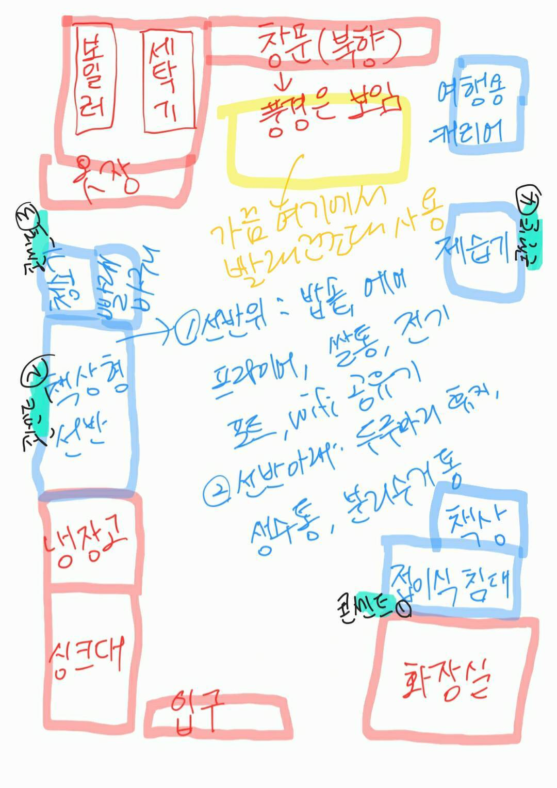

고객들은 3D 방꾸미기에서 **‘현실의 공간’**에 대해 고민합니다. 지금 살고 있는 집, 이사갈 집에 대한 고민은 끝이 없죠.

이러한 고민의 출발점, 토대가 되는 공간(Base)을 디지털로 옮기는 것은 여전히 어렵습니다.

3D 방꾸미기를 찾은 고객의 35%는 그들이 가진 문제를 해결하지 못했는데요. ‘조작이 어렵고(49%)’, ‘방 구조/크기를 원하는대로 바꿀 수 없었기(46%)’ 때문입니다.

- *Details*
    
    3D 방꾸미기를 방문한 고객들은 **‘현실 공간’**에 대한 문제를 가지고 있습니다.
    
    - 직접 방을 만들기 위해 오늘의집 3D 방꾸미기에 들어온 경우, 구체적 이유 (chart)
        
        
        
    
    이러한 문제를 해결하기 위해서는 고민의 출발점, 토대가 되는 ‘공간(Base)’을 디지털로 쉽게 옮길 수 있어야하고, 무엇보다 편리하게 사용할 수 있어야 합니다.
    
    ---
    
    [[3D 방꾸미기를 어떻게 알고 왜 들어왔을까?] 결과 해석 & 분석](https://www.notion.so/3D-b08095653f4f47bd9734548eed7ffdf7?pvs=21) 
    
    - 3D 방꾸미기를 방문한 이유는?
        
        
        
        
        - 사용자는 공간에 가구를 배치할 수 있는 서비스/툴을 찾아보다가 ‘오늘의집 3D 방꾸미기를 알게 되었습니다.
        - 3D 방꾸미기에 들어온 사용자의 91%는 '직접 방을 만들기 위해서' 3D 방꾸미기를 찾았습니다.
        - 그러나 **3D 방꾸미기를 찾은 고객의 35%(n=130)는 방꾸미기를 찾은 목적을 달성하지 못했습니다.**
        - 목적을 달성하지 못한 이유는
        **조작이 어렵고(49%)**, 
        **방 구조/크기를 원하는대로 바꿀 수 없으며’(46%), 
        원하는 가구가 없어서/가구가 부족해서(33%)** 때문입니다.
        
    - 배치할 때 고민하는 것은?
        - 3D 방꾸미기를 통해 방을 꾸밀 때에도 **정확한 수치는 중요**합니다.
        직접 방을 만드는 사용자의 약 20%는 방을 만드는 과정에서 **‘줄자’**를 사용했습니다.
            
            > *“치수 확인하면서 대략적인 공간을 확인했어요. 뭘 더 사야하는지도 봤고요!”
            ”줄자로 실측해서 가구사이즈,공간 사이즈까지 똑같이 구현”*
            (서베이 주관식 응답)
            > 
        - **현실의 공간을 어떻게 가져올 수 있을지** 고민하고, **‘도면’**을 보고 틀을 만들기도 합니다. 더 편리하게 공간을 가져오기 위해, 도면을 요구하기도 합니다.
            
            > *“도면을 넣으면 추천 인테리어 해서 자동으로 추천해주고 배치도 해주는 기능이 있으면 좋을 것 같아요!”*(유저 제안)
            *“(직접 방 만들기 하며) 정부 민원을 통해 우리집 도면을 확인. 도면과 실내 크기는 차이가 있어 줄자로 치수 잼.”
            “좀 더 다양한 오피스텔이나 아파트의 도면 샘플이 있었으면 좋겠습니다.”
            ”신축의 경우 방 사이즈 도면을 구현하는 게 어려워요.”
            ”집 평면도 불러오기가 있었으면”*
            (서베이 주관식 응답)
            > 
        - 직접 방을 만드는 사용자의 **13%는 내가 만든 방을 ‘가까운 사람’에게 공유하여 고민을 나누고 있습니다.**
            
            > *“배우자와 가구 배치를 의논하기 위하여”
            ”이사할 집에 가구를 배치하고, 괜찮은지 친구에게 물어봄”
            ”원룸 구조가 너무 한정적이라 방을 미리 바꿔놓고 괜찮은지 상의할수 있었음”
            ”가족들에게 이렇게 인테리어 하면 어떨지 물어봤습니다”*
            (서베이 주관식 응답)
            > 
            
            ---
            
    

# 10
지금 고객들이 보는 콘텐츠,
과거에 만든 콘텐츠가 다수

오늘의집 콘텐츠는 롱테일 효과가 꽤 큽니다.
6개월 혹은 그 이전에 생산된 콘텐츠의 소비량이 콘텐츠 전체 소비량의 상당수를 차지합니다. 
****퀄리티 좋은 콘텐츠를 만들어두면 오랫동안 고객에게 가치를 전달할 수 있습니다. 
****


- Detalis
    - [lifestyle vision & loadmap](https://docs.google.com/presentation/d/1Rc6pVognn3JgcOwdwHaKPQzbKAU0wDs512SFVLQHQc0/edit#slide=id.g261d08df115_3_184)
    - [콘텐츠 롱테일 효과 분석 (aka 수명 분석)](https://www.notion.so/aka-196b1edcf7c74d1e9c9a6ebd2335e7e7?pvs=21)
    - [콘텐츠 발행일 코호트별 조회수](https://www.notion.so/2dde06b8a2744fb2a3e444adce6368d8?pvs=21)
    - [2024 CNB 적정 생산량 확인](https://docs.google.com/spreadsheets/d/1iq_tXA3_nsZgpHZpAvP6folsZ1pSjBovmwJXOubRuUM/edit?gid=261445040#gid=261445040)  : 콘텐츠 하나 잘 만들어두면 2년까지 유효하다.
        - **콘텐츠 중에서 cmf 8점을 넘는 고성과 콘텐츠로 한정하면**
        - 발행 당월 고성과 콘텐츠가 받는 imp는 전체 고성과 콘텐츠 imp 대비 ~20% (연초 대비 약 30% 상승)
        - ~3개월 발행 고성과 콘텐츠가 받는 imp는 전체 고성과 콘텐츠 imp 대비 ~40% (연초 대비 약 40% 상승)
        - ~6개월 발행 고성과 콘텐츠가 받는 imp는 전체 고성과 콘텐츠 imp 대비 50%+ (연초 대비 약 15% 상승)
        - **~1년 발행 고성과 콘텐츠가 받는 imp는 전체 고성과 대비 ~75%**
        - **~2년 발행 고성과 콘텐츠가 받는 imp는 전체 고성과 대비 ~90%**

---

# 11 
물어볼 사람이 모인 오늘의집,
하지만 댓글이 달리지 않는 오늘의집

오늘의집 고객들은 구매결정을 위한 정보를 찾기 어려워하고 [있으며](https://www.notion.so/30-401c54cb6ae54835bb96c227aafb0161?pvs=21) 
오늘의집에서는 [오래된 콘텐츠들](https://www.notion.so/Ohouse-User-Insights-10da597878a080729a16d024a0c4124a?pvs=21)이 주로 보이고, 댓글을 남겨도 대댓글을 얻지 못하고 [있습니다.](https://www.notion.so/11fa597878a08105bb1df1e97deada65?pvs=21) 
매달 방문하는 사용자의 비율은 5% 미만이며, 댓글 2개 이상 달리는 콘텐츠 비율은 25%입니다. 

> *답변이 안달리는 경우가 부지기수더라구요, 그냥 안물어봐야겠다 생각했어요.*
> 

- Details
    
    이들은 관심사가 같은 사람끼리 모여, 빠르게 댓글이 달리는 [활성화된 커뮤니티](https://www.notion.so/11fa597878a08105bb1df1e97deada65?pvs=21)에서 정보 습득을 기대하고 있습니다. 
    
    > *(오픈카톡방) 자취생끼리 모인 게 도움이 돼요. 일단 제가 혼자 살고 물건도 혼자 쓰고 비슷한 취향인 사람 또는 이런 집을 구경하면서요. 2인이나 부부 생활하는 이런 집은 좀 너무 가격대도 달라지고 그쪽은 이제 아예 고급으로 가버리니까 네 그래서 좀 보기도 꺼려지고 그냥 안 보게 되더 1인 가구가 훨씬 더 가성비도 좋게 꾸미고요.*
    > 
    
    > *주제별 달글에는 질문을 하면 바로 답변해주는 사람도 있고, 다들 실시간으로 새로고침하면서 계속 댓글 달아줘요. **하루종일 그러고 있는 애들이 많아요.**  알리 달글에서 알리 꿀템을 발견하기도 하고, 지역달글에서 지역 정보를 얻기도 하구요. **제가 달글을 엄청 신뢰해요. 엄창 빨리 달려요.***
    > 
    
    ### 고객들이 현재 30분 이상 투자해야 찾을 수 있는 정보
    
    *** 현재 Selection이 부족한 문제(미입점상품)나 사용성으로 인해 찾기 어려운 문제는 배제함.*
    
    - **물건 구매하는 방법/기준 X 카테고리**
        - 화장실 타일 위에 미끄럼방지되면서 물도 잘 빠지고 인테리어에 잘 어울리는 매트
        - 해외 브랜드 가구 해외직구 싸게 사는 방법
        - 흡입력이 좋은 것과 공기주입이 되는 2in1기능 중 어떤 무선청소기를 사야하는지
        - 돔텐트 러그 , 매트 구매 방법
        - **안흔들리는** 책상 찾기
        - 내 취향에 맞는 미술품이나 액자 구하기가 어려웠어요
        - 핸드드립만 해오다가 적당한 가성비의 캡슐머신을 찾고 있는데, 캡슐 브랜드마다 호환가능한 기계가 따로 있는 것 같고 어떤 브랜드의 캡슐의 커피맛이나 가격대가 나랑 맞을지 검색하고 알아 보는 중인데 고민도 되고 선택하는데 시간이 좀 걸리네요.
        - 음식물처리기 제품 비교, 각 제품별 처리방법
        - 초등학생 방 책장 사이즈
        - 애기침대를 원목으로 할것인가 패브릭으로 할것인가 고르기
        - 와이프가 곧 출산하는데 아이에게 무해한 장난감 의류 고르기
            - 콘텐츠사진(장난감)
            - “와이프가 곧 출산해서 아이에게 무해할지 너무 고민이 많았는데 정품이라고 하고 어쩌구저꺼 ㅜ
            도움이크게 되었습니다.”
        - 블라인드 구매시 암막 여부 결정하기
        - 사계절용 침실 러그 사기
        - 아기 교구장 고르기
        - 다양한 캠핑 테이블, 높이 조절이 되는 특정 디자인의 테이블 정보
        - 철제 난간없는 샷시(입면분할창)전용 유리창 청소기 찾기
        - 봄,여름 이불 고르는 법
        - 냉장고 속 수납용품을 찾기 위해 한참을 검색해야했어요. 저는 키친핏이라 그 사이즈에 맞는 사이즈의 용품을 찾는데 시간이 많이 걸렸어요
        - 이쁘고 깔끔하고 상부장에 걸수있는 컵선반 찾기
        - 에너지효율좋고 저소음인데 시원한 에어쿨러 냉풍기 찾는 방법
        - 테이블에 각기 다른 디자인의 의자를 놓고 싶을 때 어떤 의자들이 잘어울릴지 고민
        - 강아지 브랜드 찾기
        - 강아지용 계단을 사는 방법
        - 바닥에 러그를 깔지 타일카페트를 깔지 고민
        - 공기청정기 고르는법
        - 여름철 침구류 고르기
        - 논슬립 옷걸이 유의미한 후기 찾기
        - 조잡하지 않고 저렴하면서도 심플한 이동이 가능한 스탠딩 조명찾기
        - 좁은 자취방 관련 꿀템
    
    <aside>
    🏁 **이미 사고 싶은 물건이 있지만 물건을 사는 기준이나 방법, 추천이 필요한 경우**
    
    좋은 구매를 해 본 크리에이터들이 해소해줄 수 있는 영역이며, 니즈가 분명하고, 확장 범위가 넓고, 커머스와 얼라인먼트가 가능하며, 기존 오늘의집 콘텐츠 수가 부족함 (e.g 교구장 고르는 법 - 유튜브에 쳐도 거의 없음, 아니면 오래된 콘텐츠)
    
    </aside>
    
    ---
    
    - **청소 하는 방법**
        - 거품이 나는 화장실 청소용 천연세제 만드는 법
        - 쇼파얼룩제거 방법
        - 식기세척기,건조기,세탁기 필터관리 및 청소법
        - 기종별 건조기 열교환기 깔끔하게 청소하는 방법
        - 봄철 황사 발생시 방충망 청소하는 방법, 샷시 창틀 청소 쉽게 하는 방법
        - 외부유리창 닦는법
        - 배란다 곰팡이 제거 방법.
        - 벽지에 묻은 곰팡이를 얼룩없이 제거하는 법이랑 곰팡이 예방법이요
        - 흰색 옷장에 묻은 검은 얼룩 제거
        - 창틀 먼지 제거
        - 장판 묵은때 제거
        - 에어컨 청소하는 방법
        - 싱크대 개수구 청소하는 법
        - 유해하지 않은 화장실 줄눈 곰팡이 제거제
        - 화장실 타일 사이 물때, 곰팡이 효과적으로 제거하는 방법
        - 집안 묵은때 지우는 방법
        - 화장실 물 비린내 제거법
        - 반려견 냄새 없애는 방법
        - 패브릭 소파 얼룩 집에 있는 물품으로 쉽게 지우기
    
    <aside>
    🏁 **살림 관련 콘텐츠 중 오늘의집에 없는 콘텐츠** 
    
    크리에이터들이 해소해줄 수 있는 영역이며, 니즈가 분명하고, 기존 오늘의집 콘텐츠 수가 부족함 (검색해보면 대부분 나오지 않음), 청소 관련 상품과 연계 가능
    
    </aside>
    
    ---
    
    - **인테리어 셀프/DIY**
        - 싱크대 아래 고정 브라켓부분이 안빠져서 빼는 방법
        - 주방 코팅 셀프로 해보기
        - 커튼 맞춤제작할때 너무 힘들었어요 이제 처음 독립해서사는데 한번도 해본적이 없어서
        - 마루재질 - 못찾았어요
        - 싱크대, 세면대 수전 바꾸는 방법(유튜브 보고 따라했는데 오래된 수전이라 바꾸는게 쉽지 않아서 계속 찾아보면서 고생했습니다ㅠㅠ)
        - 액자용 천장레일 거는법
        - 브라인드위에 커튼달기 언젠가보았던 노하우
        - 거실 전구 셀프로 바꾸기
        - 집안의 방수
        - 블라인드 구매시 실측하는법/ 셀프장착하는법
        - 벽지에 핀 곰팡이 제거법
        - 벽지 및 매트리스 곰팡이 제거 법
        - 결로 곰팡이 제거 및 보수공사
        - 대리석 식탁 금간거 매꾸는법
        - 베란다 바닥에 데크타일, 데코타일, 매트 깔아도 결로가 발생하지 않는지
        - 누래진 장판 다시 원상복구 시키는법
        - 줄눈 셀프 수리하는 방법
        - 커튼 사이즈 재는 법
        - 가구 재질에 대한 관리방법(금속재질의 의자 같은경우는 오래 쓰면 찐득해지는 감이 있음 물티슈로도 안 닦임)
        - 타일매트 크기 계산하는 법
        - 인덕션과 식기세척기 직렬설치방법
        - 모듈가구 만들는 방법
        - 막힘 욕조 뚫기
        - 구축 주방 셀프인테리어중 어두운 타일을 가리기위해 검색하다 여러재료를 사용한단걸 알게되었습니다. 시트지, 데코타일, 우드락 등등 그중 가스레인지를 사용해도 괜찮은 재질인지? 방수는 잘되는 재질인지? 초보자도 티안나게 잘 붙일수 있는지 그리고 최종 비용은 얼마나 들었는지 정보를 모우는데만 꼬박 3일 걸렸습니다.
        - 화장실 줄눈시공방법으로 타일공사
        - 강화마루 부분교체하는 법
        - 인테리어 시공 윤곽잡기
        - 마이크로시멘트 셀프 미장
        - 배란다 확장 방 습기 및 추위로 셀프 리모델링 방법
        - 벽 뚫지 않고 무타공으로 인테리어 꾸미는 다양한 방법들
        - 꼭꼬핀 벽지 손상 안 가고 꽂는 법
        - 거실 바닥 시공 관련하여 데코타일을 시공하고 싶어서 제품 비교 및 장단점, 실제 시공 후기 찾는데 대부분 마루 시공하여 찾는데 시간을 많이 소요함.
        - 인테리어 벽 리폼팁 셀프 시공 하는 방법
        - 물먹은 걸레받이 교체방법
        - 가전제품 청소- 저렴하고 안전한 청소업체선정
        - 리모델링 후 마감 및 하자 점검하기
        - 걸레받이 마루 안쪽으로 들어간거 꺼내는데 오래걸렸고 아직 못 꺼냈어요 ㅜㅠ (네이버 검색해도 포기)
    
    <aside>
    🏁 **니즈가 매우 뚜렷하나, 빈도수가 낮은 콘텐츠(1년에 한 두 번)**
    
    </aside>
    

---

# 12
댓글 이벤트로는 
댓글,좋아요를 더 늘릴 수 없어

댓글 달기는 보상이 있을 때만 증가하고 보상이 없어지면 오히려 더 줄어든다.
다만, 리액션(좋아요, 댓글) 을 받으면 업로드를 많이 하는 경향이 있습니다. 

- *Details*
    
    [12월 댓글 활성화 이벤트 분석](https://www.notion.so/12-d0f7b98c6a5d4181b41170210b4851f4?pvs=21) 
    
    1. 보상을 제공했을 때, 이벤트 전 대비 활동량은 유의미하게 늘었는가?
        1. 이벤트 참여자 기준 이전 대비 **40배 이상**의 좋아요, 댓글 action 발생
    2. 이벤트 기간의 경험을 바탕으로, 이벤트 기간이 끝난 이후에도 댓글/대댓글 활동을 이어가는가? 
        1. 이벤트 미참여자보다 댓글 활동성이 **소폭 개선**된 듯 보이나, 통계적 유의성이 떨어지고 **개선 폭이 매우 미미**하다.
        2. 좋아요 활동성은 **오히려 감소**했다. 
    3. 좋아요와 댓글을 받은 업로드 유저들이 **앱에 더 재방문 많이 하고 업로드를 더 하는가?**
        1. **앱 방문수**와 **업로드수** 모두 이벤트 종료 후에도 **유의미한 증가세**를 보인다.
            - 특히 **업로드수**가 소폭이지만 증가세를 보인다.

---

# 13
소규모 크리에이터는 
내 취향과 감각을 
기록할 곳이 필요해

오늘의집 콘텐츠 생산의 대부분을 차지하는 
소규모 크리에이터들,

오늘의집에서 크리에이터가 된 이유는 
다른 사람들이 올린 콘텐츠에서 도움을 받아, 
다른 사람들도 내 콘텐츠를 볼 것이라 기대를 하기 때문입니다.

콘텐츠 조회수, 팔로우, 스크랩, 수익등에 민감한 오감지수 500점 이상 크리에이터들과 달리 200점 미만의 소규모 크리에이터는 좋아요/스크랩에 신경을 쓰지 않습니다.

이들이 업로드를 하는 가장 큰 이유는 ‘기록을 위해서’입니다.

집의 변화가 있고, 요리를 하고, 반려동물과 일상을 살아가는 것을 기록하고 남기기 위해서. 이를 통해 쇼핑 과정에서 오늘의집의 다른 크리에이터들에게 도움을 받았’었’다는 부채감을 덜고(도움을 나눔), 언젠가 수익화를 하고 팔로우를 많이 얻을지도 모른다는 기대감을 가짐.

> **좋아요를 받기 위해서라기보단 제 일상 기록을 올리고 싶고 그다음에 제가 좋았던 경험들을 좀 올리고 싶은 마음이 컸어요**. 그리고 제가 활용하는 거대 것에 대해서 이거 정말 유용하다고 생각했던 것들을 올려서 어 도움이 되고 싶은 마음도 있었거든요.
> 

> 꼭 누군가 봐주길 바라는 마음으로 올리는 건 아니에요 제가 다른 유저들의 인테리어, 요리&플레이팅, 살림노하우 등의 사진이나 영상을 참고하듯이 다른 분들께 제 게시물들도 참고가 되면 좋겠다는 생각으로 컨텐츠 올리는 것 같아요! 플러스-! 댓글로 제 취향을 칭찬해주시면 좀 뿌듯한 기분이 들어서 그 맛에 열심히 하는 거 같아요😆
> 

- *Details*
    
    [[킴와이비]로 진화시키려면 어떻게 해야할까?](https://www.notion.so/e0b04376dd2c421196cc582ef429165d?pvs=21) 
    
    이들은 오늘의집의 콘텐츠 첫 생산의 허들을 넘은 이력이 있으며 **숏폼(card_collection 기준) 2회 이상의 콘텐츠 생산을 한 경험이 있으며, 오늘의집에서 팔로우 10-50명대를 보유한 사람**입니다. 
    
    | JTBD | 기록 촬영 후, 자랑할 곳 찾기 | **레퍼런스 탐색** | **콘텐츠 제작 및 업로드** | **다른 사람들의 리액션 확인 및 소통** | **내가 올린 콘텐츠 확인/다시보기** | **관심사 향유를 위한 탐색** |
    | --- | --- | --- | --- | --- | --- | --- |
    | User value | **[부담없이]** 기록하고 공유할 수 있는 곳 | - **[다양한 콘텐츠]**가 모여져 있고, **[검색]**이 편리한 곳 | - 내가 찍은 사진/영상을 **[더 예쁘게 꾸밀 수]** 있는 곳 | - **[관심사가 비슷]**하여 공감대 형성이 가능한 사람들이 있는 곳 
    - **[즉각적인 반응]**이 느껴지는 곳 | - **[분류]**할 수 있고, **[다시 찾아]** 보기 
    편한 곳  | - 원하는 취향의 콘텐츠와 상품을 **[쉽게]** 찾을 수 있는 곳 |
    | ♥️ Needs | - **공유/자랑**하고 싶어 
    
    - 내가 **좋아하는 분위기**여서 남겨놓을래(상품/공간) 
    
    - **특별한,기념하고 싶은 이 순간**을 기록해둘래(생일, 기념일, 휴직하는 동료의 선물 등) | - 나도 언젠가 저렇게 되고 싶은 콘텐츠를 볼래
    
    - 쉽게 따라해 볼만한 콘텐츠를 보고 싶어
    
    -요즘 트렌드인 콘텐츠와 크리에이터를 알고 싶어
    
    -동시에, 너무 흔하지 않은 콘텐츠도 보고싶어 | - 내가 촬영한 사진/영상을 더 
    [**예쁘게]** 만들고 싶어! (색감보정)
    
    - [**재미있게 편집]**하고 싶어(스티커/텍스트 꾸미기, 위치/사람 태그 등)  
    
    - [**쉽고 따라하기에 편했]**으면 좋겠어(릴스 템플릿) | - **[비슷한 공감대]**를 가지고 있는 사람들과 이야기하고 싶어 
    
    - **[누가]** 내 콘텐츠를 보는지 알고싶어 
    
    - 내가 한 경험이 나와 비슷한 문제를 겪는 **[다른 사람에게 도움]**이 되었으면 좋겠어 
    
    - 업로드한 콘텐츠가 **[얼마나] [인기있는지]** 알고 싶어  | - 내가 원하는 **[카테고리]**로 편집할래
    
    - 내가 **[구매했던 상품]**들도 같이 **[확인]**하고 싶어 | - 내가 모르고 있는 **[새로운 내 취향의 상품]**을 알고싶어 |
    | ✍️ Behavior | - 기록하고 싶은 순간의 사진을 **[여러 장]** 촬영(적금샷) 
    
    - 지인들에게 공유하고 알리고 싶을 때에는 [개인 메시지] or **[인스타그램 스토리]** 업로드
    
    - 기념하고 싶은 순간은 해당 시점이 지나가기 전 업로드 
    
    - 내가 좋아하고, 언젠가 도움이 될 것이라고 생각하여 기록한 것들을 [폴더]로 분류
    
     | - 계정을 **[팔로우]** 
    ㄴ 관심사가 비슷하지만 나보다 콘텐츠 퀄리티가 더 좋은 계정 
    ㄴ 흔하지 않은 콘텐츠를 업로드하는 계정
    
    - 콘텐츠를 제작하기 전 특정 키워드로 **[검색] 
    ㄴ** 오늘의집, ****핀터레스트, 유튜브, 인스타그램 등에서 관심 키워드 검색(화분, 파란색 소파 등, 브리치즈구이) 
    
    - 언젠가 따라 할 콘텐츠/템플릿을 **[스크린 캡쳐] [스크랩/저장]**
     | - 피드에 사진을 올리기 전 일상에서 틈틈히 **[임시저장]** 혹은 시간적 여유가 있을 때 **[몰아서]** 편집 
    
    - 나의 **[피드 톤/색감]**과 **[피드 구성을 고려]**하여 업로드 할 사진을 선택 | - 스토리를 업로드 한 후, **[확인한 사람들이 누구인지]** 확인 
    
    - 업로드 직후, 내 피드에 들어가 **[실시간]** 조회수, 좋아요 수, 댓글 등 확인 
    
    - 개인적인 일상 이야기는 DM으로 소통 (피드는 공개적인 소통) | - 분류되어 있는 카테고리별로 정보를 찾아 봄 
    
    - 변화가 점점 더 체감이 될 때 그 동안 남겨두었던 before & after를 훑어 봄 
    
    - 구매했던 상품 정보를 상품 태그로 다시 확인 함 
    
     | - 챌린지 업로드 후 참여작을 보며 **[마음에 드는 상품]**이 보이면 스크랩 
    
    - 피드에 올라온 다른 사진을 보며 **[마음에 드는 상품]**과 **[도움이 될 만한 콘텐츠]**를 스크랩 
    
    - 마음에 드는 상품을 발견하면 **[유저들의 스타일링샷]**을 통해 **[배치]**와 주위 **[어울리는 상품 탐색]** |
    | 🙀 Pain-points | - 이런 사진을 **[올려도 되는지]** 모르겠어 
    - **[어디에서]** 올려야 되는지 모르겠어
    - 예쁜 사진을 올리고 싶어 | - 나도 쉽게 따라할 수 있을만한 수준의 콘텐츠와 크리에이터를 발견하기 어려워 | - 에디터 UX 사용성, 버그가 있어서 불안정해 
    - 쉽고 용이한 편집 기능이 없어서 불편해 | - 어떤 사람들이 내 콘텐츠를 보는지 막연해  
    - 오늘의집은 콘텐츠 리액션이 별로 없는 곳이라, 기대되지 않아. 그래서 나도 리액션을 잘 하지 않게 돼 | - 카테고리 편집이 불가능해
     | - 콘텐츠 업로드 후 다른 사람의 콘텐츠를 보는 접근성이 떨어져 (e.g. 업로드 후, 랜딩 페이지가 어디인지 잘 모르겠음) |
    
    주로 기록/공유 목적의 자발적 콘텐츠 생산 활동을 하며, 생산 후 다른 유저들과의 소통을 원합니다. 
    
    평상시 뷰어 입장에서 오늘의집을 탐색할 때의 경험을 토대로 콘텐츠 업로드 방향을 생각해요. 
    
    - 상품을 구매, 탐색할 때 집을 꾸미기 위해 집사진과 인테리어 상품을 많이 보기 때문에 오늘의집의 콘텐츠 주제를 집으로만 국한하여 생각
    - 뷰어로 탐색하면서 오늘의집에서 본 콘텐츠들이 기록 목적으로 보이며, 소통이 활성화되어 보이지 않음
    - 상품을 구매할 때 자주 보고, 도움을 많이 받았던 스타일링샷을 통해 오늘의집에서 처음 콘텐츠 업로드 동인을 얻음
    - 내 취향을 지속 확장하고 싶고 기록 목적으로 콘텐츠를 지속 생산하며, 인플루언서가 될 기회를 꿈꾸어요.
        - 콘텐츠를 지속 올리기 위한 소재를 탐색 과정에서 우연히 발견하여 기록하고, 저장
        - 오늘의집에서 좋아하는 것들을 분류해서 보고, 구매한 내역을 남겨둠으로 추후 확인하기 용이하여 기록
        - 기록 목적으로 콘텐츠를 올리지만 궁극적으로 협찬과 수익화에 대한 기대를 함
    
    `[data]`
    
    - 월간 베스트 크리에이터 [[예시](https://ohou.se/search/index?query=%EC%9B%94%EA%B0%84%EB%B2%A0%EC%8A%A4%ED%8A%B8%ED%81%AC%EB%A6%AC%EC%97%90%EC%9D%B4%ED%84%B0&search_affect_type=Typing)] 조회한 유저들이 안한 유저보다 업로드 전환율이 더 높았고, 인당 생산 건수도 소폭 상승했다.
        
        월베크에 선정된 유저들은, 선정되기 전보다 후에 인당 생산 건수는 오히려 감소했고, 7일내 재생산률은 증가했다. (7%p)
        
        <aside>
        ❗ **그렇다.** 
        월베크 조회한 유저들이(group B) ****조회 안한 유저(group A)보다 모든 세그(이전 업로드 경향)에서 
        **업로드 전환율이 더 높았고, 인당 생산 건수도 소폭 상승했다.**
        
        </aside>
        
        ](Untitled%202.png)
        
        [https://redash-contents.datahou.se/queries/8524/](https://redash-contents.datahou.se/queries/8524/source)
        
        [월간 베스트 크리에이터 콘텐츠 > 이벤트페이지 조회자와, 월.베.크. 선정자 모두 생산에 기여했는가?](https://www.notion.so/3711f6480d714b459daa5dc30d8fe7c4?pvs=21) 
        
    
    ### 프로필 완성도가 높은 사람이 더 좋은 크리에이터
    
    > 마이페이지 자주 들어가요. 피드 색감이 맞는 게시물인지, 감성에 어긋난 게시물은 아닐지 자주 확인해요.
    - [슬기로운홈앤라이프](https://ohou.se/users/2387370)
    > 
    
    크리에이터들은 자신의 마이페이지를 신경씁니다.
    프로필 사진을 등록하고, URL을  입력하고, 자기소개를 쓴 사람들의 생산 빈도도 높고, 더 퀄리티 높은 콘텐츠를 생산합니다. 
    
    그러나 자기소개를 입력한 유저는 0.36%, 프로필을 업로드한 사람은 1%입니다. 
    
    - *Details*
        
        [[마이페이지/PDG] 프로필 업데이트 여부에 따른 유저 활동성 파악](https://docs.google.com/spreadsheets/d/18lI0CWNjRexD6Ldns7MvMY7rh05pNjmUqrC4DfJSHEw/edit?gid=0#gid=0)
        
    

---

# 14
수익도 좋지만 
명예와 소속감도 필요해

수익화 프로그램 이후, 간편한 콘텐츠 참여와 부수익을 버는 것에 만족감을 느꼈지만,
동시에 오하우스 커뮤니티 운영에서 받던 소속감과 집들이를 통해 자신의 콘텐츠가 
빛나던 (강조되는) 명예와 소속감이 줄어든 느낌을 받는 크리에이터가 생겼습니다.

> “**엄선이 돼서 로열티를 딱 받았다라고 느끼는 게 굉장히 중요**하잖아요. 예전에는 이런거 땜에 사람들이 **더 열심히 자기를 노출하고 꾸미려고 하고 진정성 있는 글에 사람들이 진정성 있게 댓글**로 다가오고 팔로우했는데 지금은 문턱이 낮아지면서 오히려 **취향 공유가 좀 더 어려워졌다**..”
> 

> 집들이도 이제는 제 마이페이지에 들어오면 없더라고요. 그래서 **내 아이덴티티가 없어지는 느낌**. 내 **피드에도 그냥 일상으로 덮이면서** 간간히 뭔가 제품 제공과 그냥 소개 이런 것밖에 없으니까 조금 그런 점이 아쉬운 것 같아요
> 

- *Details*
    
    [**[](https://www.notion.so/71acc9409f1b478cb18c2e13e0db9038?pvs=21)💰[유저는 콘텐츠 수익화 프로그램에 참여하며 만족할까?]](https://www.notion.so/71acc9409f1b478cb18c2e13e0db9038?pvs=21)**
    
    [FGD Highlight_(1).mp4](FGD_Highlight_(1).mp4)
    
    [FGD Highlight_(2).mp4](FGD_Highlight_(2).mp4)
    
    ### **Q1.[USP 작동 여부 검증] 유저는 오늘의집 콘텐츠 수익화 프로그램(이하 콘수프)에 참여하며 콘텐츠 참여 및 수익 창출의 ‘쉬운 난이도’에 공감하였을까? `YES, But..`**
    
    - User’s quote
        
        “인스타그램보다 오늘의집에서 더 재미를 느낀 부분은 수익화가 가능해서에요” (대부분)
        
    
    <aside>
    💡 **[Pain-Point]** 그러나, **수익화 로직에 대한 공감 부족**으로 인해 수익 금액을 늘리기위해 **더 적극적이고 지속적으로 생산 활동을 할 의지가 약함**
    - 이유1. 무지성으로 생산하는 콘텐츠의 양 증가로 인해 크리에이터 활동 및 뷰어로서의 경험도 저해
    - 이유2. 활동성과 상관없이 롱테일 효과로 발생하는 수익 발생이 동기부여 저하
    
    </aside>
    
    - User’s quote
        - “좀 찌질한 마음인데 5월엔가 그때 많이 받으신 분들 보고 한 풀 꺾인 거 있어요. (저도) 되게 열심히 했는데 이렇게나 많이 올리셨구나.. 그거 구나 너무 충격이었어요.” (seg1)
        - “안 한 거 대비 금액이 하던 것만큼 나와서 그게 더 현타가 오긴 했어요. 해도 이 정도고 안 해도 이 정도였나. 그전에는 막 되게 열심히 챌린지 있는 것도 열정적으로 했었는데 거의 비슷한 느낌이네” (seg2)
    
    <aside>
    💡 **[Opportunity]** 한편, 나노 크리에이터는 타 플랫폼 대비 오늘의집에서 콘텐츠를 생산하는 것에 **간편함**을 느끼며 **부담을 덜 느낌**
    - 이유1. 상품태그를 통해 노출이 잘 되고, 리뷰성 콘텐츠 생산이 간편함
    - 이유2. 지인에게 피드 노출이 적어, 제품 협찬성 콘텐츠 생산의 부담감 낮음
    - 이유3. 주제를 제안받고, 포맷과 내용에 신경을 덜 써도 됨
    (↔ 챌린지/웰컴 미션으로 제시하는 주제가 내가 올리고 싶은 콘텐츠가 아니여서 제약을 느끼기도 함) 
    
    * 참고: 오늘의집에서는 숏폼 동영상의 썸네일을 선택할 수 없어서, 영상을 올리지 않는 유저 있음
    
    </aside>
    
    - User’s quote
        - “인스타는 제가 뭔가 활동을 먼저 하지 않으면 글만 올렸을 상태에서는 아무런 반응이 오지 않아요. 그런데 오늘의집은 제품을 비슷한 걸 쓰거나 관심 있는 제품이 있으면 리뷰 타고 들어오거나. 이런 식으로 타고 올 수 있는 경로가 생각보다 많더라고요.” (seg3)
        - “오늘의집은 약간 숨어서 하는 느낌어서 내 마음대로 막 하는 느낌이고. 인스타는 다 내 지인이니까 그게 불편한 것 같아요. 저도 제품 제목 올릴 때 그거 쓰는 건 되게 창피하고 
        쑥스러워요. 내가 뭐라고 쓰지라는 마음 때문에요” (seg3)
        - “인스타는 릴스를 하라는게 너무 주인 것 같아요. 1일1포스팅챌린지 이런 것처럼. 별거 아닌 영상이라도 진짜 품이 많이 들잖아요. 근데 오늘의집은 그거에 비해서 훨씬 좀 더 캐주얼하게 올릴 수 있고 (내용도) 좀 덜 신경써도 되어서” (seg2)
    
    ### **Q2. [콘수프 지속 생산 동인 User Value 발굴] 유저가 콘텐츠 수익화 프로그램에서 콘텐츠를 지속 생산함에 있어 느낀 user value는 무엇일까? 
    `콘수프에 참여하며 느낀 User Value는 없음`**
    
    <aside>
    💡 **[Threat]** 나노 크리에이터는 오늘의집에서 **경제적 보상 만큼이나** 지속 생산의 동기부여로 **비경제적 보상을 기대**하지만, 현재 콘수프에 참여하며 **과거에 느낀 Value도 퇴색되었다 느끼며** 지속 생산의 동기를 얻지 못함
    ****- 이유1. 과거 오늘의집 크리에이터 활동을 선망하도록 만들었던 집들이의 가치가 옅어짐
    ****- 이유2. 과거 크리에이터로서 파급력을 만드는 명예/인정 욕구 충족 가능성이 낮아짐
    - 이유3. 인테리어라는 뾰족한 관심사를 가진 사람들과 가능했던 소통 및 취향 공유 상실 
    - 이유4. 기록의 가치 퇴색
    
    </aside>
    
    - User’s quote
        - “집들이도 이제는 제 마이페이지에 들어오면 없더라고요. 그래서 **내 아이덴티티가 없어지는 느낌**. 내 **피드에도 그냥 일상으로 덮이면서** 간간히 뭔가 제품 제공과 그냥 소개 이런 것밖에 없으니까 조금 그런 점이 아쉬운 것 같아요.” (seg1)
        - “제가 이 전 가구회사에서 협찬 크리에이터를 선정할 때 이미 약간 검증되어 있는 **오하우스분들은 집을 잘 꾸민다는 훈장 같은 느낌**이라고 해야 되나 그런 게 있는 사람이여서 개별적으로 .. **그거를 지표로 보고 고른 적**도 있어요.” (seg1)
        - **“인스타에서도 집에 대한 피드**나 이런 건 계속 올렸었는데 **그렇게 연락이 오지 않았단** 말이에요…근데 근데 오늘의집에 **집들을 딱 올리는 순간 갑자기 공영 방송에서 연락이 온다거나 유튜브 같은 데서 연락**이 온다거나..인정받는 느낌. 주변에서도 오하우스 하고 있다는걸 되게 좋게 봐주시고..” (seg2)
        - “**엄선이 돼서 로열티를 딱 받았다라고 느끼는 게 굉장히 중요**하잖아요. 예전에는 이런거 땜에 사람들이 **더 열심히 자기를 노출하고 꾸미려고 하고 진정성 있는 글에 사람들이 진정성 있게 댓글**로 다가오고 팔로우했는데 지금은 문턱이 낮아지면서 오히려 **취향 공유가 좀 더 어려워졌다**..” (seg2)
        - “예전에 좋았던 것들을 좀 가져가면 어땠을까. 그것 때문에 수익화가 되지 않아도 계속 참여했었던 사람들이 있었는데 사라지는 것 같고.. 홈에 딱 들어갔을 때 보여지는 게 **이제 예전처럼 그렇게 막 집에 대해서 진심으로 다가오는 느낌이 좀 덜해요**” (seg2)
        - “예전에는 **기록의 가치**에 대해서 되게 많이 알려주셨어요. 좀 더 그런 거에 집중해서 **퀄리티 있게 하고 싶은 욕심에 올렸던 것 같은데** **지금은 챌린지를 위해서 빨리 찍어서 빨리 올려야지** 늦게 올리면 조회수가 안 올라가는 것들 때문에 자꾸 거기에 치중이..” (seg2)
    
    <aside>
    💡 **[참고]** 크리에이터는 **하나의 목표를 함께 공유하며 실천할 때**, 소속감을 느끼며 콘텐츠를 지속 생산할 동기부여를 얻음
    
    </aside>
    
    - User’s quote
        - “다른 분들께 도움을 주고 싶어서 오픈채팅방을 만들어서 100명을 빨리 모으게 도와주겠다했는데, 저도 6월에 잘 못했지만 거기에 다들 갑자기 막 열정적으 오늘부터 1일 1포스팅 합니다. 올려주세요. 밤 9시에 맨날 알림 드립니다 이러면서 해서 또 그런 게 좀 재밌더라고요.” (seg1)

---

# 15
아르떼미떼보다
모던하우스, 일룸이 힙해

고객들이 생각하는 ‘힙한’ 브랜드는 드비저리, 잭슨카멜레온보다
익숙한 먼데이하우스, 일룸, 헤이같은 브랜드입니다.
또한 오늘의집은 니치한 브랜드보다는 대중적인 브랜드를 다룬다고 생각합니다. 

> *개인적으로 느끼기에는 (오늘의집은) 조금 더 **대중적인 브랜드들이 훨씬 많은 것 같고** .. 그래서 오히려 니치한 브랜드라든지 감도가 높은 브랜드들은 **다른 플랫폼에서 찾게 되는 것 같아요***
> 

바이너리샵 런칭 이후, 고감도 상품을 오늘의집에서 찾겠다고 응답한 고객 비율 증가했습니다.
그러나 여전히 바이너리샵을 모르는 고객이 [많습니다.](https://www.notion.so/Brand-2-0-ddb63d8b298641478a7200e81594a3e3?pvs=21)


- *Details*
    
    → 바이너리샵 런칭 이후 고감도 상품을 오늘의집에서 찾겠다고 응답한 고객 비율 증가, 그러나 여전히 바이너리샵을 모르는 고객이 많음. 
    
    [[Commerce] IB 인식 조사 설문](https://www.notion.so/Commerce-IB-9ec28eb1db0e45e6921c4b0aaec3fd1e?pvs=21) 
    
    1. 내부고객  (내부유저 / 퍼소나 세아 대상 서베이 / 응답자 608명)
        - 퍼소나 Seah 조건
            
            <aside>
            
            - 2024-05-01 ~ 2024-07-31 내에 **브랜드홈에 10회 이상 방문**을 했으며
            - **아래 조건 중 하나라도 만족하는 유저**를 세아라고 정의
                - 브랜드 기획전 2회 이상 view
                - 바이너리샵 기획전 3회 이상 view
                - 브랜드기획전에서 PDP 조회 3회 이상
                - 바이너리 기획전에서 PDP 3회 이상
                - IB 브랜드의 브랜드홈 방문 4회 이상
                - 브랜드홈에서 상품 클릭 7회 이상
                - IB 브랜드의 브랜드홈에서 상품 클릭 3회 이상
                - 브랜드 해시태그의 콘텐츠 태그 클릭 5회 이상
            - 해당 조건들로 정의했을 때, `최근 3개월내 오늘의집 방문 유저 중 약 5%의 유저`가 해당
            </aside>
            
        - Positive
            - 퍼소나 대부분은 오늘의집에서 감도있는 상품/브랜드를 쉽게 찾을 수 있다고 응답 (오늘의집 충성 고객으로 인한 편향성 고려 필요)
                
                
                
            - 감각적이고 트랜디한 홈인테리어 상품을 탐색하거나 구매하고자 할 때,다른 쇼핑몰 (네이버, 쿠팡, 29CM, EQL 등)보다 <오늘의집>을 더 이용한다는 응답자가 73%
                - 긍정응답 이유 VOC
                    - `실제 구매자들의 사진 리뷰들이 많고, 실제로 어떻게 인테리어했는지 데코까지 볼 수 있어서 팁을 얻을 수 있어요`
                    - `어떻게 꾸밀지 다른사람들을 올린 사진들을 참고할수있어서 자주이용합니다`
                    - `인테리어쪽으로는 그래도 조금 트랜드있고 감각적이고 예술적으로 느낌있는  상품들이 우선적으로 많이 있다고 생각합니다`
                    - `홈인테리어라는 특성 상 다른 곳보다 이름에서 오는 신뢰가 있음`
                    - `다른 매체는 의류도 있어 전문적이지 않은 느낌이라면  오늘의집은 정말 홈인테리어의 전문앱이고 리뷰가 정말 많아 잘 이용하게 된다`
            - 바이너리샵을 알거나 실제로 경험한 사람들이, 감도있는 상품/브랜드를 찾을 때 오늘의집에 우호적
                
                
                
        - Negative
            - 바이너리샵에 대해 알고 있는가 라는 질문에 58%가 모른다고 응답함
                - 모른다고 응답한 VOC (하이앤드, 고급 브랜드 샵이라는 인식이 다수, 세일샵/할인 샵, 브랜드광고/홍보, 오늘의집에서 직접 판매하는 브랜드 상품)
                    
                    `딱히 떠오르지 않음. 바이너리샵 네이밍이 직관적으로 보여주는 바가 없음`
                    
                    `브랜드광고`
                    
                    `약간의 할인된 금액으로 구매할 수 있는 것 같아요`
                    
                    `오늘의집에서 추천하는 상품 할인구매 페이지 같아요!`
                    
                    `브랜드 홍보`
                    
                    `이미지로 봤을때 오늘의 집에서 운영하고 직접 브랜드 상품을 판매하는 것 같습니다`
                    
                    `프리미엄 브랜드, 고급 브랜드, 비싼 제품`
                    
            - 감도높은 상품/브랜드 탐색 시 오늘의집을 이용하지 않는다라는 VOC
                - `접속 빈도로 따지면 오늘의집을 훨씬 많이 들어오는 편인데, 오늘의 집에서는 가구, 생활템 위주라는 생각이 아직 있는 것 같아요   지금은 귀엽고 트렌디한 소품도 많이 들어오긴했는데 처음 바이너리샵 런칭하고 들어가봤을땐 가격대가 높은 가구들이 많아 잘 안들어가게 되더라구요`
                - `감각적인 것을 찾을때는 29cm, 선물을 찾을따는 EQL, 급한것은 쿠팡을 찾는다.   세가지 이유가 없고 서치 시간이 충분할때 오늘의 집을 찾는 편이다.`
                - `오늘의 집에 괜찮은 제품이 많지만 막상 제가 원하는 브랜드와 제품을 살려고 하면 오늘의 집에 없는 경우도 많아서요.`
                - `29cm는 조금 더 세련되고 잘 알려지지 않은, 니치 제품과 브랜드가 있는 느낌인 반몈 오늘의 집은 보다  실용적이고 저렴한 상품들이 주가 되는 느낌이 없지 않아 있습니다`
                - `29CM의 전체적인 UI 자체가 트렌디하고 나만 아는 맛집 같은 느낌. 브랜드별 인터뷰나 화보집도 퀄리티가 높아서 진짜 별거 아닌데 비싼 상품이 있으면 괜히 사고 싶고 의미있는 것 같음  오늘의집은 가구를 저렴하게 산다는 느낌`
                - `최근 본 상품과 게시글 위주로 상품이 나오기때문에 그렇게 흥미롭지 않고, 감각적인 제품을 찾을때는 29cm를주로 사용하는데 메인 화면에서 추천해주는 제품이 신선하고 감각적이라고 생각하기 때문입니다.`
                - `금액대가 큰 제품은 할인율이 중요한데 그렇지 못하다. 굳이 이곳에서 결제할 이유를 찾지 못했다.  하지만 여러 감각적인 제품들이 모여있어 아이쇼핑하기에는 좋았다. 유저들의 스타일링샷을 참고해서 보기에는 참고하기에 너무 좋고 제품의 매력이 더욱 돋보인다.     금액대가 높은 제품을 구입하면 포인트가 쌓일것이 기대되거나 등급이 올라가면 쿠폰을 준다거나 하는 혜택이 필요하다. 그렇지 않으면 구경은 여기서, 결제는 할인혜택이 좋은 곳에서 하게 될 것 같다.`
                - `오늘의집은 가성비 카피 오마주 레플리카 제품이 너무 많은 느낌입니다`
            - 적어도 3일 정도는 바이너리샵홈을 경험한 사람들이 바이너리샵에 대한 인지가 높은 상태임 →
                - 최소한 고객에게 5~6번 이상의 터치가 일어나야 ‘인지’로 이어지기 때문에 내년에도 지속적인 바이너리샵 인지확대 활동 필요
                    
                    
                    
    2. 외부고객 (Peer 그룹 앱 사용자,IB 브랜드 키워드 검색어,IB 조회자의 lookalike 등)
        - meta 설문 결과
            - 약 19.7만명이 바이너리샵에 대해 새롭게 알게됨. 단 들어본적이 없거나 모르겠는 비중이 86%
            
            
            
            - 18.9만명이 바이너리샵을 방문할 가능성이 높다고 새롭게 응답했으나, 매우가능성이 낮다는 답변이 70%
            
            
            
            - 약 39.3만명이 29홈 대비 바이너리샵에 고감도 홈인테리어 상품에 대해 호감을 보였으나, 동의하지 않는 비중이 50%
            
            
            
        - Positive
            1. 바이너리샵 방문 의향을 묻는 질문에서 긍정적인 답변을 준 고객 비중 1.9% 증가함
            2. 바이너리샵이 29홈대비 고감도 홈인테리어 상품을 탐색하기 좋다고 대답한 비율 4%증가
        - Negative
            1. 바이너리샵을 모르는 사람 80%이상
            2. 다시 방문할 가능성은 70%이상이 없다고 대답
            3.  29홈 대비 고감도 상품 탐색에 용이하냐에 50%이상이 아니라고 대답함
    
    ---
    
    [[Commerce] 고감도 브랜드 탐색 유저는 누구일까?](https://www.notion.so/Commerce-66c2ef2bbfbd4eba9a53dd2771b9b547?pvs=21) 
    
    **오늘의집은 니치한 브랜드보다는 대중적인 브랜드를 다룬다고 생각합니다.** 
    
    > **“*(감도 있는 상품들, 좀 고급스러운 상품들이 따로 모아져 있는 공간이) 아닌 것 같아요. 가끔 그런 기획전 통해서 모아 있는 걸 보기는 하는 데**  딱히 제가 검색했을 때도 좀 뜬금없이 끼어 있는 제품이 있는 경우도 많아가지고… **”*** (IB브랜드를 좋아하고 아는 사람 인터뷰 중)
    > 
    
    ---
    
    특정 브랜드를 알게되는 경로는 다양했습니다.  지인을 통해서, 인스타, 뉴스레터, 오프라인쇼륨, 행사,오늘의집 등 정말 다양한 경로를 통해 브랜드를 학습하고 있었어요. **안타깝게도 오늘의집을 통해 힙하다고 생각한 브랜드를 알게 된 경우는 10% 미만**이었습니다. (오늘의집 고객 대상)
    
    ---
    
    바이너리샵을 인지하고 발견하기 어려워하는 경향이 있었고, 둘러볼 가치는 존재하지만 상품과 리뷰가 부족하다고 생각했습니다.
    
    > *“지금 조명 들어왔더니  일단 또 **상품이 많지도 않네요.** 상품류가 이게 달라서 일단 많지도 않은데 근데 또 가격도 다 대부분 비싸고 게다가 또 이제 보통 사람들은 저도 그렇고 어쨌든 근데 대부분 보면 **후기도 많이 없는 편**이기도 하고”*
    > 
    
    ---
    
    브랜드홈에서는 단순히 유저 스타일링샷을 모아서 보여주는 것으로는 충분히 가치있다고 느끼지 못했고, 브랜드에서만 접할 수 있는 브랜드 헤리티지, 브랜드 신상, 가격 정보를 얻고 싶어했습니다. 
    
    > *“이 브랜드 페이지로 들어왔을 때 실질적으로 더 도움이 되는 정보는 크게 없었단 말이에요.  만약에 브랜드 관을 **조금 더 오피셜하게 꾸며서** 그 안에서 뭔가 이 **브랜드가 주고자 하는 것들 보여주고자 하는 것들**을 이미지나 글이나 이렇게 좀 더 꾸며놓고 또 **브랜드의 프로모션**을 거기 걸면은 브랜드 관을 들어올 이유가 좀 더 생길 것 같아요.”*
    > 
    
    **바이너리샵 런칭 이후** 
    

---

# 16 
시공한 고객들에게 중요한 리뷰,
리뷰에서 많이 언급하는 것은 디자인이 아니라 ‘상담스킬’

> ***리뷰**가 적으면 아무리 포트폴리오가 고급스럽고 예뻐도 선뜻 관심이 안가요.*
> 

고객들의 리뷰는 시공 계약을 신청과 높은 상관관계를 가집니다. 

O2O 시공 고객들이 리뷰를 작성할 때 가장 많이 언급하는 것은 
상담스킬 > 가격 > 디자인 > 시공과정 > 일정 순이었습니다. 

고객들은 거리가 가깝다고해서 업체와 계약하지 않았습니다. 

- *Details*
    
    [유저 리뷰와 신청/계약 수의 상관관계 분석](https://www.notion.so/16a664ee5c3f49d5bc3f4fe54872b1b7?pvs=21) 
    
    - 유저 리뷰는 인테리어(시공) 리스팅 신청과 **높은 상관관계(0.77)**를 보입니다.
    
    [리뷰 데이터 분석 (텍스트 데이터 톺아보기)   ](https://www.notion.so/10ba597878a0805590e6cf5ca12951df?pvs=21) 
    
    - O2O 시공 고객들의 리뷰 텍스트 분석
    
    [시공지와 업체 소재지 간의 신청 상관 관계 확인](https://www.notion.so/d10ee3d45ca04da0b3beea6ab559f597?pvs=21) 
    
    - 대면 완료 시점에서 유저는 가까운 업체를 선호한다고 해서 이는 가까운 업체에 대한 계약으로 이어지는 것은 아닙니다.
    
    [[업체 이탈요인 인터뷰][Interpretation & Analysis] ](https://www.notion.so/Interpretation-Analysis-d76916ed00c348a5b562051b25ab2f22?pvs=21) 
    
    > 🎤 **P3 예설디자인스튜디오**  | 계약자 리뷰 38 | 잘나가기 때문에 해지(이미 자체 오더 많음)
    
    **딱 리뷰만 생각했어요. 처음엔 시공사례가 없으니까 사례는 사진을 적당히 올리고 리뷰에 올 몰빵을 했어요.** 오늘의집을 통해 오지 않은 블로그/인스타/지인 고객도 오늘의집 통해서 계약/리뷰를 남겨달라고 했어요. 괜히 리뷰 하나라도 잘못쓰면 큰일난다고 생각했지만 무조건 모든 고객에게 높은 만족을 주자는 마음으로 했다.  **고객들이 어떻게 오셨어요? 라고 하면 다 오늘의집 리뷰 보고 오셨대요. 그 이후로 폭발적으로 계약률이 올라가고 견적문의가.. 리뷰 15개 정도일땐 먹고살만한 정도였는데 30개가 넘어가니 이제 계약이 내년 3~4월까지 꽉찼다.**
    
    오늘의집은 리뷰가 되게 중요한 업체구나라는 생각이 들면 나는 오늘의집에 있는 고객들은 더 잘 신경 써야겠다라고 하면 고객들한테도 오늘의집 업체들이 더 이게 좋다 후기가 좋다 소문이 나면서 집닥보다 오늘의집에서 찾게 될 거예요.
    > 
    - [[O2O] 시공신청 자갈밭 레드카펫으로 바꾸기 ](https://www.notion.so/O2O-2f00e1bc4ce14e679603335381a5648a?pvs=21)
    
    > ***리뷰**가 적으면 아무리 포트폴리오가 고급스럽고 예뻐도 선뜻 관심이 안가요.
    
    **시공 마감**을 어떻게 하는지 사진을 아주 유심히봐요.
    
    **하자나 갑작스러운 문제가 생겼을 때** 어떻게 대처하는지 리뷰에서 확인해요. **보증기간이나 방식**도 보구요.
    
    대표와 상담했는데 따로 실장님이 배치되서 당황했어요. **리뷰 찾아보니 잘해준다는 실장님이 있던데 다시 돌아간다면 특정 실장님을 콕 집어서 상담**했을 것 같아요*
    > 

# 17
스탠다드가 좋은 이유
”물음표가 없는 견적서”


스탠다드는 그런데 이런 것도 다 표기를 해주네? 이런 건 이 가격이고 왜 이 가격이고 인건비가 얼마나 들고 그리고 일단 **기업 이윤 같은 것까지 다 나와 있는 게 좀 인상이 좀 충격적이어가지고. 솔직히 기업 이윤까지 이렇게 나오는 거는 어느 장사를 해도 그런 건 밝히기 어렵잖아요. 저희한테는 사기는 안치겠구나! 라는 생각을 했어요.** 

문고리 한짝의 가격까지 고객이 비교할 수 있도록 투명견적서를 제공하는 것은 유저에게 O!! Moment 였습니다. 

- *Detalis*
    
    [[O2O] 스탠다드 출시했다며? 스탠다드의 스탠다드 검증](https://www.notion.so/O2O-a22fe644a6e944578f163bad60def2e8?pvs=21) 
    
    23년 파일럿을 출시한 스탠다드, 문고리 한짝의 가격까지 고객이 비교할 수 있도록 투명견적서를 제공하는 것은 유저에게 O!! Moment 였습니다. 다른 곳보다 비싼 가격임에도 투명한 공정, 프로세스에 흔쾌히 고객들이 계약을 했으며, 결과에도 몹시 만족했습니다. 
    
    **[표준 견적서]**  물음표가 없는 견적서! 다나와보다 싸다!
    
    ---
    
    - 🎤 Voice
        
        > 🎤  **P1 - 성격급함**
        > 
        > 
        > 계약할때는 견적서를 많이 참고했어요. **업체의 시공 방식은 이미 블로그와 리뷰에서 다 봤으니까 대충 알고 있으니까요. 견적서에 공간별로 자재 스펙을 제공해 주는데 그게 가장 마음에 들었어요.** 설명도 있고 비용도 적혀있는데 비용이 가장 중요했어요. **제가 다나와로 다 찾아봤거든요. 인터넷 최저가 얼마고 이런 거, 근데 별로 차이도 안 났구요.**
        > 
        > **예산 짤 때 예를 들어서 욕실에 내가 얼마를 쓸 거고 타일에는 얼마를 쓸 거고 이런 게 있잖아요. 이제 그렇게 나와 있으니까 타일은 얼마고 욕실 얼마고 맨 마지막에 이제 현장 감리비 얼마고 이렇게 나오니까 현장 감리비 같은 경우에는 좀 깎았거든요.**
        > 
        > 오늘의집 견적서는 **욕실에 어떤 환풍기가 들어가서 얼마고 어떤 도어를 쓰고 젠다이 시공비는 얼마고 이런 게 다 써 있으니까 제가 비교하기가 편했어요. 보통 업체는 현관문 320만원 욕실 500만원 이렇게 두루뭉술하게 표기되어있더라구요.** 
        > 
        > (만약 업체가 표준견적서를 안주고 일반 업체들처럼 견적서를 줬다면 계약을 망설이셨을까요?) **아무래도 다른 업체를 비교해보고 찾아보면서 고민했을 것 같아요.** 
        > 
        > (견적서는 어떻게 활용하셨을까요?) 제가 그냥 컴퓨터로 그냥 메모장 같은 데다가 욕실에 어떤 시공이 얼마고 거실에 어떤 시공이 얼마고 이제 그거를 세 군데 견적 다 비교해가면서 봤거든요. 사실 딱 봤을 때 a b c가 있으면은 이제 a는 욕실 젠다이가 30만 원 b는 40만 원 c는 25만 원 이런 식으로 해갖고 **가격 비교를 제일 먼저 했어요. 제일 우선순위는 가격이었고, 자재가 표기가 되어있으니까 자재가 괜찮은 견적을 그 중에 골랐어요.** 
        > 
        > 총 견적이 나오는데 이제 보면은 가격은 싼데 **세부 품목을 보면은 몇몇 가지 좀 빠져 있는 것도 있는 경우가 있어요.  업체에서는 들어가 있었는데 b 업체에서는 빠져 있었다 그러면은 a 업체 그냥 가격 기준으로 해서 b 업체에 넣어보니까 결국에는 b 업체가 제일 비싸더라 이런 식으로 결론이 나오더라고요.**
        > 
        
        > 🎤 **P2** 공사 완전 만족했어요.
        
        (가격은 어땠나요?) 
        가장 싼 견적 업체와 600~700만원 비쌌다. 단순히 저렴한 곳을 찾는 게 아니라 잘 고쳐줄 수 있는 곳을 찾으니까, 대면해보니 실장님이 신뢰가 가서 결정했다. 가장 비싼 업체는 스탠다드 업체보다 1000만원 정도 비쌌는데, 제가 스탠다드 업체를 한다고 하니까 네고해주신다면서 얼마냐고 여쭤보시길래 1000만원 차이난다고 하니까 그건 못해주겠다 하시더라구요. **그리고 견적서도 일반업체같고 중간중간 물음표가 되는 견적이 있었어요.** 
        
        (부가세가 부담스럽진 않으셨는지?) 
        10%더 싸게하는 게 저도 좋죠. 그런데 10%때문에 계약을 망설이지는 않았어요. **10%가 붙어도 제가 감당할 수 있는 금액 선이었고 그다음에 이 업체가 마음에 들었기 때문에,** 10%의 내가 부가세를 내서 이 집이랑 진행을 해도 내가 이 집이 만족스럽게 나올 것이라고 생각해서요.
        > 
        
        > 🎤 P3 7군데를 견적받고 마지막으로 스탠다드 만났어요
        
        (견적서가 주요했나요?)
        처음에 저희 **1순위는 가격이었는데 오늘 스탠다드 업체는 가격은 좀 높았음에도 저희가 이제 납득이 됐어요. 다른 데 견적서는 조금 주먹구구식으로 돼 있었어요.** 이 가격이 왜 이렇게 들어가는지 그리고 인건비나 이런 거 빠진 데도 있었고요.그리고 부가세 같은 거를 처음에 나중에 알았는데 부가세 표시를 안 한 업체도 있었고요.
        
        **부가세 빼준다고 하니까 천만원~오백만원 더 다른 업체가 쌌어요. 진행하면서도 500만이면 다른 것도 할 수 있지 않을까? 마음에 걸렸는데 결국 다 하고 나니까 리스크를 지면서까지 할 필요가 없었을 것 같아요.** 
        
        스탠다드는 그런데 이런 것도 다 표기를 해주네? 이런 건 이 가격이고 왜 이 가격이고 인건비가 얼마나 들고 그리고 일단 **기업 이윤 같은 것까지 다 나와 있는 게 좀 인상이 좀 충격적이어가지고. 솔직히 기업 이윤까지 이렇게 나오는 거는 어느 장사를 해도 그런 건 밝히기 어렵잖아요. 저희한테는 사기는 안치겠구나! 라는 생각을 했어요. 가격도 중요하긴 하지만 결국에는 좀 그런 하자 하나 없이 좀 제대로 완료해 줄 수 있는 업체를 찾으려고 했죠.**
        > 
        
        > 🎤 P4 너무 마음에 들어요, 리뷰에 현장사진도 있으면 좋겠어요
        
        (제일 싼 데보다 천만 원이나 비싼데 어떻게 합리적인 가격이라고 생각하셨을까요?) 근데 저희가 알아봤던 것 중에서는 가장 합리적인 가격이라고 생각을 했습니다. 다른 그런 데는 약간 견적이 세세하게 나오지 않아서 두리뭉실하게 해서 얼마 이렇게 나와가지고 그래서 약간 너무 저렴한 가격에 믿음이 가지 않았어요. **인테라스는 이렇게 인건비 이렇게 항목별로 세세하게, 자재비가 얼만지 다 세세하게 나와 있어서 그 가격이 맞다고 생각이 들었어요.**
        > 
        
        > 🎤 P6 엄마의 반대가 있었지만 실장님의 설득으로 계약했어요
        
        견적 금액은 큰 차이가 나진 않았어요. 그런데 오늘의집 통해서 한 경우는 기업이윤이 따로 표시가 되었어요. 네 근데 **한샘이나 이런 데보다는 같은 견적 가격이라고 해도 더 좋은 조명이나 타일이나 이런 거는 좀 장점이었던 것 같아요. (유튜브나 이런데사 자재를 알아봤는데) 더 좋은 조명이나 타일이었어요. 고객이 봤을 때 한눈에 들어오게 만드는 약간 그런 견적서가 되게 보기 편했어요.약간 눈에 쏙쏙 들어오게끔 되게 정리를 잘해놓으신.**
        > 
    
    [공사 중 소통]  **매우 만족했다!** 
    
    - 🎤 Voice (인터뷰 대상자 6명 6명 모두 **매우 만족)**
        
        > 🎤  **P1 - 성격급함**
        > 
        > 
        > 이제 기대랑 좀 달랐던 게 팁이 이제 매립박스를 팠는데 제가 따로 관여를 안했어요. 그래서 그냥 내비뒀는데 막상 이제 tv를 넣어보니까 지금 너무 낮아요. 문짝도 다용도실에 세탁기를 넣으니까 안열려서 슬라이딩 도어로 다시 시공을 했는데 추가금이 많이 들었어요. 중대한 과실인 경우 다시 공사하면 되는데 매립박스 같은 경우는 너무 대공사라 그냥 제가 쓰겠다고  말씀드렸어요.
        > 
        
        > 🎤 **P2** 공사 완전 만족했어요.
        
        (업체와의 소통도 잘 됐어요. **제가 약속 시간이며 제 편한 시간 잘 맞춰주셨고 어디 고르는 거 타일이나 벽지 이런 거 고르러 갈 때도 제가 맞는 시간에 잘 맞춰서 주셔갖고 잘 정할 수 있게 해주셨어요**
        
        중간중간 사진을 보내주신다고 했는데 제가 사진 보내지 않으셔도 된다고 했고,  왜냐하면어차피 주말에는 공사를 안 하시니까 주말에 제가 왔다 갔다 하면서 보겠다고 해서요. 보는 거에 대해서는 크게 부담 느끼지 않으셨고 아무 때나 편할 때 오셔서 보고 가셔도 된다고 그렇게 말씀해 주셔서 좋았어요.
        > 
        
        > 🎤 P3 7군데를 견적받고 마지막으로 스탠다드 만났어요
        
        일단 소통은 정말 잘 됐어요. 저희가 좀 까다롭게 요청드린 부분도 많고 물어본 것도 진짜 많은데 거의 대부분 다 이렇게 설명해 주시고 그다음에 이제 사진이나 이런 거 레퍼런스 자료 그때그때 보내주시면서 이런 부분으로 진행이 된다 이런 식으로 잘 소통됐던 것 같아요.
        
        **공사 중간중간에 결정돼야 되는 부분에 대해서 뭔가 레퍼런스 사진 같은 거 보내주셨어요.**
        > 
        
        > 🎤 P4 너무 마음에 들어요, 리뷰에 현장사진도 있으면 좋겠어요
        
        사장님이 **매일 아침 이렇게 문자로 사진이랑 공사 내용이랑 몇 분이 하시는지를 알려주셔서** 그래서 과정을 볼 수 제가 좀 바빠서 많이 못 갔는데 그냥 봐도 계속 과정을 볼 수 있어서 좋았고요.고 중간중간 문제가 많이 생기는데 연락하면 바로 바로 문제를 해결해 주셔서 줬어요.
        
        예를 들면 베란다가 타일을 깔아야 되는데 이렇게 **이상한 마감 처리가 돼 있었는데 그게 콘크리트라 어떻게 할 수가 없는 상황이었는데 사장님이 어떻게 어떻게 사포로 밀어서 이렇게 해 주시고 어떻게 해서든 저희가 원한 걸 해주려고 하셨어요.**
        > 
        
        > 🎤 P5 스탠다드 업체는 뭔가 뒤통수 맞지 않을 것 같았어요
        
        실시간으로 제가 공실이었어서 그래도 왔다 갔다는 할 수 있는데 그래도 맨날 갈 수는 없잖아요. 근데 큰 공사 진행 될 때마다  다 사진 찍어서 다 보내주시고, 집이 좀 되게 많이 오래돼가지고 **좀 문제가 있는 부분들이 있었거든요.  그럴 때마다 그냥 바로 전화로 알려주셔서 가서 확인할 수 있었고** 유수관이 지금 조금 물이 샜는데 그냥 무시하고 하셨을 수도 있잖아요. 그런데 아파트 관리사무소에 전화해서 물어보라고 먼저 말씀해주셨어요.
        > 
    

---

# 18
쉽고 빠른 견적, 신뢰감 있는 스탠다드, 표준계약서
그러나 오늘의집 시공의 존재를 몰라

> *“온라인에는 **턴키 업체가 있을 거라는 생각이 안** 들었어요.” (한샘 시공)*
> 

오늘의집 고객들은 오늘의집 인테리어 시공(스탠다드,책임보장 등)를 [잘 모릅니다.](https://www.notion.so/adf968e2a41e443f99ede25e71e2838f?pvs=21) 

- Details
    
    ### **오늘의집을 탐색했으나, 책임보장/스탠다드 뱃지, 문구를 보고도** 어떤 가치를 제공하는지 인지하지 못함
    
    > *“당시 찾아볼 때는 **A/S보증 서비스 있는지 몰랐어요.** 책임보장이라고 써져 있어서.. 이게 정확하게 어떤 책임보장인지 모르니까, 집닥도 그걸 상세하게 보니까 아는 거지, 책임보장이라고 해도 **이걸 클릭하지 않은 이상 모를 것 같아요.** 제가 생각했을 때는.. **집닥 선택할 때는 이런게 포인트였거든요. 매니저가 전화와서 이걸 안내**해주는데 그래서 알게 된거고, 거기서도 그걸 처음부터 자세하게 보고 이런건 아니었는데. 이런게 있었으면 포인트를.. 처음에 인테리어 카테고리 들어갔을 때 팝업으로 띄워주신다거나 하면.. 그래야 여기도 본격적으로 이런걸 하는구나, 하고 생각을 할 수 있을 것 같아요.” ****(집닥 시공)*
    > 
    
    > *"(책임보장, 스탠다드) 이런 거를 못봤어요. 전혀 몰랐어요. 지금 알았어요. (네이버 검색을 통해 특정 업체 상세페이지만 방문한 유저)"*
    > 
    
    > **오늘의집을 통해 계약했더라도 ‘스탠다드’에 대해 잘 인지하지 못함**
    *"스탠다드는 잘 기억이 안나요." 
    "(막연히) 더 좋은 업체겠지 하고... “*
    > 
    
    ### GNB 영역에 인테리어/시공 탭이 있는지 인지하지 못함 ****
    
    오늘의집을 통해 견적을 요청한 경험이 있음에도 불구하고, 인테리어/생활 탭을 인지하지 못함
    
    - 하단 인테리어/생활 탭을 인지하지 못하며, 전체메뉴를 통해 진입함
    (최초 시공 서비스 인지는 인스타그램 광고 링크)
    - 오늘의집에서 인테리어/시공 홈을 찾는것을 실패함 → (결국 모더레이터가 알려줘서 진입)
        
        (최초 시공 서비스 인지는 카카오톡 광고 링크)
        
    - ‘집들이’를 통해 시공 서비스를 최초 인지한 경우가 많으며, 집들이를 통해 시공 홈에 진입하고자 하는 모습이 관찰됨

---

# 19
🇯🇵 일본 Ohouse 고객,
가격이 좀 비싸도 일본에서는 
구할 수 없는 예쁜 가구를 찾아서


> 몇 번 이사를 다니면서 항상 리스트에 있던 곳이 바로 BUYMA*였어요. 가격이 좀 비싸긴 하지만 일본에서는 구할 수 없는 예쁜 가구가 많기 때문이에요.
> 

- *Detalis*
    
    **일본 고객의 페르소나는 다음과 같습니다. 소득은 꽤 높은 편이며, 집 가꾸기에 관심이 매우 많고, 두 번째 이사라 제대로된 가구를 사고 싶은 고객이 타겟입니다.** 
    
    | **Profile** |
    | --- |
    | 이름: 나츠미 |
    | 만 28~31세 |
    | 1인 가구 |
    | 도쿄에서 방을 렌트하여 거주 |
    | 1K~1LDK |
    | 직장인 3~7년차 (저년차 아님) |
    | 사회초년생 때 이사 한 번 경험한 적 있음 |
    | 중상위층 소득: 연봉 약 400만~500만엔 |
    
    | 단계 | 시점 | 세부 내용 |
    | --- | --- | --- |
    | [1단계]
    인테리어 디자인 참고 자료 검색 | 이사 1개월 전, 이사할 집을 결정한 후 | 인스타그램, 핀터레스트, 오하우스에서 참고 이미지를 찾아봄(예: '1K 스타일리시 인테리어' = 1K おしゃれインテリア 등의 키워드 사용).
    
    트위터에서 인테리어 디자인에 관한 텍스트 기반 정보를 찾아봄.
    
    흔하지는 않지만, 가끔 카페 인테리어 디자인 참고 자료와 오프라인 매장을 찾아봄 |
    | [2단계]
    마음에 드는 디자인/제품을 결정 | 이사 1개월 전, 이사할 집을 결정한 후 | 구글에서 검색을 시작하고, 이미지 검색을 하고, 다양한 온라인 웹사이트를 살펴봄
    
    제품 이미지를 다운로드하고, 이미지의 배경을 제거한 후 iPhone으로 전체 방 스타일과 제품을 일치시키려고 시도함 |
    | [3단계]
    선호하는 디자인이 있는 제품 또는 유사한 제품 찾기 | 이사 1개월 전, 이사할 집을 결정한 후 | 온라인 고객 리뷰와 제품 사양(예: 사이즈, 색상, 배송, 제품 조립 방법 등)을 찾아봄
    
    특히 제품을 실제로 구매한 실제 고객 리뷰를 살펴봄 |
    | [4단계]
    필수 가구(예: 침대, 매트리스)를 먼저 구매 | 이사 가기 직전 |  |
    | [5단계]
    캐비닛과 사이드 테이블과 같은 작은 가구를 천천히 구입 | 새 집으로 이사한 후(새 집으로 이사한 후 ~ 1개월) |  |
    

---

# 20
오늘의가든에
애착을 갖게 하는 방법

오늘의가든을 다음날 돌아오는 고객의 70%는 
당일 2세션 이상 방문해서 미션을 완료합니다. 

미션 완료수가 많을수록 다음날 방문하는 사람이 많습니다. 

- Detalis
    
    [D+1 리텐션에 영향을 주는 요소는 ? ](https://www.notion.so/D-1-60c04171e43a493e93f1e6ce40059de1?pvs=21) 
    

---

# 21
아직도 51%는 모르는
원하는날도착

‘원하는날도착’ 서비스 인지도는 49.5%로, 기존 ‘오늘의집배송’ 인지도 56.4%에 비해 아직 낮습니다.

서비스를 아는 고객과 모르는 고객 모두 **무료 배송·설치**, **배송일 지정** 등 혜택을 긍정적으로 인식하지만, 실제 세부 혜택(전문 기사 설치, 부가 서비스 등)에 대해서는 여전히 이해도가 낮습니다.

**가장 도움이 되는 혜택 3가지는** **①** 무료 배송·설치(65.2%), **②** 배송일 지정(42.2%), **③** 믿을 수 있는 전문기사 직접 설치(39.58%) 순 입니다.

전체 응답자의 14%만 원하는날도착 서비스를 경험했지만, 원하는날도착의 만족도는 4.43점으로 오늘의집 배송 서비스 전반의 만족도 3.90점보다 **우위**를 보입니다.

개선점 부분에서는 ‘없다’는 응답이 과반(56.7%)을 차지했고, 기사 친절·전문성(9.3%), 시간대·날짜 정확성 및 사전 연락(7.2%) 강화가 주요 개선 요구로 나타났습니다.

- *Details*
    - [[2507] 원하는날도착 배송 서비스를 얼마나 알고 있을까?](https://www.notion.so/2507-209a597878a080c1be03f7b549f05fe4?pvs=21)
        - **[가설 1] ‘원하는날도착’ 서비스 인지율은 ‘오늘의집배송’ 인지율보다 낮을 것이다. → 사실 (True)**
            - ‘원하는날도착’의 인지도 49.45%, 벤치마크였던 25년 상반기 오늘의집배송 인지율 56.44% 보다 낮음
        - **[가설 2] ‘원하는날도착’ 서비스 1순위 드라이버는 ‘배송일 지정’일 것이다. → 거짓 (False)**
            - 1순위 드라이버는 ‘무료 배송, 무료 설치’ 이며, ‘배송일 지정(4주 이내 원하는 날짜 지정)’은 2순위
        - **[가설 3] 상품 탐색 과정의 가장 큰 불만은 “적용 상품을 찾을 수 없음”일 것이다. → 거짓 (False)**
            - 탐색 과정을 경험한 117명의 만족도 83.8%. ‘불만족’으로 평가한 응답자는 1명 (불만족 사유 : 배송일이 늦어요)
            - 단, 전체 응답자 중에서 117명(14%)만 원하는날도착 배송 서비스를 경험하고 설문에 응답
        - **[가설 4] 구매 고객의 전반적인 만족도는 다른 배송 서비스 대비 높을 것이다. → 사실 (True)**
            - (설치 배송 가구를 구매한 고객 중) 원하는날도착 배송 서비스 만족도는 4.43점, 원하는날도착 배송 외 배송 서비스 만족도는 3.90점
        - **[가설 5] 서비스 개선 1순위 드라이버는 ‘시간대 지정’일 것이다. → 거짓 (False)**
            - 특별한 개선 사항 없음이 56.7%(55건)로 가장 높았으며, 2순위는 기사 친절/전문성 9.3%(9건)
            - [상세 : <원하는날도착> 배송 서비스에서 개선되어야 하는 점이 있다면 말씀해주세요.](https://docs.google.com/spreadsheets/d/1s8T0OFbJe2m2FH0UbGrmX2DXz7bj9I2daouAHir_PdI/edit?gid=495087621#gid=495087621&range=A1)
        - **[가설 6] 배송일 지정 불가능한 상품을 구매한 고객의 50%는 추가 요금 지불로 지정일 배송 서비스를 희망할 것이다. → 거짓 (False)**
            - 추가금 지불 의향자는 대상 응답자의 44.9%
    - ‘오늘의집 배송’ 인지 및 이용 관련
        - 오늘의집 배송 인식조사에서 → 오늘의집 배송에 대해 모르는 고객은 43.6%
            
            
            
        - 오늘의집 배송 인식조사에서 → (오집배송 안다고 한 고객 중) 오늘의집 배송 미이용 고객은 45.6%
            
            
            
        - 오늘의집 배송 리네이밍 조사에서 → 오늘의집 배송 아는 고객은 51.3%
            
            
            | 오늘의집배송 | 51.25% / 617 |
            | --- | --- |
            | 희망일배송 | 37.96% / 457 |
            | 오늘출발 | 36.21% / 436 |
            | 빠른가구배송 | 20.68% / 249 |
            | 모두 알지 못함 | 17.77% / 214 |
            | 빠른가전배송 | 10.63% / 128 |
            | **총 응답자 수** | 1204 |
        - 오늘의집 배송 리네이밍 조사에서 → 오늘의집 배송 미이용 고객은 56.2%
            
            
            
    - [[2501] 고객은 오늘의집 배송에 대해 어떻게 생각할까?](https://www.notion.so/2501-173a597878a080a3a55fe77776e5dc23?pvs=21)
        - <오늘의집 배송이 좋은건 알겠는데, 그래서 어떤 혜택이 있는지 잘 알지 못한다>, <내가 구매하려는 상품에 오늘의집 배송 혜택이 없다>
        - 오늘의집 배송을 아는 고객, 모르는 고객, 모두 오늘의집 배송은 오늘의집에서 직접 운영하는 독자적인 배송 서비스로 인지함. 단, 서비스 특장점을 이해시키는데 개선이 필요하다고 판단됨.
        - 오늘의집 배송을 아는 경우의 54.4%가 실제 이용해봤으며 가장 도움이 되는 것은 지정일 배송&설치와 무료 배송&설치이며 오늘의집 배송 경험 여부에 따라 도움이되는 요소 순위가 상이함
            - 오늘의집 배송을 알고 이용한 적이 있는 경우 Top3 - **①** 지정일 배송&설치, **②** 전문 기사 직접 설치, **③** 내일 도착 순으로 도움 된다고 응답
            - 알지만 이용해본 적이 없는 경우 Top3 - **①** 무료 배송&설치, **②** 지정일 배송&설치, **③** 교환/반품 직접 관리 순으로 도움 된다고 응답
            - 모르는 경우 Top3 -  **①** 무료 배송&설치, **②** 교환/반품 직접 관리, **③** 내일 도착 순으로 도움 된다고 응답
        - 오늘의집 배송을 알지만 이용하지 않은 이유는 <구매하려던 상품이 오늘의집 배송 적용이 되지 않는 것>이 가장 큰 이유
    - [[2501] 오늘의집 배송의 새 이름은 무엇이 좋을까](https://www.notion.so/2501-176a597878a0800fbc88fbef2f0847b9?pvs=21)
        - **가구 상품을 구매할 때, 가장 이용하고 싶은 배송 서비스 문구는 <원하는날>**
        - **`원하는날 문구의 선택 이유는 단어 자체가 긍정적이고 신뢰감을 주기 때문`**
            
            > <원하는 날 받으면 기분이 좋아서 단어자체가 긍정적인 기분을 준다>
            > 
            - “원하는 날 도착하면 침대 같은 경우에는 청소나 준비를 미리할 수 있어서”
            - ”원하는날해야 직장인이 시간내기가 쉬움”
            - ”긍정적인 어감. 원하는 날에 물건을 받을 수 있을 것 같다는 느낌을 줍니다.”
            - ”내가 원하는 날짜가 좋기때문이죠”
        - **고객이 가구 배송 서비스에서 가장 중요하게 생각하는 것은 <특정 날짜를 맞춰 도착하는 것>**
            
            
            | 특정 날짜를 맞춰 도착하는 것 | 55.73% / 671 |
            | --- | --- |
            | 무료 배송 및 무료 설치 | 53.99% / 650 |
            | 시공/설치 기사님의 전문성 | 49.67% / 598 |
            | 시공/설치 기사님의 친절함 | 38.46% / 463 |
            | 시다리차 무료 및 매트리스 내림 등의 무료 부가 서비스 | 28.16% / 339 |
            | 교환/반품 절차의 편의성 | 25.91% / 312 |
            | 가능한 빠르게 배송 되는 것 | 20.27% / 244 |
            | 기타 | 2.99% / 36 |
            | **총 응답자 수** | 1204 |

---

# 22
이사/결혼 고객을 둘로 나눈다면
자기 주도형과 실용 수용형

이사/결혼 고객들은 취향을 떠나 유용한 정보를 토대로 스스로 결정하기를 원합니다. 이사/결혼을 준비하면서 수용형인 고객도 점차 주도형으로 성장합니다.

더불어 고객들은 꼭 필요한 상품 위주로 먼저 구매하고 취향에 맞는 상품과 작은 소품류는 오랜 기간 고민하며 지속적으로 구매합니다.

오래 기다리는 주도형 고객은 까다롭게 본인이 알아서 고르고, 만족스러운 가격으로 구매합니다.

> “저는 원래 좋아하는 거 생각하면 오래 기다릴 수 있어서…이상한 물건이 들어오면 제가 너무 괴로울 것 같아서 차라리 안 사요.”
> 

탐색이 어려운 수용형 고객은 무난한 취향으로 실용성과 효율성 중심의 구매를 합니다.

> “제가 원하는 게 사실은 인테리어가 내가 진짜 원하는 게 뭔지 알기가 되게 어려운 것 같아요….의사결정 과정을 좀 이렇게 서포트해 주는게 좀 있으면 좋을 것 같아요
> 

- *Details*
    
    by @Ikpyo Hong 
    
    [[2411] 이사/결혼 고객은 어디서 어떻게 구매를 할까?](https://www.notion.so/2411-13ea597878a0809c92b1cd6f02a0a05e?pvs=21) 
    
    ### 1-2. Seg 변수 기준으로 구분한 2개의 그룹
    
    
    
    **Seg1 - 까다롭게 본인이 알아서 고르고, 만족스러운 가격으로 구매하는 고객**
    
    
    
    [01_이사결혼_까탈이 음성.mp4](01_%25E1%2584%258B%25E1%2585%25B5%25E1%2584%2589%25E1%2585%25A1%25E1%2584%2580%25E1%2585%25A7%25E1%2586%25AF%25E1%2584%2592%25E1%2585%25A9%25E1%2586%25AB_%25E1%2584%2581%25E1%2585%25A1%25E1%2584%2590%25E1%2585%25A1%25E1%2586%25AF%25E1%2584%258B%25E1%2585%25B5_%25E1%2584%258B%25E1%2585%25B3%25E1%2586%25B7%25E1%2584%2589%25E1%2585%25A5%25E1%2586%25BC.mp4)
    
    - 🔊 P7 해삐곰 Voice
        
        > “ 그러니까 이 집이 예전 집보다 작아가지고 그 (잭슨카멜레온) 소파 크기가 좀 신경도 쓰이고 여기에 막 다른 걸 혹시나 놨을 때 부족할까 봐 공간이 그러니까 공간에 대한 크기 여기 면적대 비율 이런 거에 대해서 생각도 하고 그 디자인이 약간 곡선형의 그런 디자인의 소파를 갖고 싶었는데 제 마음에 든 게 좀 이런 뭐라고 그러죠 이 딱딱함 정도도 그렇고 제일 마음에 들어가지고 이거를 오래 기다렸어요. 할인하기까지”
        > 
        
        > “근데 저는 원래 좋아하는 거 생각하면 오래 기다릴 수 있어서 그래서 기다리고 생각을 엄청 많이 하다가 그냥 산 거예요. (그 과정이) 즐겁진 않은데 근데 이상한 물건이 들어오면 제가 너무 괴로울 것 같아서 차라리 안 사요. 이 디자인 디자인이 너무 마음에 들었는데 다른 데를 아무리 찾아봐도 이런 디자인이 없는 거예요."
        > 
    
    <aside>
    💡
    
    - 오늘의집에서 이미 컨텐츠와 제품 탐색을 active하게 할 수 있고 일부 가성비 상품들은 오늘의집에서 구매
    - 이미 원하는 상품을 ‘어딘가에서’ 찾았고, 가격이 구매에 가장 중요한 변수
    - 오프라인, 온라인을 유동적으로 넘나들며 상품을 탐색하고 구매하는 패턴
    - 가전을 제외한 카테고리(가구, 패브릭 등)는 하나씩 따로 구매(합구매 X)
    - 잭슨 카멜레온과 레어로우를 포인트로 하나씩은 구매하고 싶음
    </aside>
    
    **Seg2 - 무난한 취향을 가졌으며, 단일 브랜드에서 만족스러운 가격으로 합구매하는 고객**
    
    - 🔊 P12 여우망망 Voice
        
        > “ 좀 내 기준을 가지고 선택하는 게 좋다라고 했는데 하고 나니까 좀 안 예뻐보여요. 그래도 (다른 사람이 추천해줘서 그대로 하고) 후회하면은 더 후회하니까 내가 하고 후회 하는게, 망하더라도 내가 망하는 게 나아요”
        > 
        
        > “제가 원하는 게 사실은 인테리어가 내가 진짜 원하는 게 뭔지 알기가 되게 어려운 것 같아요.
        > 
        > 
        > 막상 해놓으니까 나는 이런 느낌을 원했던 건 아닌데라는 생각을 좀 많이 해서 좀 내가 결국은 이런 식으로 해 가야겠다 이런 디자인을 원한다. 거기까지 이제 가는 그 의사결정 과정을 좀 이렇게 서포트해 주는 그런 게 좀 있으면 좋을 것 같아요.”
        > 
        
        > “ 조언이 좀 필요했던 것 같아요. 그냥 저희끼리 그냥 재밌게 채워보자라는 것도 사실 재밌었지만 그래도 좀 더 예쁘게 꾸몄으면 좋았겠다 라는 생각이 좀 아쉽기는 해요. 다시 하면 잘할 텐데 약간 그런 생각을 좀 하는 것 같아요. 자취를 해봤으면 더 잘 알았을 것 같기는 해요. 맞아요. 근데 자취를 안 해보니까 더 몰랐던 것 같고”
        > 
    
    <aside>
    💡
    
    - 결혼하면서 오늘의 집을 처음 접해봄. 인테리어에 처음 관심을 가지며 오늘의 집에서 소품 등 구매해보기 시작
    - 가전/가구는 온라인에서 탐색하기 어렵고(사이즈와 배치에 대한 두려움) 오프라인에서 영업사원의 도움을 받아 추천상품 합구매
    - 아는 브랜드는 일룸, 리바트, 한샘
    </aside>
    
    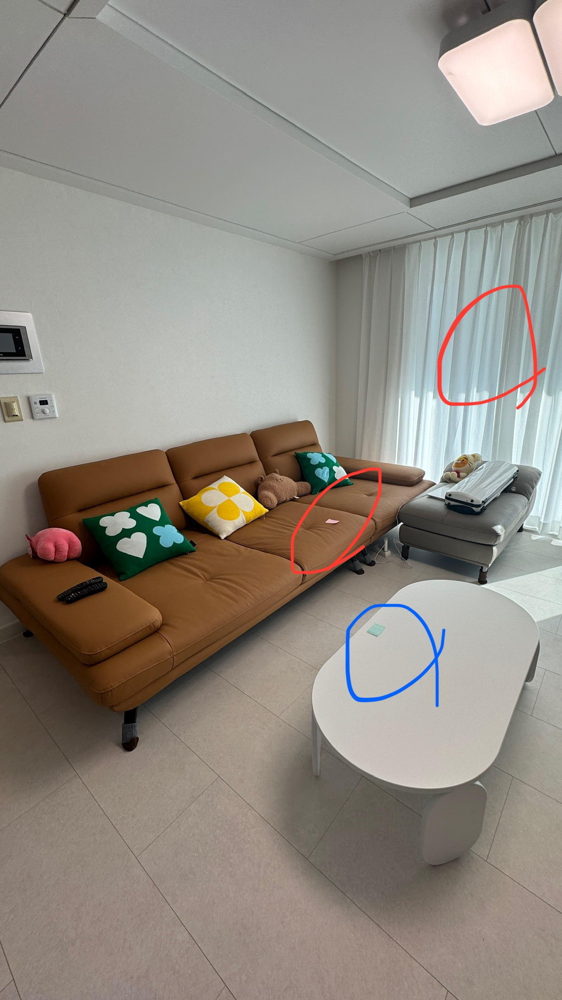
    
    [02_이사결혼_무난이 음성.mp4](02_%25E1%2584%258B%25E1%2585%25B5%25E1%2584%2589%25E1%2585%25A1%25E1%2584%2580%25E1%2585%25A7%25E1%2586%25AF%25E1%2584%2592%25E1%2585%25A9%25E1%2586%25AB_%25E1%2584%2586%25E1%2585%25AE%25E1%2584%2582%25E1%2585%25A1%25E1%2586%25AB%25E1%2584%258B%25E1%2585%25B5_%25E1%2584%258B%25E1%2585%25B3%25E1%2586%25B7%25E1%2584%2589%25E1%2585%25A5%25E1%2586%25BC.mp4)
    
    ### 1-3. 발견한 이사/결혼 고객의 특성
    
    **01 고객은 유용한 정보를 토대로 스스로 결정하기를 원함**
    
    <aside>
    💡
    
    - 우리의 주요 고객층은 취향이 확고하기 때문에 가구와 같은 카테고리에서 추천 받는것을 선호하지 않습니다. 다만, 고객은 실질적으로 도움이 되는 정보를 원하고, 이 정보를 토대로 나만의 기준을 세워 상품을 탐색하고 싶어합니다.
    </aside>
    
    🔊 P8 초록하늘휘 Voice
    
    > “추천템을 아예 안 보는 경우는 아니에요. 다 들어보기는 해요. 다 들어보고 다 읽어보고 진짜 **나한테 맞는지 안 맞는지는 제가 판단해서 구매를 하는 성향**인 것 같아요.”
    > 
    
    🔊 P11 하얀미역
    
    > “리바트에서도 돌아다니면서 거기서도 이제 비슷한 스타일의 디자인끼리 라인업이 있는데 그렇게 하지는 않았어요. 그냥 하나하나 물건 보고 이거 예쁘다 이거 예쁘다 했는데 아무래도 **추천해 주시는 물건들이 있기는 했었어요. 근데 그런 거에 은근히 좀 안 흔들리는 것 같아요**. 그냥 제가 봤을 때 제가 미술을 그래도 전공을 해서 그런지 몰라도 국민템이다 하지만 별론데 하면은 안 흔들리고 그냥 이건 아닌 것 같다라고 좀 얘기를 했던 것 같아요.”
    > 
    
    **02 꼭 필요한 상품 위주로 먼저 구매하고 취향에 맞는 상품과 작은 소품류는 오랜 기간 고민하며 지속적으로 구매한다**
    
    <aside>
    💡
    
    - 고객들은 하나의 품목에 대한 탐색을 마치고 다음 품목을 탐색하기 시작합니다.
    - 핵심 카테고리에 대한 탐색과 구매는 입주 2/3개월 이전 ~ 입주 이후 1개월동안 집중적으로 발생합니다.
    - 소형 제품들은 입주 이후 실생활에서 ‘필요’에 의해 지속적으로 충분히 시간을 들여 찾아봅니다.
    </aside>
    
    
    
    🔊 P8 초록하늘휘 Voice
    
    > “네 맞아요. 여기 아무것도 없었어요. 그냥 딱 그나마 있었던 게 욕실장 하나 있었고 다 그냥 빈 공간밖에 없어서 여기 들어오면은 일단 수납이 부족은 할 것 같은데 **이거는 안 살아보고는 잘 모르겠다 이런 생각에 바로 구매하지는 않았고 그냥 그 가구는 진짜 말 그대로 다 와서 했어요**. 가전만 딱 세 가지로 추려가지고 구매를 하려고 했었어요."
    > 
    
    🔊 P10 꽃맑음 Voice
    
    > “네 **입주하고 나서 구매했고 지금도 계속 사고 있어가지고**, 네 입주하고 나서 계속 구매했어요. 제가 잘 질리는 편이라 구매하고 당근에 올렸다가 또 다시 사고 이렇게 오늘도 계속 예쁜 게 계속 나와가지고 계속 사요. 당근은 팔고.”
    > 
    
    > “다음으로 이거 하나 사 놓고 네 그래서 **한동안 소파도 없이 살다가** 이거 사고 나서 이거랑 좀 맞는 소파를 찾아볼까 해가지고 또 검색해 보고 네 그렇게 해서 **하나하나씩 샀던 것 같아요**.”
    > 
    
    **03 결정에 대한 확신에 다른 사람(믿을만한 전문가, 고수)의 추천이 도움이 될 수 있음**
    
    <aside>
    💡
    
    - 내 집을 마련한 고객들은 대체적으로 ‘망해도 내가 선택하고 싶다’는 의지가 강합니다. 특히나, 가구처럼 취향이 결정에 중요한 변수가 되는 카테고리는 누군가의 추천이 영향력을 발휘하기 어렵습니다.
    - 다만, 고객들은 본인이 이미 마음에 들어하는 상품이 과연 내 집에 어울릴지에 대한 확신이 부족합니다.
    - 더불어 크고 비싼 상품들의 환불 리스크로 인해 더욱 고민이 길어집니다.
    - 나와 비슷한 거주 환경이나 취향을 가진 유저들의 조언을 통해 고민을 해결하고 싶어 합니다.
    </aside>
    
    🔊 P10 꽃맑음 Voice
    
    > “**약간 결정장애라고 해야 되나 너무 예쁜 게 많으니까** 그래도 추천해 주신 제품들이 어쨌든 담당자분들이 컨셉을 제가 원하는 취향 화이트 우드 뭐 이렇게 선택하면 그거 맞춰서 해주는 거라고 가정했을 때는 내가 못 고르는 거를 여기 추천해 줬을 때 괜찮은 것 같다 하면 그냥 그걸 사긴 할 것 같아. **저는 MD가 선별해 줬다고 하면 조금 더 명확하게 믿음이 갈 것 같고** 그냥 쿠팡에 뭐가 추천해 줬다면 약간 뭔가 광고성이 아닐까라는 생각은 좀 있을 것 같아요.”
    > 
    
    🔊 P11 하얀미역 Voice
    
    > “예를 들면은 저는 그런 것도 있었어요. 저희가 현관에 신발 신을 때 좀 앉을 수 있는 의자를 구입을 하고 싶은데 저희가 현관 이제 나가다가 보시면 이제 아시겠지만 약간 턱이 져 있는 부분이 있어요. 그래서 의자를 사면은 의자 다리 길이가 이렇게 좀 안 맞는 부분이 있어 가지고 네 제가 그러면은 다리 길이를 조절을 하던가 아니면은 밑에 그 턱 부분에 같은 높이로 이렇게 맞출 수 있는 뭔가 그런 그런 받침대 같은 게 있나 이런 것들을 고민을 했거든요. 그래서 그런 **인테리어 고민이 좀 있을 때 조금 조언을 해 줄 수 있는 어떤 기능이 있으면 좋겠다**라는 생각은 했었어요. 그래서 제 나름대로는 그냥 이것저것 스스로 찾아보다가 그러니까 좀 약간 난감한 인테리어나 구조가 있는데 그때 좀 조언을 해줄 수 있는 기능도 있으면은 좋겠다. **약간 상담 봇 같은 거**"
    > 
    
    🔊 P12 여우망망 Voice
    
    > "**조언이 좀 필요했던 것 같아요. 그냥 저희끼리 그냥 재밌게 채워보자라는 것도 사실 재밌었지만 그래도 좀 더 예쁘게 꾸몄으면 좋았겠다 라는 생각이 좀 아쉽기는 해요.** 다시 하면 잘할 텐데 약간 그런 생각을 좀 하는 것 같아요. **자취를 해봤으면 더 잘 알았을 것 같기는 해요**. 맞아요. 근데 자취를 안 해보니까 더 몰랐던 것 같고"
    > 
    
    [[2507] 오늘의집 고객의 인테리어 상품 탐색 성향은 어떠할까? for Glinda](https://www.notion.so/2507-for-Glinda-230a597878a080ccab28f46b1e75ef94?pvs=21) 
    
    <aside>
    📌
    
    ### 1. 오늘의집 고객의 인테리어 상품 탐색 성향은 <자기주도형 / 균형형 / 실용 수용형> 3가지로 분류됨
    
    - 자기 주도형(43%): 디자인, 디테일 중심의 탐색 선호, 추천·브랜드 정보에 덜 의존
    - 균형형(32%): 탐색과 추천 정보 모두 활용하는 중간 성향
    - 실용 수용형(25%): 빠른 구매, 추천/후기에 민감, 실용성 중심 결정
    
    *실제 해당 고객들의 로그 데이터 기반하여 자기 주도형 vs 실용 수용형 비교 시 그룹 간 유의하게 차이 존재
    
    
    
    ### 2. <나만의 패키지> 서비스 인지도는 낮으며, 그룹 간 인지 차이 없음
    
    - 전체 응답자의 **77.4%가 사용 경험 없음**, **48.9%는 서비스 자체를 모름**
        - 인지율(‘전혀 모름’ 제외)은 자기주도형이 상대적으로 높음 (52.3%)
        - 하지만 실제 구매 전환율은 전 그룹 모두 0.8~1.4% 수준으로 낮음
        - 실용 수용형은 인지 자체가 낮고, 경험/탐색도 소극적인 경향
    
    ### 3. <나만의 패키지> 구매자 만족도는 높은 편이나, 개선 요소는 여전히 존재
    
    *해석시 생존자 편향 주의 필요
    
    - 평균 만족도 4.21점, 그러나 할인 혜택 편차·조건의 복잡성·상품 구성 한계 등 개선 요구 다수
    - 개선 요구 사항:
    
    | 주요 이슈 | 세부 내용 요약 |
    | --- | --- |
    | **할인 혜택 아쉬움** | 할인율이 낮거나 구매 시기마다 차이가 커 만족도가 떨어짐. 더 강력한 할인 필요성 제기 |
    | **구성 조건의 제한** | 필수 카테고리 조건이 까다롭고, 조합이 복잡함. 한 종류만 여러 개 사는 방식도 허용되길 바람 |
    | **상품 범위 제한** | 대형 가구 위주 구성에 아쉬움. 소형 소품·생활용품도 포함되길 희망 |
    | **사용성 불편** | 장바구니와 패키지 간 연동 부족, 패키지 재구성이 어려움, 구매 이력 혼동 발생 |
    | **타깃 제약** | 이사/신혼 등 특정 상황 외에는 조건 맞추기 어려움. 특히 1~2인 가구는 진입장벽 높음 |
    
    ### **4. 패키지를 <알지만 사용하지 않은 이유>는 성향별로 상이**
    
    | 성향 | 주요 이탈 사유 |
    | --- | --- |
    | 자기주도형 | 구성 조건이 내 기준과 안 맞음, 선택의 자유 부족, 다양한 정보 탐색 후 구매 원함 |
    | 균형형 | 혜택 부족, 원하던 제품 미포함, 5개 조건 애매 |
    | 실용 수용형 | 실질적 필요 없음, 타이밍 맞지 않음, 지금 당장 필요하지 않음 |
    
    ### 5. 이사 이벤트 시점에 따라 성향 및 이용 경험 변화됨
    
    - 이사를 경험하면서 자기주도형 비중 증가, 실용 수용형은 감소
    - 이사 완료자 그룹에서 탐색 및 실제 구매 경험 모두 더 높음
    - 반면 이사 예정자 그룹은 실제 구매 0명, 전환 지점에 도달하지 못함
    
    ### 6. 설문 응답자 중 실구매는 대부분 ‘과거 이사’ 그룹에서 발생
    
    - ‘과거 이사+자기주도형’이 실제 구매 경험(13명 중 7명) 가장 높음
    - 실용 수용형은 전체적으로 반응 가능성 낮고, 진입 문턱 높음
    - → 다만 설문 내 분포이므로 추후 실 데이터로 검증 필요
    
    ### 7. 전략 방향 제안: 시점과 성향을 고려한 차별화된 유도 전략 필요
    
    - 이사 전후 모두에서 구매가 발생하므로, 시점에 따라 달라지는 고객 니즈와 상황을 고려한 전략이 필요함
    - 이사 이후에는 자기주도형 비중이 뚜렷하게 증가하며, 이들이 주요 구매층이 됨
    - 실용 수용형은 전체에서 구매 가능성은 낮지만, 반응 가능한 타이밍이 명확
    - 균형형은 유연한 편이나, 후기·추천 기반의 신뢰 형성이 선행되어야 구매로 이어짐
    - → 자기주도형과 균형형을 중심으로 두고 시점별 조합 전략이 유효할 것으로 판단
    </aside>
    

---

# 23
유저가 원하는 영감은 
이미 오늘의집에 있다.

집들이를 찾는 고객들이 원하는 정보는 “흔하지 않은 아이디어로부터 집 분위기를 바꿀 수 있는 유용한 상품 정보 및 배치정보” 를 얻는 것입니다.

그러나 이들은 집들이 콘텐츠 조회 및 탐색에서 비슷한 콘텐츠가 많고 트렌디한 콘텐츠가 없다며 ****이탈하고 있습니다.

이들이 좋아할만한 집들이 콘텐츠가 정말 오늘의집에 없는걸까요? 오늘의집에 있는 콘텐츠와 외부에서 찾는 콘텐츠는 크게 다르지 않습니다.

하지만 탐색이 불편하고 원하는 콘텐츠를 찾기 힘듭니다. 즉 원하는 집들이를 찾는 것도, 집들이에서 원하는 정보를 찾는 것도 어렵습니다. 


- *Details*
    - 최근 3개월 집들이 콘텐츠를 조회한 고객들의 설문에 따르면 집들이 조회 이유 중 **‘흔하지 않은 새로운 아이디어 수집’ 이 2위였습니다**. (48.4%) [[링크](https://docs.google.com/spreadsheets/d/1KShIjacdjolvC4ZBLTpvNb9kLg1FrADRmyJR27AVd9A/edit?gid=1915327050#gid=1915327050)] 1위는 “유용한 상품 정보 및 배치정보” 입니다.
        
        
        
    - 동시에, **집들이 콘텐츠 조회 및 탐색에서 가장 불편한 점 또한 “비슷한 콘텐츠가 많다” , 그리고 트렌디한 콘텐츠가 없다**였습니다.
        
        
        
    - 이들이 외부채널에서 찾아보고 있는 콘텐츠, 오늘의집에서 영감을 받고 있는 콘텐츠들은 다음과 같습니다.
        - 외부 콘텐츠
            
            
            
        - 스크랩한 내부 콘텐츠
            
            
            
    - 정성적으로 판단했을 때 오늘의집에 있는 콘텐츠와 외부에서 찾는 콘텐츠는 크게 다르지 않습니다.
    - **신규 포맷 발굴도 중요하지만 이미 있는 오늘의집 콘텐츠를 잘 제공하기만 해도 성과를 높일 수 있습니다.** 일례로, 최근 ‘집들이 of 집들이’ 콘텐츠는 초고성과를 보여주기도 했습니다. [[링크](https://ohou-se.slack.com/archives/C084YQX95GT/p1739268060039709)]
        
        
        
    - 단, 고객이 관심 있는 콘텐츠를 노력해야 찾을 수 있고, 직접 찾으려고 해도 어렵습니다. [[링크](https://www.notion.so/2024-2H-182a597878a080cbb7e5d3e53a43923b?pvs=21)]
        
        > **정보가 많음. 하지만 그에 비해 앱이 보여주려고 하는 것들이 너무 많으며,** **사용자가 앱을 이끄는 것이 아니라 앱이 사용자를 이끄려고 하는 느낌이 강함**
        > 
    - 이들이 이탈해서 다른 콘텐츠를 보는 이유는 ‘필요한 정보를 자세히 볼 수 있어서, 그리고 나와 맞는 정보를 얻을 수 있어서’ 입니다.
        
        
        

---

# 24
유튜브와 네이버에서 더 빠른 정보 획득: 
나에게 꼭 맞는 자세한 팁을 다양하게 소비

일반적으로 많은 유저들은 쇼츠/릴스 등의 짧은 영상으로 인테리어에 필요한 유용한 정보를 빠르게 확인하고 있으며, **나의 상황에 맞는 레퍼런스와 팁을 얻을 수** 있기 때문에 콘텐츠를 조회합니다. 

특히, 유저는 타 플랫폼의 짧은 영상에서 인테리어 **배치 및 상품 정보의 핵심만 빠르게 알려주는 콘텐츠로 오늘의집에서 겪는 어려움을 해소**하고 있습니다. 


- *Details*
    - **집들이를 탐색하면서 유저가 겪는 어려움**
        - 모든 유저는 **비슷한 분위기의 콘텐츠 노출 때문에** **취향을 발견하는 것을** 가장 어려워함 (40.8%)
        - 최근 집들이를 조회하며, **인테리어 지식과 관심 수준이 초보**일수록 **나에게 맞는 콘텐츠 발견에 어려움**을 느낌 (Level1: 22%, Level2: 18.3% ,전체 평균 15.8%)
            - Level1의 경우, 따라할 수 있을만한 정보 수집에 있어서도 어려움을 느낌 
            (24.2%, 전체 평균 16%)
        - Level3~Level4: **집들이를 조회하다 이탈한 유저**일수록, **콘텐츠 및 UX 전반에 불편함**을 느낌
            - 1) 흔하지 않고 감각적인 인테리어 상품 및 배치 정보가 부족 (Level3: 36.8%, Level4: 35%, 전체 평균 19.4%)
            - 2) 따라할 수 있을만한 정보 수집 및 이해의 어려움 (Level3: 24.2%, Level4: 23.8%, 전체 평균 16%)
            - 3) 취향에 맞는 콘텐츠 발견을 위한 필터/키워드 부재 (Level3: 24.2%, Level4: 30%, 전체 평균 19.3%)
            - 4) 오래된 집들이 콘텐츠로 인해 트렌드 발견 어려움 (Level3: 23.2%, Level4: 30%, 전체 평균 20.7%)
    
    
    
    - 최근 집들이 조회 유저와 이탈한 유저가 타 플랫폼을 이용하는 양상은 **목적에 따라 상이**함
        - 비슷한 분위기 스타일리의 콘텐츠가 많아 내 취향을 발견하기 어려워서 이탈한 경우
        ㄴ 최근 집들이를 활발하게 보는 유저: 현재 나의 상황에 따라할 만한 레퍼런스를 유튜브/블로그/카페에서 탐색(32.7%) → *검색* 
        ㄴ 집들이를 조회하다 이탈한 유저: 인테리어 스타일링과 함께 인플루언서가 알려주는 리빙팁을 얻기 위해 유튜브/인스타그램/블로그에서 탐색(35.3%) → 우연한 발견
        - 흔하지 않고 감각적인 인테리어 상품 및 배치 정보를 얻기 어려워서
        ㄴ 내 취향이면서 흔하지 않은 해외 인테리어 콘텐츠 레퍼런스 탐색 (33.5%) → 목적성 있는 탐색
        ㄴ 집들이를 조회하다 이탈한 유저: 인테리어 스타일링과 함께 인플루언서가 알려주는 리빙팁을 얻기 위해 유튜브/인스타그램/블로그에서 탐색(38.5%) → 우연한 발견
    
    
    
    [Phase.1 [Survey Result] 집들이를 보고싶은/이탈한 사람은 누구일까?](https://www.notion.so/Phase-1-Survey-Result-18fa597878a0804da4ffc48f1c6704e4?pvs=21) 
    

---

# 25
오늘의집은 고객에게 
편의점 vs 백화점

재빨리 필요한 것만 구매하고 나가는 고객도 있지만 오늘의집에서 콘텐츠도/상품도 많이 탐색하는 고객이 더 많은 돈을 씁니다. 고객들이 자신이 살 상품을 발견하는데 212분이 걸립니다 

이들은 취향이 까다로워 본인이 원하는 것을 찾을때까지 탐색하는 고객입니다. 이들은 자신이 원하는 것을 ‘충분히’ 찾을 때까지 탐색하고 스스로 결정하기를 원합니다. 

원하는 것을 재빨리 둘러보고 나가는 것이 아니라 백화점 구경하듯이 둘러보면서 마음에 쏙 드는 걸 찾는 것이죠. 

](image%2033.png)

[**탐색 시간 내 구매자 그룹 평균 구매 상품 수 & 거래액 (Carl)**](https://www.notion.so/181a597878a080d4ae8bdd99fcd67066?pvs=21)

> *추천템을 아예 안 보는 경우는 아니에요. 다 들어보기는 해요. 다 들어보고 다 읽어보고 진짜 **나한테 맞는지 안 맞는지는 제가 판단해서 구매를 하는 성향**인 것 같아요.”*
> 

- *Details*
    
    *by Ikpyo, Carl*
    
    [**탐색 시간 내 구매자 그룹 평균 구매 상품 수 & 거래액 ([쿼리](https://redash-data.datahou.se/queries/4517/source#9475))**](https://www.notion.so/198a597878a080e9b4cfe03ef48df264?pvs=21) 
    
    [](https://www.notion.so/185a597878a0802995ebd3bfda6517d1?pvs=21) 
    
    - 취향이 까다로운 고객은 충분히 탐색하고 본인이 원하는 상품을 스스로 선택하고 싶어한다.
    
    ---
    
    **01 고객은 유용한 정보를 토대로 스스로 결정하기를 원함**
    
    <aside>
    💡
    
    - 우리의 주요 고객층은 취향이 확고하기 때문에 가구와 같은 카테고리에서 추천 받는것을 선호하지 않습니다. 다만, 고객은 실질적으로 도움이 되는 정보를 원하고, 이 정보를 토대로 나만의 기준을 세워 상품을 탐색하고 싶어합니다.
    </aside>
    
    🔊 P8 초록하늘휘 Voice
    
    > “추천템을 아예 안 보는 경우는 아니에요. 다 들어보기는 해요. 다 들어보고 다 읽어보고 진짜 **나한테 맞는지 안 맞는지는 제가 판단해서 구매를 하는 성향**인 것 같아요.”
    > 
    
    🔊 P11 하얀미역
    
    > “리바트에서도 돌아다니면서 거기서도 이제 비슷한 스타일의 디자인끼리 라인업이 있는데 그렇게 하지는 않았어요. 그냥 하나하나 물건 보고 이거 예쁘다 이거 예쁘다 했는데 아무래도 **추천해 주시는 물건들이 있기는 했었어요. 근데 그런 거에 은근히 좀 안 흔들리는 것 같아요**. 그냥 제가 봤을 때 제가 미술을 그래도 전공을 해서 그런지 몰라도 국민템이다 하지만 별론데 하면은 안 흔들리고 그냥 이건 아닌 것 같다라고 좀 얘기를 했던 것 같아요.”
    > 
    
    **02 꼭 필요한 상품 위주로 먼저 구매하고 취향에 맞는 상품과 작은 소품류는 오랜 기간 고민하며 지속적으로 구매한다**
    
    <aside>
    💡
    
    - 고객들은 하나의 품목에 대한 탐색을 마치고 다음 품목을 탐색하기 시작합니다.
    - 핵심 카테고리에 대한 탐색과 구매는 입주 2/3개월 이전 ~ 입주 이후 1개월동안 집중적으로 발생합니다.
    - 소형 제품들은 입주 이후 실생활에서 ‘필요’에 의해 지속적으로 충분히 시간을 들여 찾아봅니다.
    </aside>
    
    
    
    🔊 P8 초록하늘휘 Voice
    
    > “네 맞아요. 여기 아무것도 없었어요. 그냥 딱 그나마 있었던 게 욕실장 하나 있었고 다 그냥 빈 공간밖에 없어서 여기 들어오면은 일단 수납이 부족은 할 것 같은데 **이거는 안 살아보고는 잘 모르겠다 이런 생각에 바로 구매하지는 않았고 그냥 그 가구는 진짜 말 그대로 다 와서 했어요**. 가전만 딱 세 가지로 추려가지고 구매를 하려고 했었어요."
    > 
    
    🔊 P10 꽃맑음 Voice
    
    > “네 **입주하고 나서 구매했고 지금도 계속 사고 있어가지고**, 네 입주하고 나서 계속 구매했어요. 제가 잘 질리는 편이라 구매하고 당근에 올렸다가 또 다시 사고 이렇게 오늘도 계속 예쁜 게 계속 나와가지고 계속 사요. 당근은 팔고.”
    > 
    
    > “다음으로 이거 하나 사 놓고 네 그래서 **한동안 소파도 없이 살다가** 이거 사고 나서 이거랑 좀 맞는 소파를 찾아볼까 해가지고 또 검색해 보고 네 그렇게 해서 **하나하나씩 샀던 것 같아요**.”
    > 

---

# 26
좁혀가는 탐색 보다
비슷한 상품 위주로 초점을 옮겨가는 탐색

고객은 필터를 사용하기 어려워합니다. 자신이 원하는 것을 정확히 설명하기 어렵고, 있다해도 필터가 없거나, 검색 결과가 너무 좁아지는 걸 우려하기 때문입니다.

**대신에 마음에 드는 상품을 하나 찾고, 그것과 비슷한 상품을 더 찾아보려고 많은 시간을 씁니다.** 혹시나 더 마음에 드는 상품을 발견할 수도 있기 때문이죠. 

이 과정에서 고객은 **구매 하려는 상품군 내에서 새로운 발견을 원합니다**. 마음에 드는 상품과 유사하면서 조건이 더 좋은(가격, 디자인 등) 상품을 찾고 싶어합니다.  


- *Details*
    
    by Ikpyo
    
    [[이사/결혼 고객의 탐색 문제는 무엇일까?] 진행노트 및 결과 디브리프](https://www.notion.so/181a597878a081c38ee2e0b2633516ca?pvs=21) 
    
    ### **"이 상품이 좋긴 한데, 비슷한 다른 상품도 보고 싶어"**
    
    - PDP에서 유사한 상품을 충분히 제공하지 않음
    - 비슷한 디자인/스타일을 연속해서 탐색하는 흐름이 부족
    - 네이버 등 타 플랫폼보다 유사 상품 추천 기능이 약함
    - 검색 후 유사한 상품을 찾기 위해 다시 검색해야 하는 경우가 많음
    
    < 타사 레퍼런스 https://www.figma.com/design/vfkkhetvnOu1zu305CN1Rn/%EC%9D%B4%EB%AF%B8%EC%A7%80-%EA%B2%80%EC%83%89?node-id=9-9&p=f&t=i9I9Y0Jab9DA4Y5H-0 >
    
    ---
    
    ## 문제 - 유사한 상품을 충분히 탐색했다고 느끼기 전에 탐색이 단절됨
    
    > 약간 색깔. 내가 원하는 우드는 조금 어두운 원목 호두나무 색깔이 있는데 **색상 필터를 걸 수 있는 게 없으니 직접 다 일일이 봐야겠다**. 
    비리프 제품도 예전부터 눈여겨봤던 제품
    역시 나무의 결이 너무 예쁘고 좋은데 가격이 가격이 가격이 너무 세고 리뷰는 왜 이렇게 나쁘지? 3.8밖에 안 되네.
    그렇게 견고하지 않은 것 같아
    그리고 내가 찾던 그 빈티지 조명과는 조금 멀고 너무 깔끔한 느낌이라 패스
    실링 팬 예쁜데 요즘 실링펜 많이 쓰는데 이것도 설치가 아직 어려우니 패스 
    그치만 예쁘니까 저장
    **찾기가 어렵 어렵다.**
    빈티지 내가 가지고 있는 빈티지 조명을 눌러보면 함께 보면 좋은 상품으로 추천이 뜨지 않을까?
    내가 어디로 들어가지 여기 프로필 그다음에 조명.
    이 제품은 해외 제품이라서 오늘의 집에는 역시 없구나.
    이거 다 내가 올린 사진이네. 다른 조명 다른 조명
    > 
    
    Pilot ([영상 링크](https://drive.google.com/file/d/1J055_ja_K2mAhKPtSpvX03rKy0PwODDc/view?usp=sharing)) - 16분 ~ 18분
    
    [[2505] 고객은 상품 탐색 시 PDP에서 어떤 추천 모듈을 유용하다고 생각할까?](https://www.notion.so/2505-PDP-1eda597878a0808e9a55e27377b1981c?pvs=21) 
    
    조명 카테고리 기준으로 테스트 시 비슷한 상품을 찾는 것이 가장 유용하다고 평가
    
    | 항목 | 결과 |
    | --- | --- |
    | 비슷한 디자인의 조명 | **평균**: 4.45
    **Top2 합계**: 90.04%
    **Bottom2 합계**: 2.15% |
    | 한정 기간 특가 조명 | **평균**: 4.32
    **Top2 합계**: 87.11%
    **Bottom2 합계**: 4.88% |
    | 인기 조명 | **평균**: 4.14
    **Top2 합계**: 81.44%
    **Bottom2 합계**: 5.27% |
    | 리뷰 4점 이상 조명 | **평균**: 4.11
    **Top2 합계**: 78.52%
    **Bottom2 합계**: 7.04% |
    | 다른 고객이 함께 구매한 조명 | **평균**: 3.95
    **Top2 합계**: 72.85%
    **Bottom2 합계**: 9.57% |
    | 다른 고객이 함께 본 조명 | **평균**: 3.98
    **Top2 합계**: 75.59%
    **Bottom2 합계**: 8.59% |
    | 같은 브랜드의 다른 조명 | **평균**: 3.91
    **Top2 합계**: 71.68%
    **Bottom2 합계**: 10.16% |
    | 최근에 둘러본 조명 | **평균**: 3.77
    **Top2 합계**: 65.82%
    **Bottom2 합계**: 14.26% |

---

# **27
제품 정보를 찾기 어려워 
네이버/유튜브로**

너무 많은 시간을 써야 하거나 탐색 과정에서 필터나 상품 상세 정보를 찾기 어렵다면 고객은 더 이상 우리 플랫폼을 탐색하고 싶어하지 않습니다.(한 세션에 고객은 약 30분 정도를 소비)

특히 PDP에서는 구매하려는 상품의 중요 정보(사이즈, 무게 등)를 한참 찾아 헤매다가 타 플랫폼으로 이탈하고 다시 돌아오지 않습니다. 또한 내가 찾는 상품군과 다른  추천 상품들은 집중을 흩뜨려놓습니다.


- *Details*
    
    by ikpyo
    
    - 스타일링샷이 아니더라도 PDP에서 추가탐색하고 싶은 정보를 알기 어려워 타플랫폼으로 이탈
        - 상품 구매를 고민할 때 콘텐츠를 찾고 있지만 ‘스타일링’ 외에 구매에 도움되는 상품 추천 정보, 장단점, 큐레이션 콘텐츠는 [발견하고 있지 못합니다. [Ivy]](https://www.notion.so/2-6ae578e14e2640f79a84f3af637cb065?pvs=21)
            
            > (그외 정보는 찾기 어려움) 밥솥 같은 거는 그리고 계량 이런 게 어려운데 그래서 그런 건 저는 만약에 제가 이걸 샀다면 또 네이버에 찾아보고 있을 것 같거든요.이 제품 이름으로 쳐가지고 얼마나 넣어야 되는지랑 주의사항 같은 거
            > 
        - 여전히 가전/가구 구매에 도움되는 콘텐츠를 쉽게 찾을 수 있다고 생각하는 [고객이 절반 미만입니다.](https://www.notion.so/12ea597878a08012b665cd1ab09fcc05?pvs=21)
        
        
        
    
    [[이사/결혼 고객의 탐색 문제는 무엇일까?] 진행노트 및 결과 디브리프](https://www.notion.so/181a597878a081c38ee2e0b2633516ca?pvs=21) 
    
    ## 문제 - 상품 정보를 빠르게 찾기 어려워 탐색 피로도가 쌓임
    
    > “무게가 안 나오네.”
    > 
    
    P1 ([영상 링크](https://drive.google.com/file/d/1lIQbZrYni27xEAPt1KLmVhAwQqAkxFNI/view?usp=sharing)) 24분 20초 ~ 27분 58초
    
    > "색상이랑 기능은 사실 다 비슷하다고 생각하거든요.
    그래서 얼마나 튼튼한 남편이 무게를 견뎌야 되기 때문에 네 그래서 무게가 제일 중요해요."
    예. 그래서 튼튼해야 돼요. 그래서 무게가 제일 중요했고 일단 후기가 많았기 때문에
    > 
    > 
    > "무게의 정보를 찾기 위해서 계속 스크롤을 내렸죠.
    > 이런 이런 데서조차도 이 무게에 대한 정보가 없어 가지고"
    > 무게를 못 찾았네요. 이거는 아까 100킬로라고 본 것 같은데
    > 
    
    P1 ([영상 링크](https://drive.google.com/file/d/1lIQbZrYni27xEAPt1KLmVhAwQqAkxFNI/view?usp=sharing))  58분 26초 ~ 1시 4분 25초
    
    > “(이케아 홈페이지에서 이불커버를 찾으며) 이쯤 되면 퀸 사이즈를 몰라서 좀 어렵네요.
    > 
    > 
    > 얘네는 그냥 150에 200 이렇게 써놓으니까 뭐가 싱글이고 뭐가 퀸인지 잘 모르겠어요.
    > 
    > 헐 이거 귀엽다. 이케아 패밀리 이거 슬론 페스트말 어 이거 이거 엄청 저 이거 사고 싶어요.
    > 
    > 이거 이거 나 진짜 이거 옛날부터 엄청 사고 싶었는데 근데 얘는 그게 없더라고요.
    > 
    > 그 사이즈가 큰 게 있네 뭐지? 150에 200 여기 있네.
    > 
    > 240에 220 이제 이쯤 되면 퀸 사이즈가 뭔지 몰라서 새로운 페이지로 퀸 사이즈를 검색하러 갑니다.
    > 
    > 퀸 사이즈 침대 크기 150에 200 이건가 아니잖아요.
    > 
    > 어디 찍힌 사이즈 1500엔 저게 뭐지 어디 있지?”
    > 
    
    P2 ([영상 링크](https://drive.google.com/file/d/1BUAtG5UCQsS2ifc_T7l_DIE_xGeHgfPL/view?usp=sharing)) 39분 50초 ~ 41분 50초
    

---

# 28
기획전, 나를 위한 
할인 기회가 아닌가?

기획전은 평소에 꿈꾸던 로망을 저렴하게 실현시킬 기회입니다. 그러나 오늘의집 기획전은 사고 싶은 상품이 잔뜩 모여있고 편하게 탐색할 수 있는 곳과는 거리가 있습니다.

특히 빅프로모션 기간에 고객은 평소 사고 싶었던 물건을 저렴하게 구매하고 싶어 하지만 차별성이나 독특한 상품 발견의 기대감은 낮고, 탐색이나 발견의 어려움을 느끼기도 합니다.

집요한 세일에서 고객은 <더 다양한 혜택 제공(랜덤쿠폰, 추가 이벤트 등)>이 되길 바라며, 개인화된 추천과 상품 탐색 흐름 개선, 콘텐츠 내 할인 연동 등 정보 접근성과 맥락 기반 쇼핑 경험을 기대하고 있습니다.

[제가 느끼기에는 29cm 홈 딱 들어갔을 때 눈길을 끄는 것 같아요. 29에서만 하는 디자이너 브랜드가 있어요. 그거를 보고 이거 진짜 예쁘다 사오고 싶다 하는게 생기는 것 같은 거예요. 엄청 깔끔하잖아요. 뭐라 해야 되지? 딱 들어가 보면 좀 사고 싶게 돼 있다고 해야 되나 카테고리가 좀 나눠져 있는 것도 한눈에 좀 작작 이렇게 보이게. **근데 오늘의 집은 좀 중구난방하는 느낌이 있어요.**](29%E1%84%8B%E1%85%AA%E1%84%8B%E1%85%A9%E1%84%89%E1%85%A6%E1%84%91%E1%85%A6%E1%84%87%E1%85%B5%E1%84%80%E1%85%AD.mp4)

제가 느끼기에는 29cm 홈 딱 들어갔을 때 눈길을 끄는 것 같아요. 29에서만 하는 디자이너 브랜드가 있어요. 그거를 보고 이거 진짜 예쁘다 사오고 싶다 하는게 생기는 것 같은 거예요. 엄청 깔끔하잖아요. 뭐라 해야 되지? 딱 들어가 보면 좀 사고 싶게 돼 있다고 해야 되나 카테고리가 좀 나눠져 있는 것도 한눈에 좀 작작 이렇게 보이게. **근데 오늘의 집은 좀 중구난방하는 느낌이 있어요.**

- *Details*
    
    [[2506] 집요한세일 이용 고객의 인식은 어떠할까? (6월)](https://www.notion.so/2506-6-224a597878a08016ac02e3e6964f19b7?pvs=21) 
    
    - Summary
        
        
        <aside>
        
        <aside>
        
        
        **고객은 빅프로모션 기간에 평소 사고 싶었던 물건을 저렴하게 구매하고 싶을 것이다 → YES**
        
        **[오늘의집 할인 행사에 대한 경험]** *총 1795명 응답
        
        - “원래 사고 싶었던 물건을 보다 저렴한 조건에 사고 싶어 하는 유저(58%)”가 대다수
        - 할인 사실을 알게 되는 주요 경로는 "외부 포털 검색(29%)"이며 앱 내부적으로는 "내가 관심 가진 상품의 가격 변동"을 스스로 혹은 알림을 통해 많이 확인하고 있음
        
        → 오늘의집 할인 행사에 기대하는 건 "의도하지 않은 상품 발견과 구매"보다는, 기존 관심을 가진 고객의 구매 전환을 도와주는 역할
        
        → 다만 스크랩북의 할인중 영역을 통한 인지를 늘려 볼 여지가 존재
        
        
        
        Q. 오늘의집 할인 행사 경험에 가장 가까운 것을 골라주세요.
        
        - 오늘의집 할인 행사는 이미 구매 의향이 있는 고객의 결제를 유도하는 데 효과적
        - 큐레이션 강화와 구매를 망설이게 만든 요소 해결을 통해 미구매 고객도 전환시킬 여지 있음
        - 응답 상세
            - 구매 의향 있던 사람에게 강력한 유인
                - 응답자의 58%가 "평소 사고 싶던 물건을 할인 덕분에 샀다"고 응답.
                    
                    → 행사는 ‘구매 결심을 밀어주는 계기’ 역할이 큼.
                    
            - 관심은 있지만 미구매한 잠재 고객도 다수
                - 18%는 사고 싶은 물건이 있어 행사만 둘러봤지만 미구매.
                    
                    → 조건·타이밍·UX 등 개선 시 전환 가능성 높음.
                    
            - 계획 없던 구매도 일부 유도
                - 16%는 특별히 필요 없던 물건을 행사로 인해 구매.
                    
                    → 큐레이션·노출 전략 중요.
                    
            - 무관심 고객은 소수
                - 할인 알았지만 이용 안 한 고객은 5% 수준.
                    
                    → 대부분의 고객이 할인 행사에 관심은 있음.
                    
            
            | 설명 | 응답률 | 응답 수 |
            | --- | --- | --- |
            | 평소 사고 싶은 물건이 있었고, 할인 행사를 통해 구매함 | 57.83% | 1,038 |
            | 구매를 하지 않았으나, 사고 싶은 물건이 있는지 둘러봄 | 18.27% | 328 |
            | 사고 싶은 물건은 크게 없었으나, 할인 행사를 둘러보다 구매함 | 16.32% | 293 |
            | 할인 행사가 있다는 것을 알고는 있으나 거의 이용하지 않음 | 4.96% | 89 |
            | 기타 (구체적으로 명시) | 2.62% | 47 |
            | **총 응답 수** | 100% | **1,795** |
        
        
        
        Q. 오늘의집에서 평소 사고 싶은 물건이 행사 기간 중 할인하는지 어떻게 알게 되시나요?
        
        - 할인 상품 인지는 주로 외부 검색, 상품페이지 모니터링, 스크랩/장바구니 알림 등을 통해 이뤄짐
        - 내부 기능인 ‘할인중’ 탭의 활용도는 낮아, 주요 채널로서의 영향력은 제한적
        - 응답 상세
            
            
            | 설명 | 응답률 (중복 선택 포함) | 응답 수 |
            | --- | --- | --- |
            | 네이버 등 검색 포털에서 상품 검색 시 가장 저렴한 상품이 오늘의집에서 판매하는 것을 보고 알게 됨 | 29.03% | 521 |
            | 관심있는 상품의 상품페이지를 지속적으로 확인함 | 28.47% | 511 |
            | 스크랩해두거나 장바구니에 담아둔 상품의 가격이 할인하는 것을 앱푸시 등 알림으로 받아보고 알게 됨 | 27.86% | 500 |
            | 장바구니에 담아둔 상품의 가격이 저렴해진 것을 보고 인지함 | 24.74% | 444 |
            | 스크랩북의 '할인중' 탭을 통해 할인 상품을 확인함 | 15.71% | 282 |
            | 기타 (구체적으로 명시) | 4.46% | 80 |
            | **총 응답자 수** |  | **1,795명** |
        </aside>
        
        <aside>
        
        
        **고객은 집요한세일 보다 아직 오세페를 더 잘 인지하고 있을 것이다 → YES**
        
        **[집요한세일과 오세페 인지 비교]**
        
        
        
        <집요한세일>을 알고 있나요?
        
        
        
        <오세페(오늘의집 세일 페스타)>를 알고 있나요?
        
        - 응답자의 65.7%가 집요한 세일을 알고 있지만 오세페 인지(78.8%)보다 떨어짐
        - [지난 빅프로모션 인지 조사](https://www.notion.so/25-02-1-1b4a597878a0800082aec4d6108e0a31?pvs=21)에서 확인한 25년 2월 오세페 인지 84.7%, 24년 11월 블프 인지 87.0%에 비해 인지가 잘 되지 않음
        - (모두 알고있는 경우) 집요한세일과 오세페 비교 시 33.2%가 할인율이나 가격 혜택이 더 커진 것 같다고 가장 많이 응답 했으며, 별다른 차이를 느끼지 못했다는 응답 또한 21.6%로 4번째로 많음
            
            
            | 설명 | 응답률 (중복 선택 포함) | 응답 수 |
            | --- | --- | --- |
            | 할인율이나 가격 혜택이 더 커진 느낌이 들었다 | 33.15% | 309 |
            | 상품 구성이 더 새롭거나 다양해진 것 같았다 | 25.43% | 237 |
            | 콘텐츠나 프로모션 방식이 더 기획된 느낌이었다 | 22.10% | 206 |
            | 기존과 비교했을 때 별다른 차이를 느끼지 못했다 | 21.57% | 201 |
            | 행사 분위기(디자인, 메시지 등)가 더 감각적이었다 | 18.88% | 176 |
            | 감도 높은 브랜드/상품 중심으로 구성되어 흥미로웠다 | 16.09% | 150 |
            | 기타 (구체적으로 명시) | 3.00% | 28 |
            | **총 응답자 수** |  | **932명** |
        - 기타 응답 중 참고 내용
            
            > “ 오세페는 다양한 상품(식품 등)들이 세일하는 느낌이었는데 집요한 세일은 가전가구에 한정해 세일하는 듯한 느낌을 받았어요. 가전가구의 경우는 평소 가격을 인지하지않고 있고 필요할때 구매하기때문에 세일폭을 알기 어려웠어요”
            > 
            
            > “오세페라는 워딩보다 집요한 세일이 뭔가 이유없이 더 끌리는 느낌이 들었다. 할인율이 더 높을 것 같은 느낌이 들었음.”
            > 
        </aside>
        
        <aside>
        
        
        **집요한세일을 아는 고객은 내가 구매하고 싶은 상품을 잘 찾을 수 있고 저렴하게 구매할 수 있다고 생각 할 것이다 → 일부 NO**
        
        **[집요한 세일 인식]** *집요한세일을 알고 있다고 응답한 1180명
        
        
        
        다른 곳에 비해 저렴한 상품이 많다(34.2%), 주목할만한 큰 할인 행사라고 생각한다(26.1%)라고 응답을 가장 많이 한 반면, 다른 행사와 비교 해 특별함을 느끼기 어렵다는 응답이 22.3%로 3번째로 많았음
        
        - 응답 상세
            
            **Q. <집요한세일>을 어떻게 느끼셨나요? (중복 모두 선택)**
            
            | 설명 | 응답률 (중복 선택 포함) | 응답 수 |
            | --- | --- | --- |
            | <집요한세일>은 다른 곳과 비교해도 확실히 저렴한 상품이 많다 | 34.24% | 404 |
            | <집요한세일>은 주목할만한 큰 할인 행사라고 생각한다 | 26.10% | 308 |
            | <집요한세일>은 다른 곳의 행사와 비교해서 특별함을 느끼기가 어렵다 | 22.29% | 263 |
            | <집요한세일>은 다른 곳에서 발견하기 어려운 독특한 상품을 발견할 수 있는 기회다 | 20.68% | 244 |
            | <집요한세일>은 다른 곳과는 차별화된 할인 행사라고 느껴진다 | 19.92% | 235 |
            | <집요한세일>은 사고 싶은 매력적인 상품을 발견하기 어렵다고 느껴진다 | 11.36% | 134 |
            | 기타 (구체적으로 명시) | 3.98% | 47 |
            | **총 응답자 수** |  | **1,180명** |
        - ‘집요한세일’은 **가격 경쟁력이 높고** 타 플랫폼 대비 **저렴한 상품을 발견할 기회**로 인식
        - 반면, **차별성이나 독특한 상품 발견의 기대감은 낮고**, **탐색이나 발견의 어려움**을 느낀다는 의견도 일부 존재
        
        **[집요한세일 탐색 경험]** *집요한세일을 알고 있다고 응답한 1180명
        
        
        
        부정 경험
        
        
        
        긍정 경험
        
        - 응답 상세
            - <집요한세일>에서 상품을 찾아보면서 불편점이 있었나요? (복수 응답 가능)
            - <집요한세일>에서 상품을 찾아보면서 만족했던 점이 있었나요? (복수 응답 가능)
            
            | 항목 | 불편 응답률 | 만족 응답률 | 차이 | 해석 |
            | --- | --- | --- | --- | --- |
            | **상품명, 할인율 등 주요 정보 노출** (2) | 22.46% | 29.07% | **+6.61%** | 시각적 정보 전달은 전반적으로 **긍정적으로 인식**됨 |
            | **상품 구성 다양성** (3) | 32.20% | 28.05% | **-4.15%** | 기대 대비 **다양성 부족에 대한 아쉬움**이 더 큼 |
            | **쿠폰 사용 편의성** (7) | 25.68% | 22.29% | **-3.39%** | 불편 응답이 더 많음 → 적용 프로세스 개선 여지 |
            | **원하는 상품/카테고리 찾기 쉬움** (1) | 16.86% | 21.78% | **+4.92%** | 네비게이션 구조는 상대적으로 **만족스러움** |
            | **페이지 디자인/피로감** (6) | 12.54% | 19.66% | **+7.12%** | UI/UX 측면에서 **높은 만족도**, 피로감 낮음 |
            | **추천 상품/브랜드 적절성** (5) | 34.15% | 17.03% | **-17.12%** | 가장 큰 불만 → 개인화/추천 정확도 **강화 필요** |
            | **감도 높은 상품 큐레이션** (4) | 15.34% | 13.14% | **-2.20%** | 전반적으로 낮은 만족도 → 개선 여지 있음 |
            
            ### 1. **UI 구성 및 탐색 편의성은 긍정 평가**
            
            - *‘페이지가 깔끔해서 편하다’ (19.66%)**는 항목이 “피로감을 느꼈다” (12.54%)보다 훨씬 높게 나타났습니다.
            - 네비게이션도 "찾기 어렵다" 16.86% vs. "찾기 쉬웠다" 21.78%로 **상대적 강점** 확인됨.
            
            ### 2. **추천 및 큐레이션 품질은 주요 불만**
            
            - **“추천 상품/브랜드 부족”** 34.15%로 불편 항목 중 가장 높음.
            - 이에 대응하는 **“추천이 잘 보였다”**는 17.03%에 그침 → **17.12% 차이**로 **개인화 전략 재설계 필요**.
            - 감도 높은 상품에 대한 만족도/불편 모두 낮은 편 → **차별화된 제품 발견 가치 약함**
            
            ### 3. **정보 제공 관련 항목은 긍정적 흐름**
            
            - “한눈에 들어왔다”는 만족이 **29.07%**로, “보이지 않았다”는 불만(22.46%)보다 높음.
            - 이는 **정보 구조(UI)**가 기본적으로 수용 가능하다는 신호.
            
            ### 4. **쿠폰/적용 경험은 불편 소폭 우세**
            
            - “번거로웠다” 25.68% vs. “쉬웠다” 22.29% → **소소한 마찰 있음**, 개선 여지 존재
        - ✅ [긍정] 전반적으로 탐색 편의성과 정보 구성에 긍정적인 반응
            - UI 구조나 상품 탐색 흐름 등 기본 탐색 경험은 긍정적으로 인식
        - ❌ [부정] 추천 상품의 부족함과 개인화 정확도에 가장 큰 불만이 존재
            - 특히 “나에게 맞는 추천이 부족했다”는 응답이 가장 높게 나타났으며, 이는 추천 시스템, 브랜드 다양성 개선의 필요성을 나타냄
        </aside>
        
        <aside>
        
        
        **집요한세일 명칭과 비주얼은 고객에게 긍정적인 영향을 줄 것이다 → YES**
        
        **[집요한세일 명칭에 대한 인상]** *집요한세일을 알고 있다고 응답한 1180명
        
        
        
        - 응답 상세
            
            Q. <집요한세일>이라는 이름에서 느껴지는 분위기나 인상을 가장 잘 설명하는 단어 3개를 선택해주세요.
            
            | 감정군 | 키워드 | 응답률 | 응답 수 |
            | --- | --- | --- | --- |
            | 🟢 긍정 | 할인 폭이 클 것 같은 | 65.68% | 775 |
            | ⚖️ 중립 | 잘 기획된 | 44.58% | 526 |
            | ⚖️ 중립 | 기준 있게 선별한 | 34.83% | 411 |
            | 🟢 긍정 | 트렌디한 | 30.42% | 359 |
            | ⚖️ 중립 | 개성 있는 | 29.83% | 352 |
            | ⚖️ 중립 | 강렬한 | 27.88% | 329 |
            | 🟢 긍정 | 감각적인 | 21.19% | 250 |
            | 🟢 긍정 | 신뢰할 수 있는 | 19.83% | 234 |
            | 🔴 부정 | 뻔한 | 8.14% | 96 |
            | 🔴 부정 | 이해하기 어려운 | 6.36% | 75 |
            | 🔴 부정 | 피로감이 느껴지는 | 6.27% | 74 |
            | 🔴 부정 | 혼란스러운 | 5.00% | 59 |
            - 긍정 인상이 가장 많음: 특히 "할인 폭이 클 것 같은"이라는 키워드가 65.68%로 압도적으로 높으며, "기획력", "신뢰", "감각" 등 긍정적 이미지가 전체 응답의 과반을 차지함.
            - 중립/강한 인상도 균형감 있게 분포: 응답자의 약 1/3은 <집요한세일>이라는 이름에 대해 ‘기획됨’, ‘강렬함’, ‘개성’ 등의 인상을 받음. 이는 명확한 긍정까지는 아니더라도 브랜드 인식에 힘을 실어주는 포지션으로 해석 가능.
            - 부정 인상은 소수: '피로', '혼란', '이해 어려움' 등의 키워드 선택 비율은 모두 10% 미만으로 낮음. 명칭 자체가 사용자에게 거부감을 주는 요소는 크지 않다는 것을 시사.
        - 전체적으로 <집요한세일>이라는 명칭은 할인 혜택 중심의 긍정적인 인상을 강하게 전달하며, 일부는 ‘기획력’이나 ‘개성’ 있는 행사로 인식하고 있음
        - 반면 부정적인 인상은 상대적으로 낮아, 명칭 자체가 행사에 대한 신뢰나 기대를 해치지 않는 것으로 해석
        
        **[키 비주얼에 대한 인상]** *집요한세일을 알고 있다고 응답한 1180명
        
        
        
        - 응답 상세
            
            Q. 위 이미지에서 받은 전체적인 분위기나 인상을 가장 잘 설명하는 단어 3개를 선택해주세요.
            
            | 감정군 | 키워드 | 응답 수 | 응답률 |
            | --- | --- | --- | --- |
            | 🟢 긍정 | 감각적인 | 573 | 48.56% |
            | 🟢 긍정 | 깔끔한 | 563 | 47.71% |
            | 🟢 긍정 | 트렌디한 | 553 | 46.86% |
            | 🟢 긍정 | 역동적인 | 152 | 12.88% |
            | ⚖️ 중립 | 개성 있는 | 508 | 43.05% |
            | ⚖️ 중립 | 강렬한 | 290 | 24.58% |
            | ⚖️ 중립 | 정제된 | 222 | 18.81% |
            | ⚖️ 중립 | 공을 들인 듯한 | 190 | 16.10% |
            | 🔴 부정 | 이해하기 어려운 | 205 | 17.37% |
            | 🔴 부정 | 심심한 | 161 | 13.64% |
            | 🔴 부정 | 피로감이 느껴지는 | 43 | 3.64% |
            | 🔴 부정 | 혼란스러운 | 80 | 6.78% |
        - 키 비주얼은 91.2%가 봤다고 응답
        - 이미지에 대해 응답자의 절반 가까이가 ‘감각적’, ‘깔끔함’, ‘트렌디함’ 등 **긍정적인 인상**을 느꼈으며, 전반적으로 **세련되고 기획된 느낌**을 잘 전달한 것으로 보임
        </aside>
        
        <aside>
        
        
        **집요한세일은 고객이 구매를 더 하게되는 매력적이고 가격이 저렴한 행사이다 → YES, BUT**
        
        **[집요한세일의 구매 욕구 및 가격 인식 평가]** *집요한세일을 알고 있다고 응답한 1180명
        
        
        
        
        
        
        
        - 응답 상세
            
            
            | 문항 | 평균값 | 중앙값 | 긍정 응답 (4~5) | 중립 응답 (3) | 부정 응답 (1~2) |
            | --- | --- | --- | --- | --- | --- |
            | **Q. 집요한세일 기간 동안 평소보다 더 상품을 구매하고 싶었나요?** | 3.56 | 4.00 | **56.9%** (4: 43.1%, 5: 13.7%) | 32.5% | **10.7%** (1: 3.6%, 2: 7.1%) |
            | **Q. 집요한세일의 상품 가격은 평소보다 더 매력적으로 느껴졌나요?** | 3.49 | 4.00 | **53.7%** (4: 44.1%, 5: 9.6%) | 34.9% | **11.4%** (1: 2.9%, 2: 8.6%) |
            | **Q. 다른 쇼핑몰과 비교해 가격이 어떻게 느껴졌나요?** | 2.55 | 3.00 | **44.6%** (1: 3.7%, 2: 40.9%) → “저렴하다” | 52.1% | **3.3%** (4: 2.9%, 5: 0.4%) → “비싸다” |
            
            ### 1. **구매 욕구 자극**
            
            - 평균 3.56, 긍정 응답 56.9%로 높음
            - 집요한세일이 **구매 의향을 높이는 데 효과적**이었음
            - 단, ‘아주 사고 싶었다(5점)’는 상대적으로 낮은 13.7%
            
            ### 2. **가격 매력도 인식**
            
            - 평균 3.49, 긍정 응답 53.7%
            - 절반 이상이 **가격을 평소보다 매력적이라고 인식**함
            - 다만 5점(‘매우 매력적’) 응답은 9.6%로 강한 인식은 적음
            
            ### 3. **타사 대비 가격 경쟁력**
            
            - 평균 2.55, 긍정 응답 44.6% (“저렴하다” 1~2점)
            - **비싸다고 느낀 사람은 거의 없음** (3.3%)
            - 다만 **중립 응답(보통)**이 52.1%로 가장 많음 → **가격 경쟁력이 확실하진 않다는 인식**
        - 집요한세일을 통해 평소보다 더 구매하게 된다고 응답
            - 평균 3.56 / Top2 56.9% / Bot2 10.7%
        - 절반 이상이 평소보다 가격이 매력적이었다고 인식
            - 평균 3.49 / Top2 53.7% / Bot2 11.4%
        - 또한, 타 쇼핑몰 대비 가격 경쟁력은 ‘비슷하거나 다소 저렴한 편’이라는 인식이 우세했으며, ‘비싸다’는 평가는 거의 없었음(평균 2.55 / Top2 52.1% / Bot2 3.3%)
            - 다만, 강한 가격 메리트로 인식되지는 않았으며, 전반적으로는 "무난하거나 살 만한 가격"이라는 인식에 가까움
        
        → 부정적인 점수는 아니지만 대체로 기존 빅프로모션들에 비해 낮은 점수를 기록
        
        *[참고 자료(구매 의향)](https://www.notion.so/25-02-1-1b4a597878a0800082aec4d6108e0a31?pvs=21)
        
        | 시점 | 평균 점수 | 표준 편차 | 전체 응답 수 | 매우 그렇다 (%) | 약간 그렇다 (%) | 보통이다 (%) | 약간 그렇지 않다 (%) | 매우 그렇지 않다 (%) | Top2 (%) | Bottom2 (%) |
        | --- | --- | --- | --- | --- | --- | --- | --- | --- | --- | --- |
        | **2025년 2월 오세페** | **3.74** | 0.96 | 5,864 | **20.53% (1,204명)** | 46.35% (2,718명) | 22.36% (1,311명) | 8.15% (478명) | 2.61% (153명) | **66.88%** | **10.76%** |
        | **2024년 11월 블프** | **3.85** | 0.94 | 3,911 | **25.26% (988명)** | 45.64% (1,785명) | 20.17% (789명) | 6.88% (269명) | 2.05% (80명) | **70.90%** | **8.93%** |
        | **2024년 6월 오세페** | **3.70** | 0.97 | 2,975 | **19.73% (587명)** | 45.21% (1,345명) | 23.33% (694명) | 8.97% (267명) | 2.76% (82명) | **64.94%** | **11.73%** |
        </aside>
        
        <aside>
        
        
        **집요한특가 뱃지는 고객의 구매를 돕고 긍정적 인식을 줄 것이다 → YES, BUT**
        
        **[집요한특가 뱃지 인식]** *집요한특가 뱃지를 본 적 있다고 응답한 865명
        
        
        
        
        
        - 응답 상세
            
            
            | 문항 | 평균값 | 중앙값 | 긍정 응답 (4~5) | 중립 응답 (3) | 부정 응답 (1~2) |
            | --- | --- | --- | --- | --- | --- |
            | **Q. 집요한특가 뱃지가 붙은 상품을 발견하기 쉬웠나요?** | 3.56 | 4.00 | **55.6%** (4: 42.9%, 5: 12.7%) | 33.6% | **10.8%** (1: 1.7%, 2: 9.0%) |
            | **Q. 집요한특가 뱃지가 구매 결정에 영향이 있었나요?** | 3.45 | 4.00 | **53.2%** (4: 43.1%, 5: 10.1%) | 31.2% | **15.6%** (1: 2.4%, 2: 13.2%) |
            
            Q. 집요한특가 뱃지가 붙은 상품을 보면 어떤 느낌이 드나요? (복수 응답)
            
            | 선택 항목 | 응답률 | 응답 수 |
            | --- | --- | --- |
            | 가격이 충분히 저렴할 것 같다 | 44.86% | 388 |
            | 믿을 수 있는 특가 상품처럼 느껴진다 | 32.72% | 283 |
            | 많이 팔리는 인기 상품처럼 느껴진다 | 28.44% | 246 |
            | 뱃지가 붙어도 큰 기대는 들지 않는다 | 14.45% | 125 |
            | 딱히 특별한 느낌은 없다 | 10.98% | 95 |
            | 그다지 신뢰가 가지는 않는다 | 0.00% | 0 |
            | 특별한 느낌 없다 | 0.00% | 0 |
            | 기타 (구체적으로 명시) | 1.73% | 15 |
            - **뱃지의 시인성과 노출 효과는 우수**
                - 응답자의 **56% 이상이 '발견하기 쉬웠다'**, 평균도 3.56로 높은 편
                - 뱃지 자체가 **시각적으로 잘 작동함**
            - **실제 구매에 미친 영향도 절반 이상 인정**
                - ‘영향 있었다’ 53.2% → **뱃지가 행동 유도에 일정 효과**
                - 다만 **‘매우 영향 있음’은 10%로 제한적** → 강한 설득력까지는 부족
            - **인지되는 상품 인상은 대부분 긍정적**
                - "저렴할 것 같다", "신뢰 간다", "인기 상품처럼 보인다" 순으로 높음
                - **의심 또는 부정적 반응은 15% 미만** → 마케팅 요소로서 안정적
        - 집요한세일 인지자 중 집요한특가 뱃지 본 적 있다고 응답한 고객은 73.3%
        - 응답자들은 집요한특가 뱃지를 쉽게 발견할 수 있었고
            - 평균 3.56 / Top2 55.6% / Bot2 10.8%
        - 절반 이상은 뱃지가 구매 결정에 긍정적인 영향을 줬다고 평가
            - 평균 3.45 / Top2 53.2% / Bot2 15.6%
        - 또한 뱃지가 붙은 상품에 대해 “저렴할 것 같다”, “신뢰가 간다”, “인기 상품 같다”는 긍정적 인상을 주는 것으로 나타났으며, 부정적 인식은 매우 낮음
        
        → 다만 구매 결정 영향도는 다른 빅프로모션에 비해 낮은 점수를 기록
        
        - [참고 자료(구매 결정 영향)](https://www.notion.so/25-02-1-1b4a597878a0800082aec4d6108e0a31?pvs=21)
            
            Q. 오늘의집에서 상품 구매 시, <특별 인증가 또는 특가 표시>가 구매 결정에 영향이 있나요?
            
            | 시점 | 평균 점수 | 표준 편차 | 매우 영향 있음 (%) | 약간 영향 있음 (%) | 보통이다 (%) | 별로 영향 없음 (%) | 매우 영향 없음 (%) | Top2 (%) | Bottom2 (%) |
            | --- | --- | --- | --- | --- | --- | --- | --- | --- | --- |
            | **2025년 2월 오세페** | 3.81 | 0.97 | 23.30% (1,278명) | 48.67% (2,670명) | 16.82% (923명) | 8.51% (467명) | 2.70% (148명) | **71.97%** | **11.21%** |
            | **2024년 11월 블프** | 3.82 | 0.98 | 24.62% (882명) | 46.62% (1,670명) | 17.67% (633명) | 8.77% (314명) | 2.32% (83명) | **71.24%** | **11.09%** |
            | **2024년 6월 오세페** | 3.72 | 1.01 | 20.80% (619명) | 46.67% (1,389명) | 19.49% (580명) | 9.51% (283명) | 3.53% (105명) | **67.47%** | **13.04%** |
            | **2024년 3월 오세페** | 3.66 | 1.05 | 19.21% (881명) | 49.28% (2,260명) | 13.93% (639명) | 13.78% (632명) | 3.79% (174명) | **68.49%** | **17.57%** |
        </aside>
        
        ---
        
        <aside>
        
        
        **[집요한세일 개선점]**
        
        
        
        - 응답 상세
            
            
            | 항목 | 응답률 (중복 포함) | 응답 수 |
            | --- | --- | --- |
            | 랜덤쿠폰, 틀렛 등의 더 다양한 혜택성 이벤트들이 있으면 좋겠어요 | **44.92%** | 530 |
            | 관심 있는 상품이나 브랜드의 할인 일정을 미리 알 수 있었으면 좋겠어요 | 41.27% | 487 |
            | 최근 관심 있게 본 상품이나 브랜드가 지금 할인 중인지 알 수 있었으면 좋겠어요 | 38.39% | 453 |
            | 내가 좋아할 만한 상품이나 브랜드를 더 잘 추천해줬으면 좋겠어요 | 28.90% | 341 |
            | 프로모션 페이지에서 원하는 상품을 쉽게 찾을 수 있었으면 좋겠어요 | 24.75% | 292 |
            | 콘텐츠(집들이, 스타일링샷 등)에서도 할인 여부를 한눈에 확인할 수 있었으면 좋겠어요 | 22.71% | 268 |
            | 기타 (구체적으로 명시) | 3.64% | 43 |
            | 정말 좋은 상품만 선별해서 할인해줬으면 좋겠어요 | 0.00% | 0 |
            
            ### ✅ 1. **가장 많은 요청은 "더 많은 혜택"**
            
            - **‘랜덤쿠폰, 틀렛 등 다양한 혜택’** 항목이 **44.9%**로 가장 높은 응답률
            - 집요한세일이 **기본 할인 외의 보너스/참여형 이벤트가 부족하다고 느껴짐**
            
            ### 🕐 2. **할인 일정 및 현재 할인 여부에 대한 정보 니즈**
            
            - **‘할인 일정 미리 알림’**(41.3%) + **‘지금 할인 중인지 확인’**(38.4%)
                
                → 사용자들은 **시간 기반 할인 정보를 능동적으로 탐색하고 싶어함**
                
            - 개인 관심 기반의 할인 정보 연결 필요
            
            ### 🧭 3. **개인화 및 탐색 편의성**
            
            - **‘내가 좋아할 브랜드 추천’**(28.9%), **‘상품 쉽게 찾기’**(24.8%)
                
                → 추천 시스템 및 프로모션 탐색 흐름 개선 필요
                
            
            ### 📎 4. **콘텐츠 기반 할인 노출에 대한 수요**
            
            - *‘집들이/스타일링샷 내 할인 정보 함께 보기’**도 22.7%로 적지 않음
                
                → 쇼핑 콘텐츠 내 **가격 정보 노출/연동 구조 고려 필요**
                
        - 가장 개선되길 바라는 점은 <더 다양한 혜택 제공(랜덤쿠폰, 추가 이벤트 등)>이었음
        - 할인 정보의 사전 알림 및 실시간 확인 기능에 대한 니즈도 강하게 나타남
        - 또한, 개인화된 추천과 상품 탐색 흐름 개선, 콘텐츠 내 할인 연동 등 정보 접근성과 맥락 기반 쇼핑 경험 개선에 대한 요구도 함께 확인
        </aside>
        
        <aside>
        
        
        **[집요한세일을 모르는 고객의 인식]**
        
        `기대하는 것`
        
        - 오늘의집 할인 행사에 가장 기대하는 것은 미리 찜해둔 상품을 저렴하게 구매하는 것
        - 또한 SNS 인기 아이템, 계절·특정 목적의 시즌 상품 등에 대한 기대도 높았음
            - 트렌드와 맥락 중심의 개인화된 큐레이션 전략이 중요함을 시사
        
        
        
        `부정 인식`
        
        - 할인 일정에 대한 정보 부족과 콘텐츠에서의 할인 정보 인지 어려움을 불편 요인으로 꼽았음
        
        `긍정 인식`
        
        - 오늘의집은 감도 높은 상품 구성과 다른 쇼핑몰에서 보기 어려운 아이템 구성으로 긍정적인 발견 경험을 제공
        
        `개선 방향`
        
        - 단순히 할인 빈도를 높이는 것보다는 정확한 타이밍과 개인화된 정보 연결이 향후 개선 방향
        - 응답 상세
            
            Q. 오늘의집 할인 행사에서 가장 기대하는 것은 무엇인가요? (복수 응답 가능)
            
            | 선택 항목 | 응답률 (중복 포함) | 응답 수 |
            | --- | --- | --- |
            | 미리 찾아두었던 상품을 저렴하게 구매 | **48.94%** | 301 |
            | 감도 높은 디자인상품, SNS 인기 상품 저렴 구매 | 32.20% | 198 |
            | 시즌 상품(계절/특별한 날) 저렴 구매 | 30.41% | 187 |
            | 프리미엄 브랜드 제품을 저렴하게 구매 | 27.80% | 171 |
            | 기타 (구체적으로 명시) | 3.09% | 19 |
            
            Q. 오늘의집 할인 행사에서 가장 기대하는 것은 무엇인가요? (복수 응답 가능)
            
            | 문항 | 평균값 | 중앙값 | 동의 비율 (4~5점) | 주요 해석 |
            | --- | --- | --- | --- | --- |
            | **할인하는 브랜드와 상품이 어떤 것들이 있는지 찾기 어렵다** | 3.00 | 3.00 | 28.3% (4: 23.6%, 5: 4.8%) | ⚪ 정보 탐색의 난이도는 **보통 수준**, 명확한 불만은 아님 |
            | **콘텐츠(스타일링샷 등)에서 할인상품을 발견하기 어렵다** | 3.00 | 3.00 | 26.9% (4: 23.2%, 5: 3.3%) | ⚪ 할인 정보가 콘텐츠에 **명확히 연동되지 않음** |
            | **내가 평소에 사고 싶었던 상품의 할인 일정을 알기 어렵다** | **3.45** | 3.00 | **56.1%** (4: 39.6%, 5: 16.5%) | ✅ **강한 니즈**: 할인 시기 정보 부족이 큰 불편 |
            | **관심 있는 브랜드와 상품 추천을 잘 해주지 못한다** | 2.82 | 3.00 | 20.2% | ⚪ **개인화 추천에 대한 개선 여지 있음** |
            | **다른 쇼핑몰에서 찾지 못했던 아이템을 발견할 수 있다** | **3.66** | 4.00 | **61.8%** (4: 50.1%, 5: 11.9%) | ✅ **오늘의집의 차별화 요소로 '발견성'이 긍정 평가됨** |
            | **감도 높고 인기 많은 상품들이 많은 편이다** | **3.76** | 4.00 | **65.4%** (4: 50.1%, 5: 15.4%) | ✅ **상품 큐레이션/감도 면에서는 강한 경쟁력 인식** |
            | **오늘의집 할인 행사는 자주 했으면 좋겠다** | 2.66 | 3.00 | 11.8% (4: 8.8%, 5: 3.0%) | ❌ 행사 자체에 대한 **지속적 필요성은 낮게 인식됨** |
            
            ### ✅ 1. **강한 불편**
            
            - **할인 일정 정보를 사전에 알기 어렵다** → 평균 3.45, 동의율 56.1%
                
                → 개인화된 할인 알림/예고 시스템에 대한 니즈 큼
                
            
            ### ✅ 2. **오늘의집만의 장점은 ‘상품 감도’와 ‘발견성’**
            
            - "감도 높은 상품 많다" 평균 3.76
            - "다른 쇼핑몰에 없는 상품 찾을 수 있다" 평균 3.66
                
                → 오늘의집의 **큐레이션/상품 선별력에 대한 신뢰는 높음**
                
            
            ### ⚠️ 3. **콘텐츠 내 할인 정보 연동과 추천 정확도는 개선 필요**
            
            - 콘텐츠에서의 할인 발견 어려움 (평균 3.00)
            - 추천이 아쉽다 응답도 소폭 존재 (평균 2.82)
            
            ### ❌ 4. **행사의 빈도 자체에 대한 니즈는 낮음**
            
            - “자주 했으면 좋겠다” 평균 2.66 → **반복성보다는 질에 더 민감**
                
                → **지나친 빈도보다는 목적형/테마형 기획이 적절**
                
        </aside>
        
        <aside>
        
        
        **[기타 - 오늘의집 행사에 대한 고객 의견]**
        
        - 전반적으로 사용자들은 '오늘의집'을 인테리어 정보와 감각적인 상품을 얻을 수 있는 유용한 플랫폼으로 인식하고 있으나, 가격 경쟁력, 쿠폰 정책, 배송비에 대한 불만이 가장 큰 것으로 나타남
        - 특히 '집요한 세일'과 같은 프로모션이 실제 체감 혜택으로 이어지지 않는다는 점이 주요 개선점으로 지적됨
        
        **Key real voice**
        
        > “매번 다양한 행사 기획하시느라 고생 많으세요^^  사실 오집에서는 매번 금토일세일, 오세페 등 세일 행사가 자주 있는 편인데요.  처음에는 세일 기간 내에 구입하려고 서둘렀었는데, 어느날 보니 세일이 끝나도 원하는 상품이 세일하는 경우가 있고, 세일폭이 더 큰 경우도 있어서 그 다음부터는 세일행사에 연연하지 않게 되더라구요.  타사의 11절이나 빅스마일데이 등 오집만의 세일 행사 브랜드가 좀더 자리잡고, 행사 폭이 크게 느껴지면 좋겠어요.  (전에 11절 때는 해당 플랫폼에서 가전을 정말 저렴하게 사서, 그 뒤로는 11절때마다 들어가보거든요^^;;)    이번 집요한세일은 이름이나 접근 방식 자체는 매우 신선했던 것 같아요. 막상 상세페이지에서는 선착순 쿠폰이나 집요한요원, 챌린지 등을 하는것 말고는 집요한 딜이나 브랜드행사 등은 기존에도 봐왔던거라 특별함을 못 느껴서 아쉬웠어요.  행사 기획하시느라 힘드셨을텐데 좋은 말씀을 많이 남기지 못해서 아쉽네요ㅜㅜ  (그래두 선착순 쿠폰 한 번 성공한 덕에 10년 묵은 다리 부러진 화장대 교체했어요!! 감사합니다💜ㅋㅋ)”
        > 
        
        > “오늘의집은 워낙 많은 종류의 제품을 판매하기 때문에 카테고리 구분이 쉽지 않은 것 같고, 할인을 할 때도 평소대비 얼마나 할인을 하는지 알 수 없을 때가 많아요. 정가대비로 표시가 뜨지만 그건 기존 금액이고, 이미 할인해서 팔고 있다가 조금 더 들어가는 부분을 모른달까요.  소비자 입장에서 평소 눈여겨보던 상품이 할인하면 이때가 기회다하고 소비욕이 훅 올라올 때가 있는데, 그걸 알 수 없으니 이번에도 오세페같은 세일하나보다 하고 넘기게 되더라고요ㅎㅎㅎㅎㅎ  하지만 자세히 들여다보니 집요한세일이 오세페보다 조금 더 할인하고 있구나를 알게됐어요ㅎㅎㅎ 그리고 라이브 방송은 데이별로 브랜드를 안내해주시는데 맨위에 직관적으로 캘린더로 전체 일정을 안내해주시면 좋을 것 같아요! 그리고 저는 페이지 찾기가 어려워서 늘 혜택미션 페이지에서 들어가는데 한번에 들어가기 쉽게 보여지면 좋을 것 같아요ㅜㅜ”
        > 
        
        > “비판적인 얘기좀 하겠습니다. 집요한세일,, 미안하지만 정말 집요해보이지 않고요. 대체 어떻게 집요하게 할인을 해주고 혜택을 준다는 건지 알 수가 없어요. 저는 펨코, 뽐뿌, 어미새 등등 핫딜 게시판을 하루에도 수십번씩 오가며 싼 물건을 사는 사람인데 오늘의집 물건 올라온 거를 못봤습니다. 가격을 할인가가 아닌 보통의 가격으로 집요하게 받겠다는 심산이신가요? 대체 이해가 가질 않는 페스타입니다.”
        > 
        
        > “늘 잘 이용하고 있어 감사드린다는 말씀 먼저 전하며, 행사는 당연히 기본적인 세일을 전제한다는 명목하에 진행이 될텐데, 제 체감으로는 평소에 품목/브랜드마다 쿠폰적용 되는 상시 가격과 엄청 큰 차이는 못느꼈어서 그게 좀 아쉽긴했어요. 이번 집요한 이라는 타이틀의 행사는 꽤 잘 기획되어진 소비자들의 이목을 잘 집중시키고, 단숨에 각인될만한 행사인 것 같은데 그 네이밍에 비해 내용은 약간 평범(?)한 느낌이라 좀더 내용도 다채로워진다면 좋겠고, 소비자들이 이 행사를 기다릴만한 그런 일정 텀을 두고 반복되는 정기적인 행사가된다면 좋을 것 같습니다.”
        > 
        
        > "선착순쿠폰… 할말정말 많습니다…. 사용과 발급 기준에 관한 설명이 모호하고 (특히 첫날 발급이아니고 사용도 선착순이라고함-그 다음날부터는 수량을 확 줄인건지 받을수도없음) 특히 8프로 웰컴쿠폰도 유의사항에 1일  id당 1발급? 이런식으로 되어있는데 기간내 1회발급이라 좀 당황스러운 설명들이 많았어요. 이런부분은 이해하기쉽게 잘 다듬어 공지해야 문의가 줄어들고 소비자도 혼란 없을것같아요."
        > 
        
        > "선착순 쿠폰이 사실 너무나 받기 어려워서 힘들어요. 대체 몇 명을 선착순으로 하는 건지 밝혀주시면 안 되나요? 계속적으로 실패하니 짜증이 나고 시간 낭비라는 생각이 들어 화가 나더라고요. 차라리 몇 명이라고 표기해주면 쿠폰 마감이 돼도 이해가될 텐데 말이조 ㅜㅜ."
        > 
        </aside>
        
        </aside>
        
    
    [[2502] 25Y 오늘의집 세일 페스타 고객 피드백 받기 ](https://www.notion.so/2502-25Y-193a597878a0803bafeac4abc0fa4b9a?pvs=21) 
    
    [29와오세페비교.mp4](29%E1%84%8B%E1%85%AA%E1%84%8B%E1%85%A9%E1%84%89%E1%85%A6%E1%84%91%E1%85%A6%E1%84%87%E1%85%B5%E1%84%80%E1%85%AD.mp4)
    
    <aside>
    
    
    **#Excutive Summary**
    
    ①  오늘의집세일페스타의 정체성이 약하고, 모호합니다.
    
    > *삼세페와 오세페 너무 비슷한데  무슨 연관이 있나요? 따라한건가하는 생각도 들어서요*
    > 
    
    > *어디에나 있는 세일페스타 라는 느낌이 있어서 오늘의 집의 특색이 더 들어나는 기획이 필요하다고 생각함. 특별한 느낌이 안드니 개인적인 행사(이사 등)가 있는게 아니라면 주목하지 않게 되는듯 함*
    > 
    
    ②  크게 저렴하다고 느끼지 않습니다
    
    > *오페세 라고해서 할인 엄청되는것처럼 하는데 실제로 쿠팡이나 네이버 스마트 스토어랑 비교하면 오히려 비싼 제품이 많았습니다. 지속될경우 결국 욕먹게 되는 수단에 불과하고, 별거아닌 할인으로 이미지 박힐것입니다. 요즘소비자들은 호구가 아니니.. 예로 무신사의경우 할인이 역대급으로 진행되기 때문에 비교대상이없거든요. 근데 오집은 비교대상이많습니다. 참고하시면좋을듯해요*
    > 
    
    ③  오세페에서 새로운 상품을 발견하기보다는 원래 사고싶었던 물건을 삽니다.
    
    > *원래 사고 싶었던 상품을 사는 사람이 오세페를 통해 알게 된 상품을 사는 사람보다 3.8배 많음.*
    > 
    
    ④  기획전을 오래 둘러보지 않고 검색으로 이동해서 원하는 상품을 찾습니다.
    
    > *정말 다양한 제품들이 있어서 너무 좋고 세일 기간이라서 골라보는 재미가 있었습니다*
    > 
    > 
    > *(‘조명’을 검색했는데 플로팅배너와 필터 사용하지 않고오랜시간 스크롤만 하며 상품 탐색함)*
    > 
    
    ⑤ 사용성이 낮아 쿠폰/래플 등 혜택을 제대로 받지 못하거나, 원하는 상품을 찾기 어려워 합니다.
    
    > *들어오자마자 알림신청 버튼 클릭 (스크롤을 이미 내려서 반쯤 가려짐) 알림신청 버튼 계속 클릭*
    > 
    </aside>
    

---

# 29
존재감, 재구매 요인이 약한 
VIP 멤버십

오늘의집 고객들은 오랜 시간에 걸쳐 자신이 살고 싶은 삶을 구현하기 위해 물건을 고르고 구매합니다. 

멤버십 프로그램은 오늘의집 고객들이 충성도를 높이고 재구매 및 더 많은 구매를 유인할 수 있는 도구입니다. 

그러나 회원등급의 존재조차 모르는 고객이 많습니다. 또한 자신의 등급을 모르거나, 회원등급 혜택(적립금)을 알고 있는 고객은 20% 입니다.  또한 멤버십이 재구매에 도움이 된다고 생각하는 비율은 27%입니다.

> ***포인트 혜택 자체를 모르는 사람이 많고 솔직히 이사 시즌이 아니면 3개월 내에 50만원 이상 구매하기 힘들 거라고 생각합니다.***
> 


- *Details*
    
    [[2502] 멤버십 인지 간단 설문](https://www.notion.so/2502-1a5a597878a08048b720e25c985b9c5d?pvs=21) 
    
    ### 오늘의집에 멤버십 회원등급이 있다는 사실을 알고 있나요?
    
    | 선택지 | 응답율 | 응답 |
    | --- | --- | --- |
    | 알고 있음 | 62.55% | 324 |
    | 모르고 있었음 | 37.45% | 194 |
    
    ### 고객님의 회원등급을 알고 있나요?
    
    | 선택지 | 응답율 | 응답 |
    | --- | --- | --- |
    | 알고 있음 | 52.76% | 172 |
    | 잘 기억나지 않거나 모름 | 47.24% | 154 |
    
    ### **"오늘의집 멤버십 혜택에 대해 알고 있는 것을 말해주세요."**
    
    | 선택지 | 응답율 | 응답 |
    | --- | --- | --- |
    | 기억나지 않음 모름 | **39.96%** | 207 |
    | 멤버십 존재를 모름 | 37.45% | 194 |
    | 포인트, 적립금 차이 | 18.73% | 97 |
    | 할인기타(틀린 혜택) - 무료배송,5%적립,푸시알림혜택 등 | 4.25% | 22 |
    
    ### "오늘의집 멤버십 혜택이 오늘의집에서 재구매를 하고 싶게 만든다.” 
    문장에 동의하시나요?
    
    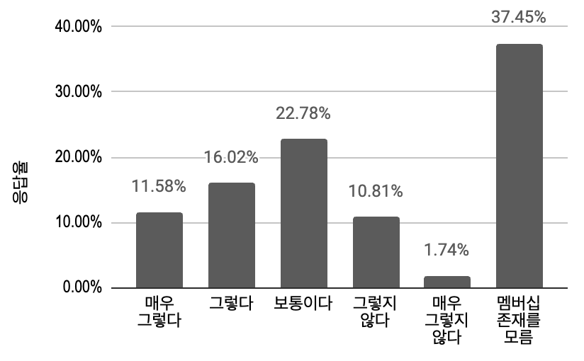
    

---

# 30
도배, 욕실, 장판 시공
아직도 동네 인테리어 업체에서 하지만
만족스럽지 않아요

오늘의집 이용자 중 25년 1월~8월 내 부분시공 경험이 있는 고객은 **오늘의집**을 **가장 많이(51.28%)** 탐색합니다. 그러나 오늘의집은 견적서 수령 단계에서 주요 업체중 **가장 높은 이탈율(92.5%)**을 보이며, 계약은 가장 낮은 수준입니다.

반면, 동네 인테리어 업체는 탐색부터 계약까지 이탈이 52.8%로, 주요 업체 중 가장 낮은 수준입니다. **동네 개인 인테리어 업체를 찾아 본 고객의 47.2%는 타사 또는 셀프시공으로 이탈하지 않고, 동네 개인 인테리어 업체에서 계약합니다.**

동네 개인 인테리어 업체와 계약한 이유는 (타사 대비) **가깝고, 소통이 편하며, 내 시공지 시공 경험이 있고, 차후 원활한 A/S**를 기대하기 때문입니다.


> *동네 장사니까 내가 원하는 것들을 요구 할 수 있었고, 후에 2명 소개시켜 줘서 AS도 편하게 받고  있음.

물리적 거리가 가까워 소통 편하고 해당 아파트 공사 이력이 많아서 상태를 잘 알것이라고 생각했습니다. 오래된 구축 아파트이기 때문에 이 부분이 가장 중요하다고 생각했습니다. 또한 사후 as도 거리가 가까워 원활하게 이루어져서 선택하게 되었습니다. (설문 OPEN 응답)*
> 

그러나 동네 개인 인테리어를 실제 시공한 후, 만족도는 높지 않았는데요.
주요 업체 중 동네 개인 인테리어 시공 만족도는 **낮은 수준이며, 유일하게 불만족 점수(0-10점 중 4점 이하)를 받았습니다.**

> *시공 퀄리티가 생각보다 잘 나오지 않았다.

훨씬 비싸고 다양하지 못한거 같음. (설문 OPEN 응답)*
> 
- *Details*
    
    by @Haley Hong 
    
    최신조사
    
    [[2508] O2O 인지 정기조사 (1차)](https://www.notion.so/2508-O2O-1-23ea597878a080198bc5f2e400552a62?pvs=21) 
    
    [[2502] 부분시공 고객을 알아보자](https://www.notion.so/2502-19fa597878a08025bcfcc8ce48543bf3?pvs=21) 
    
    [[2503] 도배 시공 고객을 알아보자](https://www.notion.so/2503-1a8a597878a080cfbeb5e7b008e74920?pvs=21) 
    
    - 평균 탐색 업체 수는 **2.8개**이며**, 1.오늘의집(51.28%), 2.동네 개인 인테리어 업체(46.15%), 3.숨고(41.03%), 4.한샘(33.33%), 5.LX지인(17.95%)** 순으로 탐색했다는 응답이 높음
    - 응답자의 약 절반이 **동네 개인 인테리어 업체(46.15%)**를 탐색했고, **동네 개인 인테리어 업체** **탐색자의 47.2%는 동네 개인 인테리어 업체에서 계약함**
    - 오늘의집을 찾아보았다는 응답은 가장 높지만(51.28%), **잔존율(계약자수/탐색자수)은 7.5%로 매우 낮음**
        - 오늘의집 탐색자 40명 중 오늘의집에서 견적서를 받은 응답자는 11명에 불과해, **오늘의집 탐색자의 72.5%가 견적을 받지 않고 이탈함**
            
            > 제가 이렇게 오늘의 집에서 보고 업체에 연락을 안 했던 이유 중에 하나도 이렇게 시공 업체들은 일단은 단일만 안 해줄 것 같은 느낌이 드는 거예요. 그래서 연락을 따로 하지 않고… 후기를 먼저 보고 싶었던 거라 아무것도 없이 상담 신청만 먼저 하고 싶지는 않았어요. (P1, 도배 시공 고객을 알아보자)
            > 
            
            > 오늘의집이 속도면에서 조금 늦어 보이는 감이 있기는 해요. (…) 여기 딱 들어가자마자 여기 보면 3일에서 5일 정도 여유를 하는 순간 바로 (후보에서) 뺐어요. 여기 3일에서 5일 걸린대. (P4, 도배 시공 고객을 알아보자)
            > 
        - 오늘의집에서 견적서를 받은 응답자 11명 중 3명이 오늘의집에서 계약해 공사를 진행함 **(견적 수령자의 72.73%가 계약하지 않고 이탈함)**
    - [최근 6개월 내(25년 1월~8월) 부분시공 경험자의 잔존율]
        
        *탐색 후 미계약, 셀프시공으로 이탈 케이스 포함
        
        | 업체/서비스 | 탐색자 수 | 견적 수령자 수 | 계약자 수 | 잔존율 (계약자수/탐색자수) |
        | --- | --- | --- | --- | --- |
        | 동네 개인 인테리어 업체 | 36 | 27 | 17 | **47.2%** |
        | 숨고 | 32 | 28 | 11 | 34.4% |
        | LX지인 | 14 | 6 | 3 | 21.4% |
        | 한샘 | 26 | 17 | 5 | 19.2% |
        | 오늘의집 | 40 | 11 | 3 | **7.5** |
    - 부분시공 만족도 (11점 척도, 0-10점)
        - 25년 내 부분시공 계약 경험 있는 고객 대상
        
        |  | 동네 개인 인테리어 | 숨고 | LX지인 | 한샘 | 오늘의집 |
        | --- | --- | --- | --- | --- | --- |
        | Base(명) | 26 | 11 | 6 | 7 | 4 |
        | Avg. | **7.35** | 8 | 8.5 | **7.28** | 8.5 |

---

# 31 
키워드 활용에는
인테리어 관련 여부가 중요해요

> ‘식기건조대’나 ‘탄산수’처럼 인테리어 관련성이 낮은 키워드로 구성된 컨텐츠 피드의 지표가 전반적으로 저조합니다. 반면, ‘복층 오피스텔’이나 ‘식탁’처럼 인테리어 관련성이 높은 키워드로 구성된 컨텐츠 피드에 대한 지표가 전반적으로 우수합니다.
> 


인테리어 관련성이 낮은 키워드는 키워드 피드 내 주요 지표가 저조합니다. 키워드의 `SRP 내 콘텐츠 이용률`은 키워드의 인테리어 관련성을 측정하는 좋은 지표입니다. 특정 키워드 검색 이후 콘텐츠 클릭을 했다면 인테리어 관련된 키워드일 확률이 높습니다. 지금까지는 키워드에 대한 분석은 "키워드가 인테리어와 관련성이 높은가?"를 함께 볼 필요가 있습니다.

- *Details*
    
    [키워드 피드 성과 분석 및 개선 방향 제안](https://www.notion.so/1cfa597878a080e8984dc436d87357cf?pvs=21)
    
    > 본 분석은 키워드 피드의 성과 분포를 파악하고 집중해야 할 키워드를 식별하기 위해 수행되었습니다.
    > 
    
    > 이를 위해 세 가지 관점의 사분면 분석을 진행했습니다:
    > 
    > - 도달 범위(키워드 조회 유저수) vs. 탭 효율성(키워드 클릭 전환율)
    > - 탭 매력도(키워드 클릭 전환율) vs. 내부 컨텐츠 만족도(키워드의 평균 컨텐츠 조회수)
    > - 탭 매력도(키워드 클릭 전환율) vs. 내부 컨텐츠 만족도(키워드의 평균 태그 클릭수)
    
    > 주요 결과 및 제안
    > 
    > - '화장대', '침대', '식탁'과 같은 주요 인테리어 키워드들은 세 가지 분석 모두에서 일관되게 1사분면(고성과 그룹)에 위치하며 높은 성과를 보였습니다.
    >     - **즉, 핵심적인 인테리어 상품 키워드들은 커버리지만 우수할 뿐만 아니라 피드 진입률과 피드 내 컨텐츠 탐색에서 모두 우수한 성과를 보였습니다.**
    > - 아이방러그, 6인용식탁의자세트, 빈티지러그 등 상대적으로 구체적이거나 특정 취향/니즈(예: 아이방, 빈티지, 6인용)를 반영한 키워드는 노출 커버리지는 낮지만 높은 피드 진입률을 보였습니다.
    >     - ✅ **각 유저의 구체적인 니즈를 반영한 키워드 추천이 발생한다면 더 높은 피드 진입을 발생시킬 수 있을 것으로 보입니다.**
    >     - 최근 수집하고 있는 유저 관심사 정보 등을 활용해볼 여지가 있습니다.
    > - 식기건조대, 세면타월과 같은 인테리어 저관여 기능성 제품과 전구, 샤워기 홀더와 같은 부수적인 부품류는 전반적으로 피드 진입률이 저조하고 컨텐츠 조회도 낮은 경향이 있습니다.
    >     - ✅ **인테리어 관여도가 낮은 상품은 전반적인 성과가 저조합니다. 인테리어 관여도에 따라 키워드 노출에 가중치를 두는 방식 등을 통해 인테리어 관련 키워드를 노출시킬 필요가 있습니다.**
    > - 쁘리엘르, 루시아이와 같은 대중적이지 않은 브랜드는 전반적으로 피드 진입률이 저조합니다.
    >     - 브랜드 키워드의 컨텐츠 조회나 태그 클릭 성과는 브랜드에 따라 상이한 경향이 있습니다. 하지만 전반적으로 저조한 피드 진입률을 보입니다.
    >     - **✅ 대중적이지 않은 브랜드 키워드는 노출 유저군 선정이 특히 중요해 보입니다. 해당 브랜드에 정말 관심을 보일만한 유저를 타켓팅할 필요가 있습니다.**
    > - 오늘의가든, 3d인테리어, 장바구니쿠폰, 3d인테리어하러가기 등 컨텐츠와 관련성이 낮은 키워드들은 유저들의 진입 비율이 상대적으로 높더라도 진입 후 컨텐츠 조회 & 태그 클릭 등이 저조합니다.
    >     - ✅ **컨텐츠의 연관성 낮은 키워드는 컨텐츠 노출을 통해 유저의 니즈를 만족시키기 어렵습니다. 해당 키워드의 제거를 고려해볼 필요가 있습니다.**
    
    [키워드 피드 효율화를 위한 '인테리어 관련성' 지표 정의 및 성과 분석](https://www.notion.so/1dfa597878a08013bbc0e98c8a5afc42?pvs=21) 
    
    > 본 분석은 **'`키워드의 인테리어 관련성`'**을 **정의하는 지표를 설정**하고, 
    이 지표가 **키워드 피드의 실제 성과와 어떤 관계**를 보이는지 검증하고자 수행되었습니다.
    > 
    
    > 분석 결과, 'SRP 콘텐츠 이용률'로 정의한 키워드의 인테리어 관련성은 해당 키워드가 속한 커머스 카테고리 내 상품들의 'PDP 스타일링샷 이용률'과 높은 양의 상관관계를 보여, 인테리어 관련성을 측정하는 타당한 지표로 사용될 가능성을 보여주었습니다.([수렴타당도](https://www.scribbr.com/methodology/convergent-validity/) 검증)
    > 
    
    > 또한, 인테리어 관련성이 낮은 키워드는 키워드 피드의 주요 성과 지표(탭 CTR, 콘텐츠 조회수 등)가 전반적으로 낮다는 사실을 재확인했습니다. 이는 향후 키워드 관리 및 추천 전략 수립 시 **인테리어 관련성이 고려될 필요성**을 보여줍니다.
    > 
    

---

# 32
오늘의집 가격에 대한
고객들의 인식 변화

오늘의집 고객이 오늘의집 상품을 저렴하다고 느끼는 비율이 증가하고 있습니다.

> 24년 3월 2.79 → 25년 2월 2.59 (5점 : 비싸다, 1점 : 저렴하다)
> 

특가 측면에서 특가 뱃지 가시성은 줄어들고 있지만 특가 뱃지가 구매 결정에 주는 영향은 점차 증가하고 있습니다.

> 특가 뱃지 가시성 : 24년 6월 83.3% → 25년 2월 79.2%
> 

> 특가 뱃지 구매 영향 : 24년 3월 3.66 → 25년 2월 3.81(5점 : 영향 있다, 1점 : 영향 없다)
> 

다만 고객들은 특가 여부와 관계 없이 가격을 항상 비교하고 있습니다.

> 52.2%가 특가 여부와 관계없이 항상 가격 비교한다고 응답(25년 2월 기준)
> 


- *Details*
    
    [[25.02] 고객의 오늘의집 가격 인식은 1년간 어떻게 변했을까? - 설문 결과 상세 분석](https://www.notion.so/25-02-1-1b4a597878a0800082aec4d6108e0a31?pvs=21) 
    
    ### Q. 오늘의집 상품의 <가격대>는 어떻게 느껴지시나요?
    
    ✅ **평균 점수가 점점 낮아지며 가격이 적당하거나 저렴하다고 느끼는 응답이 증가하는 경향**
    
    - 최근 가격 혜택이나 할인 등의 영향으로 오늘의집 상품 가격이 점점 적당하다고 인식되는 방향으로 변화했을 가능성 존재
    - Bottom2(저렴하다고 느끼는 비율)는 증가하는 반면, Top2(비싸다고 느끼는 비율)는 점점 감소
    - 최초 조사(2403 시점)에서는 가격을 상대적으로 비싸게 느끼는 사람이 많았으나, 이후 가격 인식이 개선되는 흐름을 보임
    
    *단, 최근 3개의 조사는 빅프로모션 기간 동안 수행된 것이므로 평시 가격 인식 조사 결과 추가가 필요
    
    1점 - 매우 저렴하다 ~ 5점 - 매우 비싸다
    
    | 시점 | 평균 점수 | 표준 편차 | Bottom2 (%) | Bottom2 (명) | Top2 (%) | Top2 (명) | 95% 신뢰구간 |
    | --- | --- | --- | --- | --- | --- | --- | --- |
    | 2502 (오세페) | 2.59 | 0.78 | 45.77% | 3,170명 | 11.28% | 781명 | (2.57 ~ 2.61) |
    | 2411 (블프) | 2.63 | 0.79 | 44.35% | 1,933명 | 12.43% | 542명 | (2.61 ~ 2.65) |
    | 2406 (오세페) | 2.63 | 0.79 | 44.02% | 1,573명 | 12.59% | 450명 | (2.60 ~ 2.66) |
    | 2403 (평시) | 2.79 | 0.80 | 33.24% | 1,827명 | 17.71% | 973명 | (2.77 ~ 2.81) |
    
    ### Q. 저렴하거나 비싸다고 생각한 이유
    
    ✅ (24년 6월 조사 부터) **현재까지 저렴하거나 비싼 이유의 순위 변동은 없음**
    
    아래 데이터는 25년 2월 기준
    
    (1,2점 평가한 경우)
    
    저렴하다고 생각하신 <이유>를 모두 골라주세요.
    
    | 이유 | 비중 / 명 |
    | --- | --- |
    | 쿠폰할인 등 프로모션 혜택이 좋아서 | 50.55% / 1,605 |
    | 할인하는 상품이 많아서 | 42.93% / 1,363 |
    | 다른 앱/쇼핑몰 대비 가격이 저렴해서 | 40.94% / 1,300 |
    | 할인하는 빈도가 많아서 | 28.76% / 913 |
    | 배송혜택이 좋아서 (무료배송, 묶음배송, 오늘의집 배송 등) | 22.24% / 706 |
    | 포인트 적립률이 높아서 | 11.43% / 363 |
    | 기타(구체적으로 적어주세요) | 6.08% / 193 |
    
    기타 응답 요약
    
    - **최저가 및 할인 행사**: 오세페 등 대규모 할인, 중복 할인(쿠폰·카드·적립금), 스크랩 할인 알림.
    - **포인트 적립**: 출석 체크, 리뷰 작성 등 다양한 적립 기회.
    - **상품 다양성**: 인테리어·가구·가전 등 폭넓은 품목 구성.
    - **리퍼·특가 상품**: 리퍼 제품 할인 및 특가 상품 다수.
    - **편리한 쇼핑 경험**: 가격 비교 용이, UI 편리, 리뷰 정보 풍부.
    
    (4,5점 평가한 경우)
    
    비싸다고 생각하신 <이유>를 모두 골라주세요.
    
    | 이유 | 비중 / 명 |
    | --- | --- |
    | 다른 앱/쇼핑몰 대비 가격이 비싸서 | 67.77% / 532 |
    | 배송비 부담이 커서 | 38.34% / 301 |
    | 쿠폰할인 등 프로모션 혜택이 좋지 않아서 | 25.73% / 202 |
    | 할인하는 빈도가 적어서 | 20.64% / 162 |
    | 할인하는 상품이 적어서 | 20.64% / 162 |
    | 포인트 적립률이 낮아서 | 13.50% / 106 |
    | 기타(구체적으로 적어주세요) | 10.45% / 82 |
    
    기타 응답 요약
    
    - **가격 경쟁력 부족**: 쿠팡·네이버 등 타 쇼핑몰 대비 가격이 비싼 경우가 많음.
    - **배송비 부담**: 무료배송 상품이 적고, 브랜드별 개별 배송비 부과로 체감 가격 상승.
    - **할인 효과 미흡**: 할인 상품이 한정적이며, 원래 가격이 높아 실질적 할인 체감 어려움.
    - **옵션 추가 비용**: 표기 가격보다 옵션 추가 시 가격이 크게 상승하는 경우 많음.
    - **타 플랫폼과 비교 후 구매**: 오늘의집에서 제품을 찾고 가격 비교 후 다른 쇼핑몰에서 구매하는 경우 빈번.
    
    **특가 뱃지 가시성과 특가 뱃지 발견률 연관 분석**
    
    - 인지율은 80% 이상을 유지했지만, 특가 상품 발견율은 지속적으로 감소 (48.99% → 39.96%)
        - 특가 표시 자체는 여전히 잘 보이지만, 사용자가 특가 상품을 실제로 찾는 것은 어려워지고 있음
        - 즉, 특가 UI(배지, 라벨 등)는 잘 인식되지만, 특가 상품 자체는 기대보다 적거나, 찾기 어려운 위치에 배치되었을 가능성
        - 혹은 특가가 붙어 있지만 고객이 관심 없는 상품이라 인지하지 못했을 가능성
    - 2024년 6월 이후, 인지율과 발견율 간 차이가 점점 커짐
        - UI는 유지되었지만, 특가 상품의 노출 빈도나 탐색 과정이 변화했을 가능성
        - 예를 들어, 특가 상품이 검색 결과, 카테고리 페이지에서 덜 노출되었을 수도 있음
    
    | 시점 | **붉은 동그라미 본 적 있음 (%)** | **특가 상품 발견 쉬움 (Top2, %)** | 가시성(인지율) vs. 발견률 차이 |
    | --- | --- | --- | --- |
    | **2025년 2월** | 79.20% | 39.96% | **인지율은 높지만, 특가 발견은 낮음** → 특가 상품 배치가 효과적이지 않을 가능성 |
    | **2024년 11월** | 82.19% | 43.61% | 인지율과 발견율 모두 소폭 감소 |
    | **2024년 6월** | 83.29% | 48.99% | **인지율과 발견율이 모두 가장 높음** → 이 시점에서는 특가가 잘 보였을 가능성 |

---

# 33
오늘의집 고객들의
관심 키워드는..

오늘의집 고객들의 관심이 많은 주제는 대부분 인테리어 관련 주제(수납,거실,침실 등)입니다.

육아, 반려, 강아지, 아기, 어린이방, 피규어 같은 키워드는 호불호가 강해 “전혀 관심 없는” 사람이 많습니다.


<매우 관심 많은 주제 순> 정렬 

- *Details*
    
    [[2503] 고객들의 관심사와 실제로 본 콘텐츠는 얼마나 일치할까?](https://www.notion.so/2503-1bba597878a080a282edd2c5a229fb9a?pvs=21) 
    
    <aside>
    ***데이터 바로가기***  |
    
    - 검증 대상 텍소노미 | [링크](https://docs.google.com/spreadsheets/d/1U9IjvPkIlEk_-ASbMin7Wdi7fiB9WRK6JXZ-wM6Yuic/edit?usp=sharing)
    - 설문 [[설문 테스트 링크](https://ko.research.net/r/C2FNNLF?User_ID=[User_ID_value]) | [결과 요약 링크](https://ko.surveymonkey.com/results/SM-Qp04QBw5YSraX8J6L0xV3w_3D_3D/) | [설문 결과 시트](https://docs.google.com/spreadsheets/d/1lFsSUCvvKowXkjr6Mi5Y-ueUyPguZZ9-3qdTEGzlZEs/edit?gid=1724414874#gid=1724414874) ]
    - 데이터분석 [쿼리]
    </aside>
    
    - Ohose Taxonomy 중 전체 콘텐츠(관심사) 95%를 차지하는 60여개 키워드를 대상 관심사 유무 수집
        - 1점(전혀 관심 없음)~4점(매우 관심 있음)
        - 토픽은 아래 기준으로 선정되었습니다.
            - 2024년 2월 기준으로, 토픽별 콘텐츠 수를 기준으로 내림차순 정렬
            - 누적 콘텐츠 수가 전체의 95% 수준에 근접하는 지점까지의 토픽을 포함’
            - [시트](https://docs.google.com/spreadsheets/d/1lFsSUCvvKowXkjr6Mi5Y-ueUyPguZZ9-3qdTEGzlZEs/edit?gid=0#gid=0)에서 확인 가능
    - 설문문항
    
    
    
    - 설문대상  :  3월 1일-19일 오늘의집 방문자 중 랜덤 40만명 대상 디타겟 후 145,449명 발송
    - 실제로 고객들의 관심사와 보고 있는 스타일링샷의 일치도를 파악하려고 했으나 토픽이 부여되지 않은 콘텐츠 비율이 높아 분석이 어려웠습니다.
        - 해당 기간 분석 대상 유저군이 조회한 스타일링샷 컨텐츠는 총 149,895개입니다.
        - 이 중 토픽이 존재하는 컨텐츠는 11,325개 입니다.
    

---

# 34
구매 결정이 쉬우려면 상품페이지에서 
리뷰/스타일링샷/상품상세를 쉽게 찾을 수 있어야


콘텐츠가 구매 결정에 직접적으로 도움이 될 때는 앱을 열었을 때가 아니라 상품 발견(PDP 진입) 이후 입니다.

PDP에서 원하는 리뷰, 참고할 수 있는 스타일링샷, 상품 상세 정보를 쉽게 찾을 수 있도록 한다면 이탈도 적고 구매전환을 앞당길 수 있습니다. PDP랜딩 이후 리뷰, 스타일링샷, 상품상세 정보를 쉽게 찾거나 더 많이 경험할수록 구매전환율이 높습니다. 

- *Details*
    
    [오늘의집 오작교](https://www.notion.so/1c8a597878a08094b548f904bed9a15a?pvs=21) 
    
    콘텐츠가 구매 결정에 도움이 될 때는 앱을 열었을 때가 아니라 PDP 이후. 모든 콘텐츠 경험 후보를 모아 영향력 비교했을 때, 리뷰와 스타일링샷의 영향력이 가장 높게 나타남.  ([O!작교 1차 구매 feature EDA](https://www.notion.so/O-1-feature-EDA-185a597878a080cd857af11d579e82ec?pvs=21))
    
    
    
    ---
    
    특히 ,리뷰, 스타일링샷 조회가 둘다 있는 경우가 가장 구매전환율이 높다. 요소 하나만 꼽으면, 리뷰 조회의 여부가 구매 전환율 상승에 크게 기여,
    
    ([[특정 상품 관련 콘텐츠/리뷰/스타일링샷 조회시 그 상품 구매 확률, carl]](https://www.notion.so/O-1-feature-EDA-185a597878a080cd857af11d579e82ec?pvs=21))
    
    [PDP에서 특정 행동 유무에 따른 구매전환율](PDP%EC%97%90%EC%84%9C%20%ED%8A%B9%EC%A0%95%20%ED%96%89%EB%8F%99%20%EC%9C%A0%EB%AC%B4%EC%97%90%20%EB%94%B0%EB%A5%B8%20%EA%B5%AC%EB%A7%A4%EC%A0%84%ED%99%98%EC%9C%A8%201f2a597878a0811296b2ffa21c73ab98.csv)
    
    PDP에 방문하고 바로 돌아가는 사람이 약 42% 이며, 이들의 구매전환율은 극히 낮습니다.
    
    
    
    2025년 3월 일데이터 월평균, PDP 방문한 사람 중 액션별 유저 수
    
    
    
    - 3가지를 모두 경험한 경우 전환율 20%까지 상승
        - 액션을 더 많이 수행할수록 구매 전환 상승
    - 리뷰나 상품 상세 정보를 먼저 탐색한 경우 전환율이 높음
        - 상위 3개 전환율 패턴에 모두 R과 P가 포함
    - [자세히 보기] : 세가지 액션의 순서로 인한 구매전환율 차이
        
        by Carl Genie Sophie
        
        > (파로마 모노 보나) 리클라이너  [[상품 탐색 유저 리서치, P1]](https://ohou-se.slack.com/archives/C082GLZ9LUS/p1739923205844989?thread_ts=1739856607.941059&cid=C082GLZ9LUS)
        > 
        > 
        > '아 뭐가 묻으면 닦기가 힘들구나' 
        > > '오 백화점에서도 파는건가?'
        > > '오 이정도 딱인데? 이쁜데?'
        > > '페다가 유명한거구나'
        > > '적당한 단단함, 푹신함, 허리도 안아프고...'
        > **'이거 괜찮은데?**
        > 
        - PDP 방문 후 아무 액션도 취하지 않은 경우가 전체 중 45~50% 정도. 즉 리뷰와 스타일링샷 등 도움이 되는 정보에 접근도 하지 못함.
            - 그 뒤로 상품 상세 (11%) > 리뷰 (10%) > 스타일링샷 (8%)로 단일 액션 비중이 높음
        - 가구처럼 콘텐츠의 도움을 많이 필요로 하는 카테고리는 57%가 상품상세/리뷰/스타일링샷을 보고, 생필품의 경우엔 17% 수준. 즉 가구/패브릭/주방/홈데코는 스타일링샷/리뷰를 통해 더 많은 도움을 주고 있음.
            - [스타일링샷_리뷰탐색경험_by카테고리 (Sophie)](https://docs.google.com/spreadsheets/d/1pWC8OYPnCeDc4S2iQzwGDXkaRKmaTcnF8zGVrJ_-m10/edit?gid=0#gid=0)
            
            
            
        - 순서에 따른 차이는 있지만 PDP방문뿐 아니라 리뷰/스타일링샷/상품상세를 접할수록 구매전환이 높음.
            - 세 액션을 모두 수행 하면 구매 전환이 20% 이상
            - [O!작교 PDP조회 액션 순서별 구매 전환 EDA](https://www.notion.so/O-PDP-EDA-192a597878a080bd981bc6f1b54c8974?pvs=21) (Carl)
        - 가구나 조명 등 인테리어 상품은 생필품과 달리 일단 체험하고, 나중에 구매결정하는 것이 자연스러움.
            
            
            |  | **마음에 드는 것 발견** | **체험** | 구매 고민 | 구매 결정 |
            | --- | --- | --- | --- | --- |
            | 자연스러운 흐름 | 오 예쁘네?
            
            [PLP] [PDP] | 재질이 좋네
            우리집에 잘 어울릴 것 같네.
            [상품상세, 스타일링샷] | 다른 사람들도
            좋아하네?
            [리뷰] | 아 사야겠다/
            사지 말아야겠다.
            [장바구니/구매] |
            | AS IS | 오 예쁘네?
            
            [PLP] [PDP] | 아 가격이 마음에 안드네  | (Back) |  |
    - [자세히 보기] : 리뷰/스타일링샷과 구매 의도는 상관 관계인가 인과 관계인가
        - [O!작교 동일 카테고리 PDP 액션별 구매 전환](https://www.notion.so/O-PDP-1bca597878a080519212e225185b568b?pvs=21)
        - 검색어를 기준으로 평행 세계를 간주
            - 동일한 검색어로 동일한 상품 진입한 케이스만 뽑아서 파악
            - 여전히 고객들의 3가지 행동 탐색 별 전환율 차이 존재
                - 구매전환율 상위 3그룹 : PSR > RPS > PRS 순
    - [자세히 보기] : 상품 카테고리별 PDP내 액션에 따른 구매 전환 파악  by @Carl Jang
        - [상품 카테고리별 PDP내 액션에 따른 구매 전환 파악](https://www.notion.so/PDP-270a597878a0807c805cc083a22b2f8e?pvs=21)
            - 생필품의 경우 NO_ACTION이 높아 기능성 중심의 빠른 의사결정에 도움을 줄 수 있는 PDP 내 모듈 배치 및 변경
            - 문구류의 경우 높은 스타일링샷 조회를 기반으로 디자인 요소를 더 쉽고 빠르게 접할 수 있게 UI 변경

---

# 35
보기에 비슷하다고 
비슷한 상품이 아니야.

‘비슷한 상품’ 을 판단 할 때는 시각적인 요소가 가장 중요했습니다. 

그러나 눈에 보이지 않는 비슷함도 있습니다. 예를 들어 커튼/발매트 등은 디자인보다 소재가 같아야 비슷한 상품이라고 판단하며, 휴지통 등 기능성 상품은 작동방식이 비슷함을 결정합니다. 


상품군별 비슷한 상품을 판단하는 기준 순위 

- *Details*
    
    [☀️ Highlights](https://www.notion.so/Highlights-1b4a597878a080f88bded8105c5d8f37?pvs=21) 
    
    <aside>
    
    
    ---
    
    ① 역시나 눈에 보이는 모양과 색상이 가장 중요 
    
    
    
    **②** 눈에 보이지 않는 비슷함이 있으며 카테고리별로 그 중요도는 상이합니다. 
    
    ㄴ 특히 커튼/발매트 등은 소재가 가장 중요하며 휴지통 등 기능성 상품은 작동방식이 중요
    ㄴ 반대로 오브제는 디자인이 가장 중요 
    ㄴ 디퓨저는 오히려 향보다는 디자인이 중요했으며 관리방식(향을 내는 방식) 또한 중요
    
    **③** 색상뿐 아니라 색감이 중요합니다.
    
    ㄴ 실제로는 다른 색상이라 하더라도 같은 팔레트/파스텔/뉴트럴/딥 등 색감에 따라 다르게 인지함
    
    **④** 브랜드을 보고 판단하는 경우는 매우 드물다. 
    
    ㄴ 브랜드가 사유로 언급된 비율 0.13% 15건 / 11342건
    
    **⑤** 이미지에서 작은 영역인데 결정적인 영향을 미칠 수 있음(침대헤드, 화분 부속품)
    
    **⑥ 비정형적인 디자인 포인트**를 가진 경우 다른 부분이 다 비슷해도 비슷하지 않다고 느낌. 
    
    ㄴ 제품이 코너형 책상인데, 유사한 코너형 제품이 없음
    
    ㄴ 비정형 러그/매트의 경우 컨셉과 형태가 가장 중요함 (색상/재질보단) 5각형 형태, 지붕이 있는 집 모양 디자인 이 유사성을 판단하는 핵심 기준으로 작용
    
    ㄴ 💡 (개성있고 독특한 제품군이 따로 있으면 어떨지?)
    
     **⑦ 제품을 사는 주요 이유와 비슷하다고 판단하는 이유가 연결되어 있음.** 
    
    ㄴ 단순한 거울이 아니라 수납 기능이 포함된 거울인데, 다른 제품들은 그런 기능이 없음
    
    ㄴ 💡 (후기나 다른 속성 정보를 활용하면 어떨지?)
    
    **⑧** 실제로 비슷한 상품이더라도 PDP 사진 구성에 따라 다르게 판단함. 
    
    ㄴ 비슷한 소파 하나만 보여주기 > 비슷한 소파 하나, 다른 색상 소파 두개를 보여주기 
    
    ㄴ 같은 공간에서 배치된 방식(예: 식탁과 함께 놓인 의자, 단독으로 배치된 의자 등)이 제품의 전체적인 분위기를 결정하며, 유사성을 판단하는 데 영향
    
    **⑨** 크기는 단순 크기가 아니라 비례가 중요할 수 있음.
    
    ㄴ 그릇의 경우 깊이(비례)가 굉장히 중요하게 작용함
    
    </aside>
    
    ### **대체로 응답이 비슷한 경우**
    
    ** 40% 이상인 선택지가 없는 경우
    
    
    
    - 문양이 달라도 ‘스타일’만 비슷하면 된다거나 (화분, 발매트)
    - 카테고리 자체가 차이가 크지 않거나(침대)
    
    ### **비슷한 선택지가 확실한 경우**
    
    ** 75% 이상인 하나의 선택지에 몰린 경우 
    
    
    
    - (왼) 생각보다 등받이,각도 등 디테일한 부분까지 찾아서 비슷한 상품을 분명하게 인지함
    - (중간) 제품이 아닌 사진에서 보여주는 배치방식, 상품구성이 큰 영향을 미침
    - (우) 사실상 같은 상품인 경우
    
    ### **비슷한 상품이 없다고 생각하는 경우**
    
    ** 비슷한 상품이 없다고 생각하는 비율이 20% 이상인 경우 
    
    
    
    - (왼) 부속품- 줄이 다름
    - (중간)단순한 거울이 아니라 수납 기능이 포함된 거울인데, 다른 제품들은 그런 기능이 없음
    - (오) 색상이 독특하기 때문에 비슷한 게 없음
    

---

# **36
취향있는 유저는 당장 따라하지 못하더라도
트렌디하고 새로운 콘텐츠에 만족해요**


평상시 최소 주간 단위로 콘텐츠를 조회하는 유저는 오늘의취향 피드 만족도가 높습니다. 

> *뱁새하우스나 오늘의 취향 같은 경우에는 제가 못 봤던 아이템들도 새로 이렇게 소개하는 경우가 많아서 
새롭게 다가오고 스크랩 많이 하고 있어요*
> 

왜냐하면 그동안 보통의 집들이를 보면서 평범하거나 새롭지 않다고 느껴서 아쉬움이 있었는데 큐레이션된 콘텐츠를 보며 오늘의집에서 보지 못한 새로운 콘텐츠 주제 및 포맷(e.g. 뱁새하우스)과 브랜드 정보가 제공된다고 느끼기 때문입니다. 

- *Details*
    
    [https://docs.google.com/spreadsheets/d/11N5L2P-u75xNBkmtf7-OIESpyOJbn_TdNEssbS54gRM/edit?gid=307000201#gid=307000201](https://docs.google.com/spreadsheets/d/11N5L2P-u75xNBkmtf7-OIESpyOJbn_TdNEssbS54gRM/edit?gid=307000201#gid=307000201)
    
    <aside>
    
    
    **RQ3. 유저가 오늘의취향 피드를 재방문하고 싶은 동인은 무엇일까?**
    
    - 인테리어 관심사가 높고 취향이 있는 Level 3 유저는 대체로 오늘의취향 피드에서 콘텐츠 전반의 퀄리티와 새로움에 만족감을 느끼며 피드를 자주 방문하고 있습니다.
        
        → 앞으로, Level 3 유저들의 콘텐츠 탐색이 오늘의취향 피드에서 지속되며 Lock-in 될 수 있도록 큐레이션 기준과 노출 UX 및 피드 정체성을 더 견고히 강화 시키는 것이 필요합니다. 
        
    - 인테리어 트렌드와 관심있는 스타일을 조금 알고있는 Level 2인 유저들은 오늘의취향 피드에서 인테리어 감각을 높일 수 있는 아이디어와 트렌드 파악이 강점이라고 느낍니다.
        
        → 그러나, 라이프이벤트 발생 유무에 따라 트렌드를 확인하고자 하는 니즈가 달라지기 때문에, **지속 피드를 방문하게 만드는 동인은 현재 발견되지 않았습니다.** 
        
    </aside>
    
    **👍 `긍정 피드백`** 
    
    **▷ 심심할 때 1)대리만족 혹은, 2)인테리어 감각을 키우는 아이디어와 3)트렌드 획득 목적의 방문**
    
    - *User quote*
        - 사람들이 어떻게 요즘 어떤거에 반응하지 볼 수 있었던 부분은네 좋았던 거 같고, 트렌드를 제가 굳이 따로 찾아보지 않아도 여기서 볼 수 있지 않을까라는 믿음 때문 (P1, Level2)
        - "심심할 때 예쁜 집들 보면서 대리 만족할 수 있어서 좋아요." (P5, Level3)
        - "우수 사례들을 보면 저도 조금은 따라갈 수 있지 않을까라는 기대감이 있기 때문에이 피드를 계속해서 찾게 되는 거 같고 그리고 그냥 제 개인적으로도 뭐 제가 미적 감각은 없지만 그래도 이미 잘 되어 있는 인테리어들 보는 건 되게 좋아하거든요” (P4, Level2)
    
    **▷** **집 전반적인 정보를 통해,** **새로운 콘텐츠 주제와 스타일, 브랜드 정보 획득** 
    
    - *User quote*
        - "다양한 컨셉의 피드들이 있다 보니까 보는 재미도 있고 조금 더 이렇게 가구나 소품을 보는 눈 자체가 약간은 길러지는듯한 느낌" (P4, Level2)
        - "에디터분들께서 추천한 콘텐츠도 올라오고 집들이나 요런 피드들도 자연스럽게 볼 수 있었던 거 같고 예쁜 집들이 콘텐츠 같은 것들을 자연스럽게 볼 수 있는게 오늘의취향이어 가지고 보게 된 거 같아요" (P5, Level3)
        - “근데 뱁새하우스나 오늘의 취향 같은 경우에는 제가 못 봤던 아이템들도 새로 이렇게 소개하는 경우가 많아서 새롭게 다가오고 스크랩 많이 하고 있어요” (P3, Level3)
    
    **▷ 원하는 큐레이션 위주로 빠르게 콘텐츠 탐색 용이 (Level3)**
    
    - *User quote*
        - “제가 평소에 좋아하는 알고리즘이 반영된게 있으면서, 그걸 이렇게 탭으로 이렇게 묶어 주니까 내 취향을 보고 싶을 땐 이걸 보고 새로운 건 요걸 보고 분류가 돼서 좋아요” (P3, Level3)
        - “기능이 많아졌다 생각을 하는데 그런 것들이 조금 난잡했다고 하면 오늘의취향은 진짜 어떤 스타일링이나 집에서 꾸민 좀 참고하고 싶은 그런 아카이브 같은 걸 모으고 싶은 사람들이 딱 집중해서 볼 수 있는 그런 곳”(P5, Level3)

---

# **37
오늘의집에서 생필품과 식품도 팔아요? 
아직.. 잘 몰라요!**

*오늘의집 유저 중, 최근 한 달 내 온라인에서 생필품/식품 구매 경험 있는 유저


14개 카테고리 중 생필품(8위, 67.61%), 식품(11위, 49.58%)은 **인지 하위 카테고리**에 속함 (n=599명)

응답자 절반이 오늘의집에서 식품 카테고리가 있다는 사실을 알지 못합니다. 오마트는 단 26.7%만이 인지해, 모든 카테고리의 인지율보다 낮습니다.

온라인에서 식품 또는 생필품을 구매한 경험이 있는 오늘의집 유저의 65%는 생필품, 45%는 식품을 ‘오늘의집에서’ 구매한 경험이 있는데요. **‘가격/할인’** 때문에 오늘의집에서 구매했습니다. 반면, 각 카테고리가 있는지 알고 있지만 구매하지 않은 응답자는 ‘**가격 경쟁력 부족**’과 ‘**기존 플랫폼 이용 습관**’ 때문에 구매를 하지 않았습니다.

- *Details*
    
    **Q. FMCG/오마트 카테고리를 구매한 유저는 얼마나 되며, 왜 구매했을까?**
    
    [설문 응답자의 구매 경험]
    
    
    
    - 온라인에서 식품 또는 생필품을 구매한 경험이 있는 오늘의집 유저의
    **65%는 생필품, 45%는 식품**을 ‘오늘의집에서’ 구매한 경험이 있음 (n=599명)
    
    [인지자 중 구매/미구매 비율]
    
    
    
    식품
    
    
    
    생필품
    
    
    
    오마트
    
    - **식품** 카테고리를 알고 있는 응답자의 **65%**(n=297명),
    **생필품** 카테고리를 알고 있는 응답자의 **69%**(n=405명)는 해당 카테고리 상품 구매 경험이 있음
        - 식품과 생필품 모두, 타사가 아닌 오늘의집에서 구매한 주된 이유는 **가격/할인 때문**임
        (식품 76.3%, n=194명 / 생필품 65.1%, n=281명) *주관식 응답 분석
            - [상세 내용 하단 참고](https://www.notion.so/2505-FMCG-1-206a597878a0806d9940d24082e5f327?pvs=21)
    - 오마트를 알고 있는 응답자의 **46%**가 오마트에서 구매한 경험이 있음 (n=160명)
        - 타사가 아닌 오마트에서 구매한 주된 이유 또한 생필품/식품과 마찬가지로 **가격/할인 때문임 (**60%, n=75명) *주관식 응답 분석
            - [상세 내용 하단 참고](https://www.notion.so/2505-FMCG-1-206a597878a0806d9940d24082e5f327?pvs=21)
            
    
    ---
    
    **Q. 유저는 왜 FMCG/오마트를 알고 있음에도 구매하지 않았을까?**
    
    
    
    *** **FMCG(Fast-Moving Consumer Goods):** 샴푸, 세제, 기저귀, 화장품, 음료수 등 소비 속도가 빠르고 가격이 저렴한 제품*
    
    **→ 공통적으로 `가격 경쟁력 부족`, `기존 플랫폼 이용 습관` 때문에 구매하지 않음**
    
    - 오늘의집에서 **식품** 카테고리를 판매하고 있는지 알았지만, 구매하지 않은 주된 이유는
    **1.가격 경쟁력 부족(35.9%), 2.기존 플랫폼 이용 습관(29.9%), 3.인지 부족(12.8%), 4.배송 편의성 부족(12%)** 때문임 (n=117명) *주관식 응답 분석
        
        > *“오늘의 집에서 식품류를 판매하는 사실을 최근에 알았어요 그리고 이미 멤버십 이용중인 사이트(컬리,네이버등) 이 더 가성비있게 느껴졌기 때문에”
        ”타 플랫폼 새벽배송이 편리해서 오늘의집을 통해 기획전/할인율이 큰게 아니라면 구매할 이유 없음, 주로 가구 또는 조명 등 인테리어 제품을 보러 오늘의 집을 이용함”*
        > 
        - [주관식 응답 전체보기](https://docs.google.com/spreadsheets/d/1c6fK0SF-gVcix119ntl4E7IYKfzkhI5YJOKOuOj5d7I/edit?gid=1677308028#gid=1677308028&range=A25)
    - 오늘의집에서 **생필품** 카테고리를 판매하고 있는지 알았지만, 구매하지 않은 주된 이유는
    **1.가격 경쟁력 부족(37.2%), 2.기존 플랫폼 이용 습관(20.9%), 3.배송 편의성 부족(11.6%), 4.기획전/할인 정보 부족(10.9%)** 때문임 (n=129명) *주관식 응답 분석
        
        > *“구매하던곳에서 늘 구매를해서 오늘의집에서 구매할수있다는 생각을 못했어요”
        ”타사이트가 더 저렴하다고 생각되고. 늘 구매하던 곳에서 구매했던 같은 제품을 구매함”*
        > 
        - [주관식 응답 전체보기](https://docs.google.com/spreadsheets/d/1c6fK0SF-gVcix119ntl4E7IYKfzkhI5YJOKOuOj5d7I/edit?gid=1200589963#gid=1200589963&range=A25)
    - **오마트**를 알고 있었지만, 구매하지 않은 주된 이유는
    **1.기존 플랫폼 이용 습관(40.7%), 2.가격 경쟁력 부족(23.3%), 3.배송 편의성 부족(16.3%), 4.상품 다양성 부족(15.1%)** 때문임 (n=86명) *주관식 응답 분석
        
        > *”쿠팡 월 회원비를 뽑고싶어서. 식품은 급히 주문할 때가 많아서”
        ”타 플랫폼에서 구입하는게 더 편함 가격적 메리트가 크게 없는한 배송이 빠른 쿠팡을 이용하는편임”
        ”내가 급히 필요할때 당일 배송 또는 익일 새벽 배송이 아니라서”
        ”오마트 제품이 타사 대비 많지 않아서 가격비교, 탐색만 하다 안사게 됐다.”*
        > 
        - [주관식 응답 전체보기](https://docs.google.com/spreadsheets/d/1c6fK0SF-gVcix119ntl4E7IYKfzkhI5YJOKOuOj5d7I/edit?gid=1757268153#gid=1757268153&range=A25)
    

# **38
인테리어 시공할 땐 오늘의집을 먼저 찾지만,
원하는 조건의 업체가 매칭되지 않아 떠나요**


오늘의집에서 종합시공 매칭을 받았지만 계약은 하지 않은 고객 5명 중 4명은 타 플랫폼/업체보다 오늘의집을 먼저 찾았습니다. 

간편 상담을 신청하며 **내 주소지와 동일한 시공지의 시공 경험이 있는 업체**, **작성한 예산을 충족하는 업체**가 매칭되기를 기대하고, 오늘의집 플랫폼의 데이터를 활용해 **설명/실측 반복의 피로**를 줄일 수 있을 것이라고 기대합니다. 그러나 매칭 경험이 고객의 기대를 충족시키지 못해, **업체를 직접 찾는 것과 다를 바 없다**고 느껴 타 업체/플랫폼으로 떠납니다.

> “일단 **매칭되는 기준이 좀 애매**했던 게 아쉬웠던 것 같아요. 그러니까 왜 이 업체가 매칭이 됐는지 이해가 안 되는…”
> 

**매칭에서 ‘고객이 중요하게 여기는 요소(조건)’을 고려하지 못하면,** 이후 상담 과정에서 업체 태도나 스킬이 아무리 좋더라도 오늘의집을 이탈합니다.

- *Details*
    
    [[종합시공 탐색 이후 과정에서 고객의 경험이 어떠하며, 어떻게 향상할 수 있을까?] 고객향 결과 해석 & 분석](https://www.notion.so/196a597878a081fc8334cbbe0e88f246?pvs=21) 
    
    ### 종합시공 미계약자의 오늘의집 탐색 여정
    
    *Journey map **→: 만족, 불만족, ↓: 여정 단계**
    
    
    
    
    
    
    
    
    
    ### 고객이 오늘의집에 기대하는 신청 후 경험
    
    <aside>
    💡
    
    **고객은 `신청 시`, 내 정보를 제공하거나 옵션을 선택해, 이를 만족할 수 있는 업체가 `매칭`되기를 희망함**
    
    **단순 중개가 아닌, 오늘의집이라는 `플랫폼이 가진 데이터`를 활용해 보다 빠르고 원활한 커뮤니케이션을 희망함(에너지 절약)**
    
    </aside>
    
    1. **매칭 단계에서 ‘정보를 제공’하거나, ‘옵션을 선택’하여 이를 만족할 수 있는 업체가 매칭되기를 희망함**
        - **원하는 시공 내용을 설명**
            
            > “제가 어떤 내용으로 시공하고 싶은지에 대한 내용을 넣을 수 있으면, 그걸 보시고 이제 업체에서도 이거는 못하겠다 하는 업체는 매칭 신청 안 하실 거고. 이거 한번 해볼 수 있겠다 하고 싶다 하는 업체들은 오히려 오실 테고.
            대면 상담이나 실제 계약까지 가는 케이스가 그러면 더 많아질 테니까요. 이렇게 의미없이 상담하고 매칭은 됐는데 상담까지 안 가고 이런 경우가 좀 줄어들 것 같아서…”
            > 
        - **매칭 업체 수, 업력, 주 시공 분야 등 세분화된 옵션을 선택**
        - **동일시공지 시공 경험이 있는 업체 매칭**
            
            > “주소지를 시공했었던 포트폴리오가 있는 인테리어를 먼저 리스트업을 해주면 좋겠다라고 생각이 들었고 이게 중구난방으로 이제 연락이 오니까 근데 그 부분은 이제 또다시 이제 설명을 해야 되잖아요. 시간을 계속 써야 된다라는 게 이제 불편했죠.”
            > 
        - **예산에 딱 맞는 업체 매칭**
        - **(개인의 선호에 따른) 다양한 스타일의 업체 매칭**
        
    
    1. **플랫폼이 데이터를 관리 (DB구축 / 매칭한 업체간 데이터를 공유)해, 설명/실측을 반복하지 않기를 희망함**
        - **한 업체에서 실측 후 해당 데이터를 업체간 공유**
            
            > “보통 비어진 집에 들어가지 않는 사람들이 더 많은데 세입자나 다른 사람이 있는 상태에서 저희가 여러 가지 업체를 골고루 컨택하면서 다 실측을 해볼 수가 없거든요.
            업체마다 실측을 하셔야 된다고 하니까 예를 들면 오늘의집에서 다섯 군데를 추천해 주셨으면 그중에 한 곳이 실측을 해 주시고 그 실측 정보를 추천해 준 5개의 업체들이 다 공유를 해서 실측은 한 번만 해도 된다든지 약간 이런 게 있었으면 좋겠다는 생각을 좀 했어요.”
            > 
        - **아파트별 실측 정보 DB를 구축해 빠른 가견적 산출, 쉬운 소통**
            
            > “저희 아파트 정보를 드리면 아파트별 실측 정보에 대한 것을 오늘의집에서 데이터베이스를 구축하셔서 그거 토대로 쉽게 견적을 내주고 소통할 수 있게 해준다든지 (…) 이런 것들이 좀 있으면 굳이 현장 방문 업체를 안 갈 것 같긴 하거든요.”
            > 
        - **평형 정보 기반 과거 시공 이력(사례) 기반으로 화장실/거실 등 희망 구조를 선택해 매칭**
    

---

# 39
AI로 적당한 후보군을 추리고, 
구체적인 상품 정보는 직접 찾아요.

오늘의집 유저들은 ChatGPT로 상품을 찾을 때 다음과 같은 과정을 거칩니다. 

유저들은 ① **내 집 상태를 설명**하고, ② 원하는 **스타일이나 느낌을 전달**했습니다. ③ 크기, 색상 등 구체적인 **조건을 추가**하고, ④추천하는 **상품을 비교**해보고, 우리 집에 어울릴지 **현실성을 따져봅니다.**

후보군이 어느 정도 좁혀진 뒤에는, 유저들이 직접 상품 정보를 탐색하는 경우가 많습니다. 배송 방식, 디테일한 특성, 사용 후기는 AI에 묻기보다는 스스로 확인하는 것이 더 편하고 빠르다고 느낍니다.


AI로 원하는 가구를 찾는 과정(캡쳐)

- *Details*
    
    [[2504] 본인 공간을 기반으로 가구를 찾는 과정 관찰(LLM사용)](https://www.notion.so/2504-LLM-1dea597878a0809580aadc5acf6dc5c6?pvs=21) 
    
    25년 4월 28일, 챗GPT의 서치 기능이 업데이트되며 쇼핑 기능이 추가되었어요. 생성형 AI를 쇼핑에 활용하는 비율은 계속 늘어나고 있는데요. 세일즈포스에 따르면 24년 연말 쇼핑 시즌에 사용된 생성 AI 기능은 이전 2개월(9~10월)보다 25%나 늘어났다고 합니다. 2023년 연말과 비교하면 42% 더 많이 사용했다고 해요. ([기사](https://www.aitimes.com/))
    
    그렇다면 오늘의집 유저들은 챗GPT에서 어떻게 상품을 찾고 있을까요?
    
    ### **전반적인 대화 흐름 (가구 탐색 과정)**
    
    1. **1단계: 내 집(내 방)의 상태 전달**
        - 사진 첨부 or 설명으로 현재 상태 전달
            - 예: "좁고 가구가 많아서 답답해", "벽이 허전해", "침대 옆 협탁을 고르고 싶어" 등
        - 공간의 제약 조건 언급
            - 예: 좁다, 밝게 하고 싶다, 효율적으로 쓰고 싶다
    2. **2단계: 원하는 스타일이나 느낌 전달 (혹은 물어보기)**
        - "미드센추리 모던 느낌으로", "밝고 따뜻하게", "깔끔한 화이트 톤으로"
        - 또는 사용자가 스타일을 명확히 모를 때는 AI에 먼저 물어봄 → 추천 받고 그 중 고르려 함
    3. **3단계: 구체적인 조건 추가**
        - 카테고리 좁히기
        - 사이즈, 컬러, 재질, 디자인 컨셉도 추가로 구체화
    4. **4단계: 추천된 옵션 비교 및 현실성 확인**
        - 예: "너무 커", "좀 더 슬림한 거", "이건 좁아 보여" → 재추천 요구
        - 실제 상품(브랜드, 가격, 사이즈) 링크 요구
    5. **5단계: 배치 후 느낌 시뮬레이션 요청**
        - 이미지로 조합하여 보여달라는 요청
        - "우리 집에 이 가구를 배치했을 때 느낌"을 보고 싶어함
    6. **6단계: 마지막 확정 또는 다른 대안 탐색**
        - 결정 전 비슷한 톤이나 크기가 다른 모델까지 확인
        - 가격이나 배송 정보 등 디테일한 정보를 확인 후 최종 확정
    
    ### 더 나은 제안을 위해 유저에게 받아야하는 초기 정보
    
    1. **공간 사진 or 공간 설명**
        - 공간 크기 (좁다 / 보통 / 크다)
        - 현재 가구 배치 (어디에 무엇이 있는지)
    2. **원하는 가구 카테고리**
        - 협탁, 벽 장식, 수납장 등
    3. **선호 스타일,컨셉**
        - 미니멀, 내추럴, 모던, 빈티지 등
        - 색상 톤 (밝은 톤 / 자연스러운 우드 / 화이트 등)
    4. **사이즈와 공간 제약** 
        - 폭 20cm 이하 등 구체적인 제한
        - 수치 입력 대신 AR 공간 내에 지정으로 대체 가능
    
    ### AI의 가구 추천에 대한 신뢰도 및 사용성
    
    - 정답이 아니라 "탐색의 효율화"에 AI 활용 의향 높음
    - 정교한 비교(구성품, 가격, 색상, 사이즈 포함)가 들어가면 더 신뢰함
    - 단순히 가구를 추천하는데 그치지 않고 실제 배치된 모습을 보게 되는 경우 추천에 대한 신뢰도가 높아질 수 있음
    - 대화방식을 통해 조건을 계속 구체화하고 탐색을 진행하는데 피로도를 느낌
    
    ⇒ AI 추천의 가치는 "처음부터 정답"이 아니라 "후보 좁히기 가속화”
    

---

# **40 
유저 여정은 대부분 PDP를 통해!**


유저가 앱에서 어떤 지면들을 탐색하여 최종적으로 구매까지 이어지는지 파악한 분석 결과, PDP방문은 전체 pageview 중 50% 이상을 차지합니다. PDP가 아닌 화면에서도 PDP로 이동할 확률이 가장 높습니다.

구매 전환을 높이는 페이지 전환을 보았을 때 구매에 직접적인 결제 페이지를 제외할 경우 PDP로의 이동이 대부분 상위권에 위치해 있었습니다. 결과적으로 진입은 높으나 전환율이 낮은 지면들 (오늘의가든 광고 지면, 홈, PDP, 쇼핑홈), 전환율은 높으나 진입이 낮은 지면들 (스크랩북 폴더, 오늘의딜)을 파악하였습니다.

- *Details*
    
    [구매 기여 증진을 위한 유저 여정 분석](https://www.notion.so/1caa597878a080d398cdd07ba6c0fcbd?pvs=21) 
    
    
    
    
    
    
    
    
    

---

# **41 
결국 콘텐츠가 낯선 유저들을 이끄는 것은
내 집에 적용할 수 있는 레퍼런스.**


‘오늘의취향' 피드에 새롭게 도입된 필터 기능이 콘텐츠 탐색 지표를 크게 개선했습니다.

특히 방문자 1인당 콘텐츠 조회수는 50.1%, 태그 클릭수는 28.9% 증가하는 성과를 거두었습니다. 이러한 성과는 기존 콘텐츠 미조회자(NCAU) 그룹에서 가장 두드러졌습니다. 해당 그룹은 자신의 상황에 맞는 구체적인 콘텐츠를 탐색하려는 경향이 상대적으로 더 강하며, 필터 기능이 이러한 니즈를 충족시키며 콘텐츠 조회 관련 지표를 크게 상승시킨 것으로 해석됩니다. 

이는 필터 기능 추가 전, 아직 취향을 알아가는 단계의 고객들이 **필터/정렬 기능 부재로 원하는 걸 찾기 힘들어했던 점이 잘 설명해줍니다.** 

- "찾고 싶은 스타일로 딱 보기 힘들어서 좀 헤맸어요." (P2, Level1)
- "필터가 없어서 내가 원하는 걸 찾으려면 한참 내려야 했어요." (P4, Level2)
- *Details*
    
    [오늘의취향 피드 Phase 2 - 필터 도입](https://www.notion.so/Phase-2-204a597878a080a9bd2fcac164aa90f2?pvs=21) 
    
    ### 결과 요약
    
    - 필터 도입이 오늘의취향 피드 내 콘텐츠 조회, 태그 클릭 지표를 전반적으로 크게 개선하였습니다.(모든 지표는 오늘의취향 피드 내 지표입니다.)
        - 오늘의취향 피드 방문자 중 콘텐츠 조회자 비율: **+ 8.3%**
        - 오늘의취향 피드 방문자의 1인당 콘텐츠 조회수: **+ 50.1%**
        - 오늘의취향 피드 방문자 중 태그 클릭 유저 비율:  **+ 15%**
        - 오늘의취향 피드 방문자의 1인당 태그 클릭수: **+ 28.9%**
    - 필터 도입으로 인한 지표 상승은 NCAU와 L1 그룹에서 특히 크게 관찰되었습니다.
    
    ---
    
    [](https://www.notion.so/1eda597878a080c398e7ffa9a84b45c6?pvs=21) 
    
    **▷ 필터/정렬 기능 부재로 원하는 걸 찾기 힘듦 (Level1~2)**
    
    - "찾고 싶은 스타일로 딱 보기 힘들어서 좀 헤맸어요." (P2, Level1)
    - "필터가 없어서 내가 원하는 걸 찾으려면 한참 내려야 했어요." (P4, Level2)
    
    **▷**  대부분의 유저 **처음 들어왔을 땐, 추천 기준과 스타일 다양성이 한눈에 들어오지 않아 혼란스러움** 
    
    - "이게 무슨 피드인지 한눈에 딱 안 와닿아요." (P1, Level2)
    - "어떨 때는 큐레이터가 엄선에서 만든 콘텐츠 같은데 어떤 때는 전문 메거진이랑 연재한 글인 거 같고 또 어떨 때는 그냥 집들이 콘텐츠 옛날에 홈에 올라오던 대표 콘텐츠 같기도 하고 상단은 역할이 뭘까? 이런 생각이 좀 들긴 했어요." (P5, Level3)
    - "최대한 깔끔하게 화이트톤으로 다 되어 있더라구요. 처음엔 쓱쓱 넘기다 보니까 엄청 자세히는 안 봤는데 만약에 진짜 관심을 갖고 다시 보니까 어 조금씩 다르네요" (P6, Level2)

---

# **42
56.8%는 아직 단독 상품을 잘 알지 못해요**

오늘의집 고객 4명 중 1명 이상은 '오늘의집 only', '오늘의집 에디션'과 같은 **단독 상품이 존재한다는 사실 자체를 인지하지 못하고** 있었습니다. 이름만 들어본 경우까지 포함하면, 인지율은 더 낮아집니다.

단독 상품을 아는 고객 중에서도, 뱃지나 배너 등의 **표시를 기억하는 비율은 80% 이상**으로 높았지만, 실제로 단독 상품임을 인지하거나 신뢰하는 수준은 높지 않았습니다.

단독 상품이 ‘더 눈에 띄게, 더 확실하게 차별화되었으면’ 좋겠다는 의견이 많았으며, 고객은 **희소성, 트렌디한 큐레이션, 합리적인 가격**까지 단독 상품에서 기대하고 있습니다.


- *Details*
    
    [[2505] 오늘의집 고객은 단독 상품을 어떻게 인지하고 있을까?](https://www.notion.so/2505-1e4a597878a080539782d8cb1d151e96?pvs=21) 
    
    <aside>
    
    <aside>
    
    
    **가설 1: 현재 오늘의집 고객 다수는 '오늘의집 only', '오늘의집 에디션' 단독 상품이 있다는 사실을 명확히 인지하지 못하고 있다. → YES**
    
    [단독 상품 인지] (*총 응답자 1512명)
    
    
    
    - 전체 응답자 1512명 중 ⭐43.2%만이 단독 상품이 있다는 것을 명확히 알고 있음
        - 이름만 들었거나(28.2%) 모르는 경우(28.6%) 등 비중 높아 개선 여지 존재
    - 단독 상품을 알거나 이름을 들어본 사람 중(1079명), 인지하기 쉬운지 여부는 보통 수준(평균 3.31 / Top2 45.0%)
    </aside>
    
    <aside>
    
    
    **가설 2: 단독 상품 사이니지(썸네일 뱃지, PDP 배너 등)를 통해 단독 여부를 명확히 인지하는 고객 비율은 낮다. → NO**
    
    [단독 상품 표시(뱃지/배너) 인지] (*단독 상품을 알고 있거나 이름을 들어본 1079명)
    
    
    
    - 단독 상품 표시(뱃지/배너)를 본 적 있다고 응답한 고객은 80.1%로 높은편
        - 다만, 단독 상품을 명확히 아는 경우, 단독 상품 표시 인지률은 87.9%이며 이름만 들어본 경우는 68.1%로 낮은편
    
    [단독 상품임을 알아보기 쉬운지 여부]
    
    
    
    - 단독 상품 표시(뱃지/배너)를 본 경우(864명), 단독 상품임을 알아보기 쉬운 편
        - 평균 4.08 / Top2 85.1%
    
    **[단독 상품 인지 경로]**
    
    
    
    - 단독 상품을 알게된 경로는 주로 기획전 및 특가 페이지(40.9%), PDP의 배너(33.4%), 썸네일 뱃지(28.2%) 위주
    - 다만, ⭐단독 상품이 있다는 것을 알게 된 경로는 [기획전/특가 페이지]가 가장 많지만 [상품 썸네일 뱃지]가 효율이 가장 좋음
        - 인지 용이성 응답의 매우 그렇다 + 그렇다 비중이 55.5% < 70.1%
    </aside>
    
    <aside>
    
    
    **가설 3: 일부 고객은 '단독 상품'이라는 사이니지를 신뢰하지 않거나, 실망한 경험이 있을 가능성이 있다. → YES**
    
    [단독 상품 뱃지 신뢰 여부] (*단독 상품을 알고 있거나 이름을 들어본 적이 있으며 단독 상품 뱃지를 본 적 있다고 응답한 864명)
    
    
    
    - 단독 상품 뱃지 신뢰도는 평균 3.68로 긍정적이나 강한 신뢰는 아님
    - 단독 상품 뱃지에 대한 기대는 과반 이상 60%가 일치한다고 응답하였으나 부족한 수준
    - ❓ 단독 상품이 기대와 달랐다고 응답한 경우
        - ⭐단독이라는 키워드에 대해 저렴함/특별함/한정성을 기대하지만 기대와 현실의 간극이 존재한다고 응답
        - 단독 이라는 레이블이 가격 경쟁력이나 희소성을 충분히 전달하지 못한다고 응답
        - 설득력 있는 차별 포인트가 부족
    </aside>
    
    <aside>
    
    
    **가설 4: '오늘의집 단독 상품'에 대해 긍정적 인식을 가진 고객은 가격 경쟁력, 디자인, 가성비 측면을 강점으로 인식한다. → YES**
    [오늘의집 단독 상품 인식]
    
    
    
    - 단독 상품에 대한 인식 중 ‘오늘의집이 추천해서 신뢰가 간다’는 응답이 가장 높으며(44.6%) 가격 비교 면에서의 편리함(32.3%)과 희소성/한정판 기대(30.8%)도 주요 인식
    - ⭐오늘의집 단독 상품의 긍정 인식 Top3는 [트렌드 반영 > 오늘의집 큐레이션 신뢰 > 가격 비교 불필요] 순
        - 단독 상품의 부정 인식 Top3는 [부정 인식 없음 > 가격 비교 필요 > 가격이 비싸다] 순
        - 단독 상품을 보고 실망했거나 기대와 달랐던 포인트는 [가격, 희소성, 진짜 단독인지 여부] 등
    - 오늘의집 단독 상품 긍정 인식 vs 부정 인식 비교 표
        
        
        | 항목 | 긍정 응답 (Q10) | 부정 응답 (Q11) | 인사이트 |
        | --- | --- | --- | --- |
        | **트렌드/스타일** | 최신 트렌드 반영 (35.3%) | 트렌드 못 따라감 (3.4%) | ✅ 감도/스타일은 명확한 강점 |
        | **큐레이션 신뢰** | 오늘의집 큐레이션 신뢰 (30.8%) | 큐레이션 신뢰 없음 (4.0%) | ✅ 브랜드 추천에 대한 기본 신뢰 확보 |
        | **가격 비교 편의성** | 가격 비교할 필요 없음 (26.3%) | 가격을 비교하게 됨 (29.0%) | ⚠️ 비교 행동 유발 → 기대-현실 간 불일치 존재 |
        | **가격 메리트** | 가격이 저렴함 (22.4%) | 가격이 비쌈 (18.2%) | ⚠️ 가격 경쟁력 인식 혼재 → 전략적 메시지 보완 필요 |
        | **디자인** | 디자인이 좋다 (23.5%) | 디자인이 별로다 (4.4%) | ✅ 디자인은 긍정적으로 작용 |
        | **품질** | 품질이 좋다 (18.3%) | 품질이 나쁘다 (2.4%) | ✅ 품질에 대한 부정 응답은 적음 |
        | **전반적 인식** | 좋다고 느끼지 않음 (6.5%) | 나쁘다고 느끼지 않음 (46.3%) | ✅ 부정 인식보다 중립~긍정 응답 우세 |
    - ⭐구매 경험이 있는 고객은 브랜드 인지보다 상품 기능, 색상, 가성비 중심의 실용 구매가 많았음
    
    [단독 상품을 모른다고 응답한 고객이 단독 상품 설명을 봤을 때 느낌 Top3] (*단독 상품을 모른다고 응답한 433명)
    
    - 다른 데서는 살 수 없는 특별한 상품 같다(37.2%) > 가격이 합리적/가성비가 좋아 보였다(27.3%) > 디자인이 감각적이었다(21.0%) 순
    </aside>
    
    <aside>
    
    
    **가설 5: 오늘의집 단독 상품이 있다는 것을 아는 고객은 단독 상품이기 때문에 주목하거나 구매를 더 하고 싶거나 모아서 보고 싶을 것이다. → 일부 YES**
    
    [단독 상품이라서 상품을 더 살펴보게 되는지 여부]
    
    
    
    - ⭐단독 상품을 아는 응답자의 약 70%가 '단독 상품이어서 더 유심히 본 적이 있다'고 응답
    - 응답자 과반수(55.5%)는 단독 상품만 모아보려 한 적이 없음
    - 단독 상품 페이지가 있다면 사용 의향은 높은 편(평균 3.85 / Top2(긍정) 72.7%
    
    [구매 관련]
    
    - ⭐단독 상품이라고 해서 가격 비교를 덜 한다고 보기는 어려움(평균 2.92 / Top2(더한다) 33.1% / Bot2(덜한다) 36.8%)
    - 단독 상품 표시가 실제 구매로 이어진 응답자 비율은 약 30%이며 단독임을 이유로 오늘의집에서 구매한 경험도 약 33%
    
    [플랫폼 사용 빈도 관련]
    
    - ⭐단독 상품의 존재가 구매에 미치는 영향은 평균 3.4 / Top2(긍정) 52.6%로 다소 있다고 보이지만 높은 수준은 아님
    - 단독 상품이 오늘의집 재방문 및 탐색을 유도하는지에 대해서는 평균 3.3 / Top2(긍정) 41.9%로 보통 수준
    </aside>
    
    <aside>
    
    
    **가설6: 단독 상품에 대한 경험은 플랫폼 별로 다를 것이다. → YES**
    
    [단독 상품을 찾아 본 적이 있는 플랫폼]
    
    
    
    - 단독 상품 탐색 경험 플랫폼은 쿠팡(46.1%) > 네이버(43.4%) > 올리브영(25.7%) > 컬리(24.6%) > 무신사(22.2%) > 29CM(14.8%) 순
    - ⭐오늘의집은 컬리·올리브영과 유사하게 ‘추천 기반 신뢰’를 확보한 플랫폼이며 가성비와 신뢰, 감도 요소까지 고르게 갖춘 하이브리드형 포지션
        - 29CM·무신사는 희소성 기반 차별화 포지션
        - 쿠팡·네이버스토어는 가성비 중심의 단독 상품 이미지
    - 각 플랫폼 별 단독 상품 긍정 평가 요인
        1. 오늘의집은 균형 잡힌 평가를 받는 플랫폼
            - '최신 트렌드', '큐레이션 신뢰도', '가성비', '디자인' 등 다양한 요인에서 중상위 수준.
            - 특정 키워드에 강하게 반응하기보단, ‘전체적인 신뢰와 감도’를 기반으로 한 긍정 인식이 형성됨.
        2. 29CM·무신사는 ‘트렌디함’과 ‘디자인 감도’가 강점
            - 29CM는 ‘최신 트렌드 반영’과 ‘디자인이 좋다’ 비율이 모두 최고.
            - 무신사도 ‘트렌디함’, ‘가성비’, ‘디자인’에서 고루 긍정적 평가.
        3. 올리브영·컬리는 ‘큐레이션 신뢰 + 품질 만족도’ 기반의 단독 상품 강자
            - 올리브영은 전반적으로 고른 평가를 받았으며, 컬리는 품질 만족 비율이 매우 높음.
        4. 쿠팡은 ‘가성비’가 압도적 장점이자 차별화 요인
            - ‘저렴한 가격’ 및 ‘비교 없이 편한 구매’ 측면에서 소비자 반응이 가장 높음.
            - 반면 ‘신뢰’, ‘트렌드’, ‘디자인’ 항목은 낮은 비율로, 퍼포먼스형 소비 경험에 집중됨.
        5. 네이버스토어는 가성비와 신뢰 사이에 위치
            - 가격 인식과 큐레이션 신뢰도 모두 중간 이상으로, 고른 이미지 형성.
    - 각 플랫폼 별 단독 상품 부정 평가 요인
        1. 부정 응답 중에서도 '딱히 나쁘진 않다'는 중립 응답 비율이 가장 높음
            - 이는 전체적으로 ‘단독’이라는 특성 자체에 대한 명확한 거부감은 없음을 시사함.
            - 특히 올리브영, 네이버스토어는 부정 인식이 적고, 비교적 만족도가 높은 흐름.
        2. 컬리, 무신사 등은 ‘가격 비싸다’ 응답이 상대적으로 높음
            - 프리미엄 이미지가 있는 플랫폼일수록 가격 민감도가 부정적 요인으로 작용 가능.
            - 컬리는 큐레이션 신뢰도는 높지만 가격 장벽이 브랜드 경험의 진입 장벽으로 작동하는 듯.
        3. 쿠팡은 ‘품질’과 ‘디자인’ 측면에서 불만이 가장 많이 응답됨
            - 가격 경쟁력이 있음에도 불구하고 품질과 스타일 측면에서 불신이 일부 존재.
            - 이는 단순 가격 메리트만으로 단독 상품 가치를 설명하기 어려움을 의미.
        4. 오늘의집과 네이버스토어는 가격 관련 항목에서 공통적으로 부정 인식 다수
            - 비교 쇼핑 환경에 익숙한 고객이 많아, 단독 상품이라 해도 가격 정당성 요구 강함.
        5. 전반적으로 큐레이션 신뢰 부족은 큰 이슈 아님
            - 모든 플랫폼에서 해당 응답 비중은 2~7% 수준으로 낮음.
            - 큐레이션 자체에 대한 거부보다는 ‘가격’, ‘품질’, ‘차별성 부족’이 핵심 요인.
    - 타 플랫폼 별 기억에 남는 단독 상품 사례나 특징
        - 무신사·29CM는 감성/디자인, 쿠팡은 가성비/편의성, 네이버는 혜택 기반, 컬리는 신뢰 기반 식품, 올리브영은 인기 브랜드 콜라보+할인으로 단독 인식이 존재
            
            
            | 플랫폼 | 단독상품의 특징 및 인식 요약 | 주요 키워드 |
            | --- | --- | --- |
            | **무신사** | 감도 높은 브랜드 협업/단독 제품으로 희소성·스타일 강조. “무신사라서 믿고 산다”는 감성적 신뢰 존재. | 브랜드 협업, 희소성, 스타일, 무신사 감성 |
            | **29CM** | 고감도·프리미엄 이미지 강함. 단독 상품은 예쁘지만 **가격 부담** 있어 실구매로 이어지지 않는 경우도 있음. | 디자인, 고가, 프리미엄, 감성, 브랜드 스토리 |
            | **쿠팡** | 로켓배송·반품 편의성이 핵심. 곰곰(PB) 단독은 가성비 좋으나 품질 편차 있음. 후기 신뢰 낮음. “싼맛에 삼.” | 가성비, 로켓배송, PB 브랜드, 후기 품질 문제 |
            | **네이버스토어** | 단독 인식은 약하지만, 포인트·할인·최저가 혜택으로 구매 유도. 공식스토어/사은품이 구매 트리거가 됨. | 최저가, 포인트, 멤버십, 공식몰, 사은품 |
            | **컬리** | 신선식품 단독에 대한 **품질 신뢰** 높음. KF365(PB)나 유명 맛집 상품 등에서 독점성과 실구매 연결됨. | 프리미엄 식품, 신뢰, PB 식품, 품질, 신선함 |
            | **올리브영** | 인기 브랜드와의 콜라보 단독상품 많고, **할인/적립**이 강력한 유인. “올리브영에서만”이 구매로 연결됨. | 인기 브랜드, 할인, 적립, 콜라보, 접근성 |
    </aside>
    
    <aside>
    
    
    **오늘의집에 기대하는 단독 상품**
    
    - 8-1. 고객은 ‘단독 상품’ 키워드에서 단순한 유통 독점을 넘어 희소성, 할인 혜택, 신뢰, 감도 높은 큐레이션까지 기대
        
        커뮤니케이션 예시
        
        - ✳️ “오늘의집 단독! 감도 높은 라이프스타일 상품을 특별가에”
        - ✳️ “오늘의집이 직접 고른, 오직 여기서만”
        - ✳️ “놓치면 끝, 한정 수량 단독 특가”
    - 8-2. 단독 상품에 대한 개선 포인트는 ‘단독 상품’을 더 눈에 띄고 쉽게 찾을 수 있도록 구조/디자인/기획 면에서 개선되길 바람
        - 단순히 ‘단독’ 마크만 붙이는 것보다, 별도 영역 + 시각적 강조 + 혜택 연결이 핵심
        - 효과적인 개선 방향 예시:
            - ✅ 홈/검색/카테고리 내 단독 상품 고정 배너
            - ✅ ‘오늘의집 단독’ 전용 탭 또는 기획전
            - ✅ "단독 신상 알림 신청하기", "단독 특가 오늘만!" 등 메시지 활용
            - ✅ 주간 업데이트, ‘이번 주 단독 신상품’ 섹션 등 새로움 유지 전략
        
    
    Key real voice
    
    > “‘단독’이라는 문자에서 오는 희소성, 가치성, 특별 판매가 등이 기대됨  자세하게 말하자면 이 제품을 다른 데가 아닌 여기서만 구매할 수 있을 것만 같고, 여기서만 파는 거니까 가치가 높아보이고, 퀄리티 있을 것 같고 다른 데선 비싼데 여기선 좀 더 할인하네? 이런 느낌이 오는 것 같습니다”
    > 
    
    > “오늘의집이 직접 기획하거나 단독으로 선보이는 제품이라면, 트렌드 감각이 반영된 디자인, 합리적인 가격, 검증된 품질 등이 필수적으로 동반되면 좋겠다는 생각이 듭니다. 이는 단순히 ‘구매’ 이상의 경험, 즉 오늘의집이 제안하는 라이프스타일을 소비한다는 느낌으로 이어질 수 있게 될 것입니다.”
    > 
    
    > “단독 상품이라면 배송비 무료 정책 등 먼가 단독이면 소비자에게 파격적인 조건이 따라야 한다고 생각하며 판매자 입장에서는 단독상품을 통해 여러 플렛폼에서 판매되는 비슷한 느낌의 상품이 보여져 자사 제품의 판매량을 늘릴 수 있도록 하여 단독상품군을 늘리면 좋을 것 같아요”
    > 
    </aside>
    
    </aside>
    

---

# **43** 
**복잡한 패키지 구성을 위해
친절한 탐색 구조가 필요해요**

오늘의집 패키지 상품을 탐색한 고객은 구성 조건이나 할인 기준이 복잡하다고 느낍니다. 나만의패키지 온보딩 페이지 방문 유저 중 약 83%가 이탈합니다. 또한 혜택이 있는 건 알지만 최저가로 샀는지 확신하기 어렵습니다.

대표적인 문제는 ① 패키지에 상품을 추가하고 구성 하기 어려움 / ② 쿠폰 & 즉시할인 & 패키지 할인 구분 어려움 등이 있습니다. 또한 고객은 “할인 기준이 보이면 좋겠다”, “내가 혜택을 얼마나 받고 있는지 실시간으로 알고 싶다”며 간편한 구조와 명확한 정보, 그리고 정말 혜택이 되는지 확신하고 싶어합니다.

시각적을 이해하기 쉬운 피드백을 제공한 두 가지 기능이 패키지 구성 이해에 정량적으로 도움이 되었습니다.

1. 내가 추가 할 수 있는 카테고리를 알려주는 패키지 빌더 기능
    1. 내가 더 추가해야 하는 카테고리가 무엇인지 알려주는 패키지 빌더 기능을 추가하여 탐색 구조를 개선하였더니 총 25.26%의 할인가 조회 전환을 이끌어 낼 수 있었습니다.
2. 내가 조건을 달성했는지 여부를 시각적으로 알려주는 프로그레스 넛지
    1. 상품 추가가 카테고리 조건을 달성한다는 것을 직관적으로 화면 하단에서 안내했을 때 할인가 조회율 33%, 할인가 조회 후 구매율 16.8%로 높은 전환율을 상승이 있었습니다.


- *Details*
    
    by @Ikpyo Hong @Sophie Cho 
    
    [[2506] 글린다 이용 고객의 경험은 어떠할까? ](https://www.notion.so/2506-1f8a597878a0801bb42afec2ba6a9f6c?pvs=21) 
    
    | 항목 | 가설 상세 | 검증 결과 | 상세 내용 | 🎤 고객 보이스 |
    | --- | --- | --- | --- | --- |
    | **구매 동기** | 고객은 이사/이벤트 타이밍 등 대량 구매가 필요한 시점이라 패키지를 선택했다
    - 당장 구매 필요성 + 다수 상품 일괄 구매 니즈 | ✅ Yes | - 대량 구매 목적으로 명확한 서비스 타겟 고객 존재
    
    - 다만 필수 조건이 허들로 작용 가능성 있음 |  |
    | **서비스 인지 및 기대** | 고객은 ‘나만의 패키지’를 단순 묶음 할인/기획전 수준으로 인식했다
    - 구조나 혜택 설계 의도를 충분히 인지하지 못함
    - 온보딩에서 조건/구성 방식까지는 이해하지 못함 | 🟡 일부 Yes | - 서비스 초기 목적·구조 오해 존재 (한 번에 배송 서비스 오해 등)
    
    - 카테고리 편집 기능 인지 부족(카테고리 편집 기능이 있다는 것을 인터뷰 당일에 알게된 경우 2건)
    
    - 정리를 하고 싶은 성향(J성격)이거나 오늘의집 이용에 익숙한 고객의 경우 이용에 큰 불편이 없거나 오히려 정리 정돈을 할 수 있어서 긍정적으로 평가 | - "처음엔 한 번에 배송해주는 서비스인 줄 알았어요." (P3)
    
    - “카테고리가 한 눈에 보이니까 정리가 더 잘되는 느낌이었어요. 저는 원래 정리 이렇게 딱 하고 해서 좋아. 사는 걸 좋아해 가지고.” (P3)
    
    - “아, 카테고리를 재구성을 할 수 있는 거 같은데요? 어 저 몰랐어요. 아 좀 창피한데 이거 몰랐어요” (P2) |
    | **혜택 인식
    & 조건/혜택 인지 시점** | 고객은 혜택을 체감했거나, 충분히 비교한 뒤 실질적 이득이라 판단했다
    - 가격 비교를 했고, 최저가임을 확인함
    - 충분한 할인가라고 인식해 전환함
    - 단, 상품별 혜택 확인이 어려워 체감이 낮아진 경우도 있음
    
    고객은 조건 충족 시점이나 할인 적용 시점을 명확히 인지하지 못했다
    - 조건이 충족되었는지를 실시간으로 인식하지 못함
    - 체크박스/구성 상태/최종 금액 간 연결이 불명확 | 🔴 No, 충분히 혜택으로 인식하거나 최저가라고 인식하지 못했음
    
    🔴 Yes, 조건 충족이나 할인이 어떻게 적용 되는지 명확히 인지하지 못함 | - 대부분 결제 직전에서야 할인 인지, 할인 적용 기준 혼란 경험("언제 어떻게 할인되는지 정확히 모르겠어요")
    
    - 할인율 기대 대비 낮음
    
    - 할인 구조와 기준 불명확
    
    - 패키지 구매 이후 혜택 체감이 적어 더 패키지를 구성하려고 하기 보다는 개별적으로 구매를 함(아직 구매할 상품이 남았는데 패키지 구성하지 않음) | - " 패키지 구성하는데 30분이 걸렸어요, 90만원 넘게 샀는데 근데 할인율이 고작 3천원이라서 다음부터는 안쓸 것 같아요" (P1)
    - "언제 할인 적용됐는지 모르겠고 잘 보이지 않았어요." (P1)
    
    - "할인이 기대보다 낮았어요. 최소 5%는 될 줄 알았는데." (P2)
    
    - "할인이 기대만큼 높지 않았어요. 5~6천원 할인 기대했으나 천원대로 할인받았어요(실제로는 8천원 가량 할인 받았음)" (P3)
    
    - 이게 개별적으로 할인하는 거랑 나만의 패키지로 할인 받는 거랑 가격을 비교해서 사면 좋은데 그 비교가 안 돼 가지고 그냥 이렇게 하나하나 사는게 더 눈에 딱 내가 얼마를 할인받았다는 걸 알 수 있어서” (P4)
    - "할인이 어떤 기준인지 모르겠어요. 쿠폰 중복인지, 즉시 할인인지." (P4) |
    | **구매 흐름 이해 및 활용** | 고객은 나만의 패키지의 구성 흐름을 완전히 이해하지 못했거나, 우회 흐름(장바구니/찜 등)을 활용해 전환했다
    - 장바구니/찜에 담아둔 상품이 조건을 우연히 만족시킴
    - 조합 기능은 활용했으나 사용성이 낮았음
    - 5개 조건 채우는 흐름이 자연스럽지 않음 | 🟡 일부 Yes | - 장바구니→패키지 상품 이동 UX 불편
    
    - 필수 카테고리 조건이 구매 방해 (가구 2개 조건 등)
    
    - 카테고리 편집 기능 미인지 | - "상품 담는 게 너무 어렵고 복잡했어요." (P1)
    
    - "이게 5개를 구성해야 된다는 게 조금 번거로울 수도 있겠다 싶었어요. 저는 살 게 많았지만 다른 분들은 꼭 이사 가는 경우가 아닌데 패키지 구성할 수도 있으니까 근데 침대나 옷장, 붙박이장, 화장대 콘솔 이렇게 패키지 카테고리가 있는데 이거를 다 한꺼번에 사는 사람은 그렇게 많지는 않잖아요. 그래서 뭔가 그냥 패키지 구성 하는 사람들은 이사 가거나 저처럼 그런 사람들이 이거를 잘 쓰지 않을까라는 생각이 들었어요.” (P2)
    
    - " 장바구니에 있는 걸 끌어서 와서 결제까지 했는데 장바구니에 뭔가 남아 있더라고요. 그래서 이게 조금 다시 장바구니에 남아 있는 거 지우고 이러는 게 뭐 크게 귀찮았던 건 아니지만 이게 조금 그렇게 연동이 되지는 않네 이런 생각이 들었던 것 같아요.” (P2)
    
    - "장바구니에서 담아둔걸 따로 나만의 패키지로 이동하는 기능이 있었으면." (P4)
    
    - "카테고리를 꼭 추가해야 상품을 담을 수 있는 줄 알았어요." (P4) |
    | **사용 후 경험** | 배송/CS/구성별 관리 등 구매 후 경험이 일부 유저에게는 불편 요소로 작용했다
    - 분리 배송 불편
    - 설치/설명 부재
    - 각 상품별 고객센터 분리 | 🟡 일부 Yes | - 배송 지연 문제 발생(업체 배송), 원하는날도착 서비스는 전혀 문제 없었음
    
    - 업체 응대 미흡 및 배송 품질 문제 경험 | - "배송이 2주 넘게 걸렸고, 별도 문의를 해야 확인할 수 있어서 불편했어요." (P1)
    
    - "배송이 지연되고 설치 품질 문제도 있었어요." (P2)
    
    - "배송 지연 때문에 불쾌한 경험을 했어요." (P4) |
    | **재사용/추천** | 고객은 대량 구매 시점에 다시 사용할 의향이 있고, 혜택이 충분하면 주변에도 추천할 수 있다
    - 다시 사용할 의향은 있음 (조건부)
    - 추천 여부는 혜택 인식 정도에 따라 달라짐 | 🟡 일부 Yes | - 할인·UX 문제로 인해 적극 추천 어려움
    
    - 조건 개선 시 일부 고객은 재사용 의향 있음 | - "지인에게 추천하려 해도 이용법을 내가 알려줘야 할 것 같아서 귀찮아서 추천 안할 것 같아요" (P1)
    
    - "할인이 너무 작아서 적극적으로 추천할 수는 없어요." (P4)
    
    - "이사 같은 큰 이벤트에만 추천할 수 있을 것 같아요." (P2) |
    | **미구매 품목 이유** | 고객은 특정 품목(가전/소품 등)에 대해 외부 요인을 고려해 제외했다
    - 가격은 오프라인/타 채널이 더 나았음
    - 특정 브랜드/카테고리는 오늘의집이 불안정하다고 인식함 | 🔴 Yes | - 가전 등 일부 상품은 외부 플랫폼 이용 선호 (가격, 배송비, 카드할인 등 이유로)
    
    - 주로 네이버와 쿠팡에서 가격 비교 | - "가전은 LG 홈페이지나 네이버에서 사요. 오늘의집에서 가전 파는지도 몰랐어요." (P4)
    
    - "가전은 11번가, G마켓에서 카드 할인으로 구매했어요." (P3)
    
    - "(가전 미구매한 이유에 대해서) 사실 오늘의집 제가 이용하면서 저는 제일 아 좀 아깝다라고 생각되는 부분이 배달비긴 하거든요. 오늘의집 같은 경우는 아무리 내가 진짜 몇십만원 담아도 그 회사마다 다 배송비가 있으니까. 사실 막 이렇게 뭐 집을 꾸미려고 하지 않는 이상은 오늘의집에서 (가전을) 그렇게 따로 검색을 해 보진 않는 거 같아요” (P3) |
    
    글린다 대시보드
    
    https://redash-commerce.datahou.se/dashboards/373-glinda-product---discovery?p_cate_level=depth2&p_start_dt=2025-07-15&p_w4584_cate_level=depth2&p_w4586_cate_level=depth1&p_w4587_cate_level=depth1&p_w4618_period=month&p_w4696_object_type=%5B%22button%20%2B%20production%22%5D&p_w4697_object_type=%5B%22button%20%2B%20production%22%5D&p_w4698_object_type=%5B%22button%20%2B%20production%22%5D&p_w4699_object_type=%5B%22button%20%2B%20production%22%5D
    

---

# **44 
계약 잘 따내는 인테리어 업체는 셀프홍보/마케팅을 위해,
그렇지 않은 업체는 계약 고객을 확보하기 위해 오늘의집을 이용해요**

계약 전환율이 높은 업체와 낮은 업체는 오늘의집 이용 목적, 이용 행태, 유료상품 인식에 이르기까지 다른 모습을 보여주고 있습니다. 

계약 전환율이 높은 인테리어 업체는 **‘마케팅(홍보)’**을 기대하는 반면, 계약 전환율이 낮은 업체는 **‘DB 수취를 통한 계약’**을 기대하며 오늘의집을 이용합니다.

고객 매칭 이후에 보여주는 모습 또한 다릅니다. 계약 전환율이 높은 업체는 매칭 이후 **‘체계적인 프로세스’**를 가지고 **‘빠르게’** 연락하는 반면, 낮은 업체는 뚜렷한 대응 전략 없이 매칭된 고객에게 전부 연락합니다. 또한, 계약 전환율이 높은 업체는 계약 전환 요인(강점)이 **‘커뮤니케이션/신뢰’**라고 생각하고 이에 투자하지만 그렇지 않은 업체는 계약 전환 요인이 무엇인지 명확히 알지 못하며 막연히 상담이나 스타일이 마음에 들었을 것이라고 생각합니다.

이용 목적과 행태가 다른만큼, 만족도 또한 차이가 있습니다. 오늘의집에서 계약 전환을 잘 이끌어내는 업체는 기대한 ‘광고’ 효과를 누리고 있으며 지불한 비용만큼 가치가 있다고 생각해 만족하고 있습니다. 반면, 계약 전환이 낮은 업체는 한 달에 한 건도 계약을 따내지 못하는 상황에 불만족하며 지불 비용만큼 가치를 느끼지 못해 해지를 고려하고 있습니다. 이들은 현재 1:6 매칭 구조에서 더 적은 업체가 매칭되도록 개선되기를 바랍니다.

- *Details*
    
    [[2503] 종합시공 탐색 이후 과정에서 고객의 경험이 어떠하며, 어떻게 향상할 수 있을까?](https://www.notion.so/2503-196a597878a080c3bd70e39374052367?pvs=21) 
    
    ### 1. 매칭 경험(행태)과 인식은 어떠할까?
    
    <aside>
    
    - 업체는 **‘실제 시공 의사 있는 고객/예산/아파트/전체시공’ 중심 매칭**의 니즈가 크며, 고객은 ‘**예산/스타일/내 시공지 시공 경험**’ 등 맞춤형 매칭 니즈가 큼
        - 업체는 현재의 매칭 수 자체는 충분/많다고 인식하며, 매칭 시 사전 필터링(예산 등)으로 인해 **매칭 수가 줄어드는 것을 다소 감수할 생각이 있음**
            
            > “20건에서 줄어들어도 양질의 DB가 더 좋아요. 15건으로 내려가더라도. 반토막이라는 수치는 또 애매하고. 10건이라는게.. 만약에 반토막으로 해서 던져줬더라도 저희가 그 중에서 고르면 7~8개 밖에 안 될 거니까.” (P3)
            
            ”저한테는 매칭이 많아요.” (…) “보통 여섯 업체가 매칭이 되잖아요. 오더 발주가 많이 안 나오더라도 이거를 그냥 좀 경쟁할 수 있게 한 두 세 업체만 좀 매칭을 해 주시면 좋지 않을까 시스템적으로. 그러면 업체들도 되게 영업하는 데 되게 편하고 여섯 업체가 경쟁을 하면 힘은 진짜 많이 드는데, 오더 딸 확률이 좀 많이 떨어져서.. 그래서 오더 건수가 적더라도 좀 이렇게 좀 확률적으로 좀 높게 매칭이 될 수 있는, 그렇게 해서 한 두세 업체 정도. 아니면 고객이 좀 선택할 수 있게” (P5)
            > 
    - 계약 전환율 높은 업체와 낮은 업체는 ‘**매칭 후 연락속도와 체계**’에 차이가 있음
    </aside>
    
    <aside>
    
    `공통` 
    
    - 멤버십/스탠다드 무관하게 **매칭 수는 충분 또는 많다**고 인식
        
        > “5월 기준 한 달 8개~10개 정도 매칭돼요. 매칭 수는 많아요. 그런데 정작 연락이 안되는 분들도 많고, 무작정 전화드리기 불편해하시는 분들도 있고 해서.” (P1)
        > 
        
        > “한 달 20-30개. 매칭 수는 충분한 것 같아요.” (P2)
        > 
        
        > “오더 수요? 네 너무 많습니다. 이게 너무 많아요. 아직까지는 일단은 뭐.. 한 달 조금 넘게 하다 보니까 이 정도까지는 가능한데 이 정도까지 가능합니다. 가능할 만큼 들어와요. 보통.” (P4)
        > 
        
        > “매칭은 한 20건 받고.. 저한테는 좀 많아.. 많아 많다고 해야 되나? 근데 이제 그중에 알짜배기는 좀 많이 없어서 그게 좀 아쉬웠어요.” (P5)
        > 
    - 또는 **매칭 수는 크게 중요하지 않다고** 인식함
        
        > “딱 정해져 있는 숫자는 없습니다. 이게 사람 욕심이죠.지금도 바빠요. 저희 자체 들어오는 것도 있고 오늘의집도 있고 한데 욕심이죠. 더 많이 주면 더 주는 대로 하겠다 이거지 뭐 부족하거나 일이 없어서 그런 건 아니고” (P6)
        > 
        
        > “건 수에는 의미 없는 것 같아요. 너무 많이 주셔도 필요없는건 거절해서..” (P7)
        > 
    - **매칭 퀄리티**에 대한 불만이 강하며, 기대한 수준의 고객이 충분히 매칭되지 않는다고 느낌
        - **연락이 되지 않는 고객이 많으며,** (멤버십 기준, 20건 중 5건 정도만 문자 답장 등) **허수 매칭을 의심**하기도 함
            
            > “가끔 연락을 안 받고 그럴 때는, 아 이건 숫자 채우기로 한 번 오늘의집에서 그냥 보내주는 건가라고 생각이 들 정도로 연락이 없었던 적도 꽤 있었거든요.”
            (Q. 허수 매칭을 보낸다고 생각하시는지?)
            ”그럴 수도 있다고 생각은 하죠. 그분의 정보나 이런 거는 형식적인 거고, 연락을 해서 매칭해서 오는 분이 현저히 적다 보니까 저희 입장에서는 그렇게 생각은 할 수 있죠. 다 컴퓨터가 이제 매칭해서 보내주다 보니까” (P3)
            > 
            
            > “일단 오늘의집은 대면 상담도 잘 안 오시려고 그러니까, 일단 1차적으로는 너무 많이 DB가 되니까… 제 생각이에요. 고객이 별로 이렇게 연락을 일단 좀 등한시한다고 그럴까요?” (P7)
            > 
        - 이 외 찔러보기 고객, 예산이 맞지 않음, 부분시공,  빌라/오피스, 원하는 지역 아님 등에 대한 불만
    - 사전에 **예산** 및 **고객이 원하는 시공 공정(견적서 기반 등)**을 보다 자세히 수취하기를 희망함
        
        > “바램은 좀 상세하게 모든 공정에 대해서 체크리스트가 있으면 고객도 체크를 해서 저희도 그거를 볼 수 있게 해주면 더 좋을 것 같긴 해요. 그러면 그거에 맞게 대략적인 판단을 하고 이제 수락을 할지 거절을 할지 이렇게 바로바로 판단이 될 수 있을 것 같거든요.” (P5)
        
        ”아파트 인테리어 공사하는 데에 들어가는 항목들이 한 13개에서 20개 안쪽으로의 그런 어떤 분야가 들어가서 공사가 되는데 그건 쉽게 말하면 지금 오늘의집 표준 견적서도 있잖아요.표준 견적서에 항목이 있을 거 아니에요 철거 목공 샷시 이런 항목이 있을 거 아니에요 그런 항목들이 고객이 견적 의뢰를 할 때 집 전체 수리면은 그 항목들이 다 체크가 돼야 되는 것일 거고 부분 수리면은 자기가 뭐 샤시만 바꾸고 싶은지 욕심만 하고 싶은지 이런 내용들이 있지 않겠습니까?” (P6)
        
        ”막상 와서 대면 상담하다 보면 세입자인 경우도 있고, 아니면 다 하는데 주방에서 문짝만, 도배는 방만, 샤시는 뭐 거실만. 이러면 다 그냥 짜집기잖아요. 이럴 때가 조금 그래서 체크리스트를 좀 받으셔서 그렇게 좀 해 주시든..” (P7)
        > 
    </aside>
    
    <aside>
    
    `계약 전환율 높은 업체` 
    
    - 매칭 후 연락 속도가 빠르며, 전자명함 등 **체계적인 고객 연락 체계**를 가지고 있음
    - 매칭 이후 **자체적으로 고객 필터링하여 가망고객 선별**
        - **네이버폼**을 통해 ‘아파트명, 평수, 평형대, 시공날짜, 마감날짜, 예산’ 정보 수취
        - 매칭 후 빠르게 통화하여, ‘예산, 일정 여유’를 확인하고 기준 미달 시 상담 중단
    - 참고) 고객 필터링을 진행하나, 데이터 상 해당 업체들의 ‘인입 상담 중 대면완료’ 수가 높은 것은 ‘안심번호→실번호’ 표시 위해 대면예정 처리하기 때문임
    - 기타) 스탠다드 업체가 늘어나며 최근 간편 매칭 통한 상담 수 감소를 체감
        
        > “스탠다드로만 했을 때는 그래도 DB 들어오는 게 좀 꽤 많았던 걸로 제가 기억을 하는데… 네 이번에 이제 좀 그전에 좀 스탠다드를 구별로 한 3개에서 6개 업체만 한다고 하다가, 이번에 이제 바꿨잖아요.
        약간 멤버십처럼 해서 업체가 많이 들어왔잖아요. 그러면서 좀 DB가 확 준 것 같긴 해요.
        저희를 직접 선택하는 고객(리스팅)은 줄지는 않은 것 같은데, 더 는 것 같은데.. 이제 골고루 배분해 주는(간편매칭) 거기서 좀..”
        
        (Q. 줄어들었다는 것을 매니저 통해서 확인하신 건가요? 아니면 체감이 그렇게 느껴지시는지?)
        ”이 데이터를 보고 하는 건데 (다우오피스 홈웨어에 모든 인입 경로 등록해서 대시보드 확인함).. 직접 선택으로 들어오는 게 29개, 그냥 자체적으로 배분해 주는 게 29개 (…)”
        > 
    </aside>
    
    <aside>
    
    `계약 전환율 낮은 업체`
    
    - 전체 매칭을 **모두 수락하거나 뚜렷한 대응 전략이 없음**
        - 별도 폼 통해 정보를 적극적으로 수취하지 않고, ‘시간 되면 연락 달라’ 등으로 수동적인 연락을 함
        - 매칭 후 2~3일에 한 번씩 몰아서 연락하는 등 초기대응 속도가 느린 업체도 있음
    
    ---
    
    - **공통적으로 1:6 매칭에서 더 적은 업체가 매칭되거나, 고객이 매칭 업체 수를 선택**하기를 희망함
        - 더 적은 수의 업체 매칭 시 계약 기회 확보에 도움이 된다고 여김
            
            > ”(Q.한달에 몇 건 보장이 중요하지 않은 이유는 무엇일까요?) 고객은 한정되어 있는데 가맹된 업체 전체한테 20건 보장하려고 하면 고객의 정보를 반복해서 여러 업체에 뿌리는 수밖에 없으니 별 의미가 없다. 1:3~4까지는 괜찮다. 약간 궁금한데 지금 매칭된 고객 중에 명확한 진행 의사 없는 고객이 들어가서, 업체들이 연락주면 귀찮다고 하는 고객도 있다.” (P1)
            
            “6업체가 일반적으로 매칭되잖아요. 한 2~3 업체만 시스템적으로 매칭해주면 좋을 것 같아요. 6업체 경쟁은 오더 딸 확률이 떨어져서, 오더 건수가 적더라도 확률적으로 높게 매칭되었으면 좋겠어요. 2~3개 업체정도. 아니면 고객이 선택할 수 있게. 그러면 스트레스 안받으시고 고객들도…“ (P5)
            
            ”예를 들어서 진짜 상담을 원하는 비용에서 상담비를 받든 아까 몇 개 (업체)를 원하냐 그래서 몇 개를 받든 뭐 이런 선택권을 좀 고객이 선택할 수 있게끔, 주먹구구식으로 막 다 주지 말고…” (P7)
            > 
        - 고객이 너무 많은 업체가 매칭돼 피로 호소한 경험 있음
            
            > “네 그리고 고객들한테 제가 자주 여쭤보는데 너무 많은 업체들이 연락이 온대요. 그래서 힘들어 하시더라고요. 너무 많이 와서 자기 전화 안 받고 있었다고 그러시는 분도 있고, 제가 1 2번(째 업체) 안으로 전화를 해서 저랑 통화했는데 나중에 대면 상담했더니 그 이후에 전화 오는 것들은 다 거절하셨다고 하더라고요.” (P5)
            
            “소비자분들이 전화를 하면 일단 차단을 하시는 이유가 너무 많이 연락이 와서 이런 매칭인 줄 알았으면 안 하겠다 이렇게 얘기를 많이 하세요.” (P7)
            > 
    </aside>
    
    <aside>
    
    `고객(Customer) 인식/행태` 
    
    - 4개 업체 매칭 시, 매칭 수 적당하다고 인식 (*매칭 후 오늘의집 안팎에서 실제 시공 진행한, 시공 의향 있는 고객 기준)
    - 매칭 시 ‘**예산/스타일/내 시공지 시공 경험**’ 등 중요하게 여기는 요소를 고려해 매칭하고 있지 않은 점이 불만
    - 이후 과정 진행 후, 직접 찾는 바와 다를 바 없다고 생각해 재매칭 하지 않고 이탈함
    </aside>
    
    ### 2. 성사된 계약에 대한 인식은 어떠할까?
    
    <aside>
    
    - 계약 전환율이 높을수록 **커뮤니케이션 품질, 신뢰감**이 계약에 영향을 끼친다고 인식
    - 간편매칭 < **리스팅** / 오늘의집 유입 < **외부(지인 소개/블로그 등) 유입**이 계약 성사율이 더 높다고 인식
    </aside>
    
    <aside>
    
    `공통` 
    
    - 고객의 **예산과 견적가 일치는 필**수
    - 고객이 **업체 후기/리뷰를 보고 온 경우 계약 전환율 높다고 인식**
        - 외부 SNS/소개 통한 경우 계약 성사율이 높다고 인식
            
            > (Q. 다른 경로를 통해서 오시는 분들도 있을텐데, 오늘의집이랑 비교했을 때 계약이 더 잘 된다고 생각하시는지?)
            “그렇죠 아무래도. 오늘의집은 이제 직접 신청이 아니신 분들도 있으니까… 오늘의집에서도 직접 신청이 좀 더 상담률이 높잖아요. 성공률이. 근데 이제 블로그 인스타 보고 온 건 저희 업체를 아예 찍어서 온 거니까.. (…) 다른 경로 통해서 시공하는게 더 많아요.” (P2)
            > 
        - 직접 신청(리스팅) 고객이 계약 전환에 더 효율적이라고 인식
            
            > “어쨌든 저희는 직접 신청이 좀 많습니다. 그런(오더가) 계약이 높아요. 직접 신청이 아무래도 동시 신청 이런 거는.. 직접 신청을 하신 고객님들은 어쨌든 오늘의집에서 저희 걸 리뷰라든가 저희 사진 이런 게 많이 보고 마음에 들어하시니까 의뢰를 하신 거겠죠. 그래서 저희 업체에 대한 관심도가 일단 높으신 분들이다. 그 외에 동시 신청이나 유형이 없는 분들은 모르는 경우가 더 많겠죠. 강남 인테리어입니다. 그러면 어디 있어요? 뭐 이런 거.. (*해당 업체가 위치한 지역은 성북구임)” (P4)
            > 
    </aside>
    
    <aside>
    
    `계약 전환율 높은 업체` 
    
    - (체감) 스탠다드 업체는 6~10%정도가 성사된다고 인식
    멤버십 업체는 20건 중 1~2건 정도 성사된다고 인식
    - **신뢰와 커뮤니케이션 품질이 계약 요인**이라고 인식
        - 타 업체와 비교해 정확한 설명이 신뢰 주는 계기
            
            > “정확한 상담을 해드리는 거죠. 되는 거 안 되는 거 이런 것들... 고객들도 저희가 처음으로 상담을 오시는 분도 있고 이미 여러 군데 상담을 받고 오시는 분들도 있는데, 대체적으로 요즘에는 ‘상담 많이 받아보셨어요?’라고 물어보면 ‘받고 왔다’라고 이야기하시는 분, 솔직하게 이야기하시는 분들도 많고 그래요. 상담 과정에서 ‘다른 데에서는 상담 내용이 다른 데서 받았던 내용과 틀린데’(하면) 정확한 정보를 제공해 주면서 이야기를 하면서 신뢰를 주는 거죠” (P4)
            > 
        - 세부 견적, 마감재 리스트로 신뢰 제공
        - [별도 앱](https://play.google.com/store/apps/details?id=kr.co.aicon.hausplanner.designieumsae&pcampaignid=web_share)을 제작하여 [CCTV](https://caas.works/?utm_source=&utm_medium=x&utm_campaign=gdn&utm_content=&utm_term=&gad_source=1&gad_campaignid=22240856634&gbraid=0AAAAApCk6BuNzbj737m0_qokunAIvgsuW&gclid=Cj0KCQjwgvnCBhCqARIsADBLZoJM-pZ86sUQBDn6sMipGLOiFhV1mJOu-1xp57xQDz0P2E3zXXloU3oaAszuEALw_wcB)로 현장/작업일지 확인, 예산 관리, 궁금한 점 질문 기능을 제공함
            
            > “CCTV 설치돼 있는 거니까.. 이렇게 디자인 이음새 어플로 이걸로 이제 작업 보고랑, 일정표도 이렇게 같이 공유하고 ..”
            (Q. CCTV 연동하신 이유는 무엇인가요?)
            ”고객 신뢰죠, 신뢰. 요걸 고객이 하루 종일 이거 쳐다보고 계시지 않지만, 그래도 가끔 들어갔는데 이렇게 CCTV로 작업을 하고 있다고 그러면 좋을 수 있잖아요.”
            
            ”오늘의집 후기도 보면, 우리 리뷰를 그걸 좀 많이 남겨주는데 이런 CCTV 관련돼서..” (P6)
            > 
            
            
            
            
            
    </aside>
    
    <aside>
    
    `계약 전환율 낮은 업체` 
    
    - 인터뷰 업체는 3-5월 계약 성사 0건
        - (참고: 3~5월 멤버십 평균 계약수 2.14건, 스탠다드 4.22건)
        - 계약 성사 0건인 업체 비중
            - 멤버십 37% (546개 중 200개 업체)
            - 스탠다드 16% (192개 중 30개 업체)
    </aside>
    
    <aside>
    
    `고객(Customer) 인식/행태` 
    
    - 업체의 **태도(커뮤니케이션/신뢰감)**는 전화상담→대면상담 전환부터 시작해, 계약에 이르기까지 영향을 줌
        - 커뮤니케이션: 소통이 얼마나 편리한가, 옵션/대안을 적극적으로 제시하는가, 요구사항 수용을 잘 하는가
        - 신뢰감: 고객이 제공한 정보를 기반으로 필요한 준비(신고대행) 등을 잘 수행하는가
    - 참고) [[리모델링 업체 탐색 시 겪는 어려움을 잘 해소하고 있을까?] 결과 해석 & 분석](https://www.notion.so/adf968e2a41e443f99ede25e71e2838f?pvs=21) 의 ‘업체 탐색 과정’에서도 동일한 내용 확인
        
        
        
    </aside>
    
    ### 3. 미성사된 계약에 대한 인식은 어떠할까?
    
    <aside>
    
    - 업체도 **‘가격’**이 계약 성사에 가장 큰 영향을 끼친다고 인식하고 있으며, 실제 고객 행태도 견적가와 예산이 불일치 시 이탈해 **‘가격(예산)’**은 성사의 절대적인 기준임
    - 이탈 사유 확인 불가 등 **‘피드백을 주지 않는 구조’ 때문에 현황 진단과 개선에 어려움 겪음**
    </aside>
    
    <aside>
    
    `공통` 
    
    - **가격** **불일치**가 가장 큰 요인이라고 생각함
        
        > “**금액**이 대부분인 것 같아요. 경쟁업체가 싸게 주면… 박리다매식 업체랑 못맞추는 것“ (P1)
        > 
        
        > “저희 상담이 마음에 안 들었을 수도 있고, **예산**이 안 맞았을 수도 있고.. 그런 게 제일 크지 않을까요?” (P2)
        > 
        
        > “저희가 첫 번째 (만나는 업체가) 됐을 때, 첫 번째는 너무 **터무니없는 금액들을 제시**를 하기 때문에 흘러갈 거예요. 저희 업체들 그냥 흘러서 가기 때문에 저는 (계약이) 안 됐다고 보긴 하거든요.” (P3)
        > 
        
        > “성사되지 않는 것들은 거의 예산이죠. 공사 금액이라고 보여지죠. **맞지 않는 예산 1번**이겠죠.” (P4)
        > 
        
        > “우선 경쟁이 좀 이제 있으니까 그런 것 같아요. 경쟁에 있어서 여러 업체를 비교하시다 보니까 가격적으로 낮은 업체를 우선적으로 선정을 많이 하시니까. 그렇게 고르고 고르고 하다 보면 확률적으로 좀 많이 떨어지는 것 같거든요. (..) 네, **(가격이) 절대적**인 것 같아요. 여기 지역은” (P5)
        > 
        
        > “**금액을 더 싼 데로** 찾아가는 것 같아요.” (P6)
        > 
        
        > “일단 대면도 몇 개 안 되지만 3개월에 1 건도 안 한 것 같으니까.. 대면도 안 되지만 일단 **금액적인 게** 제일 문제인 것 같아요.” (P7)
        > 
    </aside>
    
    <aside>
    
    `계약 전환율 높은 업체` 
    
    - 오늘의집 **안팎에서 발생한 전체 계약을 트래킹**해 관리함
        
        > “공유 스프레드 시트가 있어서 그쪽에 한꺼번에 다 모아서 관리해요. 번호, 아파트명, 상담 예정인지 상담 완료인지, 견적서를 송부했는지, 그 담당자가 누군지 비고에… 공사 시작 날짜가 어떻게 되는지, 예산이 얼마나 되는지.. 그냥 그런 거 저희가 알아볼 수 있게” (P2)
        > 
        
        > “오늘의집도 파트너사들 관리하듯이, 사장님 센터에다가 담당자별로도 관리할 수 있게 해놨었잖아요. 이건 최근에 생겼잖아요? 저는 이제 그전부터 이거 담당자별로 관리하고.. 해야지 개인이 매번 관리할 수 없잖아요. 그래가지고 이게 중단됐는지 안 됐는지 저희도 자체적으로 매주 미팅도 하면서 좀 가능성 고객이 있는지 뭐 이런 것도 이제 파악을 해야 되니까.” (P6)
        > 
    - 오늘의집에서 **타 업체와 성사된 계약을 알려주지 않아** 별도로 리소스 사용해서 확인해야 해 불편을 겪음
        
        > ”오늘의집에서 배분해 준 고객이 다른 데랑 계약을 했다 그러면.. 예전에는 왔었거든요. 이 배분된 고객이 타 업체랑 계약해서 상담 중단하겠습니다. 이런 알림이 오든가 뭐 이렇게 해야 하는데 그런 게 전혀 없더라고요. 
        
        이제 한 세네 군데 배분했는데 이 업체랑 계약했으면, 계약서가 올라왔으면 이제 그 업체랑 계약했으니까 저한테 ‘다른 업체랑 계약했으니까 그냥 중단하세요’ 이렇게 알려줄 수도 있고 그런 얘기가 없으니까” (P6)
        > 
    - 이탈 사유를 정확히 알지 못해 답답함을 느끼며, 오늘의집이 **이탈 사유 확인에 도움**을 줄 수 있다고 생각함
        
        > “대면 상담 진행하기 란이 있으니까 이제 전산이 거기까지 넘어갔으면 이제 오늘의집 쪽에서 ‘상담을 잘 받았는지, 어떤 게 괜찮고, 어떤 것 때문에 좀 고민이 되시는지’ 그런 걸 정리해서 한번 피드백이 올 수 있으면 아무래도 지금보다 더 낫지 않을까 싶어요.” (P2)
        > 
        
        > ”오늘의집에서 배분해 준 것들은 오늘의집에서 뭔가 기록이 남아 있을 있을 것 같아서 그런 것도 좀 해피콜처럼 이 업체를 선택한 이유가 있나 이렇게 해서 우리한테도 좀 알려주고 하면은 도움이 될 수 있을 것 같습니다.” (P6)
        > 
    </aside>
    
    <aside>
    
    `계약 전환율 낮은 업체`
    
    - 대면상담 자체가 많이 이루어지지 못해 계약으로 가는 수가 적음
        - 원치않는 지역 오더를 받아 매칭 대비 상담 수가 적어지기도 함
            
            > “저희한테 맞는 지역을 주셔야 되는데 거의 성동구를 주셔가지고… (…) 잠실 쪽으로 기존에 하시는 분이 너무 많다. 많겠죠. 그쪽에 인테리어 업체가… 그래서 아주 계약이 성사되거나 이렇지 않으면 일단 성동구가 들어갈 거다. 근데 그걸 제가 뭐 제재할 수는 없으니까 일단 (받아)봤는데 사실은 저희는 수락하고 있지는 않아요.” (P7)
            > 
    </aside>
    
    <aside>
    
    `고객(Customer) 인식/행태` 
    
    - 다른 부분이 마음에 들어도 ‘가격’이 예산과 맞지 않으면 가격을 맞춰줄 수 있는 업체로 이탈함
    </aside>
    
    [BM]
    
    ### 4. 이용중인 유료상품에 대한 인식은 어떠할까?
    
    <aside>
    
    - 계약 전환율이 높은 업체는 매칭보다는 **‘광고’ 효과를 기대**하며, 지불한 비용만큼 가치가 있다고 생각해 만족함
    - 계약 전환율이 낮은 업체는 **‘매칭 통한 계약’이 기대만큼 이루어지지 않아 불만**이 있으며, 지불하는 비용만큼 가치를 하고 있지 못하다고 생각함 (장기화될 경우 해지도 고려)
    - 현재 **스탠다드 이미지가 잘 전달되고 있지 않다**고 생각하며, 고객 대상으로 **스탠다드 가치를 제고하고 잘 알리기를 희망함 (현재 고객은 스탠다드가 무엇인지 제대로 인지하지 못함)**
    </aside>
    
    <aside>
    
    `공통` 
    
    - 스탠다드 업체는 계약 전환율과 무관하게 입점 기준 완화로 인한 **‘스탠다드’ 브랜드 희소성 약화**를 우려함
        - 현재 **스탠다드 브랜딩에 대한 불만** (고객이 모름/더 이상 ‘엄선한’ 업체가 아님 등)
            
            > “오늘의집에서도 스탠다드 업체들은 정말 잘하는 업체지만 선정해 놓은 거라는 어떤 홍보가 돼 있는지, 그렇게 만들어 주는 건지, 돈만 보고 내주는 건지…”
            
            (Q. 사장님 업체뿐만 아니라 오늘의집 스탠다드가 도대체 어떤 식으로 이제 외부에 광고를 하고 있는지 이런 부분이 전반적으로 궁금하신건가요?)
            
            ”그렇죠. 왜냐하면 일단은 제가 스탠다드 지금 한 달 넘게 하지만 고객님들이 왔을 때 그냥 저희 포트폴리오나 리뷰 이런 거 보고 오늘의집에서 보고 오신 건 맞는데 **저희 업체가 혹시 스탠다드인 건 아시나요? 그럼 몰라요.**
            
            그리고 스탠다드 업체에서는 저희가 지금 의무적으로 건자재를 사용해야 되고 사용해야 되는 네 가지 품목이 있죠? **원가 제공해야 되는 게. 그런 내용을 고객이 전혀 몰라요. 그런 홍보가 일단 좀 부족하다 많이.**
            
            그런 게 좀 알려지고 스탠다드 업체가 그래… 이거 **사실 제일 금액이 크잖아요.그렇죠 샤시 시스템 에어컨 바닥재 도기 그건 뭐 인테리어 다 한 건데, 그게 의무 발주 사항이고 그죠? 근데 이게 원가 제공된다는 걸 고객들이 모른단 말이에요.** 그냥 **옆에 스탠다드 있으면 뭐가 스탠다드인지 고객이 알아야.. 스탠다드 업체에서 정확히 오늘의집 표준 계약서와 견적서를 제공하고, 이런 네 가지 품목을 원가 제공해 드리고 이런 홍보가 부족하지 않을까 싶어요**. **손님들이 와서 스탠다드 뭔지 몰라요.**
            
            고객이 생각할 때는 결국 돈이거든요. 예산. 집 수리하면서 (필수발주 샷시 등이) 제일 비싼 품목이라고 생각하는데 그게 원가적으로 제공된다 라는 홍보가 돼 있으면 스탠다드 업체들을 더 많이 찾지 않겠느냐…” (P4)
            > 
            
            > “(스탠다드) 이 취지도 좀 많이 바뀐 것 같고, ‘스탠다드’ 오늘의집이 엄선한 이렇게 돼 있지만, 이제 엄선이 아니야.. 이제 그냥 멤버십 가입한 스탠다드 이렇게 되는 거죠. 우리가 이제 의미가 없어졌어요.” (P6)
            > 
            
            > “그러니까 업체의 격을 올려주는 건 저희가 올리는 것도 있지만, 스탠다드는 이런 업체입니다라는 거를 오늘의집에서 심어줄 수 있는 뭔가 틀이 좀 있어야 되는 것 같아...” (P7)
            > 
    
    </aside>
    
    <aside>
    
    `계약 전환율 높은 업체` 
    
    - 전반적으로 **만족**하며 해지를 고려하지 않는 편임
    - 매칭보다는 **광고 효과**를 기대해 유료 상품을 이용하는 경향
        
        > “저희가 마케팅 계속 안 하고 있었는데, 그래도 마케팅 한 번쯤은 해봐야 되지 않을까 싶어서, 이제 전체 플랫폼 중에서 오늘의집이라는 회사가 제일 크니까 그래서 그냥 한 것 같아요.” (P2)
        
        “그렇죠 광고가 더 중요한 거죠. 오늘의집에서 강남 인테리어가 광고되는 효과, 홍보 효과. 그게 결국은 좋은 데이터(매칭)로 이어지지 않나” (P4)
        > 
    </aside>
    
    <aside>
    
    `계약 전환율 낮은 업체` 
    
    - 지불한 가격 대비 효과가 떨어진다고 생각함
        - 지불가액을 절반 수준으로 낮추거나, 업체가 더 상위에 노출되기를 희망
            
            > “집닥을 써봤냐고 여쭤보셨는데, 포트폴리오 노출시키는 것 때문에 가입했고 유료화 전환되고 나서 했는데 유료화로 전환되고 나서 오히려 포트폴리오같은 노출에는 도움이 안 되는 것 같고.. 무작위로 매칭을 시켜주는데, 그 느낌이 집닥이랑 다를게 뭐가 있냐 하는 생각이 들어요. 저번에 영업사원한테 얘기했지만 내가 이걸 유지해야하는지를.. 올해 계약이 한건도 없어요. 상담하러 오시는 분들 한두분 있고 한데, 계약까지 이어진게 없어서.. ”
            ”기능적으로 좀 더 상위에 노출된다던지, 포트폴리오를 좀 더 노출되게끔 해주면 좋겠어요.“ (P1)
            > 
        - 금액을 할인해주기보다는 지불한 비용에 해당하는 퀄리티(계약 성사율)를 보장받기를 원함
            
            > “저는 금액대는 기본으로 50~60이 좋은데, 금액을 떠나서 지금 이 정도의… 지금 120만 원이잖아요. 부가세 포함해서 120 정도라면 이렇게 이 정도는 해줘야 되지 않나라는 거지, 금액을 낮춰줘는 아니에요.사람마다 좀 다르겠지만 금액을 낮춰줘보다는 조금 성사율이 있게 맞춰줬으면 좋겠다라는 거죠.” (P7)
            > 
    - 1건도 성사되지 않는 상황에 **부정적**이며, 계약이 계속 이루어지지 않는 경우 **이용 중단을 고려함**
        
        > “무작위로 매칭을 시켜주는데, 그 느낌이 집닥이랑 다를게 뭐가 있냐 하는 생각이 들어요. 저번에 영업사원한테 얘기했지만 내가 이걸 유지해야하는지를.. 올해 계약이 한건도 없어요. 상담하러 오시는 분들 한두분 있고 한데, 계약까지 이어진게 없어서..” (P1)
        > 
        
        > “계약건이 가장 중요하죠. 사실 그러니까 질 좋은 솔직히 영업 매칭 플러스 계약 성사율이 저한테 이거를 계속 유지하느냐 않느냐의 그런게 좀 커요.
        사실 건자재 뭐 이런 거는 부가적인 거기 때문에 그건 이제 추가적인 이제 시너지인 것 같고 가장 중요한 건 계약이니까 그게 우선시…” (P5)
        > 
        
        > “사무실 사람(대표 등)하고 얘기를 해봐야 되겠죠. 현재로서는 오늘의집 스탠다드가 우리한테 큰 도움이 되라는 거는 생각은 안 하고 있어요. 만약에 계속 이 상태가 매칭도 그렇고 고객의 수준도 그렇다 그러면 멈출 수도 있겠죠. 근데 그거는 모르겠어요.” (P7)
        > 
    </aside>
    
    <aside>
    
    `고객(Customer) 인식/행태` 
    
    - 종합시공을 위해 오늘의집을 탐색했으나 책임보장/스탠다드 뱃지, 문구를 보고도 **어떤 가치를 제공하는지 인지하지 못함**
        
        > “당시 찾아볼 때는 **A/S보증 서비스 있는지 몰랐어요.** 책임보장이라고 써져 있어서.. 이게 정확하게 어떤 책임보장인지 모르니까, 집닥도 그걸 상세하게 보니까 아는 거지, 책임보장이라고 해도 **이걸 클릭하지 않은 이상 모를 것 같아요.** 제가 생각했을 때는.. **집닥 선택할 때는 이런게 포인트였거든요. 매니저가 전화와서 이걸 안내**해주는데 그래서 알게 된거고, 거기서도 그걸 처음부터 자세하게 보고 이런건 아니었는데. 이런게 있었으면 포인트를.. 처음에 인테리어 카테고리 들어갔을 때 팝업으로 띄워주신다거나 하면.. 그래야 여기도 본격적으로 이런걸 하는구나, 하고 생각을 할 수 있을 것 같아요.” ****(집닥 시공)
        > 
        
        > "(책임보장, 스탠다드) 이런 거를 못봤어요. 전혀 몰랐어요. 지금 알았어요.” (네이버 검색을 통해 특정 업체 상세페이지만 방문한 유저)
        > 
        
        [[리모델링 업체 탐색 시 겪는 어려움을 잘 해소하고 있을까?] 결과 해석 & 분석](https://www.notion.so/adf968e2a41e443f99ede25e71e2838f?pvs=21) 
        
    - 오늘의집을 통해 계약했더라도 ‘**스탠다드’에 대해 인지하지 못함**
        
        > "스탠다드는 잘 기억이 안나요." 
        "(막연히) 더 좋은 업체겠지 하고... “
        > 
        
        [[리모델링 업체 탐색 시 겪는 어려움을 잘 해소하고 있을까?] 결과 해석 & 분석](https://www.notion.so/adf968e2a41e443f99ede25e71e2838f?pvs=21) 
        
    </aside>
    

---

# **45 
오늘의집 커뮤니티 
고민이 콘텐츠의 시작, 댓글이 콘텐츠의 완성이 되는 곳**


> 🎤 ***그냥 되게 쓰잘데기 없는 질문들 보는게 더 재밌더라고요. 주방 벽 도와주세요. 막 커튼 이상한가요? 뭐 뭐 도와주세요 이런 거가 더 재밌더라고요.**  좀 이렇게 보고 댓글 한번 좀 구경하고 그랬어요. 그냥 되게 약간 카페 올리는 되게 편하게 올리는 그 느낌.*
> 

> 🎤  *“처음에는 진짜 그냥 눈팅만 했거든요? 근데 한 번 올려보니까, **아 나도 괜찮은 정보 줄 수 있겠다 싶더라고요.”***
> 

오늘의집 커뮤니티를 사용하는 고객들은 쇼핑을 하다가 쇼핑 고민을 가지고 커뮤니티에 유입되는 경우가 대부분입이며 **인테리어 관련해서 도움을 주고받으며 실시간으로 소통할 수 있는 곳이라고 생각합니다.** “**도와주세요” “질문 있어요” “고민입니다”** 류의 솔직한 고민 콘텐츠가 가장 눈길이 가며 피드나 집들이 콘텐츠 경험과 가장 다른 부분입니다.

커뮤니티에 댓글을 남기거나 유용한 정보를 작성하는 고객들은 눈팅을 하다가 ‘아 나도 질문을 올려도 빨리 답변을 받을 수 있겠는데?’, ‘나도 유용한 정보를 제공할 수 있겠는데?’ 라는 생각이 들어 게시글을 작성합니다. **외재적 동기(돈, 명예)보단 소통하고 싶은 마음, 도움을 주고 싶은 마음에** 댓글, 게시글 작성하고 다른 사람의 대댓글도 보며 오히려 정보를 얻어가기도 합니다.

주로 쇼핑 관심사를 해소하러 오기 때문에 ‘살까말까’ 게시판에 관심이 많으며 자신이 관심있는 상품군/카테고리 중심으로 빠르게 탐색하고 싶어합니다. 그 외로는 요리, 육아, 출산 등 자신의 라이프 스테이지에 따라 다른 일상 관심사 게시글을 보고 싶어합니다. 

- *Details*
    
    [[2505] 커뮤니티 오픈 후 고객 만나보기 ](https://www.notion.so/2505-1f5a597878a08021a42ae245dc6e3dbb?pvs=21) by @Sungbae Kim 
    
    - **커뮤니티를 누군가에게 소개한다면, 인테리어 관련해서 도움을 주고받으며 실시간으로 소통할 수 있는 곳.**
        
        <aside>
        
        
        > *P1 “**뭐 이런 거 좀 도와주세요**” 하는 게 있으면 친구들에게 여기다 물어보라고 할 것 같아요.*
        > 
        
        > *P2 “리뷰 말고 서로 왔다 갔다 **실시간으로 댓글을 남길 수 있는 소통의 창구***
        > 
        
        > *P3 **오집의 지식인.** 예전에는 네이버나 이런 데에서 검색을 했잖아요. **제가 궁금한 걸 다 답변해 줄 수 있는 인테리어 고수분들이 많으시니까***
        > 
        
        > *P4 네이버 카페와 비슷한 느낌, **근데 아직 아직 활발하게 막 그러지는 않은, 셀인 카페와 비슷한 곳***
        > 
        
        > *P5 **인테리어 처음 하시는 분들이 잘 모를 때 조언을 구하는 곳**이요.*
        > 
        
        > *P6 **인테리어를 할 생각이 있으면 여기다가 그런 고민 같은 것들을 올려보는 곳***
        > 
        
        > *P7 **사람들과 더 소통할 수 있는 공간**"*
        > 
        </aside>
        
    
    `활성`
    
    - **커뮤니티 눈팅 경험**
        
        <aside>
        
        
        “**도와주세요” “질문 있어요” “고민입니다”** 류의 고민 콘텐츠가 가장 눈길이 감. 피드나 집들이 콘텐츠 경험과 가장 다른 영역 
        
        > P4 상품 후기는 약간 내가 궁금하지 않은 제품들의 상품 후기 위주가 올라오는 경우가 많으니까 그런 거고 **그냥 되게 쓰잘데기 없는 질문들 보는게 더 재밌더라고요. 주방 벽 도와주세요. 막 커튼 이상한가요? 뭐 뭐 도와주세요 이런 거가 더 재밌더라고요.**  좀 이렇게 보고 댓글 한번 좀 구경하고 그랬어요. 그냥 되게 약간 카페 올리는 되게 편하게 올리는 그 느낌.
        > 
        
        **짧고 가볍게 소비할 수 있는 것이 다른 오늘의집 콘텐츠와의 차별점** 
        
        > P2
        > 
        > 
        > *한 번 들어가니까 계속 쭉쭉 내려보게 되는 그래서 시간을 좀 많이 할해하면서 **이렇게 쇼츠 보듯이 많이 봤거든요. 
        > 
        > 이런 짧은 글이 많은 거 같아서 시간 할해도 좀 적고 근데 개시물 수는 많이 볼 수 있으니까***
        > 
        
        스크롤을 내리며 **관심 있는 글이나 댓글이 많은 게시물**을 주로 봄 **관심 있는 주제, 없는 주제에 대한 호불호가 확실함. 인기 게시글이라고 관심글이 아님** 
        
        > P2 
        
        ***댓글 많이 달린 거는 댓글도 좀 읽어 봤었어요.*
        
        뭐 애 키우는 집인데 아랫집 할아버지 흡연 때문에 죽겠어요. 이런 건 저는 관심은 없거든요.** 그냥 이렇게 어 요즘 뭐 핫한 주제라 해야 되나이 분한테? 그래서 근데 저랑은 또 관련이 없었으니까 넘겼고 뭐 이랬던 거 같아요. **청소기는 제가 요즘 필요하니까 이렇게 보고 그러면은 이게 파란색으로 떠 있으면 오늘의 집에도 상품이 있는 거니까 어 리뷰도 좀 달려 있네 하면 스크랩도 하고**
        > 
        
        > **P6** 
        
        “살까말까, 상품무기 이런 건 너무 포괄적이에요. 제가 뭘 보려고 하는지 모르겠어요.”
        > 
        
        **솔직한 이야기가 오가는 것이 피드와 차별점** 
        
        > P7 💬 *제품은 내가 너무 아닌 거 같다 해서 피드에 올리시는 분도 가끔 보긴 했지만 그런 피드는 제가 사실 제대로 본 적이 손꼽는 거 같거든요. 근데 이제 **이 커뮤니티 채널 같은 경우에는 상품 사용하고 아이 제품은 진짜 별로였다 뭐 이런 얘기도 많고 그러다 보니까 이제 아 내가 봤던 제품에 대해서 이런 평도 있구나라는 걸 후기만 보고는 사실 모르겠고 이게 더 직설적으로 와닿는 거 같아요**.*
        > 
        
        꿀템 발견은 “발견” 경험으로 추천이 중요하지 않지만 상품 후기는 “관심없는 상품이” 나오는 경우 급격히 흥미가 떨어짐. 
        
        > **P2 상품 후기 안에서도 이게 전자 뭐 가전 쪽인지 가구 쪽인지 뭐 청소 영품 쪽인지 이렇게 분류가 또 되어 있으면 좋겠다는 생각을 했거든요. 꿀템 발견은 제가 지금 뭐 상황이 다 필요한 거니까 이렇게 중구난방으로 물건이 다 나열되어 있어도 봐도 되는데** **상품 후기 같은 경우는 안 들어가는 이유가 난 요즘 뭐 쓰레기통이 좀 필요한데 이게 쓰레기통 후기가 언제까지 나오나 이렇게 보기가 좀 힘들기도 해서요.**
        > 
        
        커뮤니티를 먼저 쓰기보다는 쇼핑 → 커뮤니티 흐름
        
        > *뭔가 좀 심심한데 시간을 할해할 장소로는 쓰이긴 하는데 **커뮤니티가 궁금해서 먼저 들어온 일은 잘 없거든요
        
        쇼핑은 항상 제가 먼저 니즈가 있어서 들어오는 거니까 그리고 또 여기서도 한번 들어가면 (홈피드)시간을 좀 많이 할해하는게 제가 요즘 검색했던 것들이 좀 먼저 뜨는 거 같아서
        
        하다가 뭐 커뮤니티에서 궁금한거나 사람들 의견이 궁금해지면 커뮤니티로 오고***
        > 
        </aside>
        
    - **커뮤니티 질문/게시글 남기는 경험  (P2,3,4,6)**
        
        <aside>
        
        
        **[질문]**
        
        **꿀템 추천 게시판을 보다가 ‘질문 남기는 곳이구나’ 알게 되어 직접 글을 남기게 되었음**
        
        > *원래는 이제 오늘의 집 안에서 뭐 랭킹 순으로 많이 보다가, 어떤 물건을 봐도 다 단점은 조금씩 있는 거 같아서 그래서 후라이 팬이랑 뭐 냄비 요런 쪽으로 좀 추천을 해 주실 수 있냐라고 했더니 댓글이 막 이렇게 달려 가지고 거기서 그냥 하나 골랐어요.*
        > 
        
        [후기/정보글]
        
        > **Q: 어쩌다 글을 올려야겠다라고 생각하셨는지 궁금해요.**
        > 
        > 
        > P4. 처음 생긴 거 봤을 때 그날 한번 올렸었어요. 좀 뭔가 조금 더 바로바로 즉각적인 약간 답이 오는 그런 채널 같다. 약간 이런 생각이 들었어요. **오늘의집에 게시글을 올리면 댓글이 그 당일에는 달리는 경우가 거의 없는데**
        > 
        > *P6 “처음에는 진짜 그냥 눈팅만 했거든요? 근데 한 번 올려보니까, **아 나도 괜찮은 정보 줄 수 있겠다 싶더라고요.”***
        > 
        
        (외부 인스타그램) 고민이 있을 때 ‘투표’ 기능을 통해 같은 관심사를 가진 사람들에게 물어보기도 함. 
        
        > Q. 고객님이 그 쇼핑을 하실 때 혹은 갖고 싶은 물건을 찾다고 고민이 될 때 어떻게 의견을 얻으나요?
        > 
        > 
        > **P6** 
        > 인스타는 보통 어 저랑 같은 취향을 갖고 계시는 팔로워분들이 많아 가지고. 투표 기능을 통해 A vs B 혹은 살까말까를 많이 투표 받아요. 다른 사람이 올린 투표에도 참여를 종종해요. 그 아이템이 그분의 집에 조금 잘 튀지 않고 잘 어울리는지를 좀 많이 보는 편이고 보통 그렇게
        > 
        
        **자신이 쓴 글을 확인할 수 없어서 불편함** 
        
        > **P3** : 제가 쓴 글이 있었으면 좋겠어요. 제가 전에 쓴 글이 어디서 확인을 하는지 몰라 가지고. 제가 쓴 글에 이제 어떤 댓글이 달렸는지 또 또 새롭게 달렸는지를 확인하고 싶은데 **저만 못 찾는 건가 싶어 갖고 동기 방에도 올려봤는데 ..** 
        
        **Sungbae Kim:** 아 혹시 한번 찾아보시겠어요?
        
        **P3** (마이페이지에서 확인)
        > 
        </aside>
        
    - **커뮤니티 댓글 남기는 경험 (P3,5,8)**
        
        <aside>
        
        
        **외재적 동기보단 소통하고 싶은 마음, 도움을 주고 싶은 마음에 댓글을 많이 닮. 다른 사람의 대댓글도 보는 편**
        
        > P3 뭔가 이런 커뮤니티가 그런게 활성화 됐으면 좋게 했어서 좀 자주 들어가 보기도 하고 그런 댓글을 남기면서 그 사람들이랑 공유하다 보니까 또 팔로우도 같이 걸고 이런게 조금 재밌어서 좀 많이 했던 거 같은데.
        > 
        
        > **P8** 
        
        뭐 오지랖 있는 성격들은 아무래도 누가 질문하면 좀 얘기해 주고 싶고 이런게 있어서 저도 이렇게 제가 아는 아는거나 좀 의견을 내고 싶은 거는 댓글을 다는 편이에요.
        
        알람이 딱 오니까 어 댓글이 딱 있으면 이제 타고 그 클릭해서 타고 들어가서 다시 이제 읽어 보고 다른 사람들이 또 어떤 댓글 달았는지 또 같이 보고 왜냐면 다른 의견도 있을 수 있으니까. 그렇게 달았지만 **다른 사람의 댓글이나 생각이 궁금해서 몇 번 댓글 단 거는 한 반복해서 몇 번 들어가게 돼요.
        
        (댓글 단 글을 스크롤 해서 찾음)**  제가 댓글 단 거는 거의 한 스크롤 해도 한 번 스크롤하에 다 들어 있는 정도.
        > 
        
        > 댓글은 좀 어떤 동기로 달게 되셨는지 궁금해요.
        > 
        > 
        > **P7** 선풍기를 꺼냈다. 뭐 에어컨을 틀겠다. 뭐 이런 것들에 대해서 얘기하는 것들이 있더라고요. 네. 그래서 뭐 저희 같은 경우에는 이미 선풍기를 꺼냈고 선풍기는 뭐 어떤 제품을 쓰고 있고. 뭐 에어컨 같은 경우도 뭐 어떤 제품을 쓰고 있는지 그리고 뭐 신혼부 이제 곧 결혼하시는 가정 얼마 정도 했는지 뭐 이런 예상들이나 뭐 이런 것들도 공유한 거 같고요.
        > 
        
        **이미 댓글이 많이 달린 글보단, 내가 도움을 줄 수 있는 글에 댓글을 달고 싶음.**
        
        > **P5**
        
        인기보다는 전체에서 댓글을 달고 싶어요. 근데 저는 인기는 이미 댓글도 많고 조회수도 많잖아요 그래서 굳이 댓글 안 달 거 같아요.  왜냐면이 사람들도 뭐 질문을 하려고 답변을 받고 싶어서 올리는 사람들일 거 아니에요. 그러니까 댓글이 좀 없는 거를 찾아서 이게 보다가 관심이 있는 그런 걸 달아 주는게 낫지 않을까요?
        > 
        
        **댓글에 글만 작성하는 경험의 어려움. 글만으로는 질문자를 돕기 어려움.**
        
        > P3 그 사진까지 같이 공유를 할 수 있으면 제가 뭔가 그려서 요쪽에 놓으면 좋겠다. 이쪽에 놓으면 좋겠다 이렇게 설명을 할 수 있을 것 같은데 그게 조금 아쉬운 거 같아요.
        > 
        
        **도움을 주어야겠다는 생각이 들어도 평소에 댓글 달지 않는 성격이면 주저함**
        
        > **P4**. 
        
        이분은 아직 잘 모르는 거 같으니까 (질문자) 어떤 방향으로 도움을 줄 수 있겠다 이런 생각이 들긴 해요. 그 댓글을 적극적으로 잘다는 편은 아니에요. 제가 다른 카페에서도 정말 약간 이걸 꼭 달아야지라고 생각하는 글 위주로 달아 가지고..
        > 
        
        **답변을 다는 것이 체력적으로 부담이라고 생각하기도 함**
        
        > Q. 뭐 이런 글들 보면서 아, 뭔가 답변을 달아 줘야겠다 이런 생각은 하신 적 없는지 궁금해요.
        > 
        > 
        > **P6** 네. 없어요.
        > 
        > **Sungbae Kim:** 아, 왜 없으실까요?
        > 
        > **P6 (스레드는 궁금할 때 댓글 닮)**
        > 
        > 어, 약간 어, 사실 이거를 보고 고민을 하는 거 같아. **살짝 살짝 저는 체력**이라고 생각을 하거든요. 
        > 
        > 어, 그냥 그런 마음이 잘 안 들더라고요.
        > 
        </aside>
        
    - **`주제 확장`**
        
        <aside>
        
        
        공통 관심사로 “인테리어”, “집”에 관심을 가졌지만 자신이 원하는 상품, 주제가 아니면 관심이 없었으며 사람마다 추가로 있었으면 하는 게시판이 달랐음. 
        
        - **P7** 남편들끼리도 관심사를 공유하고 소통할 수 있는 공간이 되었으면
        - **P7** 결혼준비(기존에 챌린지 채널이 있지만 소통이 없다고 느낌)
        - **P7** 요리 주제로 이야기할 수 있었으면
        - **P4** 임신 및 출산 관련 용품에 대한 공간이 있었으면
        - **P3** 꿀템 수다가 너무 포괄적이다 싶은 그런 느낌 있어요. 셀프 리모델링 관련 콘텐츠가 있었으면 `추가완료`
        - **P8** 챌린지 기반 **‘인생템 공유’** 처럼 주제성 있는 게시판이 있었으면 좋겠다고 제안
        
        *참고*
        
        
        
        </aside>
        
    
    [어떤 유저가 커뮤니티에 잔류하는가?](https://www.notion.so/240a597878a080028075e6bd1c578303?pvs=21) by @Owen Lee 
    
    **`리텐션`**
    
    <aside>
    👉🏻
    
    ### 커뮤니티에 잔류하는 유저는 생산(게시물/댓글) 경험이 있거나
    조회한 게시물 수가 많은 유저
    
    유저를 크게 생산/조회로 구분했을 경우 
    
    ① 생산 경험이 있는 유저는 조회만 하는 유저 대비 방문 리텐션이 8-12배 높게 나타났으며, 
    
    ② 조회 유저 또한 게시물을 많이 볼수록 리텐션이 증가하는 경향을 보임
    
    </aside>
    

---

# **46 
오늘의가든 추천상품 광고
”추천이 찰떡이라 광고인줄 몰랐어요.”**

오늘의가든 가든은 게임 내 미션 중 [추천상품 보기] 미션이 있습니다. 해당 미션은 광고 지면을 유저가 30초간 스크롤하면 보상을 받는 구조입니다.

오늘의가든 추천상품 보기 미션을 수십회 이상 경험한 유저들은 해당 지면을 광고상품이라고 인지하지 못했습니다. 인지한 고객의 경우에도, 광고라서 거부감을 느끼지 않았습니다.

그 이유는 해당 지면이 고객의 행동을 기반으로 좋아할만한 상품을 추천해주었기 때문이며, 광고구좌라기보다는 개인화된 상품탐색 공간으로 인식하고 있습니다. 


- *Details*
    
    by @Dana Bang @Better Kim 
    
    [[2508] 오가든 리워드 미션에서 왜 상품 탐색으로 이어지지 않을까?](https://www.notion.so/2508-25ba597878a0807eb614cef64680e77c?pvs=21) 
    
    - 오가든 상품이 **광고라는 사실을 인지하지 못한 유저가 대부분**
        - 4명 중 1명만 광고라는 것을 인지하지만, 이 경우에도 상품 탐색에 있어 영향없었음
    - 유저 액션 기반으로 **추천되고 있다는 점을 잘 인지**하고 있으며, 추천 퀄리티에 대체로 만족하는 편
        - “최근 검색 기반으로”, “최근 본 기반으로” .. 등등 내 컨텍스트를 고려하고 있어서 좋다고 직접적으로 표현한 유저가 많았음
        - 오가든에서 새로운 상품을 발견했던 경험도 있다고…!
    - **중복광고 노출에 대한 의견도 긍정적인 편**
        - 내부적으로는 오가든 방문 빈도에 비해, 너무 중복된 상품이 나온다는 의견이 있어서 질문해보았는데
        - 오히려 구매 고려 상품은 여러번 반복해서 보는 편이기 때문에, 크게 거슬리지 않았다는 의견이 다수였음
    - 30초 스크롤에 대한 압박감은 없음. 오히려 **30초 초과해서까지 상품을 보는 경우가 많다**고 함.

---

# 47
오늘의집에서 리모델링/시공/이사도 해요?
안다고 했지만, 실은 다르게 알고 있어요!

오늘의집 유저의 **63.3%**는 오늘의집에서 **집 전체 리모델링**, **46.1%**는 **집 부분 수리** 서비스를 제공한다는 것을 알고 있습니다. 

또한 약 절반 정도는 O2O에서 제공하는 스탠다드, 책임보장, 직접시공을 들어본 적이 있습니다. 그러나, 각 서비스가 무엇인지는 잘 모릅니다. 정확하게 알지 못합니다. 스탠다드, 책임보장, 직접시공이 무엇인지 **제대로 알고 있는 응답자는 각 3%, 2.4%, 2.2%에 불과**합니다. 

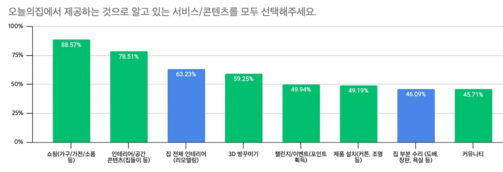

- *Details*
    
    by @Haley Hong 
    
    [[O2O 인지 정기조사 (1차)] 결과 해석 & 분석](https://www.notion.so/O2O-1-23ea597878a081efabe5e7aff980dcf2?pvs=21) 
    
    <aside>
    
    
    **오늘의집 유저는 ‘스탠다드’를 얼마나 인지하고 있으며, 어떻게 인지하고 있을까?**
    
    `스탠다드 서비스에 대해 얼마나 들어봤고, 알고 있을까?`
    
    - 설문 응답자의 **약 절반(45.1%)은 오늘의집 스탠다드를 ‘들어 본 적’**이 있음
        - [비교] 브랜드인덱스 조사 25.1H 응답자의 ‘들어봄/알고 있음’ 보기 선택률이 본 설문의 보기 선택률보다 약 3%p 높음
            
            
            |  | 브랜드인덱스조사 25.1H | 본 설문 | Diff. |
            | --- | --- | --- | --- |
            | 들어봄(알고 있음+없음) | 48.4% | 45.1% | ▼3.3%p |
            | 어떤 서비스인지 알고 있음 | 11.1% | 8% | ▼3.1%p |
    - **스탠다드를 알고 있는 응답자는 책임보장/직접시공보다 적지만, 알고 있는 경우에는 비교적 정확하게 알고 있음**
        - 스탠다드가 어떤 서비스인지 알고 있다는 응답은 **8%**로, 책임보장(13.3%), 직접시공(17.3%) 중 **가장 낮은 인지율**을 보임
        - 스탠다드를 **알고 있는 응답자(n=64)의 37.5%는 스탠다드가 어떤 서비스인지 제대로 알고 있어**(정인지), 책임보장(17.76%), 직접시공(12.95%) 중 **해당 서비스를 알고 있는 경우, 가장 높은 정인지율**을 보임
    
    
    
    |  | 들어봄 | 알고 있음 | 정인지* | 정인지/알고 있음 |
    | --- | --- | --- | --- | --- |
    | 명 | 363 | 64 | **24** | 24/64 |
    | % | 45.1% | 8.0% | **3.0%** | 37.5% |
    
    *정인지: 서비스를 얼마나 정확하게 알고 있는가? (해당 서비스에 대해 '틀린 설명'을 선택하지 않은 경우 '정인지'로 count)
    
    ---
    
    `스탠다드가 무엇이라고 알고 있을까?` 
    
    - 스탠다드 서비스에 대해 알고 있는 응답자의 절반 이상이 스탠다드 서비스가 **오늘의집 표준 견적서를 사용(59.38%)**, 하며 **A/S 책임보장을 지원(57.81%)**함을 알고 있음
    - 스탠다드 서비스에 대해 알고 있는 응답자의 약 절반 스탠다드 서비스가 **오늘의집 자체 상담을 제공(45.31%)한다고 오인지**하며, 3명중 1명은 **직영 시공팀을 배정(32.61%)한다고 오인지**함
    - 최근 6개월 내 집 전체 시공을 경험했거나, 향후 6개월 내 집 전체 시공을 앞두고 있는 응답자*의 약 **90%가 스탠다드 서비스가 ‘표준견적서를 사용’함**을 알고 있음
        
        *응답자 모수가 작아 해석에 유의 필요
        
    
    
    
    참고) 회색:틀린 설명 / 주황색:스탠다드 서비스가 제공하는 것은 아니나, 일부 제공하는 업체가 있어 이번 조사에서는 정인지 응답으로 포함함
    
    
    
    ---
    
    `스탠다드 서비스는 어디서 들어봤을까/알게 됐을까?` 
    
    - **스탠다드/책임보장/직접시공 동일하게 약 70%가 오늘의집 내 노출된 광고/콘텐츠 통해 인지함**
    - 약 **20%는 유튜브/SNS(인스타그램) 광고**를 통해 오늘의집 스탠다드를 인지함
        - 연관 유튜브/인스타그램 콘텐츠
            
            [유튜브]
            
            - 유튜브 ‘오늘의집 스탠다드’ 상위 조회수 콘텐츠인 ‘오늘의집 인테리어’ 채널 시청 중 ‘스탠다드’ 인지한 것으로 추정
            
            
            
            
            
            [인스타그램]
            
            - 각 인테리어 업체에서 ‘오늘의집 스탠다드’ 업체임을 홍보하는 콘텐츠 통해 스탠다드 인지한 것으로 추정
            
            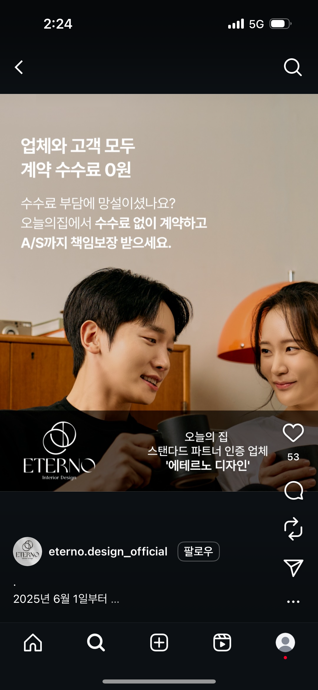
            
            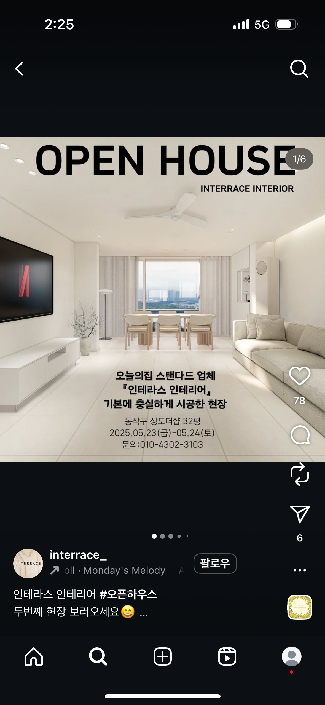
            
            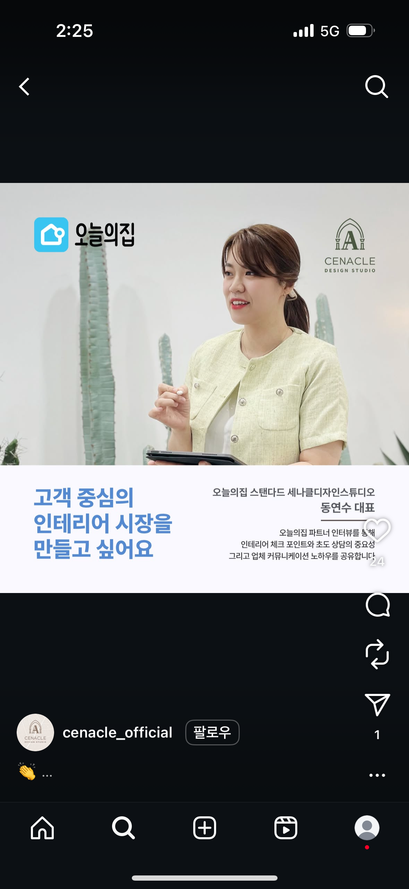
            
            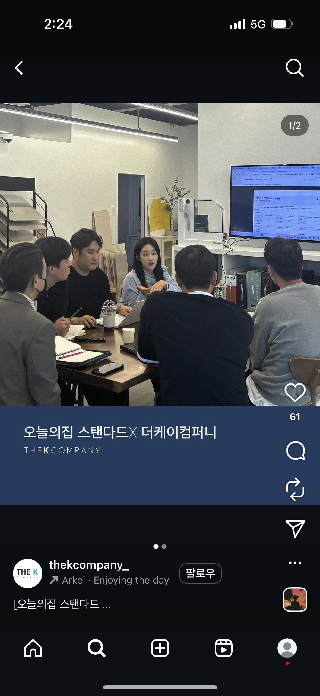
            
    
    
    
    </aside>
    
    <aside>
    
    
    **오늘의집 유저는 ‘책임보장’을 얼마나 인지하고 있으며, 어떻게 인지하고 있을까?**
    
    `책임보장 서비스에 대해 얼마나 들어봤고, 알고 있을까?`
    
    - 설문 응답자의 약 **절반(49.4%)은 오늘의집 책임보장을 ‘들어 본 적’**이 있음
    - 책임보장 서비스를 **알고 있다고 응답한 응답자(n=107)의 80% 이상이** **책임보장에 대해 잘못 알고 있음**
        - 책임보장을 알고 있는 응답자의 17.76%만이 책임보장 정인지
    
    
    
    |  | 들어봄 | 알고 있음 | 정인지 | 정인지/알고 있음 |
    | --- | --- | --- | --- | --- |
    | 명 | 398 | 107 | 19 | 19/107 |
    | % | 49.4% | 13.3% | **2.4%** | 17.76% |
    
    ---
    
    `책임보장이 무엇이라고 알고 있을까?` 
    
    - 책임보장 서비스에 대해 알고 있는 응답자의 약 절반은 책임보장 서비스가 **오늘의집 표준 ~~견적서~~ 사용(56.07%)**, **하자 및 공사 지연 발생 시 고객 만족팀 배정(48.6%)**, **안심 전자 계약 제공(48.6%)**, **시공 업체와 분쟁 발생 시 전담 매니저를 배정(46.73%)**함을 알고 있음
        - 책임보장 서비스에 대해 옳은 설명인 보기는 1~4위를 차지하고 있으나, 틀린 설명과 보기 선택률에 있어 차이가 크지 않음
    - 책임보장 서비스에 대해 알고 있는 3명 중 1명 이상은 책임보장 서비스가 오늘의집 **자체 상담** 제공(45.79%), **엄선한** 시공파트너사 중개(42.99%), **정신적 손해**를 포함한 배상 서비스 제공 (42.99%), **직영 시공팀** 배정(37.38%)을 제공하고 있다고 오인지함
    
    
    
    참고) 회색:틀린 설명
    
    
    
    ---
    
    `책임보장 서비스는 어디서 들어봤을까/알게 됐을까?` 
    
    - **스탠다드/책임보장/직접시공 동일하게 약 70%가 오늘의집 내 노출된 광고/콘텐츠 통해 인지함**
    - 2번째로 높은 응답은 **유튜브/SNS(인스타그램) 광고(13.78%)**로 1위와 5배 이상 차이를 보
    
    
    
    </aside>
    
    <aside>
    
    
    **오늘의집 유저는 ‘직접시공’을 얼마나 인지하고 있으며, 어떻게 인지하고 있을까?**
    
    - 참고) ‘직접시공’은 확정된 Label이 아니며, 배너에서 ‘오늘의집이 직접 시공합니다’로 커뮤니케이션 하고 있어 본 1차 설문에는 ‘직접시공’으로 설문을 진행함
        
        
        
    
    `직접시공 서비스에 대해 얼마나 들어봤고, 알고 있을까?`
    
    - 설문 응답자의 **절반 이상(52.7%)이 오늘의집 직접시공을 ‘들어 본 적’**이 있고, 17.3%는 ‘알고 있다’고 응답해 **스탠다드/책임보장/직접시공 중 가장 높은 인지율을 보임**
    - 그러나 직접시공 서비스를 **알고 있다고 응답한 응답자(n=139)의 약 90%가** **직접시공에 대해 잘못 알고 있으며, 직접시공의 정인지는 세 개 서비스 중 가장 낮음**
        - 책임보장을 알고 있다고 답한 응답자의 **단 12.95%만이 책임보장 정인지**
        - 응답자 수로 보아도 스탠다드 정인지자 24명, 책임보장 정인지자 19명, 직접시공 정인지자 18명으로 직접시공이 가장 낮음
    
    
    
    |  | 들어봄 | 알고 있음 | 정인지 | 정인지/알고 있음 |
    | --- | --- | --- | --- | --- |
    | 명 | 424 | 139 | 18 | 18/139 |
    | % | 52.7% | 17.3% | **2.2%** | 12.95% |
    
    ---
    
    `직접시공이 무엇이라고 알고 있을까?` 
    
    - 직접시공 서비스에 대해 알고 있는 항목으로 올바르지 않은 보기가 1, 2위를 차지하고 있으며, 각 **엄선한 시공파트너사 중개(54.61%), 오늘의집 직접 시공 업체 추천(46.1%)으로, 중개 없이 오늘의집이 직접 시공한다는 가치를 제대로 전달하고 있지 못함 (오늘의집이 관리하는 업체를 연결해준다고 생각)**
        - 참고) 온라인 오유저데이 ‘직접 시공’ 관련된 앱 내 화면을 본 후 유저 소감 (VOC)
            
            🎥영상: [링크](https://drive.google.com/file/d/1YhGMgcVIanRhLlob9uMk43OH1FtAkUnk/view?usp=sharing&t=2256) (관련 VOC 부분부터 재생)
            
            
            
            참여자가 본 화면
            
            > *“이 텍스트만 읽어봤을 때는 **오늘의집이 직접 약간 전문 인력을 키워서 도배를 한다는 느낌보다는, 일단은 여러 사장님과 업체들을 통해서 이렇게 해야한다 하는 기준점**을 오늘의집에서 정해주고, 그런 과정을 오늘의집에 사장님이 업로드 하는 쪽으로 방향성을 잡아가는게 아닐까? 하는 생각이 들어요.”*
            > 
            
            
            
            참여자가 본 화면
            
            > *“이거 봐도 (앞서 생각한 것과) 비슷하긴 한데 **직영 서비스라고 하니까 애매하게 느껴지는 것 같아요.**”*
            > 
            
            (현재는 아래 화면의 문구로 변경됨)
            
            
            
    - 직접시공 서비스에 대해 알고 있는 응답자의 약 40%는 직접시공 서비스가 **시공 후 A/S 보장(42.55%), 오늘의집 직영 시공팀 배정(41.84%), 오늘의집 책임 매니저 배정(39.72%), 3D 인테리어 모델링 제공 (39.01%)**을 알고 있음
    
    
    
    참고) 회색:틀린 설명
    
    
    
    ---
    
    `직접시공 서비스는 어디서 들어봤을까/알게 됐을까?` 
    
    - **스탠다드/책임보장/직접시공 동일하게 약 70%가 오늘의집 내 노출된 광고/콘텐츠 통해 인지함**
    - 2번째로 높은 응답은 **유튜브/SNS(인스타그램) 광고(14.32%)**로 1위와 5배 이상 차이를 보임
    
    
    
    </aside>
    
    by @Ivy Kim  
    
    [[2512] AS-IS 오늘의집 이사 서비스를 쓰는 유저는 어떤 사람일까? ](https://www.notion.so/2512-AS-IS-2c3a597878a08088bb39cb2250a65732?pvs=21) 
    
    > **AS-IS 유입경로(유저들은 어디서 이사 서비스를 발견할까?)**
    ✔️ **O2O 생태계 내 발견이 핵심 :** 이사 서비스 유입의 약 66%가 O2O 메인(38.7%)과 전체메뉴(27.2%)에서 발생합니다. 
    
    ****✔️ **검색 유입 비중이 낮음:** 통합검색에서의 유입은 7.4%로, O2O 메인이나 전체메뉴 대비 낮습니다. 
    "이사"를 목적으로 검색해서 들어오는 유저보다, 플랫폼 내 탐색 중 발견하는 유저가 많습니다. 
    
    ✔️ **타 O2O 서비스와의 시너지:** 오늘의집 이사 서비스로 유입되는 전체 비중의 7.7%가 ****입주청소에서 넘어옵니다. 이사와 입주청소는 시기적으로 함께 필요한 서비스로, 자연스러운 크로스셀 연결고리가 있습니다. 
    
     **O2O 서비스 탐색/견적 행동 비교**
    ✔️ 이사 견적 신청 하기 전 약 40%는 O2O홈 방문하며, O2O 상담 신청 가능성 일반 유저 대비 15.9배(5.28%) 높음
    > 

---

# 48
신규고객은 집들이 콘텐츠가 낯설고, 
콘텐츠를 어떻게 찾아야하는지 몰라요.

집들이 콘텐츠는 평형 필터를 통해 원하는 공간에 맞는 콘텐츠를 찾을 수 있습니다. 또한 집과 관련된 유용한 상품 및 배치 정보를 알 수 있기 때문에 특히 공간 변화를 앞두거나 진행중인 LE고객에게 가치가 높습니다. 

특히 신규 유저들에게 이러한 오늘의집 집들이의 가치를 제때에 전달해야 하지만 신규 고객은 오늘의집 집들이가 어떤 콘텐츠인지 잘 모릅니다. 가장 심각한 문제는 오늘의집에서도 네이버/유튜브처럼 콘텐츠를 검색해서도 찾을 수 있는지 모르며 어떻게 찾아야하는지 모른다는 것입니다.

- *Details*
    
    
    | 구분 | 신규 유저 | 기존 유저 |
    | --- | --- | --- |
    | **인지도** | - P3: 집들이/오늘의취향 이라는 글자 자체가 와닿지 않아서 클릭하지 않았다. 오늘 세일하는 상품이 있을 것 같다.  
    - P10: 집들이 명칭을 처음 들었다 | - P8: "집들이 콘텐츠가 무엇인지 정확히 인지하지 못했지만 관련 콘텐츠는 본 적 있다" |
    | **활용 시점** | - P7: 이사 당시 20평대 아파트 집들이를 많이 참고 | - P0: 이사/인테리어할 때는 자주 봤지만 최근엔 거의 안 본다 
    - P4: 초기(자취 때)는 적극 활용했으나 신혼집 등 특정 시점에는 맞는 사례가 없어 참고하지 않음 |
    | **평상시 활용** | - P10: 집들이 자체를 잘 몰라 활용 없음 
    - P3: 잘 보지 않음, 3D 렌더링 콘텐츠가 더 직관적이라 선호 | - P0: 최근엔 집들이 안 본다고 언급 
    - P4: 최근에는 거의 보지 않고 사진 위주로만 탐색 
    - P8: 최근에는 집들이보다는 쇼핑/후기 중심 |
    
    > *(콘텐츠를 찾을 수 있다는 사실 자체를 생각하지못함)*
    > 
    > 
    > *Sungbae Kim**:** 방금 그 주방 자투리 공간 얘기해 주셨잖아요. 혹시 한번 오늘의 집에서 한번 찾아보시겠어요?*
    > 
    > `*신규`P3 **:** 어떻게 검색하면 될까요?*
    > 
    > *Sungbae Kim**:** 어떻게 하면 될 거 같으세요?*
    > 
    > `*신규`P3 **:** 여기서 검색을 할 수가 있을까요? 어, 일단 검색을 했을 때는 아, 콘텐츠에 나오는 건가요?*
    > 

---

# 49
숏폼에서는 영상만 본다? 
No, 더보기 클릭, 대화창 클릭 등 다양한 액션을 해요

고객은 숏폼을 통해 상품을 추가로 탐색하려는 니즈를 유의미하게 보였습니다. 특히, 시각적으로는 더보기 버튼보다  상품 썸네일이 더 강조되어 있으나 더보기를 누르는 행태가 더 많이 관찰되었습니다.

숏폼에 담긴 전반적인 정보를 조망하듯 탐색하고 싶어했으며 CDP에 담긴 상품 태그를 눌러 보는 기존 콘텐츠 탐색 행태가 숏폼에서도 관찰되었습니다. 

숏폼 플레이어에 진입했으나, 영상만 보지 않고, 영상에 담긴 정보(썸네일, 더보기, 댓글, 프로필 etc) 관심을 높게 보였습니다.  

따라서, 조회시간만으로는 숏폼영상에서 고객이 느끼는 가치를 제대로 측정하기 어렵기 때문에 더보기, 댓글, 썸네일 클릭 지표를 유의깊게 봐야합니다.


- *Details*
    
    by @Helena Kim 
    
    [[2508] 숏폼 콘텐츠 관련 ](https://www.notion.so/2508-256a597878a080179815de57c9741b8f?pvs=21) 
    
    by @Genie Heo 
    
    [플레이어 내에서의 영상 콘텐츠 유의미한 조회 지표 정의](https://www.notion.so/268a597878a0808a9357ed89b197257a?pvs=21) 
    

---

# 50
오늘의집 숏폼, 
시간 때우려고 보지 않아요.

**특히 상품이 부각된 콘텐츠**를 가장 선호했습니다. 노하우/트렌드/룸투어/상품으로 분류된 콘텐츠의 선호도를 보면 각자 유사했으나, 실제 콘텐츠에서 상품 위주로 연출한 경우 선호도가 높았습니다. 상품을 부각시키지 않고 인테리어를 강조한 콘텐츠는 사람마다 비선호하는 이유가 다양했습니다. 

[상품이 부각된 콘텐츠1](_Where_my_mornings_officially_begin.%E1%84%89%E1%85%B3%E1%84%85%E1%85%A6%E1%84%83%E1%85%B3%E1%84%85%E1%85%A1%E1%86%BC_%E1%84%91%E1%85%B5%E1%84%83%E1%85%B3%E1%84%8B%E1%85%A6_%E1%84%8B%E1%85%A9%E1%86%AF%E1%84%85%E1%85%B5%E1%86%AF_%E1%84%84%E1%85%A2%E1%84%86%E1%85%A1%E1%84%83%E1%85%A1_%E1%84%87%E1%85%A1%E1%86%AB%E1%84%8B%E1%85%B3%E1%86%BC_%E1%84%91%E1%85%A9%E1%86%A8%E1%84%87%E1%85%A1%E1%86%AF%E1%84%92%E1%85%A2%E1%86%BB%E1%84%83%E1%85%A5%E1%86%AB_%E1%84%89%E1%85%B5%E1%86%AF%E1%84%87%E1%85%A5_%E1%84%83%E1%85%B3%E1%84%85%E1%85%A9%E1%84%8B%E1%85%AF%E1%84%8B%E1%85%B5_%E1%84%8C%E1%85%A1%E1%84%85%E1%85%B5.mp4)

상품이 부각된 콘텐츠1

[상품이 부각된 콘텐츠2](Tuvvys.mp4)

상품이 부각된 콘텐츠2

- *Details*
    
    by @Helena Kim 
    
    4명의 참가자에게 공통으로 보여준 콘텐츠 (노하우/트렌드/룸투어/상품) 중 트렌드와 룸투어 영상을 가장 선호하지 않았다. 그 이유로는 자신의 취향에 맞지 않았거나 사진의 집 평수와 달랐거나 리모델링에 관심이 없기 때문이었다. 
    
    - 선호하지 않은 영상 링크 1 (4명 선택) : [https://www.instagram.com/reel/DHkyVGYywnx/?utm_source=ig_web_copy_link&igsh=d2xqNXhqMW44bXFp](https://www.instagram.com/reel/DHkyVGYywnx/?utm_source=ig_web_copy_link&igsh=d2xqNXhqMW44bXFp)
    - 선호하지 않은 영상 링크 2 (3명 선택) :  [https://www.instagram.com/reel/DMFmxMup2m_/](https://www.instagram.com/reel/DMFmxMup2m_/)

---

# 51
오늘의집 숏폼, 
썸네일 제목 유무가 클릭을 만들지 않아요.

(1) 썸네일 제목 유무에 따른 CTR 차이가 거의 없습니다. 

(2) 공간변화 전보다는 공간변화 직전/직후 또는 공간변화 이후의 콘텐츠에 대한 CTR이 더 높게 나타납니다. 

(3) 영상 내 인물 여부에 따른 차이는 거의 나타나지 않았습니다.


- *Details*
    
     [영상 콘텐츠 썸네일 CTR - 1차 분석(마이피드 2그리드 모듈 한정)](https://www.notion.so/CTR-1-2-24fa597878a080c79c0eec0e18e49123?pvs=21) by @Genie Heo 
    
    ### 커버지정/미지정 여부
    
    - 커버 지정 여부에 따른 차이가 뚜렷히 보이지는 않는 모습
        - **모든 그래프의 X축 하단 숫자는 해당 속성에 속하는 콘텐츠의 숫자를 의미합니다**
    
    
    
    ### 썸네일 제목 유무
    
    - **✅ 예상과 달리 썸네일 제목 유무에 따른 CTR 차이가 거의 없습니다.**
        - 썸네일 텍스트 구분이 잘 되었는지 확인하는 [쿼리](https://redash-contents.datahou.se/queries/13129/source)
    
    
    
    ### 공간변화 시점
    
    ✅ 공간변화 전보다는 공간변화 직전/직후 또는 공간변화 이후의 콘텐츠에 대한 CTR이 더 높게 나타납니다.
    
    
    
    ### 주제
    
    
    
    ### 콘텐츠 앵글
    
    - ✅ Advantage/ How/ Performance 콘텐츠의 CTR이 전반적으로 더 높게 나타납니다
    
    
    
    ### 인물 타입
    
    - 인물 여부에 따른 차이는 크게 두드러지지 않습니다.
    
    
    
    ### 오디오 타입
    
    - 영상에 오디오가 포함되었는지 여부는 썸네일에서 알기 어렵기 때문에 오디오 타입이 CTR에 중요하다고 해석하기는 어렵습니다.
        - 기존 고성과 콘텐츠가 오디오가 없는 경향이 높다거나 하는 다른 요인이 이와 같은 착각적 상관을 만들었을 가능성이 큽니다.
    
    
    
    ### 자막
    
    - 오디오 타입과 동일한 영향으로 생각됩니다.
    
    
    

---

# **52 
상품찾기의 시작은 
검색창이 아니라 우리집**

고객들은 어떤 상품이 필요할지 이미 명확히 인식하고 있으나, 실제로 찾아보는 단계까지는 이르지 않았습니다. 왜냐하면 **돈이 없어서가 아니라, 찾아보는 노력(검색 등을 통해) 투자하기 귀찮기 때문입니다.**

고객에게 ‘내 공간’은 보이지 않는 핵심 필터지만, 기존 서비스의 탐색 방식은 이를 반영하지 못합니다. 그 결과, 고객은 **우리 집에 어울리는 상품을 찾는 대신 플랫폼이 제공하는** 막연한 필터 조합과 끝없는 스크롤에 의존할 수밖에 없습니다.

프로토타입 AI Agent와 집 사진을 활용해서 상품 탐색을 했을 때, 상품 탐색이 더 쉽다고 느꼈습니다.


- *Details*
    
    by @Carl Jang @Sungbae Kim 
    
    [유저 구매 여정 개선 프로젝트](https://www.notion.so/181a597878a080d4ae8bdd99fcd67066?pvs=21) 
    
    - 고객이 사고 싶은(살) 상품의 첫 PDP방문까지 탐색 시간은 212분이다. 8번 방문해야 찾을 수 있다.
    
    [☀️ Summary](https://www.notion.so/Summary-273a597878a0816195b1e2e61a5f2133?pvs=21) 
    
    1. 사람들은 자신이 공간에 관련된 고민을 떠올리고 후보 상품군까지 정해두었다.
    2. 상품 찾는 과정에서 ‘내 공간’은 보이지 않는 필터다. 그런데 기존 탐색방식은 이를 지원하지 않는다. 
    3. 고객은 상품 탐색 과정이 즐겁다. ‘무조건’ 가장 좋아하는 상품 하나를 빨릴 발견하고 싶은게 아니다.
    4. AI Agent가 공간을 중심으로 상품 탐색 경험을 제공하는 것이 더 쉽다고 생각하며, 상품을 ‘렌더링(우리집에 배치)’하는 것은 핵심은 아니다.
    
    [유저 그룹별 방문 후 구매 상품 발견 소요 시간](https://www.notion.so/279a597878a08039997ac94d33085226?pvs=21) 
    
    
    
    신규유저는 살 상품 발견에 25분을 사용하고 있음. 평균은 50분.(살 상품을 첫발견하는데 아주 오랜 시간이 걸리는 유저들이 큼) **상품 1개가 아닌 N개를 산다고 했을 때, 탐색시간이 점점 감소하는 것이 아니라 선형적으로 증가함. 즉 유저들은 상품 1개 찾기/사기 단위로 시간을 사용하고 있음.** 
    
    [**타임라인 내 구매 상품 발견 시점 (동일 카테고리 조건 추가) ([쿼리](https://redash-data.datahou.se/queries/5151/source#10910))**](https://www.notion.so/1eea597878a080028a27db19a40eb598?pvs=21) 
    
    고객이 살 상품을 발견하는 시점은 언제일까? 한 10개쯤 보면 6~7번째 본 상품이 실제로 산 상품이더라.
    
    [**유저들의 상품찾기 시간, 패턴 파악**](https://www.notion.so/292a597878a08014bacccf40d8f82a7d?pvs=21) 
    
    <aside>
    💡
    
    **유저들은 원하는 상품을 탐색하는데까지 긴 시간이 소요된다.**
    
    - Current, New, Revived 유저군 모두 앱 방문 이후 구매 상품 탐색까지 긴 시간 소요 ([쿼리](https://redash-data.datahou.se/queries/6333/source))
        - Current : 7days / New : 12hr / Revived : 1day (실제 시간 기준, 중간값)
        - Current User 대비 New, Revived의 경우 목적을 갖고 앱에 재방문하거나 가입하여 보다 뚜렷한 구매의사로 빠르게 상품 탐색 이후 구매
        - 원하는 니즈를 빠르게 만족하여 리텐션 측면에서 이탈도 더 크게 발생
    - 앱에 체류하고 있는 세션 기준으로 보아도 탐색에 소요되는 시간이 꽤 김
        - Current : 97분 / New : 51분 / Revived : 37분 (세션 시간 기준, 평균값)
    - 중간값으로 확인하였을 때 시간이 짧은걸 보아 고탐색 유저군의 탐색 시간이 훨씬 길게 소요
        - Current : 8분 / New : 4분 / Revived : 2분 (세션 시간 기준, 평균값)
    </aside>
    
    <aside>
    💡
    
    **New, Revived 유저의 경우 앱 진입 시 뚜렷한 목적을 가지고 방문한다.**
    
    - n번째 구매 상품 발견까지 소요시간을 보면 모든 그룹에서 linear하게 상승 ([쿼리](https://redash-data.datahou.se/queries/6470/source#13462))
        
        
        
        - New, Revived의 구매 상품 발견 시간이 더 짧음
        - 첫 구매 상품 발견 이후 구매 상품들을 발견할 때 탐색 시간이 감소하지 않고 linear 시간 소요
    - 구매 이전 구매 상품과 동일 카테고리 상품 탐색을 보았을 때 New, Revived의 탐색 수가 더 적음
        
        
        
        - Current 대비 목적성이 뚜렷하여 탐색을 넓게 가져갈 니즈 적음
        - 구매 외 스크랩 상품으로 살펴보아도 비슷한 결과 ([쿼리](https://redash-data.datahou.se/queries/6459/source))
            
            
            
        - 처음 스크랩한 상품과 이후 스크랩 상품의 카테고리를 비교하였을 때 New, Revived그룹은 동일한 카테고리 상품을 스크랩하는 경향이 높음
            
            
            
            - New, Revived의 경우 구매 니즈가 뚜렷하여 앱에 재방문 or 가입하였기에 탐색의 범주가 넓지 않음
    - New, Revived는 상품 탐색 과정에서 특정 카테고리를 한정해서 보는 경향 ([쿼리](https://redash-data.datahou.se/queries/6455/source#13437))
        
        
        
        - 구매 상품 동일 카테고리 상품 조회 비중이 New, Revived 그룹에선 80%, Current는 60%
        - depth2 기준으로 보아도 70% vs 50%
        - 평균 상품 조회 수는 Current 그룹이 2배 가까이 높음
            
            
            
            - New, Revived의 경우 구매할 상품군이 명확하여 탐색의 확장이 넓지 않음
    </aside>
    

---

# **53** 
🇯🇵 일본 유저, 신규는 원하는게 명확하지 않고, 
기존 유저는 신중하게 검토하고 있는 상태

일본 유저들의 방문별 리드타임을 분석한 결과, **마지막 방문 이후 90일이 지난 경우 복귀 확률이 구조적으로 낮아집니다.**

이를 바탕으로 신규/잔존/재활성 유저로 세그먼트를 구분하였을 때, 각각의 세그먼트에서 서로 다른 모습이 나타납니다.

이를 한 줄로 표현하면, **신규 유저는 “무엇을 원하는지 명확하지 않은 상태”, 잔존 유저는 “구체적인 목적은 있지만 최종 선택을 위해 비교하는 상태”, 재활성 유저는 “신중하게 검토하는 상태”** 라고 이야기할 수 있습니다.

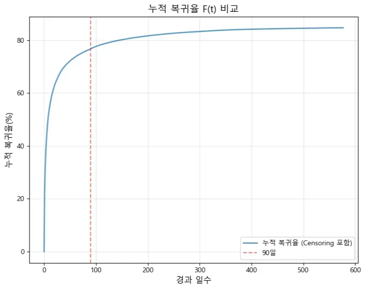

- *Details*
    
    by @Asher Kang 
    
    [Global 유저 세그먼트 구분 및 DFG 시각화](https://www.notion.so/Global-DFG-27ea597878a080fd8bafdae6fe7fdeb7?pvs=21) 
    
    - **신규 유저는 약 18회로 가장 많은 페이지 이동을 하고 잔존 유저 및 재활성 유저는 약 12회로 신규 유저와 비교하여 낮은 이동을 보임.**
        - 하지만 잔존 유저는 높은 상품 비교 행동을 보였고 재활성 사용자는 상품의 재확인 행동이 많은 뚜렷한 세그먼트별 행동 패턴의 차이를 보임.
    - 이러한 차이와 반대로 모든 세그먼트에서 SRP→SRP 60% 이상의 **검색 내 반복이 발생 및 CATEGORY를 통한 PDP 진입률이 CLP를 통한 PDP 진입률보다 4-5배 높은 공통적인 패턴도 확인**할 수 있음.
        - 모두 SRP(검색)지면을 적극 활용하지만, 결국 그 지면안에서의 이동이 빈번하며 PDP로의 전환 등 실제 JPC에서 원하는 PDP로의 진입 비중은 낮게 나타나고 있음.
        - 이를 위해서 SRP → PDP로의 전환을 위한 개선 요소가 필요하다고 판단.

---

****

# **54 
고객은 이사 전에는 큰 가구를, 
이사 후에는 작은 소품을 산다**

고객은 이사를 마치기 전 보다 이사를 준비하는 단계에서 돈을 더 쓰고 있습니다. 이사 준비 단계에서는 단가가 높은 큰 가구/가전 위주로 공간을 먼저 채워 가구 배치의 큰 틀을 잡습니다. (평균 판매 가격(ASP) 기준)

이사 후에는 작은 가구/가전, 패브릭, 홈데코 등의 상대적으로 저가의 다품목 상품을 구매하여 채워나갑니다. 더불어 이사하는 과정에서 점점 자기 주도형으로 변화하며 지속적으로 자신의 취향에 맞는 상품을 찾고 구매합니다.

> “네 **입주하고 나서 구매했고 지금도 계속 사고 있어가지고**,  제가 잘 질리는 편이라 구매하고 당근에 올렸다가 또 다시 사고 이렇게 오늘도 계속 예쁜 게 계속 나와가지고 계속 사요.”
> 
- *Details*
    
    by @Joah Lee @Ikpyo Hong 
    
    [글린다 이사 시기별 구매 카테고리 분석](https://www.notion.so/277a597878a080acb020c58075dc69a3?pvs=21) 
    
    [[이사/결혼 고객은 어디서 어떻게 구매를 할까?] 결과 해석 & 분석](https://www.notion.so/13ea597878a0811fb6ddc80d09c8a157?pvs=21) 
    

---

# **55** 
고객은 패키지 가격의 할인률 보다 정말 최저가인지 집중한다

나만의 패키지를 탐색하는 고객은 주문 금액의 할인율이 높다고 해서 구매하지 않습니다.  

오히려 오늘의집 가격이 온라인 최저가와 같거나 더 저렴할 때 구매가 늘어나는 경향을 보입니다.

패키지 상품은 가격관리를 하고 있는, 이미 최저가 이거나 최저가에 준하는 상품이 많음에도 패키지를 탐색한 고객은 최저가로 제공되고 있다는 신뢰가 적었으며 최종 가격을 확인하며 타 서비스와 비교하는 행동을 보였습니다.

단순 할인율보다 ‘최저가와 비교한 상대 가격’이 전환율에 더 중요한 변수이며, 같은 할인율이라도, 경쟁사 대비 더 싸 보일수록 전환율은 높아지게 됩니다.


- *Details*
    
    by @Sophie Cho @Joah Lee @Ikpyo Hong 
    
    [패키지 할인율에 따른 전환율 분석](https://www.notion.so/231a597878a080e9b1edd937b1dad31c?pvs=21) 
    
    [[2506] 글린다 이용 고객의 경험은 어떠할까? ](https://www.notion.so/2506-1f8a597878a0801bb42afec2ba6a9f6c?pvs=21) 
    
    ## A. 이탈 고객 설문 & 인터뷰 결과([[2505] 글린다 이탈 고객의 경험은 어떠할까?](https://www.notion.so/2505-1f8a597878a0805c83e2fb53904f5d0a?pvs=21))
    
    | 항목 | 주요 인사이트 | 액션 아이템 (idea) |
    | --- | --- | --- |
    | 패키지 구매 니즈
    높음 | - 라이프 이벤트가 있는 경우, 패키지 구매 니즈가 높다.
       ㄴ 추가 할인에 대한 기대감이 있다.
    - 현재 구매 조건은 2회 이상 구매의 허들로 작용한다. | - LE 고객 타겟팅 고도화
    - 진입한 고객 대상으로 이사 여부/일정 수취하여 타겟팅
    - 이사 전후 시점을 고려한 구매조건 다양화
    - 재구매시, 구매조건 완화 |
    | 할인 대상 불명확 | - 내가 담고자하는 상품이 할인 대상인지 확신을 갖지 못한다.
    - 이사/결혼에 필요한 모든 카테고리 상품을 할인해주고자 의도한 것이나, 유저는 특정 상품이라 이해한다.
    (e.g 소파일지라도, 내가 사고싶은 이 소파가 할인되나? 라고 생각) | - SRP/PLP 등 PDP 이전 탐색 퍼널에 패키지할인 구분자(e.g.필터) 추가
    - 대상 카테고리 확대 및 단순화 (e.g : 식품 외 모든 상품)
    - 내가 관심있는 상품이 할인 대상임을 쉽게 인지하고 추가할 수 있도록 개선
     |
    | 할인 체감 적음 | - 바로 보이는 할인액을 보고 할인율을 계산하고, 적다고 느낀다.
    - 최저가임을 인지하지 못한다. | - 할인율이 커보이게 : 정상가 기준으로 할인율 노출
    - 할인이 여러가지 적용된 것이 잘 보이게 : 즉할, 상쿠, 장쿠, 패키지할인 등 내역 쪼개서 노출
    - 할인율 실험 : 실제 할인을 더 해준다
    - 최저가임을 명시해준다 |
    
    ### 🚨 핵심 문제
    
    | 문제영역 | 상세 문제 |
    | --- | --- |
    | **낮은 할인율 체감** | 기대 대비 낮은 할인 금액 및 할인 구조 이해 어려움 |
    | **상품 추가 UX 불편** | 장바구니→패키지 상품 이동 불가능, 상품 추가 방식 혼란 |
    | **필수 카테고리 조건 부담** | 가구 2개 이상 필수 조건이 구매 흐름 방해 |
    | **할인 적용 방식 혼란** | 할인 기준(쿠폰, 즉시할인, 패키지 할인 등)이 명확하지 않음 |
    | **배송 경험 미흡** | 배송 지연, 업체 응대 불편, 취소/환불 정책 불명확(한개 취소하면 할인 받은 것이 어떻게 되는지) |
    
    =====
    
    ### 할인가 커뮤니케이션 변경 실험 ([XPC](https://xpc.dailyhou.se/experiments/1646))
    
    - 유입고객당 글린다 거래액의 유의한 하락 발생, 실험 시작 11일 만에 실험 종료
        - **Group A (Winner)**AS-IS (34%)
        - **Group B**Value Prop Comm 강화 + 할인가 설명 간단히 (33%)
        - **Group C**Value Prop Comm 강화 + 할인가 설명 상세하게 (33%)
    - 할인 체크 시도 유저 비중이 증가하긴 하였으나, 구매자수 / 거래액의 감소를 유발
        - 뭉뚱그려진 모달 내 할인가 <> 주문서내 상세하게 나온 할인 내역 사이의 정보 격차가 고객에게 짜증을 유발하는 요소가 된 것으로 보임
            - 아까는 15만원 할인이라더니, 막상 주문서 가보니 왜 패키지 할인은 8천원이야?
        
        
        
    
    - 다만, C안에서는 초반에 A와 구매전환 / 거래 관점에서 큰 격차 발생하였으나, 실험 기간동안 지속적으로 이 격차가 축소되는 트렌드 확인. “할인에 대한 강한 커뮤니케이션” 이 전환에 도움 될 수 있다는 가설은 아직 검증해볼 가치가 있어보임
    
    
    
    - 할인가 조회 모달의 실험 모수가 아직은 너무 작아, 향후 이터레이션은 충분한 모수 확보될때까지 잠정 연기
        - 거의 2주 동안 1만여명만 실험에 참여됨.
        - 위 그래프 에서도 실험군간 등락이 종료시점까지도 반복되는 트렌드
    

---

# **56 
레이어가 트렌디하긴 한데
레이어만의 뭔가가 없어요.**

레이어는 71%의 고객이 브랜드를 인지하지 못하는 신생 브랜드이며, 인지 대비 구매자 비율은 9% 입니다. 구매 전환의 가장 큰 허들은 1. 브랜드 인지도 / 2. 가격 경쟁력 / 3. 오프라인 체험 부재 입니다.

1. 레이어는 신생 브랜드이기 때문에 신뢰가 충분히 쌓이지 않았으며, 그 결과 고객은 한샘, 까사미아 등 이미 알고 있는 기존 브랜드를 더 안전한 선택지로 보는 경향이 있습니다.
2. 고객은 레이어의 디자인을 모던하고 심플하다고 긍정적으로 평가했지만 독창적인 개성이 부족하다고 평가합니다.
3. 실물 체험이 어렵다는 점도 구매를 망설이게 하는 핵심 요인이며, 오프하우스 북촌에 쇼룸이 있다고도 알지 못합니다. 


- *Details*
    
    by @Ikpyo Hong 
    
    [[2509] 레이어 인식/탐색/구매 경험은 어떠할까?](https://www.notion.so/2509-26ca597878a08095b32aeee05a611563?pvs=21) 
    
    <aside>
    📌
    
    ## 탐색 고객 전체 Survey
    
    - 설문조사는 가구 구매 경험이 있는 총 360명의 응답자를 대상으로 진행되었으며, 이 중 71%는 레이어 브랜드를 인지하지 못하는 것으로 나타남
    - 레이어는 아직 시장에서 낮은 인지도를 보이고 있으며, 브랜드 인지자 중에서도 실제 구매로 이어진 경우는 9%에 불과함
    
    ### 핵심 요약
    
    1. **브랜드 인지도 및 구매율 저조**
        1. 레이어는 응답자의 대다수가 알지 못하는 신생 브랜드이며, 인지하고 있더라도 구매로 이어지는 비율이 매우 낮음
    2. **가격 경쟁력 부족**
        1. 레이어 제품을 탐색만 하고 구매하지 않은 주요 원인으로 **가격 및 혜택**이 가장 많이 꼽혔음
        2. 응답자들은 레이어의 디자인이 모던하고 심플하다고 평가하면서도, 오늘의집 자체 브랜드라는 기대와 달리 가격이 비싸다고 느꼈음
    3. **브랜드 신뢰 및 경험 부재**
        1. 가구 구매의 중요 요소인 **실물 체험**이 불가능한 점이 구매를 망설이게 하는 큰 요인으로 작용함
        2. 또한, 신생 브랜드에 대한 신뢰 부족으로 인해 기존 가구 브랜드(한샘, 까사미아 등)를 선택하는 경향을 보임
    4. **오늘의집 PB에 대한 인식**
        1. 레이어 탐색 고객은 레이어가 오늘의집 브랜드라는 점을 인지하고 있었지만, 이는 구매에 큰 영향을 미치지 못함
        2. 소비자는 브랜드보다 **제품의 품질, 디자인, 가격**을 더 중요하게 고려함
    </aside>
    
    <aside>
    📌
    
    ## 미구매자 Interview
    
    ### 타브랜드 구매 고객 인터뷰 핵심 요약
    
    1. 오늘의집 브랜드로 인식하는 경우 신뢰는 확보되나 확신은 부족
        1. “오늘의집 제작 브랜드”라는 점은 신뢰 요인
        2. but 브랜드 인지도·리뷰 수 부족으로 고가 가구 구매 시 주저함
    2. 체험 기회 부재가 전환의 최대 장벽
        1. 고객들은 50만 원 이상 고가 가구 구매 시 실물 체험을 하고 싶어함
        2. 하지만 오프하우스 쇼룸 인지율이 낮고 지방의 경우 체험이 어려움
    3. 옵션 다양성 부족으로 구매 이탈
        1. 컬러·소재·기능(슬라이딩, 커스텀 등) 선택지가 한정돼 다양한 고객 니즈를 충족 시키고 있지 못함
        2. 중간 가격대 포지셔닝의 양날의 검
    4. 이케아보다 비싸고 프리미엄보다는 저렴한 중간 가격대
        1. 그렇다고 한샘이나 까사미아 동급으로 포지셔닝 되지 않음
        2. 중가 브랜드 구매 고객에게는 차별적 아이덴티티가 부족함
        3. 프리미엄 구매 고객에게는 가성비 브랜드로 평가
    5. 디자인은 긍정적이나 시그니처 디자인 약함
        1. 깔끔·모던한 디자인이 강점이긴 하지만 특색이 없음
        2. “비교 브랜드 중 하나”로만 인식 → 독창성 강화 필요
    </aside>
    
    <aside>
    📌
    
    ## 구매자 Interview
    
    레이어 구매 고객들은 주로 이사나 결혼을 앞둔 20~40대 기혼 가구
    
    레이어는 '가성비'를 무기로 젊은 세대에게 어필하는 신생 브랜드로 인식되나 성장을 위해 해결해야 할 과제들이 존재
    
    ### 1. 현재 포지셔닝
    
    | 포지션 | 고객 인식 및 근거 |
    | --- | --- |
    | **가성비 브랜드** | - 고가 브랜드와 비교하여 "품질 차이는 적지만 가격이 저렴한" 브랜드로 인식
    - 특히 예산 관리가 필요한 신혼 부부와 재이사를 앞둔 고객에게 결정적 요소로 작용 |
    | **현대적 디자인** | - 한샘/리바트 등 기존 브랜드가 "뒤처지고 올드한" 이미지
    - 반면, 레이어는 "젊고 힙한" 느낌의 심플하고 모던한 디자인을 제공 |
    | **신뢰의 확보** | - '오늘의 집 자체 브랜드'라는 점이 품질에 대한 기본적인 신뢰(보장)를 제공
    - 또한, '원하는 날 도착' 등 차별화된 배송 경험이 긍정적 |
    
    ---
    
    ### 2. 향후 풀어야 할 문제
    
    | 과제 영역 | 고객 니즈 및 해결책 |
    | --- | --- |
    | **라인업 부족** | - 고객은 소파 외 원하는 디자인(미드 센추리, 우드톤 등)이나 소재(패브릭)가 없어 레이어 외 타사 제품을 구매
    - 다양한 컨셉과 소재(패브릭, 원목)의 옵션 확장이 필수 |
    | **브랜드 인지** | - 레이어가 '오늘의 집' 브랜드임을 뒤늦게 알거나, 오프라인 쇼룸이 있는걸 알지 못하는 경우도 존재
    - '오늘의 집 레이어'와 같이 직관적인 브랜드 연관성 홍보 필요 |
    | **전문성 인식** | - 침대/매트리스와 같은 중요 품목은 전문 브랜드에서 구매하려는 경향 존재
    - 레이어는 가구 전문 기업으로서의 이미지를 장기적으로 구축할 필요가 있음 |
    | **품질 디테일** | - 착석감은 만족스러우나, 검은색 가죽의 먼지 묻음 이슈 존재
    - 패브릭 의자의 위생/세탁 문제 등 걱정되는 요소 존재
    - 사소하지만 불편한 사용 디테일 개선이 재구매율을 높이는 포인트 |
    </aside>
    
    <aside>
    📌
    
    ## 가설 검증
    
    ### 1. 인지 & 비교 (전체 설문)
    
    - H1-1: 최근 6개월 내 가구를 구매/탐색한 고객 중 상당수는 레이어를 인지하지 못했거나 “탐색 중 처음 알게 된” 경우일 것이다. → **YES**
    - H1-2: 레이어를 인지한 고객은 대부분 다른 브랜드와 비교를 한다. → **YES**
    
    ### 2. 구매자
    
    설문
    
    - H2-1: 레이어 구매자의 주요 선택 요인은 디자인과 가격/혜택일 것이다. → **YES**
    - H2-2: 구매 전 고민 요인은 가격과 품질/내구성이 가장 클 것이다.
        - → **일부 No**, 품질/내구성은 고민 요소가 아니었음
    - H2-3: 구매 결정의 최종 트리거는 프로모션·후기·추천 같은 “외부 자극”일 가능성이 크다.
        - → **No**, 오프라인 체험 및 디자인/사이즈 다양성 등이 중요
    
    인터뷰
    
    - **디자인/가격 합리성:** 고객은 레이어의 **미니멀한 디자인**과 **합리적인 가격**에 만족하여 구매를 결정했을 것이다 → **YES**
    - **배송/경험 만족:** '오늘의집 배송' 서비스(원하는 날 도착, 빠른 배송)를 경험하고 만족도가 높아졌을 것이다 → **YES**
    - **온라인 구매 신뢰:** 오프라인 체험 없이 온라인 리뷰, 상세 페이지, '오늘의집' 브랜드 신뢰만으로도 구매를 확신했을 것이다 → **No**
    - **제품 품질 만족:** 디자인뿐만 아니라 실제 사용 후 **품질과 내구성**에 만족했을 것이다 → **YES**
    
    ### 3. 미구매자 (탐색했지만 타브랜드 구매한 고객)
    
    설문
    
    - H3-1: 레이어를 비교한 후 타사 제품을 선택한 고객의 주된 이탈 이유는 가격 경쟁력 부족과 브랜드 신뢰 부족일 것이다. → **YES**
    - H3-2: 제품군별로 비구매 이유 패턴이 다를 것이다.
        - 예시) 식탁 → 디자인/사이즈 제약, 매트리스 → 품질·내구성 불확실 + 실물 확인 어려움
        - → **일부 No**, 기본적으로 상품 카테고리 특성에 따라 필요 요소가 다른데 그 보다 앞서 오프라인 체험, 가격, 브랜드 신뢰 등 요소가 충족되지 않는 점이 공통적으로 비구매 요소로 작용함
    - H3-3: 비구매자가 “이 조건이 충족된다면 구매했을 것”으로 꼽는 요인은 가격 인하보다 실물 체험·품질 보증·디자인 다양성일 것이다.
        - → **일부 No**, 레이어를 살펴봤지만 타브랜드 구매한 고객은 오프라인 체험을 가장 우선시 했으나 미구매 고객은 가격 인하를 가장 우선시 했음, 레이어를 모르거나 살펴보지 않은 고객은 가구 구매 및 탐색에 있어 가장 중요한 요소를 품질/내구성이라고 응답함
    
    인터뷰
    
    | 가설 | 검증 결과 | 주요 근거 |
    | --- | --- | --- |
    | **1. 브랜드 인지도·신뢰 부족** | 🟡 일부 No | - 오늘의집 브랜드라는 점은 신뢰로 작용
    - 리뷰·브랜드 파워 부족으로 고가 가구 구매 시 주저 |
    | **2. 제품 다양성 부족** | 🔴 강하게 Yes | - 컬러/소재 옵션(우드톤·블랙 등)과 기능(슬라이딩, 커스텀) 부족이 미구매 주요 요인 |
    | **3. 체험/정보 부족** | 🔴 강하게 Yes | - 50만 원 이상 고가 제품은 오프라인 체험 필요
    - 쇼룸 부재로 구매 장벽 발생 |
    | **4. 가격·혜택 차별화 부족** | 🟡 일부 No | 식탁·수납장 등 중가 제품은 합리적으로 평가, 그러나 저가 브랜드 대비 가격 경쟁력 부족 |
    | **5. 디자인 경쟁력 약화** | 🟡 일부 No | - 깔끔하고 모던한 디자인은 긍정적
    - 다만 시그니처 부족으로 비교 브랜드 대비 차별성 약함 |
    | **6. 고관여 제품 온라인 구매 불안감** | 🔴 강하게 Yes | - 착석감·내구성 등 체험이 필요한 제품은 온라인 구매 꺼림
    - 리뷰 수 부족이 불안 요소 확대 |
    - 참여자 별 가설 확인 상세
        
        
        | 가설 \ 참여자 | P1 | P2 | P3 | P4 | P5 | P6 | 요약 |
        | --- | --- | --- | --- | --- | --- | --- | --- |
        | **1. 브랜드 인지도·신뢰 부족** | No오늘의집 브랜드 신뢰↑ | Yes인지도 낮음·리뷰 부족 | No브랜드 신뢰↑ | 일부 Yes인지도 부족 | 일부 Yes인지도 낮음 | Yes인지도 부족 | **대체로 인지도 부족** → 오늘의집 브랜드 강조 필요 |
        | **2. 제품 다양성 부족** | Yes소재/색상 부재 | Yes기능·커스텀 부족 | Yes컬러 부족 | Yes제품군 부족 | Yes슬라이딩 옷장 부재 | Yes따뜻한 색상 부족 | **모두 공통 의견** → 컬러·기능 옵션 확장 필요 |
        | **3. 체험/정보 부족** | No리뷰 충분 | Yes체험 필요 | Yes체험 필요 | Yes체험 필요 | Yes체험 필요 | Yes체험 필요 | **고가 가구 체험 필요성 강함** |
        | **4. 가격·혜택 차별화 부족** | 일부 No식탁 저렴, 옷장 비쌈 | 일부 Yes수납장 비쌈 | No합리적 | 일부 Yes고가 제품 메리트↓ | 일부 Yes저가 비교 | 일부 No합리적 | **제품별 가격 인식 상이** → 저가 브랜드 대비 경쟁력 부족 |
        | **5. 디자인 경쟁력 약화** | No디자인 디테일 강점 | No | 일부 Yes차별성 부족 | 일부 Yes기본적 디자인 | No | No | **디자인은 긍정 평가** → 시그니처 부재 지적 |
        | **6. 고관여 제품 온라인 구매 불안감** | 일부 Yes배송 불안 | 일부 Yes체험 필요 | Yes체험 필수 | Yes체험·브랜드 중요 | Yes체험 필수 | Yes체험 필수 | **고가 제품=체험 필수 인식 확고** |
    </aside>
    

---

# **57**  
개인적 맥락이 반영되는 기능, 
Ohouse AI 고객을 다시 방문하게 만들어요.

OhouseAI에는 고객이 ‘레퍼런스 가구’ 혹은 ‘레퍼런스 스타일’ 이미지를 첨부하면, 이를 참고해서 AI가 방을 꾸미게 하는 **레퍼런스 기능**이 있습니다.

첫 인테리어 렌더링에서 **‘레퍼런스 기능’** 사용 유무를 기준으로 유저들을 분석한 결과, 해당 기능 사용 고객이 미사용 고객보다 7일 이내 돌아올 확률은 **10%p 높게,** 30일 이내 돌아올 확률은 **13%p 높게** 나타납니다.

그래서 레퍼런스 사진 추가처럼 개인적 맥락, 의도를 반영할 경우에, 고객이 원하는 이미지를 만들어낼 수 있을 뿐만 아니라 재방문율도 높아집니다. 


- *Details*
    
    by @Haddie Choi 
    
    [레퍼런스 기능이 리텐션에 미치는 영향 (베이지안 추론)](https://www.notion.so/273a597878a0811ba7c8f933cb9702ed?pvs=21) 
    
    **레퍼런스 기능 사용 유저는 미사용 유저 대비 높은 리텐션을 보이며, 효과가 단기간에 그치지 않고 지속됨.**
    
    레퍼런스 미사용 유저, **"d1에 급격히 감소하는 전형적인 패턴"**
    
    - **d1**: 급격한 하락 (대부분의 고객이 재방문하지 않음)
    - **d2 이후**: 서서히 감소하며 거의 0%에 가까워짐
        - 전형적인 "한 번 써보고 잊어버리는" 패턴
        - 레퍼런스 미사용 유저는 첫 경험 후 대부분 돌아오지 않음
    
    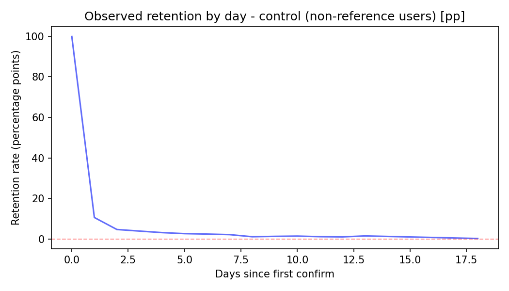
    
    레퍼런스 사용 유저, **"d1 이후에도 높은 리텐션 유지, d7 부근 소폭 반등"**
    
    - **d1**: 급격히 떨어지긴 하지만, 대조군보다 **높은 수치** (약 20-25%)
    - **d2-d6**: 서서히 감소하나, 10% 이상 유지
    - **d7**: 소폭 상승
        - 레퍼런스 사용 유저는 지속적으로 돌아오는 경향이 강함
    
    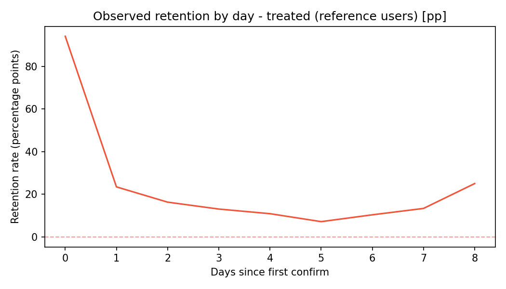
    
    **레퍼런스 기능 사용 시 d7/d30 리텐션이 절대 +10~14%p 개선됨을 확인함. (통계적으로 유의)**
    
    - 7일 “이내” 누적 리텐션
        - 평균 **+10.10%p**, 95% CI [+1.71, +19.18] %p, 개선확률 99.23%
        - 대조군 18.02% → 처치군 27.72% (절대 +10.1%p, 상대 약 +56%)
            - 레퍼런스 미사용 유저 100명 중 18명이 7일 안에 다시 돌아오고, 레퍼런스 사용 유저 100명 중 **28명**이 다시 돌아온 것을 의미.
    - 30일 “이내” 누적 리텐션
        - 평균 **+13.63%p**, 95% CI [+4.88, +22.99] %p, 개선확률 99.93%
        - 대조군 18.42% → 처치군 31.68% (절대 +13.6%p, 상대 약 +72%)
            - 레퍼런스 미사용 유저 100명 중 18명이 30일 안에 다시 돌아오고, 레퍼런스 사용 유저 100명 중 **32명**이 다시 돌아온 것을 의미.
    
    **레퍼런스 버튼 배치 최적화와 사용 유도 기능을 결합하면 임팩트 극대화가 가능함.**
    
    <aside>
    💡
    
    **신뢰구간(CI)이란?**
    
    **“95% CI [+1.71, +19.18]%p”**라는 표현은 아래의 의미로 해석할 수 있음.
    
    "레퍼런스 기능의 효과가 정확히 10.10%p다" ❌
    
    "레퍼런스 기능의 효과는 아마도 1.71%p ~ 19.18%p 사이에 있을 것이다" ✅
    
    "이 실험을 100번 반복한다면, 95번은 진짜 효과가 1.71%p ~ 19.18%p 사이에 있을 것이다” ✅
    
    </aside>
    
    <aside>
    💡
    
    **절대 차이와 상대 차이란?**
    
    - 절대 차이: 단순하게 두 값을 빼기한 것, **실제 영향력 파악**을 위함.
        - 절대 차이 = 처치군 - 대조군
    - 상대 차이: 대조군을 기준(100%)으로 했을 때의 변화율, **개선 정도를 강조**하기 위함.
        - 상대 차이 = (절대 차이 / 대조군) × 100%
    </aside>
    

---

# **58 (new)
단순** 조회가 아니라,
만족할만한 콘텐츠 조회 경험을 제공하는 것이 중요합니다.

만족할만한 콘텐츠 조회 경험 기준:

1. 특정 카드 콜렉션 콘텐츠 한 번에 10초 이상 조회 또는 특정 집들이 한 번에 30초 이상 조회(콘텐츠 몰입 시그널)
2. 특정 콘텐츠에 대해 좋아요/댓글/스크랩/공유하기/팔로우/태그 클릭의 액션 발생(유저의 명시적 액션)

분석 결과, 

1. 유저의 앱 이용 성향이 비슷하더라도 유의미한 조회를 경험한 유저는 그렇지 않은 유저보다 리텐션이 높게 나타났습니다. 
2. 유저들의 앱 이용패턴을 고려했을 때 첫 진입 시 단 한 번이라도 유의미한 조회를 경험하게 하는 것이 중요합니다.


- *Details*
    
    by @Genie Heo  
    
    [분석 문서 링크](https://www.notion.so/2a0a597878a08041ac38f685b774a9e6?pvs=21)
    
    **어떤 행동이 리텐션과 관련이 깊다고 말하려면, 아래 두 가지 조건을 만족해야 합니다.**
    
    1. 해당 행동을 한 유저가 이탈하지 않고 실제로 잔류하는 경향이 강해야 합니다.
    2. 잔류한 유저군 내에서 해당 행동을 한 유저의 비중이 높아야 합니다.
    
    아래 그래프는 위 내용을 한 눈에 살펴볼 수 있도록 각 액션/모듈별로 ‘X축: 해당 행동 경험 유저 중 잔류한 유저 비율’과 ‘Y축: 잔류자 중 해당 행동 경험 유저 비율’을 나타낸 것입니다.
    
    - 각 변수 설명
        
        모든 변수는 해당 행동을 경험한 경우를 나타내며, 모든 조회시간은 CDP 내부에서의 조회시간을 의미합니다.
        
        1. total_view_flag: CDP 진입 여부
        2. popular_{impression | click}_flag: 인기순 모듈 노출(또는 클릭) 여부
        3. newest_{impression | click}_flag: 최신순 모듈 노출(또는 클릭) 여부
        4. filtered_{impression | click}_flag: 필터 적용된 콘텐츠 모듈 노출(또는 클릭) 여부
        5. rec_click_flag: 추천 모듈 콘텐츠 클릭 여부
        6. curated_2grid_click_flag: 큐레이션 모듈 클릭 여부
        7. hero_click_flag: 히어로 모듈 클릭 여부
        8. total_view_time_more_30_flag: 총 조회시간 30초 이상 발생 여부
        9. total_view_time_more_60_flag: 총 조회시간 30초 이상 발생 여부
        10. total_meaningful_view_flag: 유의미한 조회 발생 여부
            1. 아래 조건을 만족한 조회가 발생했는지 여부
                1. 특정 카드 콜렉션 콘텐츠 한 번에 10초 이상 조회 또는 특정 집들이 한 번에 30초 이상 조회
                2. 특정 콘텐츠에 대해 좋아요/댓글/스크랩/공유하기/팔로우/태그 클릭의 액션 발생
            2. **유의미한 조회에 대한 위 세부 기준은 추후 수정될 수 있습니다.**
        11. total_implicit_meaningful_view_flag: 5-a-i의 유의미한 조회 발생 여부
        12. total_explicit_meaningful_view_flag: 5-a-ii의 유의미한 조회 발생 여부
        13. total_tagclick_flag: 태그 클릭 발생 여부
        14. total_engagement_flag: 좋아요/댓글/스크랩/공유하기/팔로우 발생 여부
        15. total_scrp_flag: 스크랩 발생 여부
        
    
    
    
    오늘의취향 피드 내 액션과 오늘의취향 피드 리텐션의 관계
    
    **‘일정 이상의 콘텐츠 조회시간’과 ‘유의미한 조회 발생’이 리텐션과 강한 관련성을 보입니다.**
    
    그 외에도 태그 클릭과 필터 모듈의 이용을 주목해볼 수 있는데, **유저가 만족할만한 콘텐츠 조회 경험이 지표적으로 일정 이상의 콘텐츠 조회 시간, 태그 클릭, 스크랩 등의 관찰 가능한 형태로 나타난다고 볼 수 있습니다.** 필터 모듈의 좋은 결과 또한 해당 모듈을 통해 만족할만한 콘텐츠를 더욱 잘 발견할 수 있기 때문으로 해석할 수 있습니다.
    
    **✅  결국 가장 중요한 것은 유저가 가치 있는 콘텐츠 조회 경험을 하도록 만드는 것입니다. 유저가 만족할만한(도움을 얻을 수 있는) 콘텐츠 조회 경험을 제공하는 것이 중요합니다.**
    

---

# **59 (new)**
빠른 속도와 전문성,
건자재 발주 사용 경험 향상의 핵심이에요

인테리어 업체는 자재를 발주하는 과정에서 크게 두 가지 니즈를 가지고 있습니다. 빠른 커뮤니케이션과 전문성입니다. 고객과의 약속을 차질 없이 지키기 위해서는 제 시간에 정확한 자재가 현장에 도착하는 것이 중요합니다.

오늘의집 건자재팀은 카카오톡 발주 의존의 문제점을 해소하고자 채팅솔루션을 개발해 인테리어 업체 업체의 목소리를 들어보았습니다.

채팅솔루션을 통해 ‘현장(프로젝트)’이 분리된 점은 편리하게 느꼈지만, ‘채널’ 변경과 무관하게 ‘커뮤니케이션 방식’이 바뀌지 않아, 인테리어 업체가 가지고 있는 니즈는 해소되지 않았습니다.

업체는 건자재 발주가 시공 일정에 지장을 주지 않게끔 야간 대응, 후불 결제 등이 제공되기를 희망합니다.

[P1) 정확하지 않은 커뮤니케이션, 느린 피드백, 선결제 정책으로 시공 영향 받음](P1_audio_1.mp4)

P1) 정확하지 않은 커뮤니케이션, 느린 피드백, 선결제 정책으로 시공 영향 받음

- *Details*
    
    by @Haley Hong 
    
    [[2511] 건자재 채팅솔루션 베타 UX 검증](https://www.notion.so/2511-UX-29ba597878a08068a01fd9d3f7333677?pvs=21) 
    
    <aside>
    
    `채팅솔루션(Beta) 이용 경험은 어떠한가?` 
    
    ## 채팅솔루션의 현장 분리는 전반적으로 편리하게 느끼며, 더 편리한 사용을 위해 개선을 희망하는 항목이 있음
    
    (세부 개선 희망 항목은 하단 [Key Insights](https://www.notion.so/2511-UX-29ba597878a08068a01fd9d3f7333677?pvs=21)에서 후술)
    
    ## 그러나, 커뮤니케이션 채널 변경과 무관하게 뒷단의 커뮤니케이션 ‘방식’은 바뀌지 않았기 때문에 {발주} 관련해 유저가 체감하는 편의성 상승은 크지 않음
    
    - **1.커뮤니케이션 속도**, **2.전문성 이슈**로 긴급발주 및 문의 대응이 되지 않음
        - 오늘의집 ‘선결제’ 정책으로 확인이 늦어지는 경우, 시공 일정에 영향을 받음
    - 사용자는 ‘문의-발주’ 과정에서 **커뮤니케이션이 가능한 시간(야간 대응 등)과 속도, 정확성이 향상되기를 희망함**
    
    [P1) 정확하지 않은 커뮤니케이션, 느린 피드백, 선결제 정책으로 시공 영향 받음](P1_audio_1.mp4)
    
    P1) 정확하지 않은 커뮤니케이션, 느린 피드백, 선결제 정책으로 시공 영향 받음
    
    [P2) 상담 전문성 이슈, 느린 피드백](p2_audio_1.mp4)
    
    P2) 상담 전문성 이슈, 느린 피드백
    
    [P3) 커뮤니케이션 가능 시간 제한](p3_audio_1.mp4)
    
    P3) 커뮤니케이션 가능 시간 제한
    
    - 🗣️ Quote
        
        <aside>
        
        “(오늘의집은) 9시에 오픈하고 6시 퇴근이에요. 근데 우리는 일 특성상 아침 일찍 시작하고 현장 돌고 나서 한 6시부터 저희는 밀린 업무를 시작합니다. 그럼 6시 이후에 좀 더 발주도 뭣도 다 넣어야 되는데 6시 이후에 상담할 수 있는 구간이 아무것도 없어요. 정작 필요한 그 시간대에는 낮 시간이고 낮 시간에는 현장 때문에 바빠요. 저희가 인테리어 팀이라는 거를 알아줬으면 좋겠어요. 일반 회사원들이 아니잖아요.” *(P1)*
        
        </aside>
        
        <aside>
        
        “월요일에는 너무 스트레스를 많이 받아요. 피드백이 느려가지고. 그리고 제일 답답한 것 중에 하나가 이렇게 견적을 넣었는데 다르게 오는 경우가 굉장히 많아요. 특히 에어컨 다배관을 넣었는데 단배관을 주고, 또 다배관을 넣었는데 단배관을 주고, 이런 경우가 너무 많아서 제가 스트레스 받아서 ‘그냥 돈 좀 더 줘 그냥 단배관만 넣자’ 이렇게 돼버린 거예요.
        그리고 또 문제가 뭐냐? 채팅방에 ‘수정하겠습니다’ 하잖아요?  그럼 공급사에다 또 이걸 얘기를 해야 되는 거예요. 그리고 공급사에서 또 견적서를 받아서 이렇게 넘어오고.
        이게 얼마나 시간 낭비고 피곤하고 제가 봤을 때 채팅 하시는 분들이 제가 받는 스트레스보다 한 200배 더 받을 것 같아요.”
        
        ”소통 창구가 너무 느리다 보니까 그 선결제를 하는 것조차도 너무 이게 급하게 되잖아요. 결국엔 시간이 없고 견적서를 어제 줬는데 오늘 (결제요청이) 와 그러더니 ‘죄송합니다. 결제 여기 바로 해야된다.’ 그러면 이게 그렇잖아요. 아니 자기가 대답 늦게 해놓고 결제 오늘 해달라고 그러고, 오늘 결제 안 하면 시공일 밀린다고? (말하니까) 화가 막 있는 끝까지 나는 거야. 그러면서 조금 말이 되나? 싫은 소리 하면…”
         *(P1)* 
        
        </aside>
        
        <aside>
        
        “아무래도 전문성 같은 게, 오늘의집에서 상담하시는 분들은 떨어질 수밖에 없잖아요. 뭔가를 물어봤을 때 바로바로 답변이 안 되고, 그걸 또 (공급사에) 물어봐야 되니까. 그냥 바로 해결되면 그냥 저는 물어볼 수 있는 거죠. 사실 어느 거래처랑 거래를 해도 저희는 받고 잘 응대만 해주면 어디든 쓸 수 있거든요.” *(P2)*
        
        </aside>
        
        <aside>
        
        “저희가 퇴근하는 시간들이 다 다르고요. 저녁에 미팅 같은 것들이 있으면 8시 9시에도 퇴근을 해요. 그런 상황에서 여쭤보고 싶어도 여쭤볼 수가 없는 상황이고요. 그리고 긴급하게 그 시간에 발주를 넣어서 다음 날 받아야 되고 혹은 그다음 날 오후에 받아야 되고 이런 사항들이 조금 느리죠.” *(P3)* 
        
        </aside>
        
        <aside>
        
        ”더 하셔야(운영시간 늘리셔야) 돼요. (개인적으로 쓰는) 거래처들은 아침 7시부터 일해요. 7시부터 일하고 저녁 8시까지 일해요.”
        ”그래서 저는 새벽에도 남기고 밤에도 남겨요. 그럼 다음 날에 누군가 보니까” *(P4)*
        
        </aside>
        
    </aside>
    

---

# **60 (new)
이사할 때 이사,**청소,설치 업체를 
따로 찾고 결정하는게 힘들어요

이사 고객은 이사 과정에서 필요한 여러 업체를 **개별적이고, 분산적으로 탐색하는 경험에서 피로감**을 느낍니다. 특히 포장이사 고객은 이 과정에서 직접 여러 업체들과 조율하고 선택하는 것에 스트레스를 느끼며, **한 곳에서 모든 것을 통합적으로 결정**하고 싶어합니다.

- *Details*
    
    by @Ivy Kim  
    
    [[2511] 오늘의집 이사는 누구를 타겟해야 할까? ](https://www.notion.so/2511-2a7a597878a08057a5dbc46309733ed7?pvs=21) 
    
    > 라이프 이벤트 발생에 따라 고객에게 필요한 서비스를 제공하는 경쟁 업체들은 늘어났지만, 여전히 이사 과정에서 고객이 겪는 문제는 많습니다. 
    그 중에서도, 1) 이사 업체와 고객간 서비스 기대치 간극으로 인해,고객은 대형•특수 가구,가전의 해체/조립/설치를 위해 추가 비용을 지불하며 전문가를 따로 불러야하고, 2) 서비스 퀄리티가 보장된 입주 청소 업체를 찾기 어려워 높은 스트레스를 받고 있습니다. 여러 플랫폼을 돌아다니며 많은 시간과 비용을 투자하여도 당황스럽고 만족스럽지 못한 결과를 얻는 것이 현실입니다.
    > 
    
    <aside>
    
    
    **가설6. 이사 고객은, 이사 전/중/후 처리 과정에서 각각 선택하고 조율해야 하는 과정에 번거로움을 느끼며, 빠르게 결정할 수 있게 허브 역할을 해주는 서비스가 있으면 구매 전환 될 것이다**
    idea) 이사 통합 플래너 서비스 제공
    **→ 특별히 포장 이사와 같이 짐 양이 많고, 일상이 바빠 편리함을 우선으로 생각하는 고객 유형에게 YES**
    
    </aside>
    
    - "인터넷 설치 그거는 전문가가 해야 되니까 어쩔 수 없다 쳐도 **가전 따로 설치, 가구 따로 설치... 에어컨은 따로 전문가가 와서 해 줘야 되니까 그것도 또 알아봐야 되고** 천편일륜적으로 같이 할 수 있는 서비스가 있다면 저는 염두해 둘 거 같아요"(P3)
    - "(이사 업체와 청소 업체를 모두 숨고에서 결정한 이유는) 저는 한 군데에서 하는게 나으니까. 나중에 뭐 정립금을 받는다거나 아니면 책임을 묻기도 좋잖아요." (P9)

---

# **61 (new)
파손에 부담없는 1인가구, 
비용부담이 적은 이사업체가 최고**


원룸이나 오피스텔에 거주하고, 중저가 위주의 소형 가구, 소품 정도만 있어 이삿짐 양이 1톤 내외로 적은 1인가구는 서비스 퀄리티 보다도 최저가를 가장 중요시 생각합니다. 비용을 줄이기 위해 직접 짐을 이동하는 것 까지 고려하며, 손품을 팔더라도 여러 업체의 견적을 비교하고, 가장 값이 싼 용달을 선택할 때가 많습니다. 

- *Details*
    
    by @Ivy Kim 
    
     [[2511] 오늘의집 이사는 누구를 타겟해야 할까? ](https://www.notion.so/2511-2a7a597878a08057a5dbc46309733ed7?pvs=21) 해당 페르소나는 비용 절감에 최적화된 의사결정 패턴을 가지고 있습니다. 옮기는 짐 양이 1톤 내외로 많지 않고, 파손돼도 부담 없는 중저가 가구소품 위주라, 서비스 퀄리티 보다는 **“얼마나 싸게, 최소한의 스트레스로 짐을 옮길 수 있는지”**가 이사 업체를 선정할 때 가장 중요한 기준이 됩니다. 
    
    **✔️ P00: 경쟁사 대비 저렴함을 직관적으로 체감할 수 있는 견적 제시 & 이사 당일 추가 금액 방지 보장**
    **→ 고객 문제: 1) 가격이 괜찮은 이사 업체가 어디인지는 이사를 할 때 마다 새롭게 찾음 2) 이사 당일에 추가 금액을 요구 받을 수 있다는 불안감 
    **✔️ P0: 페이백 지급성 리뷰가 아닌, 실제 내돈내산 리뷰 확보** 
    **→ 고객 문제: 1) 숨고의 견적이 가장 저렴하것 같으나, 리뷰를 신뢰하기 어려움 2) 업체들 간 경쟁으로, 서로가 사기꾼이라는 안내 메시지로 인한 혼란**극한의 
    
    - 갓성비 추구형 Friction map
        
        
        |  | JTBD | Behavioral pattern  | Friction  | why
        (Friction을 느낀 이유) | Solution
        F(friction 해소 방법) | Wow Point |
        | --- | --- | --- | --- | --- | --- | --- |
        | **b) 이사 업체 탐색 및 비교/선정** | 평균가를 파악하고, **저렴한 견적을 제시하는 이사 업체를 알고싶음. 🔥🔥🔥** 
        서비스 퀄리티가 높은 업체를 기대하기보다, **내가 감당 할 수 있는 수준의 업체를 추림🔥🔥** | -플랫폼(숨고, 당근)/네이버 검색(광고, 블로그 콘텐츠 참고)/지인추천 등 다양한 방법을 사용하여 이사 업체를 알아봄 
        -가격을 최우선 비교 기준으로 삼고, 이 후 나와 비슷한 환경, 부정 리뷰 등을 확인함.  | - 이사하면 떠오르는 업체가 명확히 없음 
        - 견적 요청 전, 대략적으로라도 평균가격을 알기 어려움
        - 숨고의 견적이 가장 저렴하것 같으나, **리뷰를 신뢰하기 어려움🔥🔥**  | - **가격이 괜찮은 이사 업체가 어디인지는 이사를 할 때 마다 새롭게 찾아야 하기 때문🔥🔥🔥**
        - 돈을 받고 작성된 리뷰가 많고, 불만족한 경우는 리뷰를 미작성 한 경우가 많음 | N/A | N/A |
        | **d) 견적 요청/상담 및 계약** | 추가금액 발생 방지와 견적 가격에 확신 필요 | 신청폼 작성 후, 궁금증 해소를 위해 전화 상담을 병행하나, 파손 보장과 계약서에 대한 내용을 꼼꼼히 확인하지는 않음
         | - 신청폼 작성 과정이 번거롭고 귀찮음
        - 개인업체의 경우, 사장님과 전화 연결이 어려움 
        - 견적 상담을 받기위해 신뢰할 수 있는 업체가 어디인지 선택하기 어려움
        - **이사 당일에 추가 금액을 요구 받을 수 있다는 불안감🔥🔥🔥** | - **짐의 부피를 세세하게 측정해야 함🔥**
        - **업체들 간 경쟁으로, 서로가 사기꾼이라는 안내 메시지로 인한 혼란🔥🔥** 
        - 대부분 구두 계약으로 진행되며, 소형이사의 경우 계약서를 작성하지 않는 것이 일반적인 관행 | 개인 업체의 경우, 비용 할인을 위한 deal을 시도 | N/A |
        | **i) 포장 자재·체크리스트 준비 및 점검** | 이사 업체에서 요구한 포장 규격에 맞는 박스를 저렴하게 구하고 싶음 | 포장 자재(박스)를 직접 구매하거나 사용하던 수납함을 이용함 | **생각보다 비싼 포장 박스 구매 비용🔥** | 짐을 싸기 위해 필요한 박스 수량과 가격을 제대로 알지 못함 (박스 구매 가격이 얼마 안들 것이라는 예상) | N/A | N/A |
        | **k) 이사 당일 실행** | **문제 없이 정해진 시간 내 이사가 빨리 끝났으면 함🔥🔥** | 필요한 행정 처리 및 기사님을 도와 짐 옮기기 | - **업체측에서 요구하는 예상치 못한 추가 금액 요구🔥🔥🔥** 
        - 짐을 옮기는 과정에서 발생하는 파손/훼손 
        - 업체 기사님의 청결(담배 냄새) 상태 와 불친절한 대응(짜증, 분노 표출) 
        - 지각 | 이사 업체에서 사용하는 규정 박스 규격을 알지 못했음 (예: 7호 박스) | 이사 날 분란을 만들고 싶지 않아, 끝난 후 추가 요금을 지불 | 속도감 있게 이동해주셔서, 이사가 생각보다 빨리 끝 |
    

---

# **62 (new)
고가의 가구/가전을 옮기는 2인 이상 가구는
비싸더라도 확실한 이사업체를 찾아요**

이들은 과거 이사 경험이 부정적이거나, 살면서 구매한 상품의 가격대가 높아져 적절한 가격 보다 이사 업체의 서비스 퀄리티 보장이 가장 중요한 결정 기준이 된 사람입니다. 비싸더라도 내 집과 짐을 싸고 정리하는 모든 과정을 전문가에게 온전히 맡기는 이사를 원하며, 애초에 파손·누락·지연이 발생하지 않도록 시스템과 팀이 설계된 서비스를 원합니다. 


- *Details*
    
    by @Ivy Kim 
    
    [[2511] 오늘의집 이사는 누구를 타겟해야 할까? ](https://www.notion.so/2511-2a7a597878a08057a5dbc46309733ed7?pvs=21)
    
    해당 페르소나는 노동력과 시간을 투자하지 않고 그 노력을 비용으로 치환하고 싶어합니다. 고가의 소중한 물건에 대한 애착과 청소/정리에 민감한 기준을 가지고 있어 견적이 다소 높더라도, 이사 하는 과정에서 받는 정신적 스트레스를 없앨 수 있는 보장형 서비스가 있다면 전환될 것이라 판단합니다. 
    
    **✔️ P00: 고가 가구의 꼼꼼한 패킹 및 파손 없이 원상태 그대로의 이동과 배치 보장
    → 고객 문제: 1) 당일 예상치 못하게 발생하는 파손/훼손(바닥 찍힘, 대리석 파손 등) 2) 이사짐 패킹 과정에서의 청결과 위생에 대한 염려
    ✔️ P00: 이사 마무리까지 깔끔하고 깨끗한 정리와 처리
    → 고객 문제: 포장 이사임에도, 가구 설치 일정에 따라 배치/정리가 미흡**
    

---

# **63 (new)
오랜 자취,** 결혼으로 짐이 늘어난 사람은 적당한 가격과 신속한 서비스를 제공하는 이사 업체가 좋아요

이들은 싸서 불안하지 않고, 비싸서 억울하지 않은 **중간 가격에서 적정한 선택을 한 것 같은 심리적 안정감을 느낍**니다. 중간값의 견적을 제시한 업체는 이사의 피로도를 줄여주는 적절한 서비스도 제공할 것이라 생각합니다. 

그래서, 전화 상담/방문 견적에서 대면하는 업체의 첫 인상, 말투, 설명의 디테일 같은 요소를 통해 전문성을 가늠하여, 이사 당일 문제 없이 약속을 지키고 신뢰할 수 있는 업체를 가려냅니다.


- *Details*
    
    by @Ivy Kim  
    
    [[2511] 오늘의집 이사는 누구를 타겟해야 할까? ](https://www.notion.so/2511-2a7a597878a08057a5dbc46309733ed7?pvs=21) 
    
    해당 페르소나는 이사에서 100% 만족할 수 있는 업체는 없다고 생각하기 때문에, 이사 당일 발생할 수 있는 불안함을 최대한 줄여주고, 예측 가능할 수 있도록 만드는 응대 과정(일종의 showing)에서 서비스 신뢰를 느낍니다. 리뷰를 통해 업체를 발견했을 때의 첫인상과 상담 과정~실행 당일의 일관성이 서비스 전환의 핵심이라 판단합니다. 
    
    **✔️ P00: 비교-방문 견적 과정에서, 일정하고 투명하게 업계 평균 가격 제안 
    → 고객 문제: 전화상담-방문견적 과정에서 견적이 계속 바뀌어, 견적 가격에 대한 신뢰가 사라짐 
    ✔️ P00: 추가금액 발생 가능한 상황과 방지 방안에 있어 사전에 자세한 안내
     → 고객 문제: 이사 당일 현장 추가금 요구에 대한 우려**
    
    - 합리적 편의 추구형의 이사 과정 Friction-map
        
        
        | 이사 과정 | JTBD | Behavioral pattern | Friction | why
        (Friction을 느낀 이유) | Solution(friction 해소 방법) | Wow Point | lesson learn & regret |
        | --- | --- | --- | --- | --- | --- | --- | --- |
        | **b) 현재/신규 집 정보 수집** | 신규집에 필요한 상품을 구매하고 배치하기 위해 정확한 도면을 쉽게 구하고 싶음 | 도면을 구하기 위한 여러 노력을 하며(관리사무소 문의, 입주민 카페/단톡방 활용, 오늘의집 도면 검색 등) 실측을 직접하러 가기도 함 | -**이사 할 집의 도면 정보 수집이 어렵고, 부정확 하여 미리 배치/가구 구매를 결정하지 못함🔥** 
        -사다리차 사용 불가하여, 엘레베이터로 운반 중 대형 가구가 들어가지 않음
        
         | - 신축 아파트: 도면공개와 문의를 공식적으로 어디서 해야 하는지 모르겠음 
        ****- 구축 아파트/빌라: 개인적으로 알아볼 수 있는 공개된 도면이 부재함
        - 엘레베이터에 실어지는 대형 가구/가전 규정을 확인해야한다는 생각을 못함 | - **오늘의집 3D 도면을 찾아보려 했으나 사용이 불편해 중단🔥** 
        - 집을 방문하여 실측하지만, 세입자 눈치가 보여 정확하지 않음 
        - 가구 계약을 취소하고 위약금 변상
         | 신축 아파트의 경우, 단체 채팅방이나 카페를 통해 입주민들끼리 정보가 공유되어 정보 수집에 도움이 됨. | 사전에 신규집에 대한 **정확한 도면과 실측이 가능한 서비스**가 있다면 비용을 지불하고 이용하고 싶음(P3) |
        | **c) 이사 업체 탐색** | 여러 비교를 통해 가격은 너무 싸지도 않고 합리적이면서 친절한 서비스를 제공하는 업체를 선택하고 싶음 | 네이버 검색 및 지인 추천과 동시에  여러 플랫폼(숨고, 짐싸, 아정당, 이사몰 등)을 병행하여 업체를 찾고, 리뷰를 꼼꼼히 탐색.
        
          | - 숨고에 견적 요청 시, 너무 많은 업체에서 연락 오는 것이 스트레스 (다발성 전화/견적 스팸) 
        - 신청폼에 입력한 정보가 무의미하다고 느껴짐
        - **리뷰가 서비스 퀄리티 판단의 기준인데, 신뢰하기 어려움🔥🔥** 
        
         | - 숨고의 매칭 시스템이 견적을 올리자마자 바로 채팅/전화가 동시에 폭발적으로 옴
        - **정확한 짐 양을 작성하기 어렵고 신청폼 입력 후, 자동 안내 견적과 전화/방문 견적 금액의 변동폭이 큼🔥🔥🔥**
        - 페이백을 조건으로 한 광고성 리뷰가 많음
         | 리뷰의 사진과 내용에서 서비스 퀄리티와 *원하는 조건 가능 여부 확인하고, 부정리뷰가 많으면 제외함. 
        
        * 예.보관이사, 냉장고 콘센트 연결 가능 / 파손 보장 및 꼼꼼한 보양 작업 등
         | - **신청폼 작성 후, 빠른 피드백과 견적을 다양하게 비교할 수 있는 점은 긍정적🔥** 
        - **사장님이 고객을 기억하여, 진심을 다해 작성한 리뷰 댓글🔥🔥** |  |
        | **d) 견적 요청/상담 및 계약 확정** | 통화와 방문 과정에서 서비스가 일관적이고 친절한 업체를 만나 이사 당일 발생할 리스크를 최대한 줄이고 싶음 | 추가금 발생을 사전에 방지하기 위해 확정받을 수 있는 상담(방문 견적, 업체의 역할 및 준비에 상세히 알려주는 전화 상담 등)을 진행
        
         | - 상담-방문 견적 과정에서 일관적이지 않은 응대가 불안함 
        - 꼼꼼하지 않고, 친절하지 못한 상담 과정에서 전문성에 대한 우려가 생김
        **- 이사 당일 현장 추가금 요구에 대한 우려🔥🔥🔥**  
        **- 이사 현장에서 발생할 수 있는 파손/문제에 대한 우려🔥🔥**
        
         | - 전화 상담자, 방문 견적 담당자, 실제 이사 담당자가 모두 다름
        - **거들먹거리며 내가 전문가라는 식의 불친절한 말투로 상담 진행🔥🔥**
        - 전반적인 짐을 상세히 파악(예. 에어컨 실외기 이동 여부 확인)하려 하지 않고, **내가 놓칠 수도 있는 조건(에. 해체/설치 필요한 가구/가전 추가금 등)에 대한 안내 부재** **🔥🔥**
        - **전화상담-방문견적 과정에서 견적이 계속 바뀌어, 견적 가격에 대한 신뢰가 사라짐🔥🔥🔥** 
        - 저렴한 가격을 선택했기 때문에 상세한 계약 조항을 기대하기 어렵다고 인식, 파손 및 A/S에 대한 배상 책임 여부가 명확하지 않음 | - 견적 금액이 중간 정도이면서, 상담이 친절하고, 구체적인 이사 과정을 잘 설명해 준 곳이 노하우가 있다고 판단
        - 방문 견적할 때 가격 협상을 시도하여 가격을 낮춤.  
        - 잔짐은 직접 차량으로 옮겨 당일 추가금 발생을 피함
        
         | - 상담이 친절하고 구체적으로 이사 과정(이사 유형에 대한 설명, 전세금 처리, 엘리베이터 예약 시간 등)을 잘 설명해 주는 곳에 전문성을 느낌. 
        - **업체 측에서 당일 추가금이 발생할 수 있음과 상황에 대해 솔직하게 고지하는 점🔥🔥🔥**  ****
        - 파손 보상이나 당일 추가금 없음 등의 표준화된 내용을 구두 견적서로 받음
        
         |  |
        | **g) 이사 당일 실행** | 사전에 안내 받지 않은 문제가 발생하지 않고, 신속하게 이사가 끝났으면 좋겠음 | 대출 및 부동산 잔금 처리 / 엘리베이터 사용 및 이사 트럭 출입 협조 요청
        
         | - 당일 예상치 못하게 발생하는 파손/훼손(바닥 찍힘, 대리석 파손 등)  
        - 당일 예상치 못한 행정 처리/주차 문제로 인해 발생하는 작업 딜레이 및 추가 요금 발생
        - **이사짐 패킹 과정에서의 청결과 위생에 대한 염려🔥🔥**
        - **사전 안내되지 않았던 추가 비용 요구(추가 인력 요구, 밥값/음료 값 등🔥🔥🔥)**
        - 이사가 완료된 후 알게되는 미흡한 서비스 
         | - **이사 날 분란을 만들고 싶지 않아, 업체에 불만을 말하기 쉽지 않음🔥**  
        - 미리 문의하여도, 주차장 크기/주차 복잡도로 인해 트럭 진입 동선에 제약 발생.  
        - 당일 이사 짐을 싸주시는 인력의 담배 냄새로 인해 내 짐을 만지는 것에 찝찝함을 느낌
        - **이사 당일 짐을 옮기는 인력의 느린 작업 속도 및 이사 업체가 단지 내에 쓰레기를 버리고 가는 등 비전문적인 태도🔥🔥**
        - 이사 당일 처리해야 하는 여러 일들로 이사 하는 동안 꼼꼼히 지켜보고 있기 어려움
         | - 웃으면서 부당한 요구에 대해 무시
        - 큰 시설 파손은 변상 요구했지만, 업체에 거부 당함 
        
         | - **이사 팀이 빠르고 묵묵하고 깔끔하게 일만 하고 간 서비스에 만족🔥🔥** 
        - 예정된 시간보다 이사 업체에서 일찍와준 점
        - 짐 운반 후 바닥 신발 자국 등 간략한 청소를 해주고 간 부분 만족 
        - 이사 업체가 주차 동선에서 발생한 문제를 능동적으로 해결하려는 태도(예. 사다리차 공간 확보 위해 차단기 설치 및 플랜카드 붙이기)
        - 추가금액 발생 시, 유연하게 비용을 할인 해준 점 | -이사 당일 인력의 청결/위생 상태를 확신할 수 없기 때문에 반포장으로 이사 방식 변경, 그러나 미리 확신받을 수 있다면 해당 업체에서 포장이사 진행 할 의향 있음(P1)
        - 포장 이사가 반포장보다 두 배 이상 비싸 예산을 절감하려 했으나, 반포장 이사가 힘들고 노동 집약적임을 실행하며 깨달음 
        → 다시 이사를 한다면 예산을 절감하기보다는 **돈을 더 쓰고 포장 이사를 할 것 (P4) 
        -** 가격보다는 **사후 처리가 확실한 검증된 업체**에 비용을 지불할 의향이 있음 (P3) |

---

# **64 (new)
1,000개의 검색어만큼의 
가치가 있는 이미지 검색**

고객은 ‘수납이 잘 되는 소파’, ‘햇빛 잘 드는 거실에 어울리는 테이블’처럼 말로 정의하기 어려운 니즈를 상품으로 연결해야 하지만, 이런 니즈는 전통적인 키워드 검색만으로 찾기 어렵습니다. 그래서 상품 이름을 모르거나 태그가 없을 때 이미지를 찍거나 캡처해 유사 상품을 탐색하고, 그 과정에서 함께 구매할 **비슷한** 상품을 자연스럽게 발견하기도 합니다.

텍스트로 표현하기 어려운 니즈를 이미지 기반으로 탐색하는 이 이미지 검색을 콘텐츠(CDP) 영역에서 사용하면서, 새로운 키워드를 찾고 추가 탐색으로 이어지는 패턴을 확인했습니다. 특히 가구, 수납/정리, 패브릭, 생활용품 카테고리에서 효과가 두드러졌고, 그중 **수납/정리 카테고리가 클릭·구매 전환율에서 가장 높은 퍼포먼스**를 보였습니다.


- *Details*
    
    by @Kao Lim @Stella Han @Sungbae Kim @Jake Kim 
    
    - [[2502] 이미지 검색 기능 기회영역찾기 설문조사](https://www.notion.so/2502-193a597878a0807ab939d525cbf4dae1?pvs=21)
        
        ‘비슷한 상품’ 을 판단 할 때는 시각적인 요소가 가장 중요했습니다. 그러나 눈에 보이지 않는 비슷함도 있습니다. 예를 들어 커튼/발매트 등은 디자인보다 소재가 같아야 비슷한 상품이라고 판단하며, 휴지통 등 기능성 상품은 작동방식이 비슷함을 결정합니다.
        
    - [ Stella & Sungbae & Kao (B) ](https://www.notion.so/Stella-Sungbae-Kao-B-230a597878a081139a85d0041ab46cfa?pvs=21)
        - **PDP내 이미지검색 네이밍**
            - '이미지로 상품 찾기' 네이밍에서 고도화 필요
                - '비슷한 상품 찾기' 네이밍은 기존에 존재하던 기능들과 비슷하다고 느껴 굳이 눌러볼 것 같지않고,
                - 클릭했을 때의 이미지검색 뷰어 화면과 크게 매칭되는 느낌을 받지 못함
        - **툴팁의 필요성**
            - 해당 기능의 역할에 대해 추가적인 설명이 필요함
                - '이미지'로 상품을 찾는 경험을 실제로 해보지 못한 유저의 경우, 첫 진입에 허들이 있을 수 있음 (첫 진입 이후에는 잘 사용할것이라 말씀주심)
        - **명확한 가이드 제공 필요**
            - 기능 진입시 명확한 가이드를 제공해 사용법에 불편함이 없도록 해야함
                - 1. 오브젝트 디텍팅 / 2. 영역 이동 > 두가지 기능은 우선적으로 안내해 인지를 높여야함
    - [[2509] 타사이미지 검색 멘탈 모델 관찰](https://www.notion.so/2509-264a597878a08069b3e6d18cf9bd65f0?pvs=21)
        
        > **이미지검색 전반에 대한 발견점**
        > 
        - 이름을 모르는 상품일 경우, 이미지검색을 통해 검색어를 찾고자하는 니즈를 가짐
        - 이미지검색을 통해 탐색하는 과정에서 다른 상품을 둘러보며 함께 구매하기도 함
        - ‘카메라모양’을 통해 ‘이미지검색’ 서비스를 인지함
        - 이미지검색을 제공하는 서비스 내에서 또다른 이미지검색 서비스를 통해 상품을 탐색하는 이유는 더 저렴한 제품을 찾기 위함임
            - ex. 테무 상품을 구글 렌즈를 통해 추가 탐색하는 경우
        - AI툴을 통해 원하는 이미지를 생성해 이미지검색에 활용하기도함
        - 제품이 많아지면 선택이 힘들어져 필터를 많이 사용하는 유저군도 있음
        - 대부분이 이미지 캡처본을 이용해 이미지 검색을 이어감
        
        > **오늘의집 내에서 이미지검색이 필요한 경우**
        > 
        - 상품태그가 달려있지 않은 상품이 궁금할 경우
        - 상품의 이름을 모르겠는 경우
    - 실험 정보
        
        <aside>
        
        - XPC
            - iOS : [https://xpc.dailyhou.se/experiments/1869](https://xpc.dailyhou.se/experiments/1869)
            - AOS : [https://xpc.dailyhou.se/experiments/1907](https://xpc.dailyhou.se/experiments/1907)[PRD](https://docs.google.com/document/d/1514jGSDBIZ6upbdD25Rm9MfSHHHttVuIrooYEwoK9NU/edit?tab=t.au0qrrsxn7d7#heading=h.8jprid95ty4d)
        - https://www.figma.com/design/vfkkhetvnOu1zu305CN1Rn/%EC%9D%B4%EB%AF%B8%EC%A7%80-%EA%B2%80%EC%83%89?node-id=3543-41143&p=f&t=VVBKKW4pZrjZ1aW8-0
        - [PRD](https://docs.google.com/document/d/1514jGSDBIZ6upbdD25Rm9MfSHHHttVuIrooYEwoK9NU/edit?tab=t.au0qrrsxn7d7#heading=h.8jprid95ty4d)
        </aside>
        
    - 이미지 검색 CDP Launching
        
        <aside>
        
        - **GMV per customer** **+5.45% (p=0.022) - Sitewide impact +1.11%**
        - [검색] 유저당 구매기대 상품수 +2.35% (P value : 0.041)
        - [검색] 유저당 쿼리수 +1.84% (P value : 0.047)
        - 유입고객 당 광고+커머스 합계이익 +11.78% (P value : 0.010)
        - **유입고객 당 집행 광고비 +3.07% (P value : 0.006)**
        </aside>
        
        - **CDP only인 C그룹에서 유의미한 상승이 있어 CDP에만 런칭**힙니다.
        - 가드레일인 **GMV per customer +5.45% 유의미한 상승**이 있었습니다.
        - PDP에서의 이미지 검색은 지표 하락이 보이지는 않았지만 하단 추천영역 탐색이 줄어든 것으로 확인하였으며, 그 영향으로 특별한 증분도 없었던 것으로 보입니다.
        - 고객당 상품 조회수가 늘어날 것으로 기대했으나 특별한 변화는 없었습니다.
        - 고객당 쿼리(검색)수가 증가한 것으로 UT에서 발견하였던 **이미지 검색을 활용하여 검색어를 찾고 추가 탐색을 하는 고객의 행동 패턴**을 지표로 확인할 수 있었습니다.
        - 또한 광고 쪽에도 긍정적인 영향이 있어서 **유입고객 당 집행광고비 및 커머스 광고 합계이익에도 큰 상승**이 있었습니다.
    - [이미지 검색 카테고리별 분석](https://www.notion.so/29da597878a0801a9169c59c82ba0eb7?pvs=21)
        - A군과 비교를 위해 카테고리별로 전체 상품노출, 클릭, 구매기대 지표를 분석
        - 가구, 수납/정리, 패브릭 , 생활용품 카테고리에서 더 좋은 퍼포먼스를 보임. 특히 **클릭 전환율, 구매 전환율 측면에서 수납/정리 카테고리가 가장 퍼포먼스가 좋은 것을 발견'**
        - **카테고리의 규모와 이미지 검색 진입 전환율의 경향이 일치함.** 많이 보는 카테고리에서 진입도 많이함. 보통 규모가 크면 전환율이 낮기 마련인데 의외의 결과를 보여주며 ‘오늘의집 플랫폼에서 많이보는 카테고리’와 ‘이미지 검색을 하고싶은 카테고리’가 일치한다고 보여짐

---

# **65 (new)
이미지 연속보기 UI로 
콘텐츠 탐색률을 높였어요**

고객들은 ‘이미지 탭’을 사용할 때 **‘이미지 자체와 취향’ 중심으로 훑어보고 싶어 했지만** 기존 화면에서는 조회수·좋아요·댓글·본문 등이 크게 노출되어 **이미지만 이어서 탐색하기 어려웠습니다.**

이에 이미지 탐색 상황에서는 텍스트 정보를 최소화하고, **비슷하거나 연관된 이미지를 탭·스와이프로 연속 탐색할 수 있는 UI**를 제공해 ‘이미지 검색 = 이미지 중심 탐색’, ‘콘텐츠 화면 = 글 중심 탐색’으로 역할을 명확히 나눴습니다.

그 결과 **유저당 콘텐츠 조회수는 16.98%, 유저당 조회 게시글 수는 44.26% 증가했습니다.**


- *Details*
    
    by @Kao Lim @Ari Lee @Stella Han 
    
    XPC : [**이미지 SRP 이미지 뷰어 실험](https://xpc.dailyhou.se/experiments/1564)**  
    
    PRD : [**PRD-S&R-25Y2Q-사진검색 UXUI 개편 (이미지 뷰어)**](https://docs.google.com/document/d/1UVugycbR9OU35iwrTymoe42FAvTuCPudzcTC0dfxzns/edit?tab=t.0#heading=h.8jprid95ty4d) 
    
    1. 콘텐츠 조회 지표 상승이미지 뷰어 도입 이후 **콘텐츠 탐색 전반이 크게 증가**
        - KR 콘텐츠 조회자 전환율 **+2.44%** (p=0)
        - KR 유저당 콘텐츠 조회수 **+16.98%** (p=0)
        - 유저당 조회 게시글 수 **+44.26%** (p=0)
    
    2. 검색·이미지 SRP 탐색 증가검색 내 콘텐츠 탐색도 함께 늘었고, 특히 **이미지 SRP에서는 1.5~2배 수준의 큰 상승**이 확인되었습니다. 이미지 SRP 탐색 증가로 **통합검색 전체 CTR은 일부 하락**
    
    - [검색] 유저당 콘텐츠 클릭수 **+26.93%** (p=0)
    - [검색] 콘텐츠 클릭 User Conversion **+12.36%** (p=0)
    - [이미지 SRP] 유저당 클릭수 **+60.97%** (p=0)
    - [통검] 전체 CTR **–8.18%** (p=0)
    
    💸 3. 광고 지표 영향기존 이미지 SRP는 관심 피드로 이동하며 광고가 노출되었지만, 이번 뷰어는 광고가 없어 일부 광고 지표 하락은 예상되었고, 예상대로 하락이 있었습니다. 그러나 가드레일 지표인 **"커머스+광고 합계이익은 유의미한 차이가 없는 것**으로 확인했습니다.
    
    - 유입고객당 광고+커머스 합계이익 -**1.24%** (유의미하지 않음)
    - 유입고객당 집행광고비(상품) **–1.58%** (p=0.046)
    - 유입고객당 집행광고비(스타일링샷) **–5.62%** (p=0.003)

---

# **66  (new)
배너 크기 효과는 미미, 
중요한 건 ‘행사와 배너의 궁합’**

**배너 크기 자체는 사용자 경험에 유의미한 차이를 만들지 않았습니다.**

행사 관심도와 배너 피로도 모두에서, 배너 크기 변경만으로는 통계적으로 의미 있는 차이가 나타나지 않았습니다.

그러나 **행사가 무엇이냐에** 따라 배너 경험이 크게 달라졌습니다. 예를 들어 디자인어워드에 대한 관심도는 49%, 오세일에 대한 관심도는 79%로 30%p 차이가 났습니다.

**일상적으로 반복되는 행사**는 하프 배너에서 피로도가 더 낮게 나타났고, **특별한 프로모션**의 경우 전면 배너가 행사 매력도를 더욱 효과적으로 끌어올렸습니다


- *Details*
    
    by @Sungbae Kim @Lucy Ryu 
    
    [[2510] 배너타입에 따라 고객 경험이 달라질까?](https://www.notion.so/2510-27fa597878a080e1be3cf22252ca344f?pvs=21) 
    
    <aside>
    
    
    - **배너 크기에 따라 사용자 경험이 유의미하게 차이나지 않습니다.**
        - [행사 관심도(세일 행사에 관심이 있나요?)] [피로도(같은 유형의 배너를 앞으로 반복 노출 받으면 피곤할 것 같다.)] | [예상 클릭률(배너를 보고 세일 페이지를 더 보고 싶었다.)] 모두 통계적으로 유의미한 차이를 보여주지 않았습니다.
    - 그보다는 **기획전 내용 자체가 영향**을 크게 주었습니다.
        - 예를 들어 디자인어워드에 대한 관심도는 49%, 오세일에 대한 관심도는 79%로 30%p 차이가 났습니다.
        - 이는 Mass 타깃한 행사와 소수의 팬(고감도 유저)을 위한 행사의 관심도 차이로 보입니다.
    - 또한 **일상적으로 하는 행사의 경우 하프배너**가, **특별한 프로모션의 경우 전면배너**가 유리한 것으로 보입니다.
        - 상시세일 행사 기획전 타입에서 행사관심도/배너매력도는 통계적으로 유의미한 차이가 없었으나 반복 노출시 피로도에서 하프배너가 더 낮은 피로도를 보여주었습니다.
        - 반대로 특별한 프로모션은, 반복노출에 대한 피로도는 같지만 전체배너가 행사매력도,관심도,사용성에서 더 선호가 높았습니다.
    </aside>
    
    [10월 오유저데이](https://www.notion.so/10-270a597878a08080bd7fc7e607ff1b96?pvs=21) 
    
    
    
    - **전면배너**
        - 매력도는 A안이 소폭 우세한 패턴을 보임
            - 화면을 크게 활용하는 구성으로 인해 시각적 임팩트와 집중도가 높게 평가됨
        - 피로도·방해도는 A안과 B안 간 유사하게 분포했으나, 그 원인은 상반된 특성에서 기인함
            - A안 - 화면을 과도하게 채워 ‘답답함·과몰입 피로’로 인식됨
            - B안 - 닫기 버튼 인지성이 낮고 요소가 복잡하게 보이며 ‘인지 부담’으로 이어짐
    - **하프배너**
        - B안이 종합적으로 우세한 평가
            - 불필요한 시각적 부담이 적고 피로도가 낮음
            - 클릭 유도를 위한 핵심 요소가 명확하게 드러나 이해도·사용성 측면에서 긍정적 반응이 높음.
    - **개선사항**
        - **전면배너**
            - **A안이 지닌 시각적 임팩트는 유지하되,
            화면 전체를 과도하게 차지하지 않도록 적정 크기 범위에 대한 추가 테스트가 필요함**
            - **B안의 버튼 인지성에 대한 테스트가 필요함**
    - 최종 개선안 : [전면/하프배너 리뉴얼 ](https://www.notion.so/2b5a597878a080dc836cc14d1f2e2393?pvs=21)
        
        
        

---

# **67 (new)
초보도 따라올 수 있게, 
홈스타일리스트가 고객 문제를 해결하는 방법**


전 세계 누구나 인테리어를 시작할 때는 인테리어 초보입니다. 우리집 도면, 제약 조건, 수납량, 예산, 스타일과 취향을 한 번에 정리해 집을 꾸미는 일은 생각보다 훨씬 어렵습니다. 

홈스타일리스트는 이 어려움을 **정보를 구조적으로 모으는 것부터** 풀어갑니다. 설문·인터뷰로 고객의 의도와 제약 조건을 파악하고(Intent), 줄자·디지털 도구로 실제 공간 정보를 수집합니다(Spatial). 고객이 스스로 말하기 어려운 취향은 레퍼런스 이미지를 보여주며 호·불호를 모아 공통된 특징으로 정리하고(Style), 방의 쓰임새와 필수 품목, 라이프스타일(시간을 어디서 얼마나 보내는지)을 초반에 함께 결정합니다.

이렇게 모은 정보를 바탕으로 취향·컬러·원하는 가구가 반영된 무드보드를 만들고, 그 안에서 대략적인 가구 리스트와 배치 컨셉을 잡습니다. 마지막으로 실제 상품의 세부 속성(팔걸이, 헤드 유무 등), 후기와 이미지를 하나씩 비교하며 “실제로 놓였을 때 잘 어울리는지”를 검증해 최종 구매 리스트를 완성합니다.

- *Details*
    
    by @Sungbae Kim 
    
    [[2511] 공간스타일리스트와 고객의 방을 꾸미는 경험은 어떨까?](https://www.notion.so/2511-29ca597878a080228b2ed44610ec0c2a?pvs=21) 
    
    - **전세계 누구나** **인테리어 초보인 상태로 집꾸미기**를 시작합니다.
    - 하지만 우리집 도면, 조건, 수납량, 스타일, 취향, 예산을 파악해서 집을 꾸미는 건 보통 어려운 일이 아닙니다.
    - AI의 시대에도 오늘의집 커뮤니티에는 고객들이 "제발 도와주세요." 라며 스타일링의 어려움을 호소하고 있습니다.
    - 홈스타일리스트는 다음과 같은 과정을 통해 고객의 어려움을 해결하고 있습니다.
        - **고객 정보 수집 (Intent) :** 설문/혹은 인터뷰 형태로 고객이 어떤 유형인지 파악을 하고, 집을 꾸미는데 제약 조건을 수집합니다.
        - **공간 정보 수집 (Spatial) :** 디지털/줄자측정합니다.(1cm 단위도 중요합니다., 작은집 30분/ 큰 집 60분). 초보자의 경우 명확한 가이드가 없으면 훨씬 오래걸릴 수 있습니다.  디지털로 집의 형태를 옮길 때는 구석(모서리)에 서서 0.5배줌으로 집을 전체촬영합니다.
        - **취향수집 (Style) :** 고객의 취향을 파악합니다. **고객은 스스로 취향을 설명하지 못하기 때문에 레퍼런스 이미지를 보여주고 호/불호를 수집해 공통된 특징을 추출합니다.** (e.g 빨간커튼에, 페르시안러그, 녹색포인트계열을 좋아하시는군)
        - **방(꾸밀 공간의) 쓰임새와 필수 품목 고르기 :** 서재로 쓰일 것인지, 침실로 쓰일것인지에 따라 상품구성과 동선이 크게 달라지게 되며 반드시 **스타일링 초반에 정합니다.** 이 단계에서 고객의 라이프스타일를 파악하게 되는데 **시간을** 어떻게 보내는가가 핵심입니다. 예를 들면 책상 위에서 보내는 시간이 얼마나 긴지에 따라 서재의 크기나 책상 크기가 달라집니다.
        - **무드보드 만들기 :** 이 단계의 결과물은 무드보드([pinterest suffle](https://www.shffls.com/ko)처럼)입니다. 핵심은 **단순한 이미지의 조합이 아니라 앞서 수집한 유저의 취향, 원하는 가구, 컬러가 반영된 이미지의 조합**입니다
        - **가구 배치 : 공간 정보, 꾸밀 공간의 쓰임새와 필수 품목 고르고 이**를 바탕으로 가구 배치를 합니다. **‘정확한’ 실제 가구보다**는 대략적인 가구리스트를 어느 위치에 어떻게 배치할지 컨셉을 정하는 단계입니다.
        - **살 상품 고르기 공간 정보 수집**
            
            **가장 오래걸리는 작업으로** 상품의 세부적인 속성(팔걸이, 헤드레스트 유무 등)을 정하고 실제 상품후기, 이미지를 비교해가며 결정합니다. 실제로 배치했을 때 **잘 어울리는지 판단해보기 위해 하나하나 직접 모델링해가며 대조하기도 합니다.**
            
        

---

# **68 (new)
사장님은 오늘의집 뿐 아니라 
외부 고객 상담 신청까지 한번에 관리하고 싶어요**

잘 나가는 업체는 네이버예약, 현장방문 등 외부 채널에서 들어오는 상담 신청도 많습니다. 현재 오늘의집 상담 관리에서는 이러한 외부 채널 상담을 등록하기 불편하고, 채널별 구분을 제공하지 않아 상담 관리 효율이 떨어집니다.

결국 사장님은 외부 상담을 빠르고 쉽게 찾을 수 있는 툴을 찾아 떠나고, 이로인해 상담신청 이후 단계의 일정관리부터 통계까지 ‘반쪽짜리’가 되어 사장님의 업체 운영에 도움을 주고 있지 못합니다.

향후 추가될 공정관리부터 고도화될 대시보드까지, SaaS로써 경쟁력을 가지려면 외부 채널 신청까지 통합 가능한 상담관리 UX가 필수적입니다.

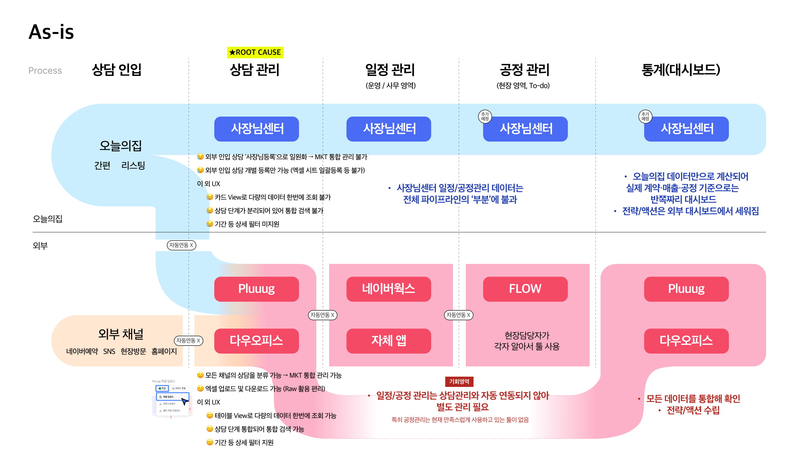

- *Details*
    
    by @Haley Hong 
    
    [[2511] 업체 대시보드를 어떻게 생각할까? +일정관리 → 상담관리](https://www.notion.so/2511-2b5a597878a080de8362ca7dae514fd6?pvs=21) 
    
    `그렇다면 상담관리에서 무엇부터 개선해야 할까?` 
    
    
    
    <aside>
    
    ### **외부 채널 통해 인입되는 상담을 통합 관리할 수 있는 기능 제공이 필수**
    
    - `Reference` 상담 일괄등록 (Pluuug)
        
        [매뉴얼 가이드라인](https://guide.pluuug.com/ko/articles/-%EA%B3%84%EC%95%BD-%EC%97%91%EC%85%80-%EC%97%85%EB%A1%9C%EB%93%9C-5eb9fb67#2-%ED%85%9C%ED%94%8C%EB%A6%BF-%EB%8B%A4%EC%9A%B4%EB%A1%9C%EB%93%9C) ← 상세내용
        
        
        
        1. 파일 > 엑셀 업로드
        
        
        
        2. 템플릿 다운로드 (엑셀)
        
        
        
        3. 필드값 입력
        
        
        
        4. 데이터 업로드
        
        
        
        5. 필드 매칭
        
        
        
        6. 매칭된 데이터 확인 후 등록
        
    - 외부 인입 상담 커스텀 분류
        - `As-is` 현재는 일괄 ‘사장님등록’으로 표출됨
            
            
            
        - `To-be` SNS, 홈페이지, 네이버예약, 현장방문 등 다양한 채널을 등록해 관리할 수 있도록 필요
    - `Reference` 항목 빠른 탐색 및 분류 (Pluuug)
        
        [매뉴얼 가이드라인](https://demo.arcade.software/lVdPjwMUYwm39wyxwGgm?embed&embed_mobile=inline&embed_desktop=inline&show_copy_link=true) ← 상세내용
        
        
        
        
        
        
        
        > “그렇죠 아무래도 이거(Pluuug)는 필터 같은 거를 좀 더 세분화해서… 이제 날짜라든가(기간) 이런 것도 되게 세밀하게 필터를 설정할 수가 있거든요. 근데 이제 오늘의집에서는 필터가 이제 기능이…” *(P1)*
        > 
    
    기타 상담관리 관련 개선 희망 사항
    
    - 타 업체와 계약이 이루어진 경우, 자동 상담 중단 처리
        
        > “다른 데 계약한 사람이 있을 수도 있잖아요. 그전에 그랬었는지 안 그랬는지 좀 기억이 잘 안 나긴 하지만 이렇게 동시에 한 세네 군데 업체에다가 (매칭)줬는데 다른 업체랑 계약을 해서, 여기 이제 (오늘의집에) 계약자로 등록이 됐어. 그럼 저희한테는 다른 업체와 계약이 완료되었습니다 해서 자동 상담 중단 처리가 된다든지 이런 게 되면 좋을 것 같고, 우리가 동시에 이렇게 배분이 됐는데 그중에서 우리가 계약한 게 비율로 몇 건인지 이런 것도 좀 궁금하지 않을까.
        요즘은 이게 상담 중단이 됐는지 다른 업체랑 계약을 했는지 보통 이제 카톡으로 다시 한 번 물어보고선 타 업체랑 계약했습니다 하고 그냥 중단하고는 있는데, 이게 이제 오늘의집에서 당연히 DB로 관리가 되니까, 세네 군데 업체에 줬는데 뭐 다른 업체랑 계약을 했다 그러면 바로 알게 되지 않나요? 그거를 어떤 고객은 대답도 안 하는 고객도 있거든요. 계속 그래서 뭔가 고객이 ‘죄송해요. 뭐 저희 안 하려고요 아니면 다른 데랑 계약했어요’ 하면 제가 그냥 바로 상담 중단을 하는데, 아무 대꾸도 안 하고 계속 ‘고민 중이에요.’ 이런 분이 있거든요. 일부러 그러는 건지… 그래서 중단을 못하고 계속 두고 있어요.” *(P2)*
        > 
    - 상담 5단계(매칭, 수락, 대면, 실측, 계약)를 커스텀하고 싶은 니즈
        
        > “저희 같은 경우는 1차 미팅하고, 그다음에 2차 미팅하고, 계약하고, 그다음에 디자인 미팅하고, 이런 식으로 이제 업체마다… 다른 업체는 또 다르게 하잖아요.그래서 저희가 뭐 입맛대로 바꿀 수 있는지 그거를 말하는…”
        ”네 이게 경우의 수가 좀 더 있다 보니까 5가지로 분류하는 것보다 조금 더 저희는 이제 세분화시켜서 단계를 좀 (Pluuug에서 나눠 관리)하고 있거든요.” *(P1)*
        → 대시보드에서 표시되기를 희망하며, 상담 단계서부터 제공이 필요함
        > 
    
    이 외 상담 관련 세부 VOC는 [더보기](https://www.notion.so/2511-2b5a597878a080de8362ca7dae514fd6?pvs=21)
    
    </aside>
    

---

# **69 (new)
오늘의집에서 처음 리모델링 정보를 접하는 곳은 
인테리어/생활이 아닌 집들이**

**시공 유저는 시공 과정과 공정 정보, 자재를 궁금합니다. 그래서** 셀인 카페에서 고객은 시공 과정 및 공정 정보와 자재에 관한 현실적인 후기를 주로 찾습니다. 

**오늘의집에서도 시공 리뷰가 있지만** 인테리어/시공 탭으로 이동해야 하기 때문에 **접근성이 낮아서 찾기 어려워 합니다.** 

**시공 리뷰 대신** ‘집들이’를 보며 스타일(자재/분위기)을 탐색합니다. 처음부터 오늘의집이 시공을 한다고 알고 집들이를 보기 보다, **집들이를 보며 시공 서비스를 제공한다는 사실을 알게 됩니다.**

 

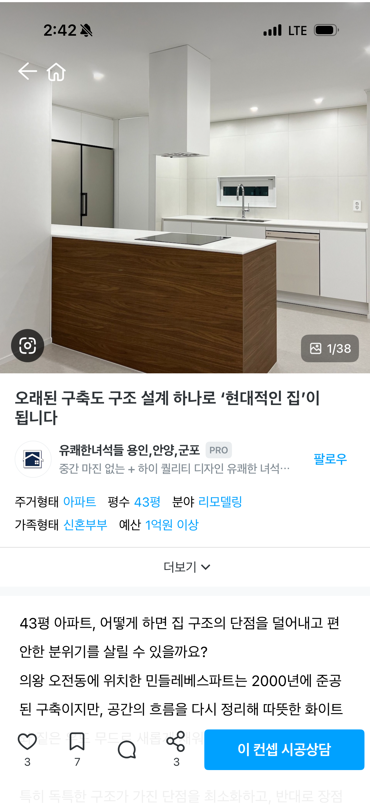

전문가 집들이

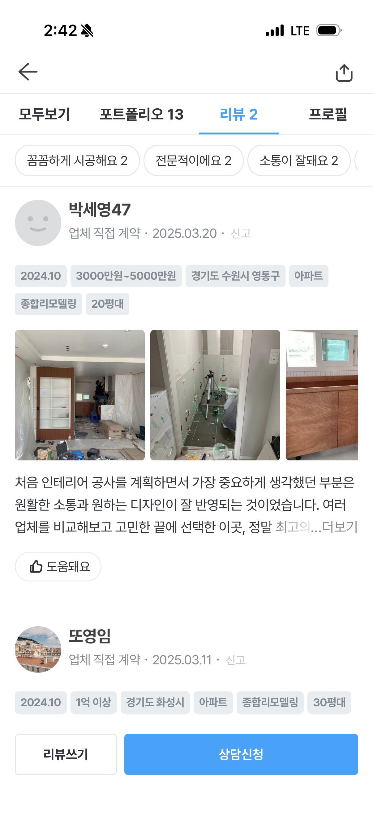

마이홈 내 시공리뷰

- *Details*
    
    by @Helena Kim @Haley Hong 
    
    [[2510] 인테리어 고민이 있을 때 커뮤니티(특히 셀인)를 어떻게 활용할까?](https://www.notion.so/2510-273a597878a0807e9fdbf2b03d24a02e?pvs=21) 
    
    - 셀인 카페에 글을 남기는 가장 큰 이유는 시공 경험이 있거나 시공 중인 사람들이 모인 곳이라 문제를 해결할 수 있는 정보를 얻을 수 있기 때문이다.
    - 오늘의 집에서는 주로 **디자인 레퍼런스, 홈스타일링과 제품 쇼핑 연계** 영역에서 강점을 가진다고 느끼며, 이를 통해 **인테리어의 큰 그림과 완성된 모습을 참고한**다.
    
    [[Phase 1. 부분시공 이탈 고객 인터뷰] 결과 해석 & 분석](https://www.notion.so/Phase-1-234a597878a0819fbd37e081178fd8e4?pvs=21) 
    
    - ‘집들이’, 시공 후 ‘소품 탐색 중 오늘의집을 둘러보다가’ 등 **오늘의집을 이용하는 과정에서 부분시공*을 인지**하게 됨
    - 인지 경로에 관계 없이 공통적으로 시공 전 ‘집들이’를 보며 스타일(자재/분위기)을 탐색함
    - 시공리뷰의 **솔직한 후기에 호감을 느끼거나 반대로 부정리뷰에 불안을 느껴 시공 의향이 없어짐**

---